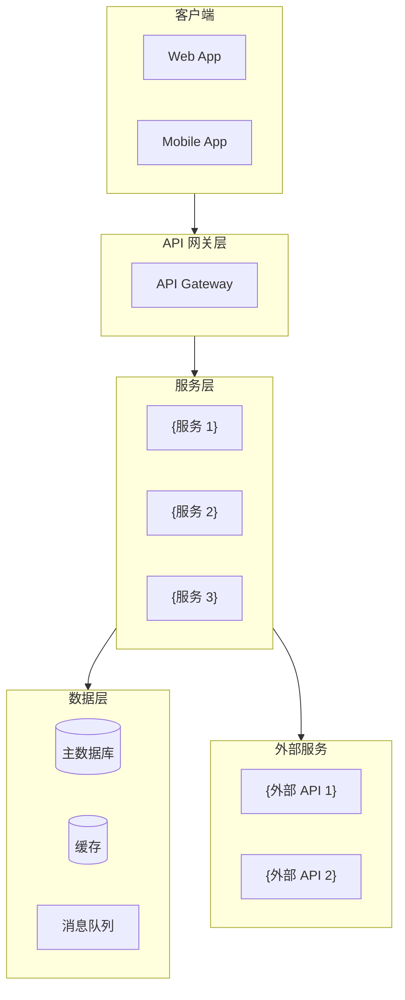
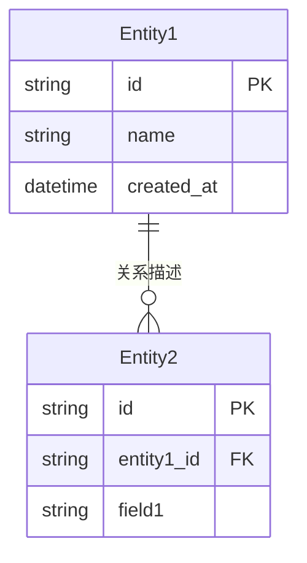
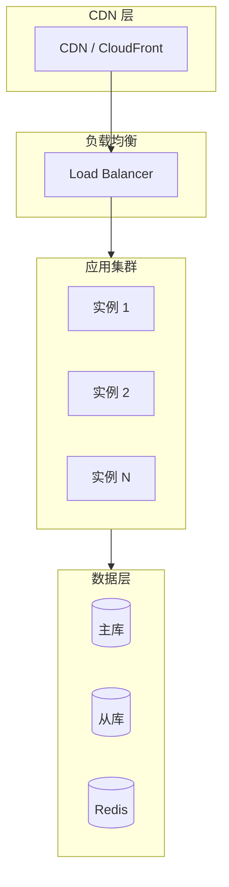

# {项目名} — 技术架构设计文档

> **版本**：v{版本号}
> **架构师**：{作者}
> **创建日期**：{日期}
> **最后更新**：{日期}
> **状态**：草稿 / 评审中 / 已批准 / 已替代
> **关联 PRD**：{PRD 文档路径} v{PRD 版本号}

---

## 0. 文档索引

> 本架构文档为主文档（总纲）。当采用分文档模式时，前端、后端、数据库的详细设计位于独立子文档中，主文档保留各章节的摘要和导航链接。

| 文档 | 路径 | 说明 | 模式 |
| ---- | ---- | ---- | ---- |
| **主架构文档（本文档）** | `architecture-{项目名}.md` | 系统整体架构、技术栈选型、部署方案、非功能需求 | 始终生成 |
| 前端架构详设 | `frontend-architecture-{项目名}.md` | 前端页面路由、组件架构、状态管理、性能优化 | 分文档模式 |
| 后端服务详设 | `backend-services-{项目名}.md` | API 端点定义、认证鉴权、服务通信、中间件 | 分文档模式 |
| 数据库设计 | `database-design-{项目名}.md` | 表结构定义、索引策略、缓存设计、数据迁移 | 分文档模式 |

> **单文档模式**：所有内容写入本文档的对应章节，不生成子文档。
> **分文档模式**：§3.4、§4、§5 仅保留摘要，详细内容见子文档。

---

## 1. 设计概述

### 1.1 项目背景

{从 PRD 提取的项目背景概述，1-2 段}

### 1.2 设计目标

| 目标 | 描述 | 衡量标准 |
| ---- | ---- | -------- |
| {目标 1} | {描述} | {可量化指标} |
| {目标 2} | {描述} | {可量化指标} |
| {目标 3} | {描述} | {可量化指标} |

### 1.3 设计原则

- **{原则 1}**：{说明，例如"优先简单性 — 选择最简方案满足当前需求，避免过度设计"}
- **{原则 2}**：{说明}
- **{原则 3}**：{说明}
- **{原则 4}**：{说明}

### 1.4 范围与边界

| 范围 | 包含 | 不包含 |
| ---- | ---- | ------ |
| {模块/领域 1} | {本次设计覆盖的部分} | {明确排除的部分} |
| {模块/领域 2} | {本次设计覆盖的部分} | {明确排除的部分} |

### 1.5 需求追溯矩阵

> 将 PRD 中的 P0/P1/P2 功能需求映射到架构模块和 API，确保所有需求在架构中有迹可循。

| PRD 需求编号 | 需求描述 | 优先级 | 对应架构模块 | 对应 API | 备注 |
| ------------- | -------- | ------ | ------------ | ------- | ---- |
| {F-001} | {需求描述} | P0 | {模块/服务名} | `{API 路径}` | |
| {F-002} | {需求描述} | P0 | {模块/服务名} | `{API 路径}` | |
| {F-003} | {需求描述} | P1 | {模块/服务名} | `{API 路径}` | |

---

## 2. 技术栈选型

### 2.1 选型总览

| 层级 | 技术选型 | 选型理由 | 备选方案 |
| ---- | -------- | -------- | -------- |
| **前端框架** | {技术} | {理由} | {备选} |
| **移动端** | {技术} | {理由} | {备选} |
| **后端框架** | {技术} | {理由} | {备选} |
| **API 网关** | {技术} | {理由} | {备选} |
| **主数据库** | {技术} | {理由} | {备选} |
| **缓存** | {技术} | {理由} | {备选} |
| **消息队列** | {技术} | {理由} | {备选} |
| **搜索引擎** | {技术} | {理由} | {备选} |
| **对象存储** | {技术} | {理由} | {备选} |
| **AI/ML** | {技术} | {理由} | {备选} |
| **CI/CD** | {技术} | {理由} | {备选} |
| **容器编排** | {技术} | {理由} | {备选} |
| **监控** | {技术} | {理由} | {备选} |
| **日志** | {技术} | {理由} | {备选} |

### 2.2 关键选型决策记录（ADR）

> 对于重要的架构决策，使用 `references/adr-template.md` 模板记录完整的决策过程。简单决策可直接在下方摘要，复杂决策应单独快照为 ADR 文档。

#### ADR-1：{决策标题，例如“后端框架选型”}

- **状态**：接受
- **背景**：{决策背景}
- **候选方案**：{方案 A} vs {方案 B} vs {方案 C}
- **评估维度**：性能 / 生态 / 学习曲线 / 团队经验 / 成本
- **结论**：选择 {方案 X}
- **理由**：{详细理由}
- **后果**：{正面影响 / 技术债 / 后续跟进}

---

## 3. 系统架构

### 3.1 架构风格

**选择**：{单体架构 / 微服务架构 / Serverless / 混合架构}

**理由**：{为什么选择这种架构风格}

### 3.2 整体架构图



### 3.3 模块职责

| 模块/服务 | 职责 | 核心功能 | 依赖 |
| --------- | ---- | -------- | ---- |
| {模块 1} | {职责描述} | {功能列表} | {依赖的其他模块} |
| {模块 2} | {职责描述} | {功能列表} | {依赖的其他模块} |
| {模块 3} | {职责描述} | {功能列表} | {依赖的其他模块} |

### 3.4 前端架构（基于原型图分析）

> **分文档模式**：本节仅保留摘要，完整前端架构设计详见 [`frontend-architecture-{项目名}.md`](frontend-architecture-{项目名}.md)。
> **单文档模式**：直接在本节展开所有子节。

#### 摘要

| 分析项 | 结果 |
| ------ | ---- |
| 原型图来源 | {wireframes / hifi-wireframes / 两者均有 / 无} |
| 页面总数 | {N} 个 |
| 前端复杂度评级 | {低 / 中 / 高} |
| 核心交互模式 | {列表} |
| 状态管理方案 | {方案} |

**页面清单**：

| 页面 | 路由 | 说明 |
| ---- | ---- | ---- |
| {首页} | `/` | {说明} |
| {页面 2} | `/{path}` | {说明} |

> 完整页面路由设计、组件架构、状态管理方案、设计系统分析 → 见前端架构子文档。

### 3.5 服务通信

| 调用方 | 被调用方 | 通信方式 | 协议 | 说明 |
| ------ | -------- | -------- | ---- | ---- |
| {服务 A} | {服务 B} | 同步 / 异步 | REST / gRPC / Event | {说明} |

---

## 4. 数据模型设计

> **分文档模式**：本节仅保留核心 ER 图和摘要，完整表结构定义、索引策略、缓存设计详见 [`database-design-{项目名}.md`](database-design-{项目名}.md)。
> **单文档模式**：直接在本节展开所有子节。

### 4.1 核心实体关系图



### 4.2 数据层概览

| 数据类型 | 存储介质 | 说明 |
| -------- | -------- | ---- |
| 核心业务数据 | {MySQL / PostgreSQL} | {主数据库} |
| 缓存数据 | {Redis} | {热点数据缓存} |
| 文件/媒体 | {S3 / OSS} | {对象存储} |

> 完整表结构定义、索引策略、缓存 Key 设计、数据迁移方案 → 见数据库设计子文档。

---

## 5. API 设计

> **分文档模式**：本节仅保留核心接口概览，完整 API 规范、认证鉴权、中间件设计详见 [`backend-services-{项目名}.md`](backend-services-{项目名}.md)。
> **单文档模式**：直接在本节展开所有子节。

### 5.1 设计规范

- **风格**：RESTful / GraphQL
- **版本策略**：URL 路径版本 `/api/v1/`
- **认证方式**：{JWT / OAuth 2.0 / API Key}
- **限流策略**：{描述}
- **响应格式**：统一 JSON 结构

### 5.2 核心接口概览

| 方法 | 路径 | 功能 | 认证 | 优先级 |
| ---- | ---- | ---- | ---- | ------ |
| `POST` | `/api/v1/{resource}` | {功能描述} | 是/否 | P0 |
| `GET` | `/api/v1/{resource}/:id` | {功能描述} | 是/否 | P0 |

> 完整接口定义（请求/响应体）、错误码规范、认证鉴权详设、中间件设计 → 见后端服务子文档。

---

## 6. 部署架构

### 6.1 部署拓扑图



### 6.2 环境规划

| 环境 | 用途 | 配置规格 | 数据策略 |
| ---- | ---- | -------- | -------- |
| **Development** | 开发调试 | {规格} | 模拟数据 |
| **Staging** | 预发布验证 | {规格} | 脱敏生产数据 |
| **Production** | 正式生产 | {规格} | 真实数据 |

### 6.3 CI/CD 流水线

```text
代码提交 → Lint/Format → 单元测试 → 构建镜像 → 集成测试 → 推送镜像 → 部署 Staging → E2E 测试 → 部署 Production → 验证
```

### 6.4 部署策略

- **策略选择**：{Rolling Update / Blue-Green / Canary}
- **回滚方案**：{描述}

### 6.5 成本估算

> 本节评估架构方案的运营成本，包括云资源、第三方服务、AI/ML API 调用等。若项目不涉及付费外部服务，可标注「本项目无显著外部服务成本」并简要列出基础设施成本。

| 资源类别 | 具体资源 | 规格 | 单价 | 月预估用量 | 月成本 |
| -------- | -------- | ---- | ---- | ---------- | ------ |
| 计算 | {云服务器 / K8s 节点} | {规格} | {单价} | {用量} | {成本} |
| 数据库 | {托管 RDS / CosmosDB 等} | {规格} | {单价} | {用量} | {成本} |
| 存储 | {对象存储 / CDN} | {规格} | {单价} | {用量} | {成本} |
| AI/ML API | {模型服务，如 OpenAI / Sora / DALL-E} | {调用规格} | {单次调用费} | {月预估调用次数} | {成本} |
| 第三方服务 | {监控 / 日志 / 邮件 / 短信 等} | {规格} | {单价} | {用量} | {成本} |
| **月度总计** | | | | | **{总成本}** |

**成本优化策略**：

- {策略 1，例如：使用预留实例降低计算成本}
- {策略 2，例如：缓存 AI 生成结果减少重复调用}
- {策略 3，例如：分级存储策略（热数据 SSD / 冷数据归档）}

---

## 7. 非功能需求设计

### 7.1 性能设计

| 指标 | PRD 要求 | 目标值 | 推导逻辑 | 达成方案 |
| ---- | -------- | ------ | -------- | -------- |
| 首屏加载时间 | {PRD 中的原始要求} | ≤ {X}s | {例如：PRD 要求“快速响应”，目标用户为移动端，取 3G 网络下 2s 作为基准} | {CDN + SSR + 懒加载} |
| API 响应时间（P99） | {PRD 中的原始要求} | ≤ {X}ms | {例如：PRD 要求“AI 生成 ≤15s”，拆解为接口接收 200ms + AI 处理 14s + 回写 800ms} | {缓存 + 索引优化 + 异步处理} |
| QPS 峰值 | {PRD 中的原始要求} | ≥ {X} | {例如：PRD 预估日活 1 万，尖峰倍率 5x，平均请求 3次/人→峰值 QPS ≈ 17} | {水平扩展 + 限流} |
| 并发连接数 | {PRD 中的原始要求} | ≥ {X} | {推导过程} | {方案} |

### 7.2 高可用设计

| 策略 | 描述 | SLA 目标 |
| ---- | ---- | -------- |
| 多实例部署 | {描述} | {X}% |
| 数据库主从 | {描述} | |
| 故障转移 | {描述} | RTO: {X}min, RPO: {X}min |
| 健康检查 | {描述} | |

### 7.3 可扩展性设计

- **水平扩展**：{哪些组件支持水平扩展，如何扩展}
- **垂直扩展**：{资源上限和升级路径}
- **自动伸缩**：{HPA / 自动伸缩策略和触发条件}

### 7.4 监控与告警

| 监控维度 | 工具 | 关键指标 | 告警阈值 |
| -------- | ---- | -------- | -------- |
| 应用性能 | {APM 工具} | {指标} | {阈值} |
| 基础设施 | {监控工具} | {指标} | {阈值} |
| 业务指标 | {BI 工具} | {指标} | {阈值} |
| 日志 | {日志平台} | {指标} | {阈值} |

---

## 8. 安全设计

### 8.1 认证与授权

| 层级 | 方案 | 说明 |
| ---- | ---- | ---- |
| 用户认证 | {JWT / OAuth 2.0 / SSO} | {说明} |
| 接口鉴权 | {RBAC / ABAC} | {说明} |
| 服务间通信 | {mTLS / API Key} | {说明} |

### 8.2 数据安全

| 场景 | 策略 | 说明 |
| ---- | ---- | ---- |
| 传输加密 | TLS 1.3 | 所有通信强制 HTTPS |
| 存储加密 | {AES-256 / 透明加密} | {敏感字段 / 全盘} |
| 密钥管理 | {KMS / Vault} | {说明} |
| 脱敏 | {规则} | {日志和展示脱敏策略} |

### 8.3 安全防护

| 威胁 | 防护措施 |
| ---- | -------- |
| SQL 注入 | 参数化查询 + ORM |
| XSS | 输出编码 + CSP |
| CSRF | CSRF Token + SameSite Cookie |
| DDoS | WAF + 限流 + CDN |
| 敏感信息泄露 | Secret Manager + 环境变量注入 |

### 8.4 合规要求

- {GDPR / 个人信息保护法 / 等保}：{合规策略}

---

## 9. 风险与应对

| 风险 | 概率 | 影响 | 应对措施 |
| ---- | ---- | ---- | -------- |
| {风险 1} | 高/中/低 | 高/中/低 | {应对策略} |
| {风险 2} | 高/中/低 | 高/中/低 | {应对策略} |
| {风险 3} | 高/中/低 | 高/中/低 | {应对策略} |

### 9.1 架构演进路线

```text
Phase 1 (MVP): {当前架构}
    ↓
Phase 2 (Growth): {演进方向 1}
    ↓
Phase 3 (Scale): {演进方向 2}
```

---

## 10. 术语表

| 术语 | 定义 |
| ---- | ---- |
| {术语 1} | {定义} |
| {术语 2} | {定义} |
| {术语 3} | {定义} |

---

## 11. 变更记录

> 记录架构文档的版本演进历史。每次技术选型变更、模块调整或架构方案修改时，在此表格中追加一行。
>
> **版本号规则**：
> - **Major（vX.0.0）**：架构风格变更、核心技术栈替换、系统边界重大调整
> - **Minor（v1.X.0）**：新增模块/服务、新增 API 端点、调整部署方案、修改数据模型
> - **Patch（v1.0.X）**：措辞修正、图表优化、格式调整、补充说明

| 版本 | 日期 | 作者 | 变更类型 | 变更摘要 |
|------|------|------|----------|----------|
| v1.0.0 | {创建日期} | {作者} | 初始版本 | {首版架构设计，基于 PRD v{PRD版本号}} |
