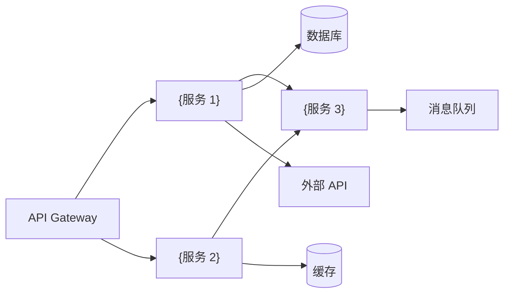

# {项目名} — 后端服务设计文档

> **版本**：v1.0
> **架构师**：{作者}
> **创建日期**：{日期}
> **最后更新**：{日期}
> **状态**：草稿

---

## 关联文档

| 文档 | 路径 | 说明 |
| ---- | ---- | ---- |
| 主架构文档 | `architecture-{项目名}.md` | 系统整体架构、技术栈选型、部署方案 |
| 前端架构详设 | `frontend-architecture-{项目名}.md` | 前端页面路由、组件架构、状态管理 |
| 数据库设计详设 | `database-design-{项目名}.md` | 数据模型、表结构、存储策略 |
| 关联 PRD | {PRD 文档路径} | 产品需求文档 |

---

## 1. 服务清单与职责

### 1.1 服务总览

| 服务/模块 | 职责 | 核心功能 | 技术栈 | 依赖 |
| --------- | ---- | -------- | ------ | ---- |
| {服务 1} | {职责描述} | {功能列表} | {语言/框架} | {依赖的其他服务} |
| {服务 2} | {职责描述} | {功能列表} | {语言/框架} | {依赖的其他服务} |
| {服务 3} | {职责描述} | {功能列表} | {语言/框架} | {依赖的其他服务} |

### 1.2 服务依赖图



---

## 2. 后端技术栈

| 类别 | 技术选型 | 选型理由 | 备选方案 |
| ---- | -------- | -------- | -------- |
| **语言** | {Go / Node.js / Python / Java} | {理由} | {备选} |
| **Web 框架** | {Gin / Express / FastAPI / Spring Boot} | {理由} | {备选} |
| **ORM** | {GORM / Prisma / SQLAlchemy / TypeORM} | {理由} | {备选} |
| **认证库** | {JWT / Passport.js / 自研} | {理由} | {备选} |
| **日志库** | {Zap / Winston / Loguru} | {理由} | {备选} |
| **HTTP 客户端** | {Resty / Axios / httpx} | {理由} | {备选} |
| **任务队列** | {Bull / Celery / 无} | {理由} | {备选} |

---

## 3. API 设计规范

### 3.1 设计约定

- **风格**：{RESTful / GraphQL}
- **版本策略**：URL 路径版本 `/api/v1/`
- **命名规范**：{kebab-case 路径，camelCase 字段}
- **分页约定**：`?page=1&page_size=20`，响应含 `total`/`page`/`page_size`
- **排序约定**：`?sort=created_at&order=desc`
- **过滤约定**：`?status=active&type=premium`

### 3.2 统一响应格式

**成功响应**：

```json
{
  "code": 200,
  "message": "success",
  "data": {},
  "timestamp": "2026-01-01T00:00:00Z",
  "request_id": "uuid"
}
```

**分页响应**：

```json
{
  "code": 200,
  "message": "success",
  "data": {
    "items": [],
    "total": 100,
    "page": 1,
    "page_size": 20
  },
  "timestamp": "2026-01-01T00:00:00Z",
  "request_id": "uuid"
}
```

**错误响应**：

```json
{
  "code": 400,
  "message": "参数校验失败",
  "errors": [
    { "field": "email", "message": "邮箱格式不正确" }
  ],
  "timestamp": "2026-01-01T00:00:00Z",
  "request_id": "uuid"
}
```

### 3.3 错误码规范

| 错误码 | HTTP 状态 | 说明 |
| ------ | --------- | ---- |
| `COMMON_001` | 400 | 参数校验失败 |
| `COMMON_002` | 401 | 未认证 |
| `COMMON_003` | 403 | 权限不足 |
| `COMMON_004` | 404 | 资源不存在 |
| `COMMON_005` | 429 | 请求频率过高 |
| `COMMON_006` | 500 | 服务内部错误 |
| `{MODULE}_001` | {状态} | {模块级错误描述} |

---

## 4. 核心 API 端点

### 4.1 {模块 1} API

| 方法 | 路径 | 功能 | 认证 | 限流 | 优先级 | 说明 |
| ---- | ---- | ---- | ---- | ---- | ------ | ---- |
| `POST` | `/api/v1/{resource}` | {功能描述} | 是 | {X 次/分} | P0 | {说明} |
| `GET` | `/api/v1/{resource}` | {功能描述} | 是 | {X 次/分} | P0 | {含分页} |
| `GET` | `/api/v1/{resource}/:id` | {功能描述} | 是 | {X 次/分} | P0 | |
| `PUT` | `/api/v1/{resource}/:id` | {功能描述} | 是 | {X 次/分} | P1 | |
| `DELETE` | `/api/v1/{resource}/:id` | {功能描述} | 是 | {X 次/分} | P1 | {软删除} |

### 4.2 {模块 2} API

| 方法 | 路径 | 功能 | 认证 | 限流 | 优先级 | 说明 |
| ---- | ---- | ---- | ---- | ---- | ------ | ---- |
| {方法} | {路径} | {功能描述} | {是/否} | {限流} | {优先级} | {说明} |

---

## 5. 认证与鉴权

### 5.1 认证方案

| 层级 | 方案 | 说明 |
| ---- | ---- | ---- |
| 用户认证 | {JWT / OAuth 2.0 / SSO} | {Token 签发、刷新、失效策略} |
| API 密钥 | {API Key / Bearer Token} | {第三方集成认证} |
| 服务间通信 | {mTLS / 内部 API Key} | {服务间信任链} |

### 5.2 Token 生命周期

| Token 类型 | 有效期 | 存储位置 | 刷新策略 |
| ---------- | ------ | -------- | -------- |
| Access Token | {15min / 1h} | {httpOnly Cookie / Authorization Header} | {过期后用 Refresh Token 刷新} |
| Refresh Token | {7d / 30d} | {httpOnly Cookie} | {单次使用，刷新后颁发新 Refresh Token} |

### 5.3 权限模型

| 角色 | 权限描述 | 可访问 API |
| ---- | -------- | ---------- |
| {角色 1} | {权限描述} | {API 列表} |
| {角色 2} | {权限描述} | {API 列表} |

---

## 6. 服务间通信

| 调用方 | 被调用方 | 通信方式 | 协议 | 超时 | 重试 | 说明 |
| ------ | -------- | -------- | ---- | ---- | ---- | ---- |
| {服务 A} | {服务 B} | 同步 | REST / gRPC | {X}ms | {N} 次 | {说明} |
| {服务 A} | {服务 C} | 异步 | Event / MQ | — | {死信队列} | {说明} |

### 6.1 异步消息定义

| 事件名 | 生产者 | 消费者 | Payload 结构 | 说明 |
| ------ | ------ | ------ | ------------ | ---- |
| `{event.name}` | {服务} | {服务} | `{ id, type, data, timestamp }` | {说明} |

---

## 7. 中间件设计

### 7.1 请求处理链

```text
请求 → CORS → 请求日志 → 认证 → 限流 → 参数校验 → 业务处理 → 响应格式化 → 响应日志
```

### 7.2 日志规范

| 日志级别 | 使用场景 | 示例 |
| -------- | -------- | ---- |
| `ERROR` | 未预期异常、外部服务故障 | 数据库连接失败 |
| `WARN` | 可恢复的问题、降级 | 缓存未命中 fallback 到数据库 |
| `INFO` | 关键业务操作 | 用户登录成功、订单创建 |
| `DEBUG` | 调试信息（生产关闭） | SQL 查询、外部 API 请求/响应 |

**结构化日志格式**：

```json
{
  "level": "INFO",
  "timestamp": "2026-01-01T00:00:00Z",
  "request_id": "uuid",
  "user_id": "uid",
  "method": "POST",
  "path": "/api/v1/resource",
  "status": 200,
  "latency_ms": 42,
  "message": "request completed"
}
```

### 7.3 限流策略

| 限流范围 | 策略 | 阈值 | 超限响应 |
| -------- | ---- | ---- | -------- |
| 全局 | {令牌桶 / 滑动窗口} | {X 次/分} | 429 Too Many Requests |
| 用户级 | {令牌桶} | {X 次/分} | 429 + Retry-After 头 |
| IP 级 | {滑动窗口} | {X 次/分} | 429 |

### 7.4 错误处理

| 错误类型 | 处理策略 | 说明 |
| -------- | -------- | ---- |
| 参数校验错误 | 返回 400 + 字段级错误 | {详细错误信息} |
| 业务逻辑错误 | 返回对应状态码 + 业务错误码 | {错误码映射} |
| 外部服务超时 | 重试 + 降级 + 熔断 | {配置重试次数和超时} |
| 未预期异常 | 返回 500 + 记录完整堆栈 | {生产不暴露堆栈细节} |

---

## 8. 后端性能方案

| 场景 | 优化策略 | 说明 |
| ---- | -------- | ---- |
| 高频读取 | {Redis 缓存 + TTL} | {缓存策略：Cache-Aside / Write-Through} |
| 慢查询 | {索引优化 + 查询重写} | {参见数据库设计文档索引策略} |
| 批量操作 | {批量 INSERT + 事务} | {避免 N+1 查询} |
| 大文件上传 | {分块上传 + 直传 OSS} | {前端直传对象存储，后端只处理元数据} |
| 长耗时操作 | {异步任务队列} | {AI 生成等耗时操作放入队列，前端轮询/SSE 获取结果} |
| 高并发写入 | {消息队列削峰} | {写入请求先入队列，消费端批量写入} |

---

## 9. 健康检查与优雅关闭

### 9.1 健康检查端点

| 端点 | 检查内容 | 超时 | 说明 |
| ---- | -------- | ---- | ---- |
| `GET /health` | 服务存活 | — | Kubernetes liveness probe |
| `GET /ready` | 数据库 + 缓存 + 外部依赖 | {X}s | Kubernetes readiness probe |

### 9.2 优雅关闭

```text
收到 SIGTERM → 停止接受新请求 → 等待进行中请求完成（超时 {X}s）→ 关闭数据库连接 → 关闭缓存连接 → 退出
```

---

## 10. 后端安全防护

| 威胁 | 防护措施 | 说明 |
| ---- | -------- | ---- |
| SQL 注入 | 参数化查询 + ORM | {不拼接 SQL，使用预编译语句} |
| 命令注入 | {不使用 shell 执行用户输入} | {使用安全 API 替代} |
| 敏感数据泄露 | {日志脱敏 + 响应过滤} | {密码、Token、手机号等字段脱敏} |
| 暴力破解 | {登录限流 + 账号锁定} | {连续 {N} 次失败锁定 {X} 分钟} |
| 依赖漏洞 | {定期扫描 + 自动更新} | {Dependabot / Snyk / govulncheck} |
| 密钥管理 | {Secret Manager + 环境变量注入} | {不在代码中硬编码密钥} |
