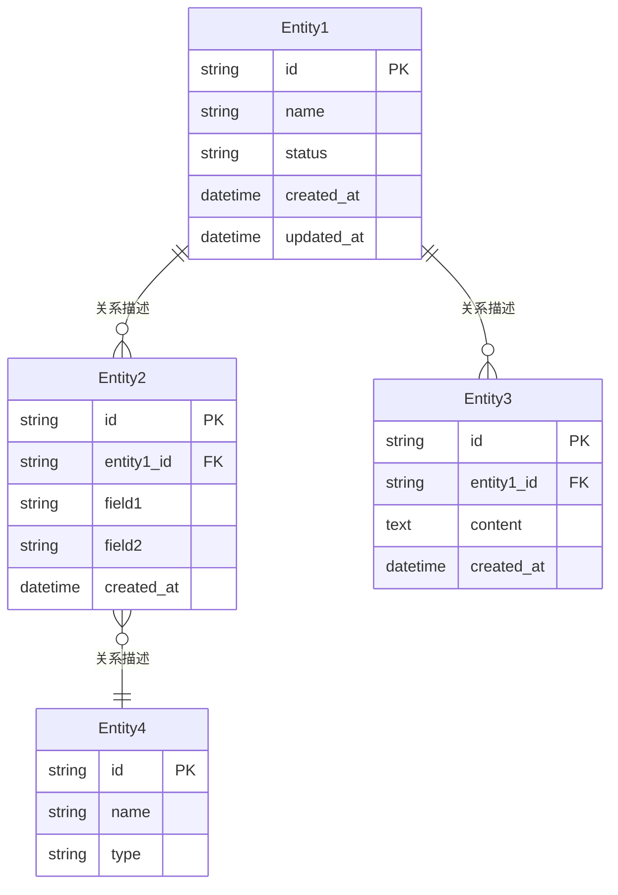

# {项目名} — 数据库设计文档

> **版本**：v1.0
> **架构师**：{作者}
> **创建日期**：{日期}
> **最后更新**：{日期}
> **状态**：草稿

---

## 关联文档

| 文档 | 路径 | 说明 |
| ---- | ---- | ---- |
| 主架构文档 | `architecture-{项目名}.md` | 系统整体架构、技术栈选型、部署方案 |
| 前端架构详设 | `frontend-architecture-{项目名}.md` | 前端页面路由、组件架构、状态管理 |
| 后端服务详设 | `backend-services-{项目名}.md` | API 端点定义、认证鉴权、服务通信 |
| 关联 PRD | {PRD 文档路径} | 产品需求文档 |

---

## 1. 核心实体关系图

---

## 2. 表结构定义

### 2.1 {表名 1}

> {表的业务说明，1 句话描述用途}

| 字段名 | 类型 | 约束 | 默认值 | 说明 |
| ------ | ---- | ---- | ------ | ---- |
| `id` | UUID / BIGINT | PK, NOT NULL | {auto-gen} | 主键 |
| `{字段 1}` | VARCHAR({N}) | NOT NULL | | {说明} |
| `{字段 2}` | TEXT | | NULL | {说明} |
| `{字段 3}` | ENUM('{v1}', '{v2}') | NOT NULL | '{v1}' | {说明} |
| `{外键字段}` | UUID / BIGINT | FK, NOT NULL | | 关联 {表名}.id |
| `created_at` | TIMESTAMP | NOT NULL | CURRENT_TIMESTAMP | 创建时间 |
| `updated_at` | TIMESTAMP | NOT NULL | CURRENT_TIMESTAMP ON UPDATE | 更新时间 |
| `deleted_at` | TIMESTAMP | | NULL | 软删除标记 |

**索引**：

| 索引名 | 类型 | 字段 | 用途 |
| ------ | ---- | ---- | ---- |
| `idx_{表名}_{字段}` | B-Tree | `{字段}` | {查询场景说明} |
| `idx_{表名}_composite` | B-Tree | `({字段1}, {字段2})` | {复合查询场景} |
| `uk_{表名}_{字段}` | Unique | `{字段}` | {唯一性约束} |

### 2.2 {表名 2}

> {表的业务说明}

| 字段名 | 类型 | 约束 | 默认值 | 说明 |
| ------ | ---- | ---- | ------ | ---- |
| `id` | UUID / BIGINT | PK, NOT NULL | {auto-gen} | 主键 |
| `{字段}` | {类型} | {约束} | {默认值} | {说明} |

**索引**：

| 索引名 | 类型 | 字段 | 用途 |
| ------ | ---- | ---- | ---- |
| `idx_{表名}_{字段}` | {类型} | `{字段}` | {说明} |

---

## 3. 索引策略

### 3.1 索引设计原则

- **主键索引**：所有表使用 UUID 或自增 BIGINT 作为主键
- **外键索引**：所有外键字段自动建立索引
- **查询优化索引**：基于 API 查询模式建立（见各表索引定义）
- **复合索引**：遵循最左前缀原则，高选择性字段在前

### 3.2 慢查询防护

| 场景 | 预期查询模式 | 索引策略 | 说明 |
| ---- | ------------ | -------- | ---- |
| {场景 1} | `WHERE {字段} = ? ORDER BY {字段} DESC` | 复合索引 | {说明} |
| {场景 2} | `WHERE {字段} IN (?) AND {字段} = ?` | 覆盖索引 | {说明} |
| {场景 3} | `LIKE '{关键词}%'` | 前缀索引 / 全文索引 | {说明} |

---

## 4. 数据存储策略

| 数据类型 | 存储介质 | 读写模式 | TTL/保留策略 | 说明 |
| -------- | -------- | -------- | ------------ | ---- |
| 核心业务数据 | {MySQL / PostgreSQL} | 读多写少 | 永久保留 | {主数据库} |
| 热点缓存数据 | {Redis} | 读多 | {TTL: Xmin} | {高频访问缓存} |
| 文件/媒体 | {S3 / OSS / MinIO} | 写少读多 | {按策略归档} | {对象存储} |
| 全文搜索 | {Elasticsearch} | 读多写少 | {与主库同步} | {搜索场景} |
| 日志/审计 | {Elasticsearch / ClickHouse} | 写多读少 | {保留 {X} 天} | {运维日志} |
| 临时/会话数据 | {Redis} | 读写均衡 | {TTL: Xh} | {Session、验证码} |

---

## 5. 缓存设计

### 5.1 缓存架构

| 缓存层 | 工具 | 用途 | 说明 |
| ------ | ---- | ---- | ---- |
| 本地缓存 | {内存 / LRU Cache} | {配置、字典等不常变数据} | {进程内缓存，无网络开销} |
| 分布式缓存 | {Redis} | {热数据、Session、限流计数} | {多实例共享} |
| CDN 缓存 | {CloudFront / CloudFlare} | {静态资源、API 响应缓存} | {边缘节点缓存} |

### 5.2 Redis 键结构设计

| 键模式 | 数据结构 | TTL | 说明 |
| ------ | -------- | --- | ---- |
| `{project}:user:{userId}` | Hash | {X}h | {用户信息缓存} |
| `{project}:session:{sessionId}` | String | {X}h | {会话数据} |
| `{project}:{resource}:{id}` | Hash | {X}min | {业务实体缓存} |
| `{project}:{resource}:list:{query_hash}` | String (JSON) | {X}min | {列表查询缓存} |
| `{project}:rate:{userId}:{endpoint}` | String (counter) | {X}s | {限流计数} |
| `{project}:lock:{resource}:{id}` | String | {X}s | {分布式锁} |

### 5.3 缓存更新策略

| 策略 | 适用场景 | 说明 |
| ---- | -------- | ---- |
| Cache-Aside | {读多写少的实体数据} | 读缓存→未命中→读 DB→写缓存；写 DB→删缓存 |
| Write-Through | {一致性要求高的数据} | 同时写 DB 和缓存 |
| TTL 自动过期 | {列表、聚合数据} | 设置合理 TTL，不主动失效 |
| 事件驱动失效 | {跨服务引用的数据} | 数据变更时发消息通知消费者清缓存 |

---

## 6. 数据迁移方案

### 6.1 Schema 迁移工具

- **工具**：{Flyway / golang-migrate / Alembic / Prisma Migrate}
- **命名规范**：`V{yyyy}{MM}{dd}{HH}{mm}__{description}.sql`
- **执行策略**：CI/CD 中自动执行，部署时先迁移后启动服务

### 6.2 迁移规范

| 规则 | 说明 |
| ---- | ---- |
| 向前兼容 | 新版 Schema 必须兼容旧版代码（新增字段有默认值/允许 NULL） |
| 禁止破坏性变更 | 不直接删除列/改名列，使用两步迁移：先新增→迁移数据→再删除旧列 |
| 回滚脚本 | 每个迁移附带回滚 SQL（或标注"不可回滚"） |
| 大表变更 | 使用 pt-online-schema-change 或 gh-ost，避免锁表 |

---

## 7. 备份与恢复

| 备份类型 | 频率 | 保留期 | 存储位置 | 恢复 RTO |
| -------- | ---- | ------ | -------- | -------- |
| 全量备份 | {每日} | {30 天} | {S3 / 冷存储} | {X}h |
| 增量备份 | {每小时} | {7 天} | {S3} | {X}min |
| Binlog/WAL | 实时 | {7 天} | {本地 + 远程} | {X}min |

**恢复演练**：每 {X} 个月执行一次恢复演练，验证备份数据的完整性和恢复流程。

---

## 8. 分库分表策略（如需）

> 当单表数据量预估超过 {X} 万行或单库 QPS 超过 {X} 时才需要考虑。若项目初期无此需求，可标注「当前阶段无需分库分表，预留水平扩展能力」。

- **分片键选择**：{字段名} — {选择理由}
- **分片策略**：{Range / Hash / 一致性 Hash}
- **分片规模**：{X} 个分片，每分片预估 {X} 万行
- **跨分片查询**：{方案，如：汇总查询走 Elasticsearch}

---

## 9. 数据生命周期管理

| 数据类型 | 热数据期 | 温数据期 | 冷数据期 | 归档/删除 |
| -------- | -------- | -------- | -------- | --------- |
| {业务数据 1} | {0-{X}天：SSD} | {{X}-{Y}天：HDD} | {>{Y}天：对象存储} | {>{Z}天：归档/删除} |
| {日志数据} | {0-{X}天：ES} | — | — | {>{X}天：删除} |
| {用户上传文件} | 永久：对象存储 | — | — | {用户删除后 {X} 天物理删除} |

### 9.1 数据清理策略

| 规则 | 执行方式 | 频率 | 说明 |
| ---- | -------- | ---- | ---- |
| 软删除数据物理清理 | {定时任务} | {每周} | {deleted_at 超过 {X} 天的记录} |
| 过期 Session 清理 | {Redis TTL 自动过期} | 自动 | {无需额外处理} |
| 临时文件清理 | {定时任务 / 对象存储生命周期规则} | {每日} | {处理中间文件、临时上传} |
