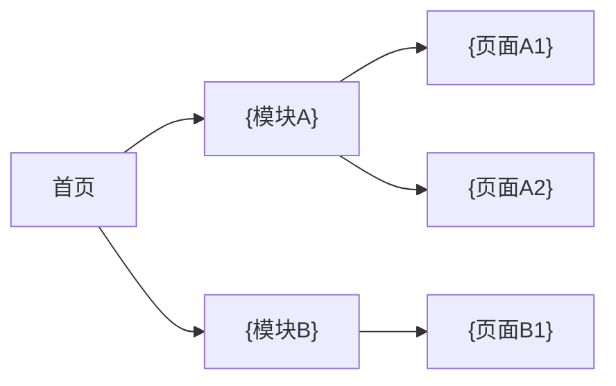

# {项目名} — 前端架构设计文档

> **版本**：v1.0
> **架构师**：{作者}
> **创建日期**：{日期}
> **最后更新**：{日期}
> **状态**：草稿

---

## 关联文档

| 文档 | 路径 | 说明 |
| ---- | ---- | ---- |
| 主架构文档 | `architecture-{项目名}.md` | 系统整体架构、技术栈选型、部署方案 |
| 后端服务详设 | `backend-services-{项目名}.md` | API 端点定义、认证鉴权、服务通信 |
| 数据库设计详设 | `database-design-{项目名}.md` | 数据模型、表结构、存储策略 |
| 关联 PRD | {PRD 文档路径} | 产品需求文档 |

---

## 1. 原型图分析摘要

| 分析项 | 结果 |
| ------ | ---- |
| 原型图来源 | {wireframes / hifi-wireframes / 两者均有 / 无} |
| 页面总数 | {N} 个 |
| 前端复杂度评级 | {低 / 中 / 高} |
| 核心交互模式 | {列表，如：表单提交、实时进度、拖拽排序、并排对比、无限滚动} |

### 1.1 低保真分析（基于 `wireframes/`）

| 提取项 | 结果 |
| ------ | ---- |
| 页面清单与导航结构 | {描述} |
| 信息架构 | {描述} |
| 基础交互流程 | {描述} |

### 1.2 高保真增强分析（基于 `hifi-wireframes/`，若存在）

| 提取项 | 结果 | 架构影响 |
| ------ | ---- | -------- |
| 设计系统（CSS 变量/主题色） | {描述} | {影响组件库选型和主题方案} |
| 交互动效（动画/过渡） | {描述} | {影响性能优化策略} |
| 响应式断点 | {描述} | {影响 CSS 架构和测试矩阵} |
| 数据展示需求 | {图表/表格/搜索筛选} | {影响前端数据层设计} |

---

## 2. 前端技术栈选型

| 类别 | 技术选型 | 选型理由 | 备选方案 |
| ---- | -------- | -------- | -------- |
| **框架** | {React / Vue / Next.js / Nuxt} | {理由} | {备选} |
| **语言** | {TypeScript / JavaScript} | {理由} | {备选} |
| **UI 组件库** | {Ant Design / shadcn/ui / Element Plus} | {理由} | {备选} |
| **CSS 方案** | {Tailwind CSS / CSS Modules / styled-components} | {理由} | {备选} |
| **构建工具** | {Vite / Webpack / Turbopack} | {理由} | {备选} |
| **包管理器** | {pnpm / npm / yarn} | {理由} | {备选} |
| **图表库** | {ECharts / Chart.js / D3.js / 无} | {理由} | {备选} |
| **表单库** | {React Hook Form / Formik / VeeValidate / 无} | {理由} | {备选} |

---

## 3. 页面与路由设计

### 3.1 导航结构



### 3.2 路由表

| 页面 | 路由 | 原型文件 | 布局 | 鉴权 | 核心组件 | 说明 |
| ---- | ---- | -------- | ---- | ---- | -------- | ---- |
| {首页} | `/` | `{home.html}` | {MainLayout} | 否 | {组件列表} | {说明} |
| {页面 2} | `/{path}` | `{file.html}` | {MainLayout} | 是 | {组件列表} | {说明} |
| {404} | `*` | — | {MinimalLayout} | 否 | ErrorPage | 未匹配路由 |

### 3.3 路由守卫与权限

| 守卫类型 | 适用路由 | 逻辑 |
| -------- | -------- | ---- |
| 认证守卫 | {需要登录的路由} | {未登录跳转 /login} |
| 角色守卫 | {需要特定角色的路由} | {权限不足跳转 /403} |

---

## 4. 状态管理方案

| 状态类型 | 管理方式 | 说明 |
| -------- | -------- | ---- |
| 全局状态 | {Redux / Zustand / Pinia / Context} | {用户信息、认证状态、主题设置等} |
| 服务端状态 | {React Query / SWR / TanStack Query} | {API 数据缓存、自动刷新、乐观更新} |
| 表单状态 | {React Hook Form / Formik / 原生} | {表单校验规则与提交流程} |
| URL 状态 | {搜索参数 / 路由参数} | {筛选条件、分页、排序等 URL 持久化} |
| 实时状态 | {WebSocket / SSE / 轮询} | {生成进度、通知推送等} |

### 4.1 Store 结构设计

```text
stores/
├── auth.ts         # 认证状态（用户信息、Token、登录/登出）
├── ui.ts           # UI 状态（主题、侧边栏、Loading）
└── {domain}.ts     # 业务领域状态
```

---

## 5. 组件架构

### 5.1 目录结构

```text
src/
├── app/                # 应用入口（路由配置、Provider 嵌套）
├── pages/              # 页面组件（对应路由，每页独立目录）
│   ├── home/
│   ├── {module-a}/
│   └── {module-b}/
├── components/         # 通用 UI 组件
│   ├── common/         # 基础组件（Button, Input, Modal, Toast...）
│   ├── layout/         # 布局组件（Header, Sidebar, Footer, PageContainer）
│   └── business/       # 业务组件（从原型图提取的复合组件）
├── hooks/              # 自定义 Hooks（useAuth, usePagination, useDebounce...）
├── stores/             # 状态管理（见 §4.1）
├── services/           # API 调用层（按模块组织）
│   ├── api.ts          # Axios/Fetch 实例配置（baseURL、拦截器）
│   └── {module}.ts     # 模块级 API 函数
├── types/              # TypeScript 类型定义
├── utils/              # 工具函数（格式化、校验、常量）
├── styles/             # 全局样式、主题变量
└── assets/             # 静态资源（图片、字体、图标）
```

### 5.2 核心业务组件清单

> 从原型图分析提取的关键业务组件。

| 组件名 | 所属页面 | 功能 | 复杂度 | 说明 |
| ------ | -------- | ---- | ------ | ---- |
| {组件 1} | {页面} | {功能描述} | 高/中/低 | {说明} |
| {组件 2} | {页面} | {功能描述} | 高/中/低 | {说明} |

---

## 6. 设计系统与主题

### 6.1 设计令牌（Design Tokens）

```css
:root {
  /* 品牌色 */
  --color-primary: {#hex};
  --color-primary-hover: {#hex};
  --color-secondary: {#hex};

  /* 语义色 */
  --color-success: {#hex};
  --color-warning: {#hex};
  --color-error: {#hex};

  /* 中性色 */
  --color-text-primary: {#hex};
  --color-text-secondary: {#hex};
  --color-bg-primary: {#hex};
  --color-bg-secondary: {#hex};
  --color-border: {#hex};

  /* 字体 */
  --font-family: {字体栈};
  --font-size-base: {size};

  /* 间距 */
  --spacing-unit: {size};

  /* 圆角 */
  --border-radius: {size};

  /* 阴影 */
  --shadow-sm: {值};
  --shadow-md: {值};
}
```

### 6.2 响应式断点

| 断点 | 值 | 适用设备 | 布局策略 |
| ---- | -- | -------- | -------- |
| `sm` | {≥640px} | 手机横屏 | {策略} |
| `md` | {≥768px} | 平板 | {策略} |
| `lg` | {≥1024px} | 笔记本 | {策略} |
| `xl` | {≥1280px} | 桌面 | {策略} |

### 6.3 暗色模式

- **支持情况**：{是/否/后续迭代}
- **实现方案**：{CSS 变量切换 / class 切换 / media query}

---

## 7. 构建与打包配置

### 7.1 构建优化

| 优化项 | 配置 | 说明 |
| ------ | ---- | ---- |
| 代码分割 | {路由级懒加载} | {每个页面独立 chunk} |
| Tree Shaking | {开启} | {移除未使用代码} |
| 压缩 | {Terser / esbuild} | {JS/CSS 压缩} |
| 图片优化 | {WebP 转换 / 压缩} | {静态资源优化} |
| 预加载 | {关键路由 prefetch} | {提升页面切换速度} |

### 7.2 环境变量

| 变量名 | 开发环境 | 生产环境 | 说明 |
| ------ | -------- | -------- | ---- |
| `VITE_API_BASE_URL` | `http://localhost:{port}/api` | `https://{domain}/api` | API 基础地址 |
| `VITE_APP_TITLE` | {开发标题} | {生产标题} | 应用标题 |

---

## 8. 前端性能优化

### 8.1 Core Web Vitals 目标

| 指标 | 目标值 | 达成方案 |
| ---- | ------ | -------- |
| LCP (Largest Contentful Paint) | ≤ {X}s | {SSR / 图片优化 / CDN / 预加载关键资源} |
| FID (First Input Delay) | ≤ {X}ms | {代码分割 / 延迟非关键 JS / Web Worker} |
| CLS (Cumulative Layout Shift) | ≤ {X} | {图片尺寸预设 / 字体加载优化 / 骨架屏} |
| TTFB (Time to First Byte) | ≤ {X}ms | {CDN / 边缘计算 / 服务端缓存} |

### 8.2 资源加载策略

| 资源类型 | 加载策略 | 说明 |
| -------- | -------- | ---- |
| 首屏 JS | 内联关键路径 | {关键 CSS + JS 首屏渲染} |
| 非首屏页面 | 路由懒加载 | {React.lazy / dynamic import} |
| 图片 | 懒加载 + WebP | {Intersection Observer / loading="lazy"} |
| 第三方脚本 | defer / async | {非阻塞加载} |
| 字体 | font-display: swap | {避免 FOIT} |

---

## 9. 前端安全

| 威胁 | 防护措施 | 说明 |
| ---- | -------- | ---- |
| XSS | {输出编码 + CSP 策略} | {Content-Security-Policy 头配置} |
| CSRF | {SameSite Cookie + CSRF Token} | {API 请求自动携带} |
| 敏感数据泄露 | {不在前端存储敏感信息} | {Token 存储策略：httpOnly Cookie vs localStorage} |
| 依赖漏洞 | {npm audit + Dependabot} | {定期扫描依赖安全} |
| CORS | {严格配置允许域名} | {仅允许特定来源} |

---

## 10. 前端测试策略

| 测试类型 | 工具 | 覆盖范围 | 说明 |
| -------- | ---- | -------- | ---- |
| 单元测试 | {Vitest / Jest} | {工具函数、Hooks、Store} | {覆盖率目标：≥{X}%} |
| 组件测试 | {Testing Library} | {核心业务组件} | {用户交互行为测试} |
| E2E 测试 | {Playwright / Cypress} | {关键用户流程} | {CI 中自动运行} |
| 视觉回归 | {Playwright screenshot} | {核心页面截图对比} | {防止 UI 意外变更} |
| 无障碍测试 | {axe-core} | {WCAG 合规检查} | {CI 中自动扫描} |

---

## 11. 国际化方案（如需）

- **是否需要**：{是/否/后续迭代}
- **方案**：{i18next / vue-i18n / next-intl}
- **支持语言**：{zh-CN, en-US, ...}
- **翻译管理**：{JSON 文件 / 在线翻译平台}
