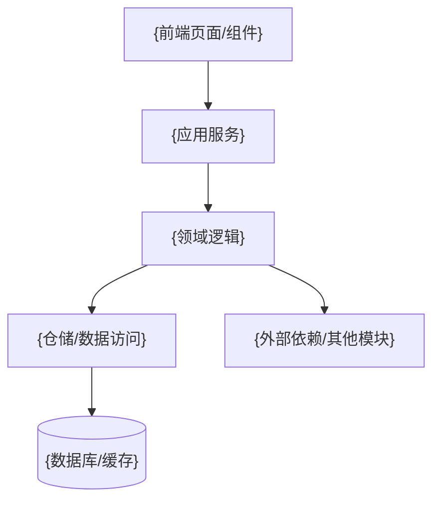
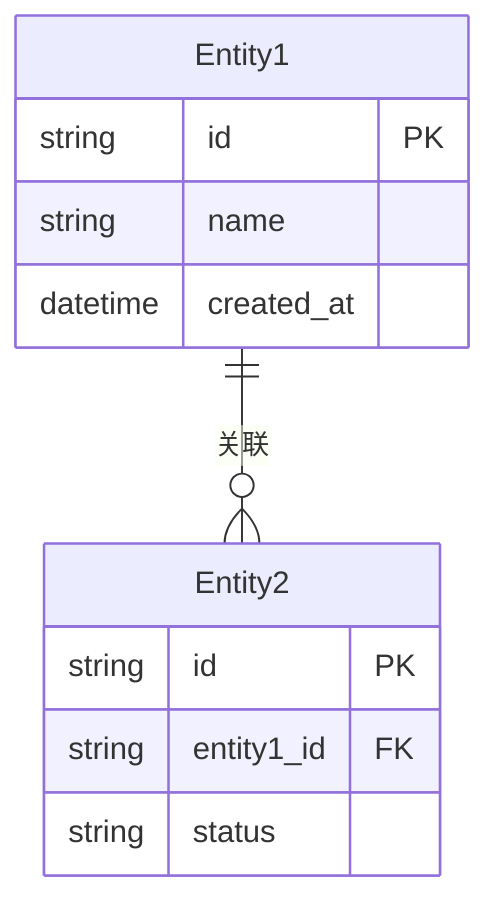

# {项目名} — {模块中文名} 模块架构设计文档

> **版本**：v{版本号}
> **架构师**：{作者}
> **创建日期**：{日期}
> **最后更新**：{日期}
> **状态**：草稿 / 评审中 / 已批准 / 已替代
> **模块标识**：{module_en_slug}
> **关联 Module PRD**：`modules/prd-{module_en_slug}.md` v{Module PRD 版本号}
> **关联主架构文档**：`architecture-{项目名}.md` v{主架构版本号}

---

## 0. 关联文档

| 文档 | 路径 | 说明 |
| ---- | ---- | ---- |
| 主架构文档 | `architecture-{项目名}.md` | 跨模块架构总纲、部署、安全、公共能力 |
| 模块 PRD | `modules/prd-{module_en_slug}.md` | 模块需求、用户故事、验收标准 |
| 关联原型 | `{module_en_slug}-*.html` | 模块相关 wireframe / hifi-wireframe 页面 |

---

## 1. 模块定位

### 1.1 模块概述

{从 Module PRD 提取模块职责、目标用户、核心价值，1-2 段}

### 1.2 设计目标

| 目标 | 描述 | 衡量标准 |
| ---- | ---- | -------- |
| {目标 1} | {描述} | {指标} |
| {目标 2} | {描述} | {指标} |

### 1.3 范围与边界

| 范围 | 包含 | 不包含 |
| ---- | ---- | ------ |
| {模块功能域 1} | {本模块覆盖内容} | {明确排除项} |
| {模块功能域 2} | {本模块覆盖内容} | {明确排除项} |

### 1.4 需求追溯矩阵

| Module PRD 需求编号 | 需求描述 | 优先级 | 对应组件/服务 | 对应 API | 对应数据对象 |
| ------------------- | -------- | ------ | ------------- | -------- | ------------ |
| {MF-001} | {需求描述} | P0 | {组件/服务} | `{API}` | {实体/表} |
| {MF-002} | {需求描述} | P1 | {组件/服务} | `{API}` | {实体/表} |

---

## 2. 模块架构设计

### 2.1 模块组件与职责

| 组件/服务 | 职责 | 输入 | 输出 | 依赖 |
| --------- | ---- | ---- | ---- | ---- |
| {组件 1} | {职责说明} | {输入} | {输出} | {依赖} |
| {组件 2} | {职责说明} | {输入} | {输出} | {依赖} |

### 2.2 模块内部架构图

### 2.3 前端路由与组件

| 页面/路由 | 核心组件 | 状态管理 | 原型来源 | 说明 |
| --------- | -------- | -------- | -------- | ---- |
| `/{route}` | {组件列表} | {状态方案} | `{module_en_slug}-*.html` | {说明} |

### 2.4 后端服务与处理流

| 场景 | 入口 API / 事件 | 核心处理步骤 | 结果 |
| ---- | --------------- | ------------ | ---- |
| {场景 1} | `{METHOD /api/v1/...}` | {步骤摘要} | {结果} |
| {场景 2} | {事件/任务} | {步骤摘要} | {结果} |

---

## 3. 数据模型设计

### 3.1 核心实体关系图

### 3.2 关键数据对象

| 数据对象 | 类型 | 关键字段 | 用途 | 生命周期 |
| -------- | ---- | -------- | ---- | -------- |
| {对象 1} | 表 / 缓存 / 文件 | {字段列表} | {用途} | {生命周期} |
| {对象 2} | 表 / 缓存 / 文件 | {字段列表} | {用途} | {生命周期} |

### 3.3 索引与一致性策略

| 场景 | 策略 | 说明 |
| ---- | ---- | ---- |
| {查询场景} | {索引/缓存策略} | {说明} |
| {一致性场景} | {事务/补偿/幂等策略} | {说明} |

---

## 4. API 设计

### 4.1 接口清单

| 接口 | 方法 | 说明 | 请求摘要 | 响应摘要 | 鉴权 |
| ---- | ---- | ---- | -------- | -------- | ---- |
| `/api/v1/{module}/...` | GET | {说明} | {请求参数} | {响应结构} | {鉴权方式} |
| `/api/v1/{module}/...` | POST | {说明} | {请求体} | {响应结构} | {鉴权方式} |

### 4.2 错误处理与幂等

| 场景 | 错误码/状态码 | 幂等策略 | 说明 |
| ---- | ------------- | -------- | ---- |
| {场景 1} | {状态码} | {策略} | {说明} |

---

## 5. 模块间接口与依赖

| 调用方模块 | 被调用方模块 | 接口 / 数据结构 | 同步/异步 | 说明 |
| ---------- | ------------ | --------------- | --------- | ---- |
| {当前模块} | {依赖模块} | `{API}` / {事件} | {方式} | {说明} |

### 5.1 外部依赖

| 依赖项 | 类型 | 用途 | 降级策略 |
| ------ | ---- | ---- | -------- |
| {依赖服务} | 内部模块 / 外部服务 | {用途} | {降级策略} |

---

## 6. 非功能与安全

### 6.1 性能与容量

| 指标 | 目标值 | 推导依据 | 设计方案 |
| ---- | ------ | -------- | -------- |
| {响应时间/QPS} | {目标值} | {依据} | {方案} |

### 6.2 安全控制

| 控制项 | 方案 | 覆盖风险 |
| ------ | ---- | -------- |
| 输入校验 | {方案} | {风险} |
| 鉴权授权 | {方案} | {风险} |
| 敏感数据保护 | {方案} | {风险} |

---

## 7. 风险与演进

| 风险/债务 | 影响 | 应对策略 | 触发条件 |
| --------- | ---- | -------- | -------- |
| {风险 1} | {影响} | {策略} | {触发条件} |

---

## 8. 关联与回填检查

| 检查项 | 状态 | 说明 |
| ------ | ---- | ---- |
| 文档头已关联 Module PRD 版本 | [ ] | |
| 文档头已关联主架构版本 | [ ] | |
| Module PRD 「关联架构文档」已更新 | [ ] | |
| Module PRD §5.3 技术参考已回填 | [ ] | |

---

## 9. 变更记录

| 版本 | 日期 | 作者 | 变更类型 | 变更摘要 |
| ---- | ---- | ---- | -------- | -------- |
| v1.0.0 | {日期} | {作者} | Initial | 首次生成模块级架构文档 |
