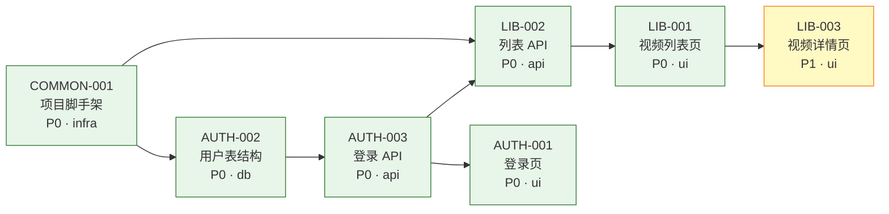

# tasks/task-dependency-map.md 模板

> 该文件由 `architecture-to-tasks` Skill 自动生成。它是**跨模块开发顺序导航**——决定下一个该开哪个 task。

## 模板

```markdown
# {项目名} — Task 依赖与开发顺序导航

- 项目目录：`projects/prd-{项目名}/`
- 总 task 数：{N}
- 最后更新：{ISO8601 时间}
- 配套快照：[README.md](./README.md)

> 💡 **如何使用本文件**：
> 1. 看「🌊 推荐执行批次」决定从哪个 Wave 开始。
> 2. 看「✅ 当前可执行」直接挑一个开工。
> 3. 看「🎯 关键路径」识别影响全局的高优先 task。
> 4. 开工前必须按 Skill 的 pre-execution-checklist 做依赖检查。

## 🗺️ 跨模块依赖图

> 节点颜色：P0 绿 / P1 黄 / P2 灰；已完成节点加粗蓝色边框。
> 箭头方向：A → B 表示 B 依赖 A（A 是前置）。



## 🌊 推荐执行批次（Wave）

> 同一 Wave 内的 task 之间无依赖，**可并行或任意顺序**。Wave 之间有依赖，必须串行。

### Wave 1 — 基础设施（无依赖，可立即并行启动）

| ID | 标题 | 模块 | 类型 | 优先级 | 估算 | 文件 |
|----|------|------|------|--------|------|------|
| COMMON-001 | 项目脚手架 | common | infra | P0 | 3 SP | [文件](./common/COMMON-001-scaffold.md) |

### Wave 2 — 数据层（依赖 Wave 1）

| ID | 标题 | 模块 | 类型 | 优先级 | 估算 | 文件 |
|----|------|------|------|--------|------|------|
| AUTH-002 | 用户表结构 | user-auth | db | P0 | 2 SP | [文件](./user-auth/AUTH-002-user-schema.md) |

### Wave 3 — 核心 API（依赖 Wave 2）

| ID | 标题 | 模块 | 类型 | 优先级 | 估算 | 文件 |
|----|------|------|------|--------|------|------|
| AUTH-003 | 登录 API | user-auth | api | P0 | 3 SP | [文件](./user-auth/AUTH-003-login-api.md) |
| LIB-002 | 视频列表 API | video-library | api | P0 | 3 SP | [文件](./video-library/LIB-002-list-api.md) |

### Wave 4 — 核心 UI（依赖 Wave 3）

| ID | 标题 | 模块 | 类型 | 优先级 | 估算 | 文件 |
|----|------|------|------|--------|------|------|
| AUTH-001 | 登录页 | user-auth | ui | P0 | 3 SP | [文件](./user-auth/AUTH-001-login-page.md) |
| LIB-001 | 视频列表页 | video-library | ui | P0 | 3 SP | [文件](./video-library/LIB-001-list-page.md) |

### Wave 5 — 增强功能

| ID | 标题 | 模块 | 类型 | 优先级 | 估算 | 文件 |
|----|------|------|------|--------|------|------|
| LIB-003 | 视频详情页 | video-library | ui | P1 | 5 SP | [文件](./video-library/LIB-003-detail-page.md) |

## ✅ 当前可执行（Ready Queue）

> 计算规则：`status == todo` 且所有 `depends_on` 已 `done`。每次 task 完成后会自动刷新。

1. COMMON-001 项目脚手架 → [文件](./common/COMMON-001-scaffold.md)

> 建议从 Wave 1 任意一个开始。

## 🎯 关键路径（Critical Path）

> 该链路上的任一 task 延期会直接影响项目最早完成时间。请优先保障。

```text
COMMON-001 → AUTH-002 → AUTH-003 → LIB-002 → LIB-001 → LIB-003
```

总估算：{X} SP

## 📦 全部 Task 一览（按模块）

### user-auth

| ID | 标题 | 状态 | 类型 | 优先级 | 依赖 | 文件 |
|----|------|------|------|--------|------|------|
| AUTH-001 | 登录页 | todo | ui | P0 | AUTH-003 | [文件](./user-auth/AUTH-001-login-page.md) |
| AUTH-002 | 用户表结构 | todo | db | P0 | COMMON-001 | [文件](./user-auth/AUTH-002-user-schema.md) |
| AUTH-003 | 登录 API | todo | api | P0 | AUTH-002 | [文件](./user-auth/AUTH-003-login-api.md) |

### video-library

| ID | 标题 | 状态 | 类型 | 优先级 | 依赖 | 文件 |
|----|------|------|------|--------|------|------|
| LIB-001 | 视频列表页 | todo | ui | P0 | LIB-002 | [文件](./video-library/LIB-001-list-page.md) |
| LIB-002 | 视频列表 API | todo | api | P0 | AUTH-003, COMMON-001 | [文件](./video-library/LIB-002-list-api.md) |
| LIB-003 | 视频详情页 | todo | ui | P1 | LIB-001 | [文件](./video-library/LIB-003-detail-page.md) |

### common

| ID | 标题 | 状态 | 类型 | 优先级 | 依赖 | 文件 |
|----|------|------|------|--------|------|------|
| COMMON-001 | 项目脚手架 | todo | infra | P0 | — | [文件](./common/COMMON-001-scaffold.md) |
```

## Wave 划分算法

1. 收集所有 task，构建有向无环图（DAG），节点为 task，边为 `depends_on`。
2. **Wave 1** = 所有入度为 0 的 task。
3. 移除 Wave 1 的节点与其出边，重复计算入度为 0 的节点 → 形成 **Wave 2**。
4. 直到所有节点被分批；若仍有节点未分配 → 存在依赖环，报错并停止。
5. 同一 Wave 内按 `(priority, module, id)` 排序展示。

## Mermaid 渲染规则

| 元素 | 规则 |
|---|---|
| 节点标签 | `{ID}<br/>{标题}<br/>{优先级} · {类型}` |
| P0 | `fill:#e8f5e9,stroke:#2e7d32` |
| P1 | `fill:#fff9c4,stroke:#f57f17` |
| P2 | `fill:#f5f5f5,stroke:#9e9e9e` |
| done | 加 `stroke:#1976d2,stroke-width:3px` |
| 方向 | `graph LR` 横向；节点过多（> 30）切换为 `graph TD` |

## 刷新口径

| 段落 | 全量重算时机 | 增量更新时机 |
|---|---|---|
| Mermaid 依赖图 | task 增删 / 依赖关系变化时 | task 完成时仅更新节点样式（done 边框） |
| Wave 批次 | 同上 | — |
| Ready Queue | — | 每次 task 状态变化 |
| 关键路径 | 同 Mermaid | — |
| 全部 Task 一览 | task 增删时 | 每次 task 状态变化（更新「状态」列） |
