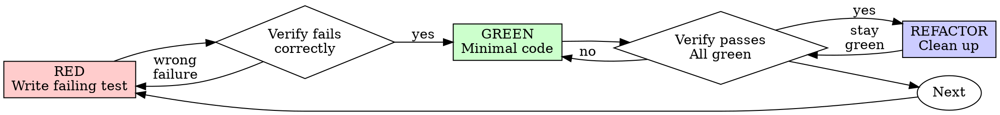

# 测试驱动开发（TDD）

## 概览

先写测试。确认它失败。再写最少的代码让它通过。

**核心原则：** 如果你没有亲眼看到测试失败，你就无法确认它测试的是正确的东西。

**违背规则的字面要求，本质上就是违背规则本身。**

## 何时使用

**始终适用：**
- 新功能
- 缺陷修复
- 重构
- 行为变更

**例外情况（先询问你的人工协作者）：**
- 一次性原型
- 生成式代码
- 配置文件

如果你在想“这次先跳过 TDD 吧”，停下。这只是自我合理化。

## 铁律

```
NO PRODUCTION CODE WITHOUT A FAILING TEST FIRST
```

先写了实现代码再补测试？删掉，重新来。

**没有例外：**
- 不要把它留着当“参考”
- 不要在写测试时“顺手改一改”
- 不要继续盯着它看
- 删除就是删除

从测试重新开始实现。就这样。

## Red-Green-Refactor



### RED - 写一个失败的测试

写一个最小化测试，描述“应该发生什么”。

<Good>
```typescript
test('retries failed operations 3 times', async () => {
  let attempts = 0;
  const operation = () => {
    attempts++;
    if (attempts < 3) throw new Error('fail');
    return 'success';
  };

  const result = await retryOperation(operation);

  expect(result).toBe('success');
  expect(attempts).toBe(3);
});
```
命名清晰，测试真实行为，只关注一件事
</Good>

<Bad>
```typescript
test('retry works', async () => {
  const mock = jest.fn()
    .mockRejectedValueOnce(new Error())
    .mockRejectedValueOnce(new Error())
    .mockResolvedValueOnce('success');
  await retryOperation(mock);
  expect(mock).toHaveBeenCalledTimes(3);
});
```
命名模糊，测的是 mock，不是实际代码
</Bad>

**要求：**
- 只验证一个行为
- 名称清晰
- 使用真实代码（除非无法避免，否则不要 mock）

### 验证 RED - 亲眼看到它失败

**强制执行，绝不能跳过。**

```bash
npm test path/to/test.test.ts
```

确认以下几点：
- 测试确实失败了，而不是报错中断
- 失败信息符合预期
- 失败原因是功能尚未实现，而不是拼写错误之类的问题

**测试直接通过？** 说明你测的是已有行为。改测试。

**测试报错？** 先修复报错，重新运行，直到它以正确方式失败。

### GREEN - 最小实现

写出最简单的代码让测试通过。

<Good>
```typescript
async function retryOperation<T>(fn: () => Promise<T>): Promise<T> {
  for (let i = 0; i < 3; i++) {
    try {
      return await fn();
    } catch (e) {
      if (i === 2) throw e;
    }
  }
  throw new Error('unreachable');
}
```
刚好足够通过测试
</Good>

<Bad>
```typescript
async function retryOperation<T>(
  fn: () => Promise<T>,
  options?: {
    maxRetries?: number;
    backoff?: 'linear' | 'exponential';
    onRetry?: (attempt: number) => void;
  }
): Promise<T> {
  // YAGNI
}
```
过度设计
</Bad>

不要顺手加功能，不要重构别的代码，也不要做超出当前测试范围的“优化”。

### 验证 GREEN - 亲眼看到它通过

**强制执行。**

```bash
npm test path/to/test.test.ts
```

确认以下几点：
- 当前测试通过
- 其他相关测试仍然通过
- 输出干净，没有新的错误或警告

**测试失败？** 修代码，不要改测试来迎合实现。

**其他测试失败？** 现在就修。

### REFACTOR - 整理代码

只有在绿灯状态下才做：
- 去掉重复
- 改善命名
- 提取辅助方法

保持测试一直是绿色。不要在这一步新增行为。

### 重复循环

为下一个行为再写一个失败测试。

## 好测试的标准

| 质量维度 | 好的表现 | 不好的表现 |
|---------|------|-----|
| **最小化** | 只测一件事。名字里出现 “and” 就考虑拆分。 | `test('validates email and domain and whitespace')` |
| **清晰** | 名称能描述行为 | `test('test1')` |
| **表达意图** | 能清楚展示期望的 API 行为 | 让人看不出代码到底该做什么 |

## 为什么顺序很重要

**“我先把功能写完，再补测试验证一下。”**

在实现之后才写的测试，往往一上来就通过。立刻通过并不能证明任何事：
- 你可能测错了东西
- 你可能测的是实现细节，不是行为
- 你可能漏掉自己已经忘记的边界条件
- 你从来没见过它真正捕获缺陷

先写测试会强迫你先看到失败，这才能证明它确实在测试某件事。

**“我已经手动把边界情况都测过了。”**

手工测试是临时性的。你以为自己都测到了，但实际上：
- 没有明确记录你测过什么
- 代码一变，你没法稳定重跑
- 一旦赶时间，很容易漏掉场景
- “我刚刚试过能跑” 不等于覆盖完整

自动化测试才是系统化的，每次都能用同样方式重复执行。

**“删掉已经写了几个小时的代码太浪费了。”**

这是沉没成本谬误。时间已经花掉了，现在真正的选择只有：
- 删掉，用 TDD 重写（再花一些时间，但信心高）
- 留着，事后补测试（看起来只省一点时间，但信心低，而且更容易出 bug）

真正的浪费，是把你自己都不信任的代码留在仓库里。没有可靠测试支撑的“能跑代码”就是技术债。

**“TDD 太教条了，真正务实的人会灵活处理。”**

TDD 本来就是务实的：
- 在提交前发现 bug（比事后排查更快）
- 防止回归（代码一坏，测试马上提醒）
- 文档化行为（测试本身就在说明代码怎么用）
- 支撑重构（放心改，测试会帮你兜底）

所谓“务实”的捷径，最后往往会变成线上调试，而那只会更慢。

**“先写后写都一样，关键是精神，不是流程。”**

不是。事后测试回答的是“它现在做了什么”；先写测试回答的是“它本来应该做什么”。

事后测试会被你的实现绑架。你测试的是“你已经写出来的东西”，而不是“需求真正要求的行为”。你验证的是自己记得住的边界，而不是通过设计和思考发现的边界。

先写测试会在实现之前逼你发现边界条件。事后测试只是在验证你是否把所有情况都记住了，而你通常记不全。

事后补 30 分钟测试，不等于 TDD。你可能拿到了覆盖率，却失去了“测试确实有效”的证明。

## 常见借口

| 借口 | 现实情况 |
|--------|---------|
| "太简单了，不用测" | 简单代码一样会坏，写个测试可能只要 30 秒。 |
| "我之后再测" | 立刻通过的测试说明不了任何问题。 |
| "事后测试也能达到同样效果" | 事后测试回答“它现在做什么”；先写测试回答“它应该做什么”。 |
| "我已经手测过了" | 临时手测不等于系统测试。没有记录，也无法稳定重跑。 |
| "删掉几个小时的工作太浪费" | 这是沉没成本谬误。保留未经验证的代码，就是在积累技术债。 |
| "先留着参考，再从测试开始" | 你最后一定会参照它改，那本质上还是事后测试。删除就是删除。 |
| "我得先探索一下" | 可以，但探索代码要丢掉，正式实现要从 TDD 开始。 |
| "测试很难写，说明需求复杂" | 先听测试的反馈。难测通常意味着设计本身难用。 |
| "TDD 会拖慢我" | TDD 比事后调试更快。真正务实，就是先写测试。 |
| "手测更快" | 手测无法证明边界条件，而且每次改动后你都得重测一遍。 |
| "这段旧代码本来就没测试" | 现在轮到你改善它了，就从补测试开始。 |

## 危险信号：立刻停下并重来

- 先写代码，后写测试
- 实现完了才补测试
- 测试第一次运行就直接通过
- 你解释不清测试为什么失败
- 测试被留到“后面再补”
- 你开始说服自己“这次例外”
- “我已经手动测过了”
- “事后测试也能达到同样效果”
- “重要的是精神，不是流程”
- “先留着当参考”或者“按现有代码稍微改改”
- “已经花了几个小时，删掉太浪费”
- “TDD 太教条了，我这是务实”
- “这次情况不一样，因为……”

**出现这些情况，都意味着：删掉代码，按 TDD 重来。**

## 示例：修一个缺陷

**缺陷：** 空邮箱也被接受了

**RED**
```typescript
test('rejects empty email', async () => {
  const result = await submitForm({ email: '' });
  expect(result.error).toBe('Email required');
});
```

**Verify RED**
```bash
$ npm test
FAIL: expected 'Email required', got undefined
```

**GREEN**
```typescript
function submitForm(data: FormData) {
  if (!data.email?.trim()) {
    return { error: 'Email required' };
  }
  // ...
}
```

**Verify GREEN**
```bash
$ npm test
PASS
```

**REFACTOR**
如果需要，可以把验证逻辑提取成可复用的方法。

## 验收清单

在宣布工作完成之前，检查这些项：

- [ ] 每个新增函数或方法都有测试
- [ ] 每个测试在实现前都亲眼看过它失败
- [ ] 每个测试都是因为预期原因失败（功能缺失，而不是拼写错误）
- [ ] 你写的是刚好能让测试通过的最小代码
- [ ] 所有测试都通过
- [ ] 输出干净，没有错误和警告
- [ ] 测试使用真实代码（除非无法避免，否则不要 mock）
- [ ] 边界条件和错误路径都有覆盖

有任何一项打不上勾？说明你没有真正执行 TDD。重新来。

## 卡住时怎么办

| 问题 | 处理方式 |
|---------|----------|
| 不知道怎么测 | 先写出你希望拥有的 API，先写断言，再请教你的人工协作者。 |
| 测试过于复杂 | 说明设计过于复杂，先简化接口。 |
| 感觉什么都得 mock | 说明代码耦合太重，改用依赖注入。 |
| 测试准备工作太大 | 先提取辅助方法；如果还是复杂，就继续简化设计。 |

## 将调试纳入流程

发现 bug 了？先写一个会失败的复现测试。然后走完整个 TDD 循环。这个测试既能证明修复有效，也能防止回归。

不要在没有测试的情况下修 bug。

## 测试反模式

当你要加 mock 或测试工具函数时，先读 @testing-anti-patterns.md，避免这些常见坑：
- 测的是 mock 行为，而不是真实行为
- 把测试专用方法塞进生产类
- 在没搞清依赖关系前就开始 mock

## 最终规则

```
Production code → test exists and failed first
Otherwise → not TDD
```

没有人工协作者明确同意，就不要搞例外。
