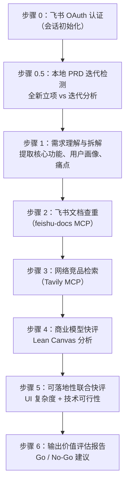
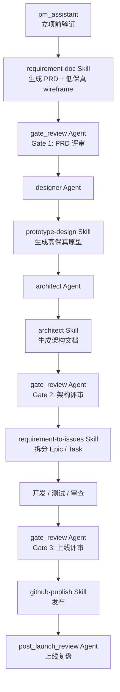
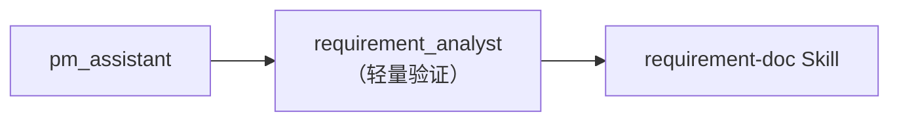
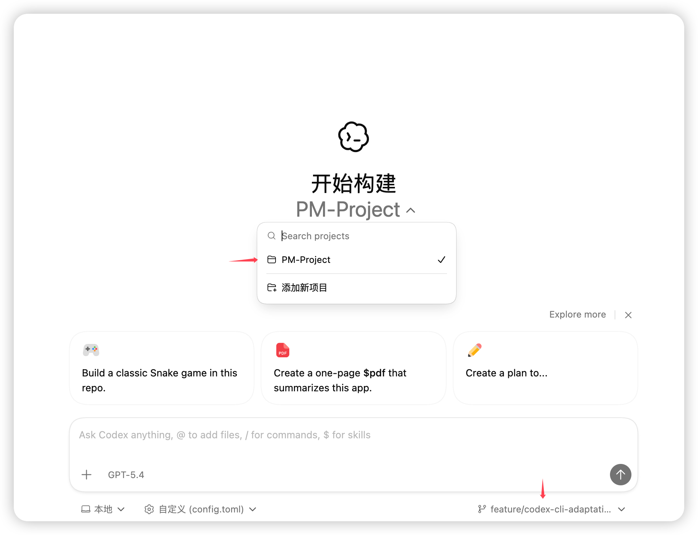
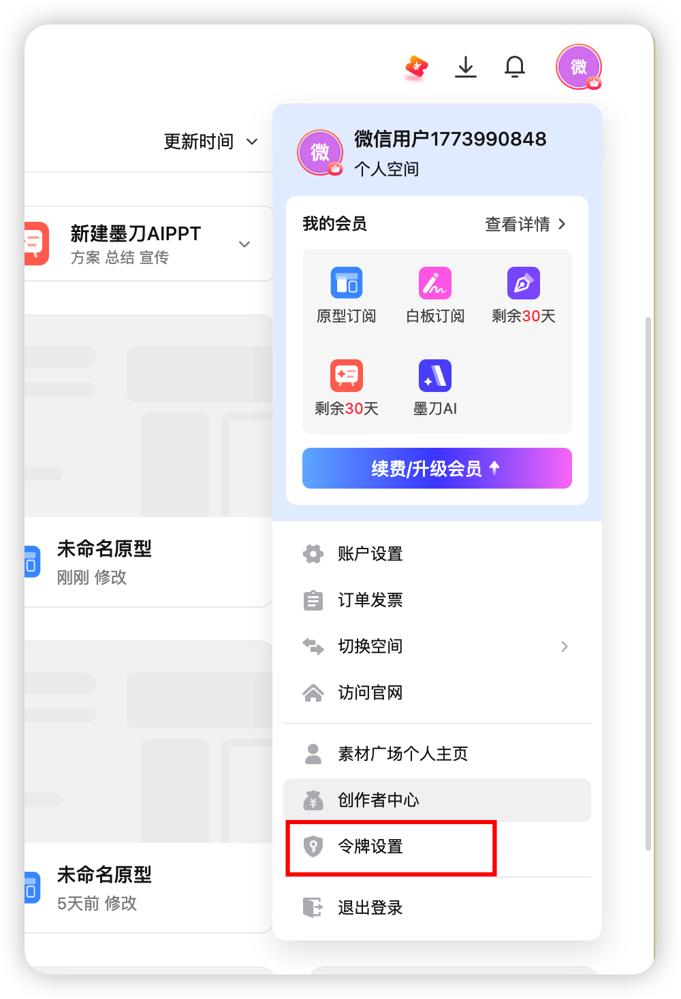
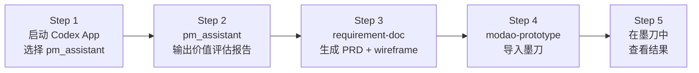
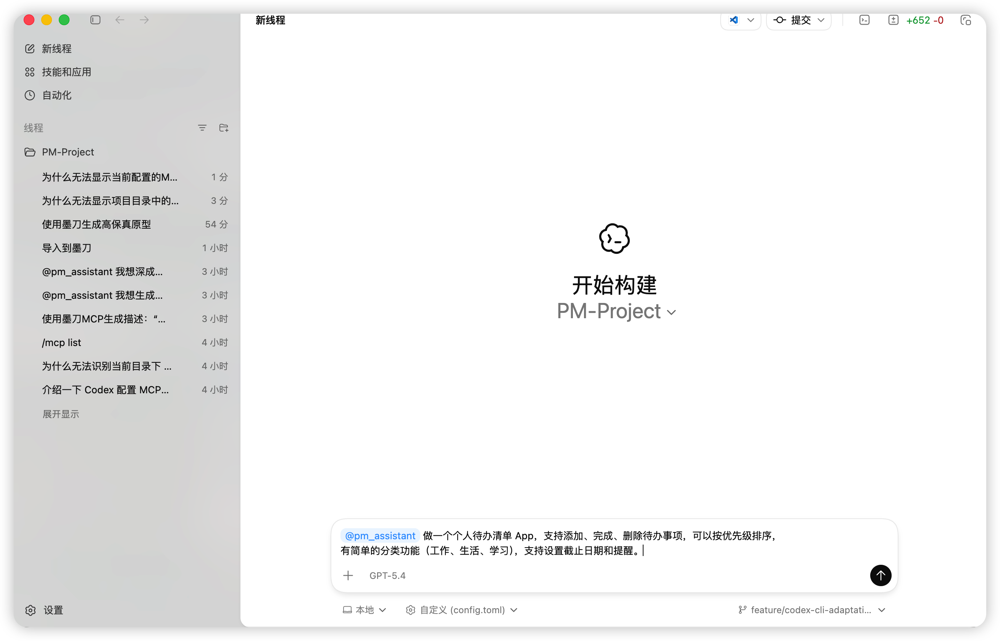
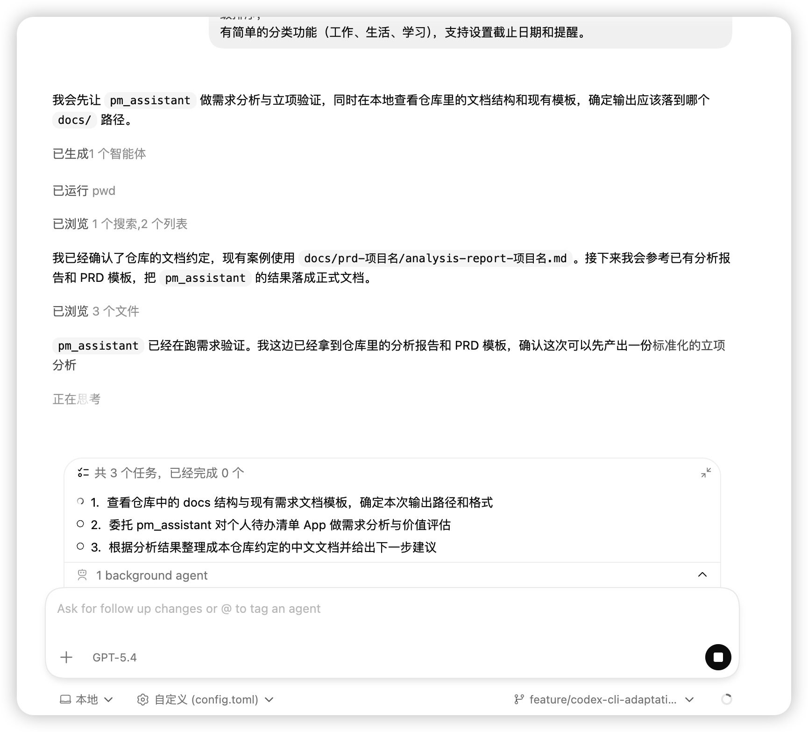
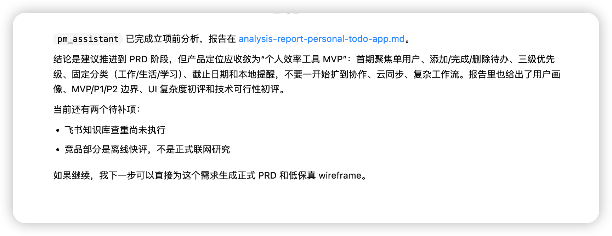
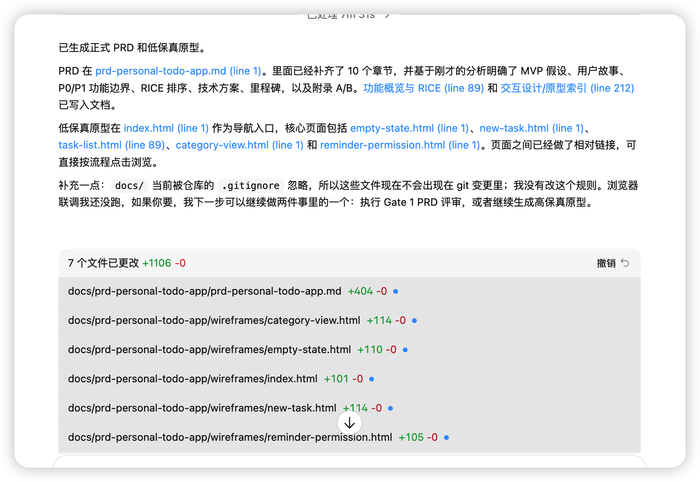

# PM-Project Hands-on 实操指南

本文档面向 Workshop 参与者，从仓库背景认知到亲手跑通"需求分析 → PRD 生成 → 原型导入墨刀"的完整链路。

---

## 目录

- [1. 仓库背景](#1-仓库背景)
- [2. 包含的 Agent 和 Skill](#2-包含的-agent-和-skill)
- [3. PM-assistant 工作流程图](#3-pm-assistant-工作流程图)
- [4. 使用这个仓库](#4-使用这个仓库)

---

## 1. 仓库背景

### 1.1 仓库定位

PM-Project 是一个 **GitHub Copilot / Codex 自定义 Agent 与 Skill 仓库**，不是传统的应用代码仓库。它的核心目标是把产品开发全流程——需求分析、PRD 生成、原型设计、架构设计、代码审查、测试、发布、复盘——沉淀为可复用的 AI 协作能力。

- **仓库地址**：<https://github.com/nickhou1983/PM-Project>
- **当前分支**：`feature/codex-cli-adaptation`（适配 Codex App）
- **默认分支**：`main`

### 1.2 核心价值

| 维度 | 说明 |
|------|------|
| **角色化协作** | 14 个 Agent 各司其职，覆盖产品、设计、架构、开发、测试、发布全角色 |
| **方法论沉淀** | 13 个 Skill 将领域方法论、模板、参考文档封装为可复用的执行流程 |
| **MCP 集成** | 集成飞书、墨刀、Playwright、GitHub、Context7、Tavily 六大外部服务 |
| **Stage-Gate 管控** | 内置三道评审门（PRD 评审、架构评审、上线评审），保障交付质量 |

### 1.3 目录结构概览

```text
PM-Project/
├── .codex/
│   ├── agents/          # Codex App Agent 运行时定义（14 个 .toml 文件）
│   ├── config.toml      # Codex App 项目级配置（含 MCP 服务器配置）
│   └── rules/           # Codex App 运行时规则
├── .github/
│   ├── agents/          # GitHub Copilot Agent 定义（14 个 .agent.md 文件）
│   └── skills/          # Skill 主目录（13 个 Skill）
├── .agents/
│   └── skills -> ../.github/skills   # 兼容软链接
├── docs/                # 项目文档、PRD、架构设计、原型
│   ├── prd-{项目名}/    # 各项目的 PRD、wireframe、架构文档
│   └── *.md             # 指南、矩阵、工作流说明
├── plans/               # 运行时 Planning 结果目录
├── AGENTS.md            # 项目级工作协议和指令
└── README.md
```

> **关键区分**：`.codex/agents/` 下的 `.toml` 文件是 Codex App 的运行时 Agent 配置；`.github/agents/` 下的 `.agent.md` 文件是面向 GitHub Copilot（VS Code）的 Agent 定义。两者内容对应，适配不同的运行环境。

---

## 2. 包含的 Agent 和 Skill

### 2.1 Agent 一览

本仓库包含 **14 个 Agent**，覆盖产品开发全生命周期：

| Agent | 职责 | 模式 |
|-------|------|------|
| `pm_assistant` | 需求分析与立项前验证（飞书查重、竞品分析、商业快评、UI/技术快评） | read-only |
| `requirement_analyst` | 需求灵感验证（简化版 pm_assistant，不含 UI/技术快评） | read-only |
| `architect` | 根据 PRD 设计技术架构方案（技术栈选型、数据模型、API、部署） | workspace-write |
| `designer` | 高保真原型设计（基于 PRD + wireframe，覆盖品牌配色、组件系统） | workspace-write |
| `code_review` | 代码审查（MUST/SHOULD/NIT 三级严重度分级） | read-only |
| `code_debug` | 代码错误诊断（飞书知识库检索 + 代码搜索 + 修复方案） | workspace-write |
| `code_testing` | 代码测试（单元/集成/UI/E2E 测试用例生成与执行） | workspace-write |
| `code_docs` | 代码文档生成（注释/README/API 文档，可同步飞书） | workspace-write |
| `gate_review` | Stage-Gate 评审门（PRD/架构/上线三个 Gate，Go/No-Go 决策） | read-only |
| `planning` | 任务规划与上下文研究（只研究不执行，输出路由建议） | read-only |
| `new_employee_mentor` | 新员工导师（路由分发器，分析意图后路由到合适的 Agent） | workspace-write |
| `post_launch_review` | 上线复盘与迭代决策（收集数据反馈、输出复盘报告） | read-only |
| `pr_review_submit` | 将审查结果写入 GitHub PR Review | read-only |
| `ui_testing` | UI 自动化测试（Playwright MCP，Page Object Model） | workspace-write |

### 2.2 Skill 一览

本仓库包含 **13 个 Skill**，沉淀各领域的方法论与执行模板：

| Skill | 用途 |
|-------|------|
| `requirement-doc` | 生成 PRD 与低保真 wireframe |
| `requirement-to-issues` | 将 PRD 需求拆分为 GitHub Issues |
| `prototype-design` | 从低保真升级为高保真原型 |
| `modao-prototype` | 生成 HTML 原型并导入墨刀平台 |
| `architect` | 技术架构设计模板与 ADR |
| `microservices` | 微服务架构/部署/CI-CD 规范 |
| `coding-standards` | 全栈编码规范与最佳实践 |
| `code-review` | 标准化代码审查流程与评论模板 |
| `code-standards-check` | 代码规范合规性扫描与审计报告 |
| `security-audit` | 基于 OWASP Top 10 的安全审查清单 |
| `feishu-docs` | 飞书文档查询/创建/同步（MCP） |
| `github-publish` | GitHub 提交/分支/PR/发布工作流 |
| `playwright-testing` | Playwright UI/E2E 测试规范 |

### 2.3 Agent 与 Skill 的协作关系

Agent 负责**角色扮演和流程控制**，Skill 负责**方法论和具体执行**。一个 Agent 可以调用多个 Skill，一个 Skill 也可以被多个 Agent 复用：

```text
pm_assistant ──调用──→ feishu-docs（查重）
                    └→ Tavily MCP（竞品检索）

designer ──调用──→ prototype-design（高保真生成）
               └→ modao-prototype（导入墨刀）

architect ──调用──→ architect Skill（架构模板）
                └→ microservices（微服务规范）

code_review ──调用──→ code-review（审查流程）
                  └→ coding-standards（编码规范）
```

---

## 3. PM-assistant 工作流程图

### 3.1 pm_assistant 自身流程

`pm_assistant` 是产品开发的**入口 Agent**，在正式投入 PRD 和研发之前，先完成价值判断。其内部执行 7 步立项前验证：



**输出报告包含 7 大章节**：需求概述、内部需求查重、竞品分析（SWOT 矩阵）、商业模型快评（Lean Canvas）、可落地性快评、价值评估综合评分、结论与建议。

### 3.2 从 pm_assistant 出发的产品开发全链路

从 `pm_assistant` 立项验证通过后，进入完整的产品开发主链路：



### 3.3 可选轻量分支

如果需要快速验证，可以走更轻量的路径（跳过 UI/技术快评）：



### 3.4 各阶段交付物一览

| 阶段 | Agent / Skill | 交付物 | 输出路径 |
|------|--------------|--------|----------|
| 立项前验证 | `pm_assistant` | 价值评估报告 | `docs/prd-{项目名}/analysis-report-{项目名}.md` |
| PRD 生成 | `requirement-doc` | PRD + 低保真 wireframe | `docs/prd-{项目名}/prd-{项目名}.md` + `wireframes/*.html` |
| PRD 评审 | `gate_review` Gate 1 | Go/No-Go 评审报告 | 输出到终端 |
| 高保真原型 | `designer` + `prototype-design` | 高保真 HTML 原型 | `docs/prd-{项目名}/hifi-wireframes/*.html` |
| 墨刀导入 | `modao-prototype` | 墨刀个人空间原型 | 墨刀平台 |
| 架构设计 | `architect` | 架构文档 + 子文档 | `docs/prd-{项目名}/architecture-{项目名}.md` |
| 架构评审 | `gate_review` Gate 2 | Go/No-Go 评审报告 | 输出到终端 |
| 任务拆分 | `requirement-to-issues` | GitHub Epic / Task / Sub-Issue | GitHub Issues |
| 上线评审 | `gate_review` Gate 3 | Go/No-Go 评审报告 | 输出到终端 |
| 发布 | `github-publish` | PR / Release | GitHub |
| 复盘 | `post_launch_review` | 复盘报告 + 迭代建议 | 输出到终端 |

---

## 4. 使用这个仓库

本章以 **Codex App（桌面应用）** 或 **Codex CLI（命令行工具）** 为运行环境，手把手演示从安装到跑通完整链路的全过程。

### 4.1 安装 Codex App 或 Codex CLI （如果已经安装了，可直接进入章节 4.2）

你可以选择以下任一方式来运行 Codex。推荐使用 **Codex App（桌面应用）**，它提供了更直观的图形界面、内置 Git 工具、多任务并行和 worktree 支持。

> **订阅要求**：ChatGPT Plus、Pro、Business、Edu 和 Enterprise 计划均包含 Codex。详见 <https://developers.openai.com/codex/pricing>。

---

#### 方式 A：安装 Codex App（推荐）

Codex App 是一个专注的桌面体验，支持并行处理多个 Codex 线程，内置 worktree 支持、自动化和 Git 功能。

**第一步：下载并安装**

| 平台 | 下载链接 | 说明 |
|------|----------|------|
| macOS（Apple Silicon） | [下载 Codex.dmg](https://persistent.oaistatic.com/codex-app-prod/Codex.dmg) | 支持 M 系列芯片 Mac |
| Windows | 前往 [Codex App 官网](https://developers.openai.com/codex/app) 下载 | Windows 版本 |
| Linux | [申请通知](https://openai.com/form/codex-app/) | 暂未发布，可申请通知 |

macOS 安装步骤：

1. 下载 `Codex.dmg` 文件
2. 双击打开 `.dmg` 文件
3. 将 `Codex.app` 拖入 `/Applications` 文件夹
4. 首次打开时，如果系统提示"无法验证开发者"，前往 **系统设置 → 隐私与安全性**，点击 **仍要打开**


**第二步：打开 Codex App 并登录**

1. 从 Launchpad 或 Applications 文件夹打开 Codex App
2. 使用 **ChatGPT 账户** 登录（推荐），或使用 **OpenAI API Key** 登录

> ⚠️ 如果使用 API Key 登录，部分功能（如 Cloud Threads）可能不可用。


**第三步：选择项目**

1. 登录后，点击 **选择项目文件夹**
2. 导航到本仓库目录（如 `~/Codes/PM-Project`），如果之前未克隆，请先执行4.2 章节的克隆步骤
3. 确保界面左上角显示 **Local** 模式，让 Codex 在本机执行操作



**第四步：验证安装**

在 Codex App 的对话框中输入任意消息（如 `Tell me about this project`），如果 Codex 能正常响应并分析项目结构，说明安装成功。

<!-- 📸 截图占位：Codex App 成功运行的界面截图 -->


> **更多功能**：Codex App 还支持 [Skills](https://developers.openai.com/codex/skills)、[MCP 集成](https://developers.openai.com/codex/mcp)、[Automations](https://developers.openai.com/codex/app/automations) 等高级功能。完整功能列表请参阅 [Features 文档](https://developers.openai.com/codex/app/features)。
>
> 遇到问题？请查阅 [Troubleshooting 指南](https://developers.openai.com/codex/app/troubleshooting)。

---

#### 方式 B：安装 Codex CLI（命令行工具）

如果偏好命令行操作，可以安装 Codex CLI。

**前置条件**

- **Node.js ≥ 22**：在终端执行 `node -v` 检查，如未安装请前往 <https://nodejs.org> 下载
- **npm**：随 Node.js 一起安装，执行 `npm -v` 检查

**安装步骤**

```bash
# 全局安装 Codex CLI
npm install -g @openai/codex
```

**验证安装**

```bash
codex --version
```

如果输出版本号，说明安装成功。

<!-- 📸 截图占位：终端执行 codex --version 输出版本号的截图 -->


**配置 API Key（Codex App 和 CLI 方式均需要）**

Codex CLI 需要 OpenAI API Key。在终端设置环境变量：

macOS / Linux：

```bash
echo 'export OPENAI_API_KEY="你的 OpenAI API Key"' >> ~/.zshrc
source ~/.zshrc
```

Windows（PowerShell）：

```powershell
[Environment]::SetEnvironmentVariable("OPENAI_API_KEY", "你的 OpenAI API Key", "User")
```

> 设置后需重启终端使环境变量生效。

### 4.2 下载本代码仓库当前分支

#### 克隆并切换分支

```bash
# 克隆仓库
git clone https://github.com/nickhou1983/PM-Project.git

# 进入项目目录
cd PM-Project

# 切换到 Codex App 适配分支
git checkout feature/codex-cli-adaptation
```

#### 确认仓库结构

克隆完成后，确认关键文件存在：

```bash
# 查看 Codex App 配置
ls .codex/

# 预期输出：
# agents/    config.toml    rules/

# 查看 Agent 定义文件
ls .codex/agents/

# 预期输出：14 个 .toml 文件
# architect.toml          code_debug.toml         code_docs.toml
# code_review.toml        code_testing.toml       designer.toml
# gate_review.toml        new_employee_mentor.toml planning.toml
# pm_assistant.toml       post_launch_review.toml pr_review_submit.toml
# requirement_analyst.toml ui_testing.toml
```


#### MCP 配置说明

仓库中的 `.codex/config.toml` **已包含所有 MCP 服务器配置**，无需手动添加。当前配置了以下 MCP 服务：

| MCP 服务 | 用途 | 需要的环境变量 |
|----------|------|---------------|
| 墨刀 (Modao) | 原型生成与导入 | `MODAO_TOKEN` |
| 飞书 (Feishu) | 文档查重、知识库检索 | `FEISHU_MCP_UAT`（可选） |
| GitHub | PR 管理、Issue 操作 | `GITHUB_PERSONAL_ACCESS_TOKEN`（可选） |
| Playwright | UI 自动化测试 | 无 |
| Context7 | 最新开发文档检索 | 无 |
| Tavily | 网络搜索（竞品分析） | `TAVILY_API_KEY`（可选） |

> **本次 Hands-on 只需配置 `MODAO_TOKEN`**，其他服务为可选。

### 4.3 配置墨刀个人 Token，并将 Token 写入环境变量

#### 第一步：获取墨刀访问令牌

1. 打开浏览器，登录 <https://modao.cc>
2. 点击右上角头像 → **个人设置**
3. 找到 **访问令牌 / API Token** 页面
4. 点击 **创建令牌**，复制生成的 Token



> ⚠️ **请妥善保管你的 Token，不要提交到代码仓库中。**

#### 第二步：将 Token 写入环境变量

**macOS / Linux**

```bash
# 编辑 shell 配置文件（zsh）
echo 'export MODAO_TOKEN="你的墨刀访问令牌"' >> ~/.zshrc

# 使配置立即生效
source ~/.zshrc

# 验证环境变量
echo $MODAO_TOKEN
```

**Windows（PowerShell）**

```powershell
[Environment]::SetEnvironmentVariable("MODAO_TOKEN", "你的墨刀访问令牌", "User")
```

> Windows 用户设置后需重启终端。

#### 第三步：理解仓库中的 MCP 配置

打开 `.codex/config.toml`，可以看到墨刀 MCP 的配置：

```toml
[mcp_servers.modao]
command = "sh"
args = ["-lc", "exec npx -y @modao-mcp/modao-proto-mcp --token \"$MODAO_TOKEN\" --url https://modao.cc"]
startup_timeout_sec = 15
tool_timeout_sec = 60
```

**配置解读**：

- Codex App 启动时自动拉起 `modao-proto-mcp` 服务
- 通过 `sh -lc` 执行命令，运行时自动展开环境变量 `$MODAO_TOKEN`
- 无需在配置文件中硬编码 Token，安全可靠


### 4.4 实操：用 Agent 生成文档和原型，保存到墨刀

现在进入实操环节！我们将用一个简单的需求——**个人待办清单 App**——走通从需求分析到原型导入墨刀的完整链路。

#### 实操链路概览



---

#### Step 1：启动 Codex App，输入需求灵感

在项目目录下启动 Codex App，并指定使用 `pm_assistant` Agent：


在 Codex App 交互界面中输入你的需求灵感：

```text
做一个个人待办清单 App，支持添加、完成、删除待办事项，可以按优先级排序，
有简单的分类功能（工作、生活、学习），支持设置截止日期和提醒。
```


> **提示**：`pm_assistant` 的完整流程会执行飞书查重（步骤 2）和网络竞品检索（步骤 3），这需要配置飞书 MCP 和 Tavily MCP。如果未配置这些服务，Agent 会跳过对应步骤，不影响后续操作。

---

#### Step 2：查看 pm_assistant 的价值评估报告

`pm_assistant` 会按照 7 步流程执行分析，输出一份结构化的价值评估报告。

**报告关键内容预览**：

| 章节 | 内容 |
|------|------|
| 需求概述 | 核心功能拆解、目标用户画像、痛点分析 |
| 内部需求查重 | 飞书文档是否有类似需求（可选） |
| 竞品分析 | 市面上类似产品的对比、SWOT 矩阵 |
| 商业模型快评 | Lean Canvas 分析 |
| 可落地性快评 | UI 复杂度评估 + 技术可行性评估 |
| 价值评估 | 综合评分（创新度、需求度、难度、优势、商业可行性） |
| 结论与建议 | Go / No-Go 决策，下一步行动建议 |




报告输出后，如果结论为"建议推进"，即可进入下一步生成 PRD



> **快捷方式**：如果想跳过分析直接生成 PRD，可以在 Codex App 中直接输入：
>
> ` 为"个人待办清单 App"生成 PRD 和低保真原型`

---

#### Step 3：生成 PRD 和低保真原型

在 Codex App 中输入指令，让 Agent 调用 `requirement-doc` Skill：

```text
根据刚才的分析结果，生成正式的 PRD 文档和低保真原型。

```

Agent 会执行以下操作：

1. **整理需求信息**，结合 Step 2 的分析结果
2. **按模板生成 PRD**，输出到 `docs/prd-todo-app/prd-todo-app.md`
3. **生成低保真 wireframe**，输出到 `docs/prd-todo-app/wireframes/` 目录下

**检查交付物**：

```bash
# 查看生成的文件
ls docs/prd-todo-app/

# 预期结构：
# prd-todo-app.md           ← PRD 文档
# wireframes/
#   ├── index.html           ← wireframe 导航首页
#   ├── task-list.html       ← 待办列表页
#   ├── add-task.html        ← 添加任务页
#   └── ...                  ← 其他页面
```



**预览低保真原型**：

用浏览器打开 wireframe 主页查看效果：

```bash
# macOS
open docs/prd-todo-app/wireframes/index.html

# Windows
start docs/prd-todo-app/wireframes/index.html
```

<!-- 📸 截图占位：浏览器中预览低保真原型的截图 -->


---

#### Step 4：将原型导入墨刀

在 Codex App 中输入指令，调用 `modao-prototype` Skill：

```text
将 docs/prd-todo-app/wireframes/ 下的低保真原型导入墨刀。
```

或者直接输入：

```text
生成高保真原型并导入墨刀。
```

Agent 会依次调用墨刀 MCP 的三个工具完成导入：

| 步骤 | 调用工具 | 作用 |
|------|----------|------|
| ① | `gen_description` | 为每个页面生成结构化设计说明 |
| ② | `gen_html` | 根据设计说明生成适配墨刀的 HTML 原型 |
| ③ | `import_html` | 将 HTML 原型导入墨刀个人空间 |

<!-- 📸 截图占位：Codex App 调用墨刀 MCP 工具的过程截图 -->


导入完成后，Agent 会输出汇总表：

```markdown
## 🎨 墨刀原型导入结果

| 页面 | 状态 | 说明 |
|------|------|------|
| 首页导航 | ✅ | 导入成功 |
| 待办列表 | ✅ | 导入成功 |
| 添加任务 | ✅ | 导入成功 |
| ... | ... | ... |

**墨刀空间**：已导入到个人空间
```

---

#### Step 5：在墨刀中查看结果

1. 打开浏览器，登录 <https://modao.cc>
2. 进入 **个人空间**
3. 找到刚导入的原型项目
4. 查看各个页面的原型效果

<!-- 📸 截图占位：墨刀个人空间中导入成功的原型截图 -->


---

#### 🎉 恭喜完成！

你已经成功走通了从需求灵感到原型导入墨刀的完整链路：

```text
需求灵感 → pm_assistant 价值评估 → requirement-doc 生成 PRD + wireframe → modao-prototype 导入墨刀
```

**本次实操涵盖了**：

| 环节 | 使用的 Agent / Skill | 产出物 |
|------|---------------------|--------|
| 需求分析 | `pm_assistant` Agent | 价值评估报告 |
| PRD 生成 | `requirement-doc` Skill | PRD 文档 + 低保真 wireframe |
| 原型导入 | `modao-prototype` Skill | 墨刀个人空间中的原型 |

#### 后续探索

完成基础链路后，你可以继续探索更多能力：

| 下一步 | 操作 | 说明 |
|--------|------|------|
| **PRD 评审** | 调用 `gate_review` Agent | 对 PRD 做正式 Go/No-Go 评审 |
| **高保真原型** | 调用 `designer` Agent | 将低保真升级为高保真原型 |
| **架构设计** | 调用 `architect` Agent | 根据 PRD 生成技术架构文档 |
| **任务拆分** | 调用 `requirement-to-issues` Skill | 将 PRD 拆分为 GitHub Issues |
| **代码审查** | 调用 `code_review` Agent | 对代码做 MUST/SHOULD/NIT 分级审查 |

---

## 附录

### A. 常见问题

| 问题 | 解决方案 |
|------|----------|
| `codex` 命令未找到 | 确认已执行 `npm install -g @openai/codex` 且 npm 全局路径在 PATH 中 |
| `npx` 命令未找到 | 确认已安装 Node.js（≥ 22）并加入 PATH |
| 墨刀导入失败，提示 token 无效 | 检查 `echo $MODAO_TOKEN` 是否输出正确的 Token |
| 环境变量设置后未生效 | 终端需执行 `source ~/.zshrc`，或完全关闭后重新打开 |
| pm_assistant 跳过了飞书查重 | 正常现象，未配置 `FEISHU_MCP_UAT` 环境变量时会自动跳过 |
| Codex App 启动后 MCP 连接失败 | 确认在 PM-Project 项目目录下启动，`.codex/config.toml` 存在 |

### B. 环境变量汇总

| 变量 | 用途 | 是否必需 |
|------|------|----------|
| `OPENAI_API_KEY` | Codex App 运行所需的 OpenAI API Key | ✅ 必需 |
| `MODAO_TOKEN` | 墨刀 MCP 访问令牌 | ✅ 本次实操必需 |
| `FEISHU_MCP_UAT` | 飞书 MCP 认证令牌 | ⬜ 可选 |
| `TAVILY_API_KEY` | Tavily 网络搜索 API Key | ⬜ 可选 |
| `GITHUB_PERSONAL_ACCESS_TOKEN` | GitHub MCP 访问令牌 | ⬜ 可选 |

### C. 参考文档

- [环境配置操作手册](setup-guide.md) — VS Code 环境的详细配置指南
- [pm_assistant 下游工作流说明](pm-assistant-downstream-workflow.md) — 完整的产品开发全流程详解
- [Custom Agent / Skill 能力矩阵](custom-agents-skills-matrix.md) — 全部 Agent 和 Skill 的能力映射
