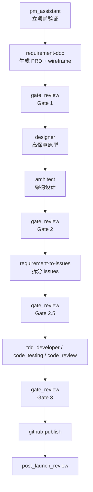
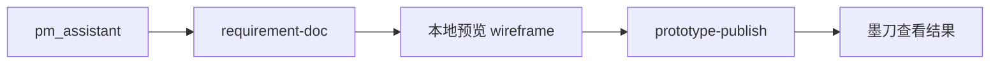
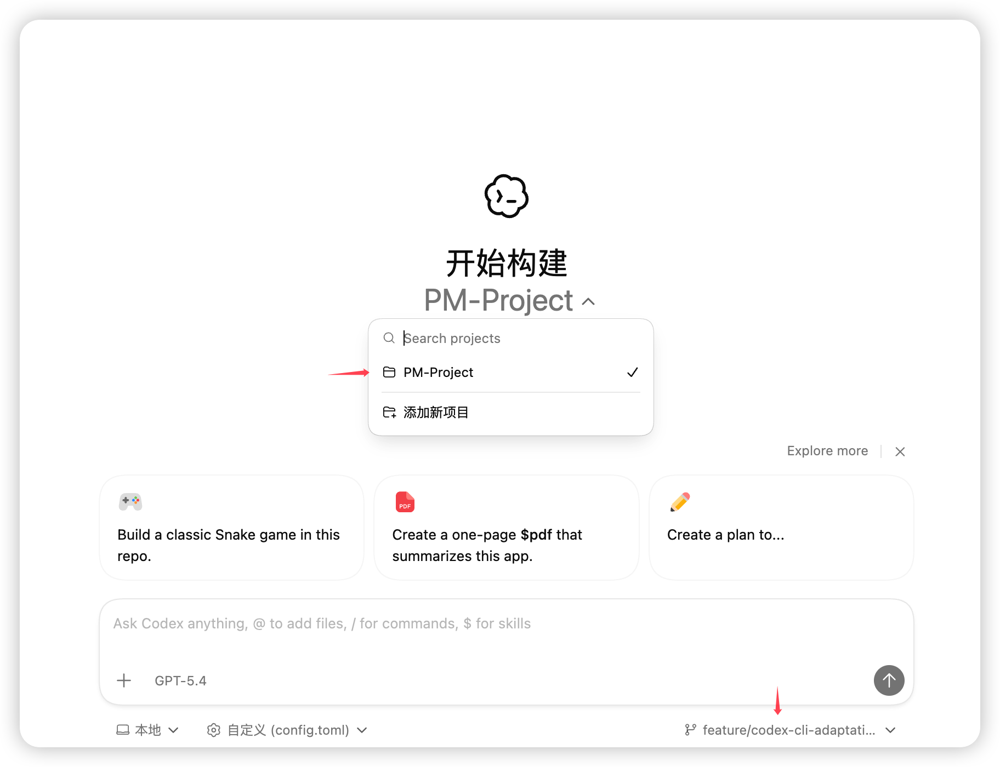
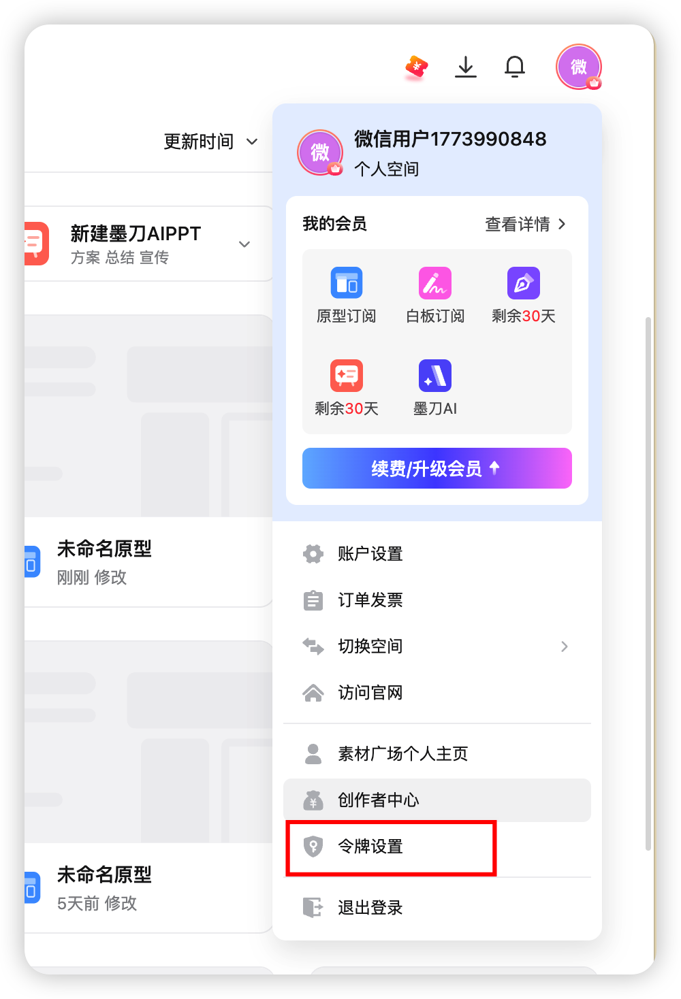
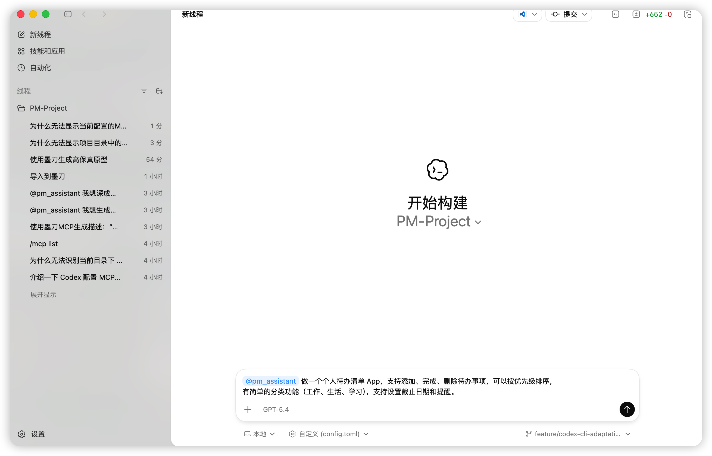
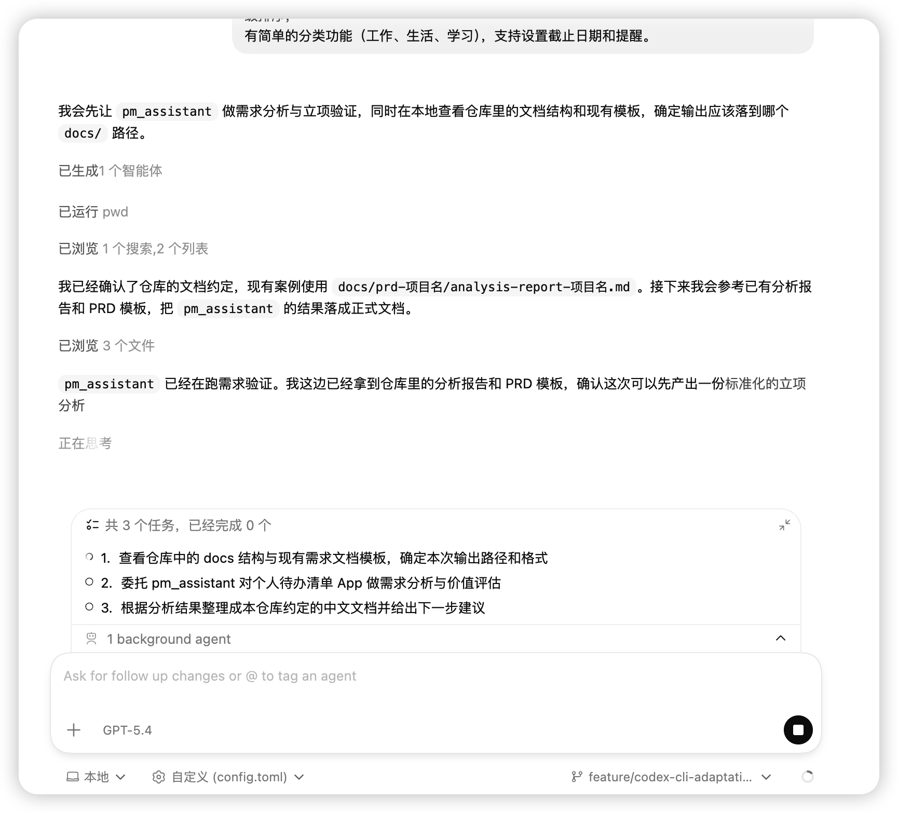
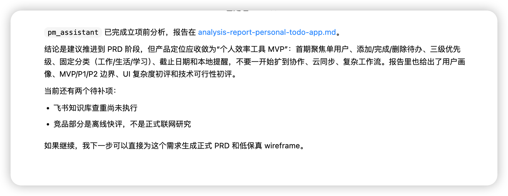
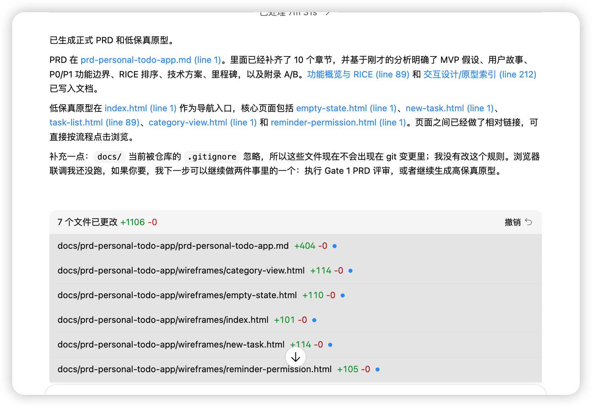
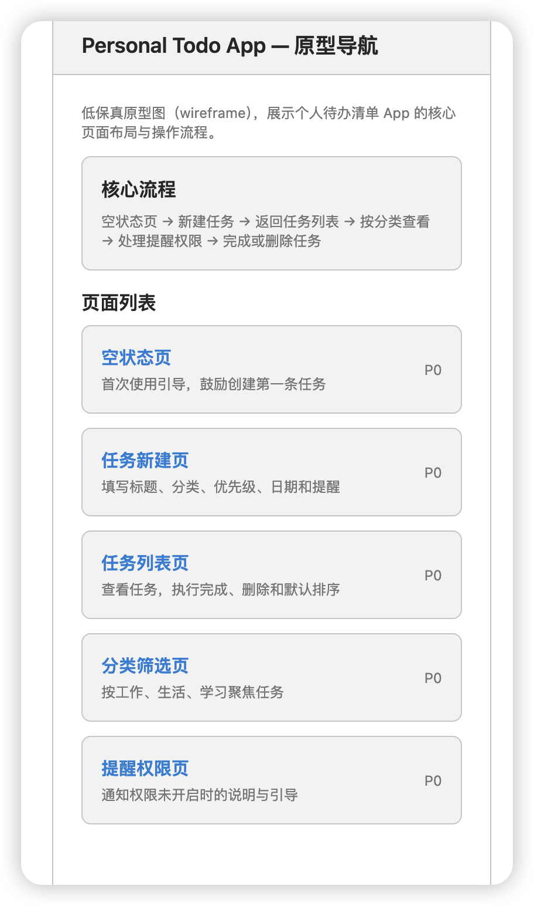

# PM-Project Hands-on 实操指南

本文档面向 Workshop 参与者，基于**当前仓库内容**介绍如何理解 PM-Project，并亲手跑通一条最典型的链路：

```text
需求灵感 → pm_assistant → requirement-doc → wireframe 预览 → prototype-publish → 墨刀
```

> 本文以当前检出的仓库内容为准。编写本文时，工作分支为 `features/github-only`；如果你在其它分支，Agent / Skill 数量和 `.codex/config.toml` 配置可能不同。

---

## 目录

- [1. 仓库背景](#1-仓库背景)
- [2. 当前仓库包含什么](#2-当前仓库包含什么)
- [3. 实操前准备](#3-实操前准备)
- [4. Hands-on 主链路](#4-hands-on-主链路)
- [5. 常见问题](#5-常见问题)

---

## 1. 仓库背景

### 1.1 仓库定位

PM-Project 不是传统业务代码仓库，而是一个面向 **GitHub Copilot + OpenAI Codex** 的 Agent / Skill 知识库。它把产品研发过程中的关键环节沉淀为可复用的 AI 协作能力，包括：

- 需求分析与立项前验证
- PRD 与 wireframe 生成
- 高保真原型设计与平台发布
- 架构设计与 Stage-Gate 评审
- 任务拆分、代码审查、测试与复盘

### 1.2 当前仓库的核心价值

| 维度 | 当前状态 |
| --- | --- |
| 角色化协作 | 当前仓库包含 11 个 GitHub Agent 主定义，并为这 11 个 Agent 补齐了 Codex 自定义 Agent 适配 |
| 技能沉淀 | 当前仓库包含 17 个 Skill，统一维护在 `.github/skills/` |
| 双平台适配 | GitHub Copilot 读取 `.github/agents/*.agent.md`；Codex 读取 `AGENTS.md`、`.codex/config.toml`、`.codex/agents/*.toml` |
| MCP 集成 | 当前 `.codex/config.toml` 已注册 `tavily`、`github`、`playwright`、`feishu`、`modao`、`context7` |
| 过程治理 | 当前流程包含 Gate 1 / Gate 2 / Gate 2.5 / Gate 3，并通过 `workflow-manifest.json` 做阶段契约 |

### 1.3 目录结构概览

```text
PM-Project/
├── AGENTS.md                    # Codex 仓库级指令
├── .codex/
│   ├── config.toml             # Codex 项目级配置与 MCP 注册
│   ├── agents/                 # 11 个 Codex 自定义 Agent
│   └── rules/                  # Codex 运行时规则
├── .github/
│   ├── agents/                 # 11 个 GitHub Agent 主定义
│   ├── skills/                 # 17 个 Skill 主定义
│   └── copilot-instructions.md # GitHub Copilot 项目指令
├── .agents/
│   └── skills/                 # 指向 .github/skills 的兼容软链接镜像
├── docs/                       # 流程与规范文档
├── projects/                   # 运行后产出的 PRD / 架构 / 原型等
├── plans/                      # Planning 输出
└── Hands-on/hands-on-guide.md
```

> 重点区分：
>
> - `.github/agents/*.agent.md` 是 GitHub Copilot 侧的主定义
> - `.codex/agents/*.toml` 是 Codex 侧的运行时适配层
> - `.github/skills/` 是 Skill 主定义源
> - `.agents/skills/` 只是给 Codex 做技能发现的软链接镜像

---

## 2. 当前仓库包含什么

### 2.1 当前 Agent 一览

当前仓库实际维护的 Agent 是这 11 个：

| Agent | 作用 |
| --- | --- |
| `pm_assistant` | 需求分析、查重、竞品检索、立项前价值评估 |
| `architect` | 根据 PRD 生成技术架构方案 |
| `designer` | 根据 PRD / wireframe 生成高保真原型 |
| `gate_review` | Gate 1 / 2 / 2.5 / 3 评审与 Go/No-Go 决策 |
| `planning` | 开发前上下文研究与实施规划 |
| `tdd_developer` | 基于 Issue / 架构文档执行 TDD 开发 |
| `code_testing` | 测试策略、测试补齐、覆盖分析 |
| `code_review` | MUST / SHOULD / NIT 三级代码审查 |
| `pr_review_submit` | 把审查结论写回 GitHub PR Review |
| `pm_workflow_evaluator` | 横向评估整条 PM 工作流健康度 |
| `post_launch_review` | 上线复盘、数据分析与迭代建议 |

> 旧版手册中出现的 `requirement_analyst`、`code_debug`、`code_docs`、`ui_testing`、`new_employee_mentor` 等角色，当前分支里已经不存在，不应再作为现行能力介绍。

### 2.2 当前 Skill 一览

当前仓库维护的 17 个 Skill 如下：

| Skill | 作用 |
| --- | --- |
| `requirement-doc` | 生成主 PRD、Module PRD 与低保真 wireframe |
| `requirement-to-issues` | 将 PRD 拆分为 Epic / Task（支持 GitHub 远程创建或本地 Markdown 存储） |
| `architect-doc` | 技术架构模板、ADR 与模块级架构设计 |
| `prototype-design` | 从低保真升级为高保真原型 |
| `prototype-publish` | 发布原型到墨刀 / Figma |
| `premium-frontend-ui` | 沉浸式高端 UI 设计规范 |
| `playwright-testing` | UI / E2E 自动化测试 |
| `code-review` | 代码审查方法论与输出模板 |
| `security-audit` | OWASP Top 10 安全审查 |
| `tdd-coder` | TDD 工作流与编码约束 |
| `microservices` | 微服务设计与治理规范 |
| `github-publish` | 提交、推送、PR 与发布流程 |
| `feishu-docs` | 飞书文档检索、同步与 MCP 接入 |
| `gate-review` | Gate 检查清单与评审辅助材料 |
| `doc-lint` | 文档结构化 Lint、RTM 生成、Warning 追踪 |
| `doc-quality-judge` | LLM-as-Judge 文档语义质量评估 |
| `workflow-dashboard` | 流程指标看板与结果汇总 |

### 2.3 当前推荐主流程


```mermaid
flowchart TD
    A["pm_assistant<br/>立项前验证"] --> B["requirement-doc<br/>生成 PRD + wireframe"]
    B --> C["gate_review<br/>Gate 1"]
    C --> D["designer<br/>高保真原型"]
    D --> E["architect<br/>架构设计"]
    E --> F["gate_review<br/>Gate 2"]
    F --> G["requirement-to-issues<br/>拆分 Issues"]
    G --> H["gate_review<br/>Gate 2.5"]
    H --> I["tdd_developer / code_testing / code_review"]
    I --> J["gate_review<br/>Gate 3"]
    J --> K["github-publish"]
    K --> L["post_launch_review"]
```

### 2.4 本次 Hands-on 走哪一段

本次实操聚焦最容易上手、也最能体现仓库价值的一段：


```mermaid
flowchart LR
    A["pm_assistant"] --> B["requirement-doc"]
    B --> C["本地预览 wireframe"]
    C --> D["prototype-publish"]
    D --> E["墨刀查看结果"]
```

这条链路的优势是：

- 能快速理解 Agent 和 Skill 如何配合
- 能直观看到 `projects/prd-{项目名}/` 下的实际产物
- 不依赖完整研发链路，也不需要先准备 GitHub Issues

---

## 3. 实操前准备

### 3.1 克隆仓库并安装依赖

```bash
git clone https://github.com/nickhou1983/PM-Project.git
cd PM-Project
npm install
```

如果你已经在本仓库目录中，可直接执行：

```bash
git branch --show-current
npm install
```

### 3.2 选择运行环境

你可以使用以下任一环境：

- **Codex App**
  - 适合 Workshop 现场演示和多线程交互
  - 官方文档：[Codex App](https://developers.openai.com/codex/app)
- **Codex CLI**
  - 适合命令行操作和本地工作流
  - 官方文档：[Codex CLI](https://developers.openai.com/codex/cli)

无论用哪种方式，重点都是：**打开的项目根目录必须是本仓库根目录**，这样 Codex 才会自动读取：

- 根目录 `AGENTS.md`
- `.codex/config.toml`
- `.codex/agents/*.toml`
- `.agents/skills/`

如果你使用 Codex App，打开项目后可以先确认界面已经选中本仓库根目录。



### 3.3 验证仓库关键文件

```bash
ls AGENTS.md
ls .codex
ls .codex/agents
ls .agents/skills
```

你应该至少看到：

- `AGENTS.md`
- `.codex/config.toml`
- `.codex/rules/`
- 11 个 `.codex/agents/*.toml`
- 17 个 `.agents/skills/*` 软链接镜像

### 3.4 当前 MCP 配置与环境变量

当前 `.codex/config.toml` 已注册以下 MCP server：

| MCP | 用途 | 当前仓库是否已预置 | 需要的环境变量 |
| --- | --- | --- | --- |
| `modao` | 原型生成与导入墨刀 | 是 | `MODAO_TOKEN` |
| `feishu` | 飞书文档检索与同步 | 是 | `FEISHU_APP_ID`、`FEISHU_APP_SECRET` |
| `tavily` | 网络搜索（竞品分析） | 是 | `TAVILY_API_KEY` |
| `github` | GitHub Issue / PR 操作 | 是 | `GITHUB_TOKEN` |
| `playwright` | UI / E2E 自动化测试 | 是 | 无 |
| `context7` | 开发文档检索 | 是 | 无 |

> 说明：
>
> - **本次 Hands-on 必需**：`MODAO_TOKEN`
> - **推荐但非必需**：`TAVILY_API_KEY`
> - **可选**：`FEISHU_APP_ID`、`FEISHU_APP_SECRET`、`GITHUB_TOKEN`
> - `prototype-publish` Skill 支持 Figma 路径，但 **当前 `.codex/config.toml` 没有预置 Figma MCP**；如果要走 Figma 路径，需要你自行完成用户级配置

### 3.5 配置墨刀 Token

1. 登录 [墨刀](https://modao.cc)
2. 打开个人设置
3. 创建或复制访问令牌
4. 将 Token 写入环境变量



macOS / Linux：

```bash
echo 'export MODAO_TOKEN="你的墨刀访问令牌"' >> ~/.zshrc
source ~/.zshrc
echo $MODAO_TOKEN
```

Windows PowerShell：

```powershell
[Environment]::SetEnvironmentVariable("MODAO_TOKEN", "你的墨刀访问令牌", "User")
```

### 3.6 理解当前墨刀 MCP 配置

当前仓库里的 `.codex/config.toml` 使用的是**运行时环境变量展开**方式，而不是把 Token 明文写入配置：

```toml
[mcp_servers.modao]
command = "sh"
args = ["-lc", "exec npx -y @modao-mcp/modao-proto-mcp --token \"$MODAO_TOKEN\" --url https://modao.cc"]
startup_timeout_sec = 15
tool_timeout_sec = 60
```

这意味着：

- 你只需要在本机环境变量中配置 `MODAO_TOKEN`
- 不需要改仓库里的 `.codex/config.toml`
- Token 不会因为提交仓库而泄漏

---

## 4. Hands-on 主链路

### 4.1 实操目标

我们用一个简单需求跑通完整链路：

> 做一个个人待办清单 App，支持添加、完成、删除待办事项；支持优先级排序、分类（工作 / 生活 / 学习）、截止日期和提醒。

目标产出：

- 一份 `pm_assistant` 的价值评估结果
- 一份正式 PRD
- 一组低保真 wireframe
- 一个导入到墨刀的原型

### 4.2 Step 1：启动 Codex 并输入需求灵感

如果你使用 **Codex App**：

- 打开本仓库目录
- 在同一个线程中直接输入需求

如果你使用 **Codex CLI**：

```bash
codex
```

然后输入下面这段需求：

```text
请使用 pm_assistant 分析一个新需求：
做一个个人待办清单 App，支持添加、完成、删除待办事项，可以按优先级排序，
有简单的分类功能（工作、生活、学习），支持设置截止日期和提醒。
```



### 4.3 Step 2：查看 pm_assistant 的输出

`pm_assistant` 当前职责不是直接生成最终 PRD，而是先做立项前分析。按当前仓库定义，它会重点覆盖：

- 需求理解与拆解
- 本地项目 / 文档查重
- 网络竞品分析（如果已配置 Tavily）
- 商业模型快评
- UI 复杂度和技术可行性初评
- 是否建议推进

你可以重点观察输出里是否有这些信息：

| 关注点 | 说明 |
| --- | --- |
| 需求边界 | 有没有把 P0 核心功能讲清楚 |
| 用户价值 | 有没有说明解决什么痛点 |
| 竞品与差异化 | 如果配置了 Tavily，会给出外部参考 |
| 推进建议 | 是否建议进入 PRD 阶段 |



如果结论是建议推进，就进入下一步。



### 4.4 Step 3：生成 PRD 与低保真原型

继续在同一个线程输入：

```text
根据刚才的分析结果，调用 requirement-doc 生成正式 PRD 和低保真 wireframe。
项目名使用 todo-app。
```

按照当前 `requirement-doc` Skill，产物会落在：

```text
projects/prd-todo-app/
├── prd-todo-app.md
├── modules/                 # 只有命中模块化条件时才会生成
└── wireframes/
    ├── index.html
    ├── ...
```

本地检查：

```bash
ls projects/prd-todo-app
ls projects/prd-todo-app/wireframes
```

如果想直接查看低保真原型：

```bash
# macOS
open projects/prd-todo-app/wireframes/index.html

# Linux
xdg-open projects/prd-todo-app/wireframes/index.html

# Windows
start projects/prd-todo-app/wireframes/index.html
```





> 提示：
>
> - `requirement-doc` 当前已经接入 `workflow-manifest` 规则，因此在真实项目中会校验上游阶段并写回 `stages.prd`
> - 如果你的输入足够复杂，它可能会进入**模块化 PRD**模式，而不只是单文件 PRD

### 4.5 Step 4：可选执行 Gate 1 评审

如果你想让 Hands-on 更完整，可以在 PRD 生成后继续输入：

```text
请对 projects/prd-todo-app/prd-todo-app.md 执行 Gate 1 评审。
```

这一步会让 `gate_review` 按当前仓库的 Gate 规则检查：

- PRD 结构是否完整
- 功能优先级是否清晰
- 非功能需求是否可量化
- RICE / RTM / 版本信息是否足够支撑下游使用

这一步不是导入墨刀的前置条件，但很适合演示“仓库不是只有生成，还有质量门控”。

### 4.6 Step 5：发布到墨刀

继续在同一个线程输入：

```text
调用 prototype-publish，将 projects/prd-todo-app/wireframes/ 下的低保真原型发布到墨刀。
```

当前 `prototype-publish` Skill 在墨刀路径下的核心动作是：

| 步骤 | 工具 | 说明 |
| --- | --- | --- |
| 1 | `gen_description` | 输入较简略时，先补全设计说明 |
| 2 | `gen_html` | 生成适配平台导入的 HTML 原型 |
| 3 | `import_html` | 导入墨刀个人空间 |

导入完成后，期望看到类似结果：

```markdown
## 🎨 原型平台发布结果

**目标平台**：墨刀

| 页面 | 状态 | 平台位置 |
|------|------|----------|
| 首页导航 | ✅ | 墨刀个人空间 |
| 待办列表 | ✅ | 墨刀个人空间 |
| 添加任务 | ✅ | 墨刀个人空间 |
```

### 4.7 Step 6：在墨刀中检查结果

1. 登录 [墨刀](https://modao.cc)
2. 进入个人空间
3. 打开刚刚导入的原型项目
4. 检查页面数量、顺序和基本布局是否正确

如果只想演示“仓库生成了本地原型”，也可以到 Step 3 为止，不强制走墨刀导入。

### 4.8 本次 Hands-on 覆盖了什么

| 环节 | Agent / Skill | 产出 |
| --- | --- | --- |
| 立项前分析 | `pm_assistant` | 需求分析与建议推进结论 |
| PRD 生成 | `requirement-doc` | PRD 文档 |
| 低保真原型 | `requirement-doc` | `wireframes/*.html` |
| 平台发布 | `prototype-publish` | 墨刀中的原型 |

如果你还想继续向下游扩展，可以继续试：

| 下一步 | 建议输入 |
| --- | --- |
| 高保真原型 | `请使用 designer 基于 todo-app 的 PRD 和 wireframe 生成高保真原型。` |
| 架构设计 | `请使用 architect 基于 todo-app 的 PRD 生成架构文档。` |
| 任务拆分（GitHub） | `请调用 requirement-to-issues，把 todo-app PRD 拆分成 Epic 和 Task。` |
| 任务拆分（本地） | `请调用 requirement-to-issues，把 todo-app PRD 拆分成本地 Issue 文件。` |
| 测试策略 | `请使用 code_testing 为 todo-app 制定测试策略。` |
| 工作流评估 | `请使用 pm_workflow_evaluator 评估 todo-app 的流程健康度。` |

---

## 5. 常见问题

### 5.1 仓库里为什么同时有 `.github/skills/` 和 `.agents/skills/`？

因为当前仓库采用“双平台主定义 + Codex 镜像发现”的结构：

- `.github/skills/` 是主定义源
- `.agents/skills/` 是给 Codex 扫描技能时使用的软链接镜像

你不应该直接维护两份内容。

### 5.2 为什么手册里不再写旧的 14 个 Agent？

因为当前分支真实存在的 Agent 只有 11 个。旧手册里提到的若干角色已经不在当前仓库里，继续保留会误导使用者。

### 5.3 为什么 `prototype-publish` 提到 Figma，但 Hands-on 只演示墨刀？

因为当前 `.codex/config.toml` 已经预置了 `modao` MCP，但**没有预置 Figma MCP**。所以 Hands-on 默认走墨刀路径；Figma 仍然是 Skill 能力的一部分，但需要额外用户级配置。

### 5.4 `pm_assistant` 没有做竞品分析，正常吗？

正常。当前仓库里 Tavily 是已注册但依赖环境变量的 MCP：

- 没有配置 `TAVILY_API_KEY` 时，外部竞品检索能力会受限
- 但本地需求理解、PRD 生成、wireframe 生成仍然可以继续

### 5.5 `requirement-to-issues` 不配置 GitHub Token 能用吗？

可以。当前 `requirement-to-issues` 已支持**本地存储模式**：

- 无 `GITHUB_TOKEN` 或无 GitHub MCP 时，Skill 会自动推断为「本地模式」
- 产物以 Markdown + YAML frontmatter 形式存储在 `projects/prd-{project}/issues/` 目录下
- 输出包含 Epic 文件、Task 文件和 `_index.md` 索引

三种存储模式：

| 模式 | 触发方式 | 需要 GitHub Token |
| --- | --- | --- |
| GitHub 模式（默认） | 正常使用，且 GitHub MCP 可用 | 是 |
| 本地模式 | 说"本地存储 Issue"或无 GitHub MCP | 否 |
| 混合模式 | 说"同时本地和 GitHub" | 是 |

### 5.6 当前实操至少要配哪些环境变量？

最小集合如下：

| 环境变量 | 是否必需 | 用途 |
| --- | --- | --- |
| `MODAO_TOKEN` | 本次导入墨刀时必需 | 墨刀原型导入 |
| `TAVILY_API_KEY` | 可选 | 竞品分析、网络检索 |
| `FEISHU_APP_ID` | 可选 | 飞书文档查重与同步 |
| `FEISHU_APP_SECRET` | 可选 | 飞书文档查重与同步 |
| `GITHUB_TOKEN` | 可选 | GitHub Issue / PR 流程（本地模式下不需要） |

### 5.7 如何快速确认 Codex 真的读取了仓库配置？

可以做三件事：

1. 确认打开的是仓库根目录，而不是子目录
2. 确认根目录存在 `AGENTS.md` 与 `.codex/config.toml`
3. 在 Codex 中先问一句：

```text
请先总结这个仓库里的 Agent、Skill 和当前工作流。
```

如果返回内容能正确提到：

- 11 个 Agent
- `.github/skills/` + `.agents/skills/`
- `pm_assistant → requirement-doc → gate_review ...`

说明项目级指令和技能发现通常已经生效。
