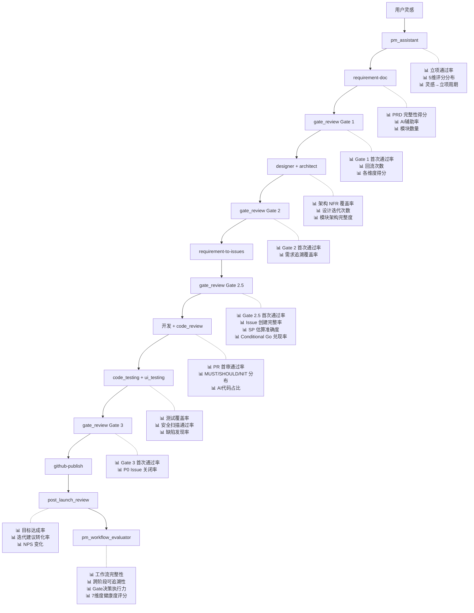

# AI 时代产品团队度量体系框架

> **版本**: v1.2.0  
> **日期**: 2026-04-13  
> **状态**: 活跃  
> **适用范围**: 产品经理 / 开发工程师 / 测试工程师  
> **AI 工具背景**: GitHub Copilot  
> **关联工作流**: [pm-assistant-downstream-workflow.md](pm-assistant-downstream-workflow.md)

---

## 目录

- [§1 引言：AI 时代的度量范式转移](#1-引言ai-时代的度量范式转移)
- [§2 三层度量仪表盘设计](#2-三层度量仪表盘设计)
- [§3 PM-Project 工作流度量集成](#3-pm-project-工作流度量集成)
- [§4 GitHub Copilot 专项度量](#4-github-copilot-专项度量)
- [§5 反模式与踩坑分析](#5-反模式与踩坑分析)
- [§6 实施路线图](#6-实施路线图)
- [§7 附录](#7-附录)

---

## §1 引言：AI 时代的度量范式转移

### 1.1 为什么传统度量体系正在失效？

AI 编程助手（以 GitHub Copilot 为代表）的普及，使传统度量指标面临根本性挑战：

| 传统指标 | 失效原因 | 失效程度 |
|---------|---------|---------|
| 代码行数（LoC） | Copilot 可秒级生成大量代码，量不再反映能力 | 🔴 完全失效 |
| 提交频率 / Commit 数 | AI 辅助下提交节奏被工具而非能力决定 | 🟡 严重衰减 |
| Bug 发现数量 | AI 可批量生成测试用例，数量膨胀但不代表覆盖深度 | 🟡 严重衰减 |
| 需求文档页数 | AI PRD 生成使文档产出变得廉价 | 🔴 完全失效 |
| 任务完成数 | AI 加速执行使简单任务完成数意义降低 | 🟡 严重衰减 |

### 1.2 新范式：度量 AI 无法替代的能力

**核心原则**：度量应聚焦于 AI 无法替代的三项核心能力 —

```
┌──────────────────────────────────────────────────────┐
│                  AI 无法替代的能力                      │
│                                                      │
│   ┌─────────────┐  ┌──────────┐  ┌──────────────┐   │
│   │   判断力     │  │ 系统思维  │  │  创造性洞察   │   │
│   │             │  │          │  │              │   │
│   │ 需求取舍    │  │ 全局影响  │  │ 差异化创新    │   │
│   │ 风险评估    │  │ 架构权衡  │  │ 用户共情      │   │
│   │ 优先级排序  │  │ 技术债务  │  │ 市场嗅觉      │   │
│   └─────────────┘  └──────────┘  └──────────────┘   │
│                                                      │
│   ──────── vs ────────                               │
│                                                      │
│   AI 可替代：执行速度 / 产出量 / 格式规范 / 模板填充    │
└──────────────────────────────────────────────────────┘
```

### 1.3 本框架与 PM-Project 工作流的关系

本仓库定义了完整的产品开发全流程（见 [pm-assistant-workflow-one-page.md](../pm-assistant-workflow-one-page.md)），已内建三道 Stage-Gate 质量门和上线复盘机制。本度量框架在此基础上：

1. **补充量化指标** — 为每个 Gate 和 Agent 定义可计算的度量指标
2. **增加 AI 维度** — 新增 Copilot 使用效能的度量层
3. **定义反模式** — 明确 AI 时代应避免的度量陷阱
4. **设计仪表盘** — 提供可落地的可视化方案

---

## §2 三层度量仪表盘设计

### 2.1 仪表盘架构总览

```
┌─────────────────────────────────────────────────────┐
│  L1 管理层仪表盘（Management Dashboard）              │
│  目标：端到端效能一目了然                              │
│  受众：技术负责人 / 产品负责人                          │
│  刷新频率：每周                                       │
├─────────────────────────────────────────────────────┤
│  L2 角色仪表盘（Role Dashboard）                      │
│  目标：PM / Dev / QA 各自的核心指标                    │
│  受众：各角色个人 + 直属 Lead                          │
│  刷新频率：每日                                       │
├─────────────────────────────────────────────────────┤
│  L3 AI 工具仪表盘（AI Tool Dashboard）                │
│  目标：Copilot 使用效能与质量影响                      │
│  受众：工程效能团队                                    │
│  刷新频率：每周                                       │
└─────────────────────────────────────────────────────┘
```

---

### 2.2 L1 管理层仪表盘

#### 指标清单

| # | 指标名称 | 计算公式 | 数据采集源 | 图表类型 | 告警阈值 |
|---|---------|---------|-----------|---------|---------|
| L1-1 | **需求交付周期** | `上线日期 - pm_assistant 立项日期`（自然日） | Git 提交时间戳 + Gate 评审日期 | 趋势折线图 | > 60 天黄灯，> 90 天红灯 |
| L1-2 | **Gate 通过率** | `首次通过项目数 / 总评审项目数 × 100%`（分 Gate 1/2/2.5/3） | Gate Review 评审报告 | 堆叠柱状图 | < 60% 红灯 |
| L1-3 | **缺陷逃逸率** | `线上 Bug 数 / (线上 Bug + 测试阶段 Bug) × 100%` | GitHub Issues（标签 `bug` + `production`） | 仪表盘（Gauge） | > 10% 黄灯，> 20% 红灯 |
| L1-4 | **上线目标达成率** | `达标指标数 / PRD §8 定义的成功指标总数 × 100%` | Post Launch Review 报告 | 雷达图 | < 70% 黄灯，< 50% 红灯 |
| L1-5 | **AI 效率增益比** | `(AI辅助前平均交付周期 - 当前交付周期) / AI辅助前平均交付周期 × 100%` | 历史基线 + 当前数据 | 对比柱状图 | 负增长红灯 |
| L1-6 | **回滚率** | `回滚发布数 / 总发布数 × 100%` | CI/CD 部署日志 | 趋势折线图 | > 5% 黄灯，> 10% 红灯 |

#### 布局建议

```
┌─────────────────┬──────────────────┬─────────────────┐
│  需求交付周期     │  Gate 通过率      │  缺陷逃逸率      │
│  (折线图, 12周)  │  (柱状图, 3 Gate)│  (Gauge, 当月)   │
├─────────────────┴──────────────────┴─────────────────┤
│        上线目标达成率（雷达图, 按项目）                  │
├──────────────────────────┬───────────────────────────┤
│  AI 效率增益比            │   回滚率                   │
│  (对比柱状图)             │   (折线图)                 │
└──────────────────────────┴───────────────────────────┘
```

---

### 2.3 L2 角色仪表盘

#### 2.3.1 PM 仪表盘

| # | 指标名称 | 计算公式 | 数据采集源 | 图表类型 | 告警阈值 |
|---|---------|---------|-----------|---------|---------|
| L2-PM-1 | **需求首次评审通过率** | `Gate 1 首次 Go 数 / Gate 1 总评审数 × 100%` | Gate 1 评审报告 | 环形图 | < 50% 红灯 |
| L2-PM-2 | **需求变更率** | `开发启动后 scope-change Issue 数 / 总 Issue 数 × 100%` | GitHub Issues (`scope-change` 标签) | 趋势折线图 | > 20% 黄灯，> 30% 红灯 |
| L2-PM-3 | **PRD 完整性得分** | `Gate 1 各维度加权得分（完整性30%+合理性25%+可行性25%+原型15%+版本5%）` | Gate 1 评审报告中的评分矩阵 | 雷达图 | 任一维度 < 60% 黄灯 |
| L2-PM-4 | **灵感→PRD 周期** | `requirement-doc 完成日 - pm_assistant 立项日`（自然日） | 文件创建时间戳 | 趋势折线图 | > 14 天黄灯 |
| L2-PM-5 | **竞品分析深度** | `pm_assistant 报告中竞品数量 + 差异化优势条目数` | pm_assistant 价值评估报告 | 数值卡片 | 竞品 < 3 个红灯 |
| L2-PM-6 | **差异化功能占比** | `原创功能点数 / 总功能点数 × 100%` | PRD 功能列表人工标注 | 饼图 | < 20% 黄灯 |
| L2-PM-7 | **复盘目标达成率** | `Post Launch Review 中达标指标数 / PRD §8 目标数 × 100%` | post_launch_review 报告 | 仪表盘 | < 60% 红灯 |

#### 2.3.2 Dev 仪表盘

| # | 指标名称 | 计算公式 | 数据采集源 | 图表类型 | 告警阈值 |
|---|---------|---------|-----------|---------|---------|
| L2-Dev-1 | **PR 首次审查通过率** | `无 MUST 意见的 PR 数 / 总 PR 数 × 100%` | GitHub PR Reviews（code_review Agent 输出） | 环形图 | < 60% 黄灯 |
| L2-Dev-2 | **生产缺陷密度** | `线上 Bug 数 / 交付代码千行数` | GitHub Issues + `git diff --stat` | 趋势折线图 | > 2 bugs/KLoC 红灯 |
| L2-Dev-3 | **MUST 问题解决率** | `已修复 MUST 数 / 总 MUST 数 × 100%` | code_review Agent 审查报告 | 进度条 | < 100% 时 Gate 3 阻断 |
| L2-Dev-4 | **架构 NFR 覆盖率** | `有架构方案的 NFR 数 / PRD §5 定义的 NFR 总数 × 100%` | Gate 2 评审报告 | 百分比卡片 | < 100% 红灯 |
| L2-Dev-5 | **技术债务净变化** | `本迭代新增技术债务 - 本迭代消除技术债务` | 代码质量工具（SonarQube/CodeClimate） | 趋势折线图 | 连续 3 迭代正增长红灯 |
| L2-Dev-6 | **代码审查响应时间** | `PR 提交到首次 Review 的中位时间（小时）` | GitHub PR 时间戳 | 趋势折线图 | > 24h 黄灯，> 48h 红灯 |
| L2-Dev-7 | **安全漏洞引入率** | `security-audit 发现的高危漏洞数 / PR 数` | security-audit Skill 扫描结果 | 数值卡片 | > 0 红灯 |

#### 2.3.3 QA 仪表盘

| # | 指标名称 | 计算公式 | 数据采集源 | 图表类型 | 告警阈值 |
|---|---------|---------|-----------|---------|---------|
| L2-QA-1 | **缺陷逃逸率** | `线上 Bug / (线上 Bug + 测试 Bug) × 100%` | GitHub Issues | 仪表盘 | > 10% 红灯 |
| L2-QA-2 | **有效缺陷率** | `确认有效的 Bug 数 / 提交的总 Bug 数 × 100%` | GitHub Issues 状态流转 | 环形图 | < 70% 黄灯 |
| L2-QA-3 | **P0/P1 缺陷测试阶段拦截率** | `测试阶段发现的 P0P1 Bug / 总 P0P1 Bug × 100%` | Bug 严重级别 + 发现阶段标签 | 百分比卡片 | < 90% 红灯 |
| L2-QA-4 | **测试覆盖率** | `单元测试覆盖率 + 集成测试 API 覆盖率 + E2E 核心路径覆盖率` | 测试框架报告（Jest/pytest/Playwright） | 堆叠柱状图 | 单元 < 80% 或 E2E < P0 路径黄灯 |
| L2-QA-5 | **探索性测试发现率** | `探索性测试发现的 Bug 数 / 总测试 Bug 数 × 100%` | Bug 来源标注（`exploratory` 标签） | 趋势折线图 | < 10% 黄灯（AI 时代这个比例下降说明探索性不足） |
| L2-QA-6 | **自动化测试 ROI** | `(节省的回归测试人时 - 自动化脚本编写维护人时) / 自动化脚本编写维护人时 × 100%` | 工时记录 | 数值卡片 | < 100% 黄灯（ROI 低于 1x） |
| L2-QA-7 | **回归测试精准度** | `回归测试覆盖的实际影响文件数 / 变更实际影响文件数 × 100%` | Git diff + 测试执行范围 | 百分比卡片 | < 80% 黄灯 |

---

### 2.4 L3 AI 工具仪表盘

> 详细指标定义见 [§4 GitHub Copilot 专项度量](#4-github-copilot-专项度量)，此处展示仪表盘布局。

```
┌──────────────────────────────────────────────────────────┐
│                    L3 AI 工具仪表盘                       │
├──────────────┬──────────────┬──────────────┬─────────────┤
│ Acceptance   │ AI-Authored  │ AI 代码      │  Chat       │
│ Rate         │ Lines %      │ 缺陷密度     │  交互轮次   │
│ (Gauge)      │ (趋势折线)   │ (对比柱状)   │  (趋势折线) │
├──────────────┴──────────────┼──────────────┴─────────────┤
│  PM: PRD AI辅助率 vs 人工   │  QA: AI测试用例有效率      │
│  编辑比例 (堆叠面积图)      │  vs 盲区发现率 (双轴图)    │
├─────────────────────────────┴────────────────────────────┤
│        Developer Velocity Index 变化趋势（折线图）        │
└──────────────────────────────────────────────────────────┘
```

---

## §3 PM-Project 工作流度量集成

本章将度量指标嵌入到 PM-Project 已有的 Stage-Gate 工作流中。每个阶段绑定对应的 Agent/Skill，明确度量点、数据源和阶段关口。

### 3.1 度量埋点全景图



### 3.2 逐阶段度量详解

#### 阶段 1：立项验证（pm_assistant）

**绑定 Agent**：`pm_assistant`（[.github/agents/pm_assistant.agent.md](../.github/agents/pm_assistant.agent.md)）

| 度量指标 | 定义 | 计算公式 | 现有数据源 |
|---------|------|---------|-----------|
| 立项通过率 | 评估后建议推进的项目占比 | `✅建议推进 / (✅+⚠️+❌)` | pm_assistant 价值评估报告 |
| 5 维评分均值 | 创新度/市场需求/难度/竞争优势/商业可行性 | `5 维得分总和 / 5` | 价值评估报告 |
| 灵感→立项周期 | 从提交灵感到产出评估报告的时间 | `评估报告日期 - 灵感提交日期` | 文件时间戳 |
| 飞书查重命中率 | 飞书查重发现重叠的比例 | `查重命中项目数 / 总查重项目数` | 步骤 2 输出 |
| UI 复杂度分布 | 被评为低/中/高复杂度的项目占比 | 计数统计 | 步骤 5.1 输出 |

**阶段关口**：pm_assistant 综合结论 — ✅ 建议推进 / ⚠️ 条件推进 / ❌ 不建议推进

---

#### 阶段 2：PRD 生成（requirement-doc）

**绑定 Skill**：`requirement-doc`（[.github/skills/requirement-doc/SKILL.md](../.github/skills/requirement-doc/SKILL.md)）

| 度量指标 | 定义 | 计算公式 | 现有数据源 |
|---------|------|---------|-----------|
| PRD 章节完整度 | 10 个标准章节的填写覆盖率 | `已填写章节数 / 10 × 100%` | PRD 文档内容检查 |
| 模块化程度 | 是否按规范拆分 Module PRD | `Module PRD 数量 ≥ 3 为"模块化"` | `docs/prd-{项目}/modules/` 目录 |
| PRD 修订轮次 | 从初稿到 Gate 1 评审版的修订次数 | `Git commit 中 prd-*.md 的变更次数` | Git log |
| 原型页面覆盖率 | wireframe 覆盖 P0 功能的比例 | `有原型的 P0 功能数 / P0 功能总数 × 100%` | wireframes/ 目录 + PRD §4 |
| AI 辅助率 | PRD 中由 AI 生成后未经实质修改的段落占比 | 人工标注或 diff 分析 | PRD 版本对比 |

**阶段关口**：PRD 版本号达 v1.0.0 且原型导航页就绪

---

#### 阶段 3：PRD 评审（gate_review Gate 1）

**绑定 Agent**：`gate_review` Gate 1（[.github/agents/gate_review.agent.md](../.github/agents/gate_review.agent.md)）

| 度量指标 | 定义 | 计算公式 | 现有数据源 |
|---------|------|---------|-----------|
| Gate 1 首次通过率 | 首次评审即获 🟢 Go 的比例 | `首次 Go / 总评审数 × 100%` | Gate 评审报告 |
| 各维度得分分布 | 需求完整性(30%)/商业合理性(25%)/可行性(25%)/原型质量(15%)/版本管理(5%) | 各维度 ✅/⚠️/❌ 计数 | Gate 评审报告 |
| 回流次数 | No-Go 后回流修订的次数 | 累计 No-Go 次数 | Gate 评审记录 |
| 平均评审耗时 | 从提交评审到出结论的时间 | 时间差统计 | 评审报告时间戳 |
| Gate 回流率 | No-Go 后需返工重评的比例 | `No-Go 次数 / 该 Gate 总评审次数 × 100%` | Gate 评审报告 |
| 回流修复周期 | No-Go 后到重新提交评审的时间 | `第 N+1 次评审日期 − 第 N 次 No-Go 日期`（自然日） | 评审报告时间戳 |
| 二次评审通过率 | 第二次评审即 Go/Conditional Go 的比例 | `第二次 Go 数 / 二次评审总数 × 100%` | Gate 评审记录 |

> **回退告警阈值**：回流率 > 40% 🟡 / > 60% 🔴；回流修复周期 > 7 天 🟡；二次通过率 < 70% 🔴

**阶段关口**：Gate 1 判定 — 🟢 Go / 🟡 Conditional Go（限期解决）/ 🔴 No-Go（回流）

---

#### 阶段 4：设计 + 架构（designer + architect + Gate 2）

**绑定 Agent/Skill**：`designer` + `prototype-design` + `architect` + `gate_review` Gate 2

| 度量指标 | 定义 | 计算公式 | 数据源 |
|---------|------|---------|--------|
| 高保真原型覆盖率 | hifi-wireframes 覆盖 P0 页面的比例 | `hifi 页面数 / P0 页面数 × 100%` | hifi-wireframes/ 目录 |
| 架构 NFR 覆盖率 | 架构文档中有方案的 NFR 占比 | `有方案的 NFR / PRD §5 NFR 总数 × 100%` | Gate 2 评审报告 |
| 需求追溯覆盖率 | RTM 中 P0 功能→架构方案的追溯完整度 | `有追溯的 P0 / 总 P0 × 100%` | 架构文档 RTM 矩阵 |
| 模块架构完整度 | 模块级架构文档覆盖所有 Module PRD 的程度 | `架构文档数 / Module PRD 数 × 100%` | 文件目录统计 |
| Gate 2 首次通过率 | 同 Gate 1 计算方式 | 同上 | Gate 2 评审报告 |
| 架构评审各维度得分 | 完整性(30%)/追溯(25%)/质量属性(25%)/风险成本(15%)/版本(5%) | ✅/⚠️/❌ 计数 | Gate 2 评审报告 |
| Gate 回流率 | No-Go 后需返工重评的比例 | `No-Go 次数 / 该 Gate 总评审次数 × 100%` | Gate 评审报告 |
| 回流修复周期 | No-Go 后到重新提交评审的时间 | `第 N+1 次评审日期 − 第 N 次 No-Go 日期`（自然日） | 评审报告时间戳 |
| 二次评审通过率 | 第二次评审即 Go/Conditional Go 的比例 | `第二次 Go 数 / 二次评审总数 × 100%` | Gate 评审记录 |

> **回退告警阈值**：回流率 > 40% 🟡 / > 60% 🔴；回流修复周期 > 7 天 🟡；二次通过率 < 70% 🔴

**阶段关口**：Gate 2 — 🟢 Go / 🟡 Conditional Go / 🔴 No-Go

---

#### 阶段 4.5：Issues 质量评审（gate_review Gate 2.5）

**绑定 Agent**：`gate_review` Gate 2.5（[.github/agents/gate_review.agent.md](../.github/agents/gate_review.agent.md)）

| 度量指标 | 定义 | 计算公式 | 数据源 |
|---------|------|---------|--------|
| Gate 2.5 首次通过率 | 首次评审即获 🟢 Go 的比例 | `首次 Go / 总评审数 × 100%` | Gate 2.5 评审报告 |
| Issue 创建完整率 | 创建 Issue 数覆盖 PRD 功能点的比例 | `创建 Issue 数 / PRD §4 功能点数 × 100%` | GitHub Issues + PRD §4 |
| SP 估算准确度 | 预估 SP 与实际完成 SP 的吻合度（迭代后回溯） | `\|实际 SP − 预估 SP\| / 预估 SP × 100%`，值越低越准 | Issue SP 字段 + 关闭记录 |
| P0 Issue 无验收标准率 | 缺少 AC 的 P0 Task Issue 占比 | `无 AC 的 P0 Issue 数 / P0 Issue 总数 × 100%` | GitHub Issues 内容检查 / Gate 2.5 评审报告 |
| Epic-Task 绑定率 | 有父 Epic 的 Task 占比 | `有父 Epic 的 Task 数 / Task 总数 × 100%` | GitHub Sub-Issues |
| Conditional Go 兑现率 | Conditional Go 中限期修复 ⚠️ 项实际被关闭的比例 | `限期内关闭的 ⚠️ 项 / Conditional Go 总 ⚠️ 项 × 100%` | Gate 2.5 评审报告 → 后续版本对比 |
| Gate 回流率 | No-Go 后需返工重评的比例 | `No-Go 次数 / 该 Gate 总评审次数 × 100%` | Gate 评审报告 |
| 回流修复周期 | No-Go 后到重新提交评审的时间 | `第 N+1 次评审日期 − 第 N 次 No-Go 日期`（自然日） | 评审报告时间戳 |
| 二次评审通过率 | 第二次评审即 Go/Conditional Go 的比例 | `第二次 Go 数 / 二次评审总数 × 100%` | Gate 评审记录 |

> **告警阈值**：Issue 创建完整率 < 80% 🔴；SP 准确度偏差 > 50% 🟡；P0 无 AC 率 > 0 🔴；Epic-Task 绑定率 < 90% 🔴；Conditional Go 兑现率 < 100% 🟡；回流率 > 40% 🟡 / > 60% 🔴；回流修复周期 > 7 天 🟡；二次通过率 < 70% 🔴

**阶段关口**：Gate 2.5 — 🟢 Go / 🟡 Conditional Go（限期补充）/ 🔴 No-Go（回流补充 Issues）

---

#### 阶段 5：开发 + 审查（code_review + code_testing）

**绑定 Agent**：`code_review`（[.github/agents/code_review.agent.md](../.github/agents/code_review.agent.md)）+ `code_testing`

| 度量指标 | 定义 | 计算公式 | 数据源 |
|---------|------|---------|--------|
| PR 首审通过率 | 无 🔴 MUST 意见的 PR 比例 | `无 MUST 的 PR / 总 PR × 100%` | code_review 输出 |
| MUST/SHOULD/NIT 分布 | 审查意见严重级别分布 | 各级计数 | code_review 输出 |
| AI 代码占比 | Copilot 生成或辅助的代码行比例 | Copilot telemetry / PR diff 标注 | GitHub Copilot 后台 |
| 代码审查响应时间 | PR 创建到首次 Review 的中位时间 | 时间差中位数 | GitHub PR 时间戳 |
| 测试覆盖率 | 单元/集成/E2E 各层覆盖率 | 测试框架报告 | Jest/pytest/Playwright 报告 |
| 安全扫描通过率 | 高危漏洞为 0 的 PR 比例 | 安全扫描结果 | security-audit 扫描 |
| Issue 完成率 | 已关闭 P0 Issue / 总 P0 Issue | 计数比 | GitHub Issues |

**阶段关口**：所有 P0 Issue 关闭 + 无未解决 MUST + 测试全绿

---

#### 阶段 6：Gate 3 + 上线（gate_review Gate 3 + github-publish）

**绑定 Agent/Skill**：`gate_review` Gate 3 + `github-publish`

| 度量指标 | 定义 | 计算公式 | 数据源 |
|---------|------|---------|--------|
| Gate 3 首次通过率 | 首次 Go 比例 | 同 Gate 1 | Gate 3 评审报告 |
| 功能完成度(30%) | P0 Issue 关闭率 + PR 合并率 | Issue/PR 统计 | GitHub API |
| 测试覆盖(30%) | 单元+集成+E2E+安全均通过 | 各项 ✅/❌ | 测试报告 |
| 部署就绪(25%) | CI/CD 全绿 + 回滚方案 + 监控 | checklist 通过率 | CI/CD + 运维确认 |
| 文档沟通(15%) | 变更日志 + 用户文档 + 通知 | checklist 通过率 | 文档检查 |
| 上线周期 | Gate 3 通过到实际发布的时间 | 时间差 | 部署时间戳 |
| 回滚率 | 发布后触发回滚的比例 | 回滚次数 / 发布次数 | CI/CD 日志 |
| Gate 回流率 | No-Go 后需返工重评的比例 | `No-Go 次数 / 该 Gate 总评审次数 × 100%` | Gate 评审报告 |
| 回流修复周期 | No-Go 后到重新提交评审的时间 | `第 N+1 次评审日期 − 第 N 次 No-Go 日期`（自然日） | 评审报告时间戳 |
| 二次评审通过率 | 第二次评审即 Go/Conditional Go 的比例 | `第二次 Go 数 / 二次评审总数 × 100%` | Gate 评审记录 |

> **回退告警阈值**：回流率 > 40% 🟡 / > 60% 🔴；回流修复周期 > 7 天 🟡；二次通过率 < 70% 🔴

**阶段关口**：Gate 3 — 🟢 Go（发布）/ 🟡 Conditional Go / 🔴 No-Go（回流修复）

---

#### 阶段 7：上线复盘（post_launch_review）

**绑定 Agent**：`post_launch_review`（[.github/agents/post_launch_review.agent.md](../.github/agents/post_launch_review.agent.md)）

| 度量指标 | 定义 | 计算公式 | 数据源 |
|---------|------|---------|--------|
| 业务目标达成率 | PRD §8 成功指标的达标比例 | `达标指标数 / 总指标数 × 100%` | 埋点数据 + 监控面板 |
| 技术 SLA 达成率 | API P95、错误率、可用性达标比例 | 同上 | APM 监控 |
| NPS 得分 | 净推荐值 | `推荐者% - 贬损者%` | 用户问卷 |
| 事故影响度 | 上线后事故的用户影响面 | `受影响用户数 / 总用户数 × 100%` | 事故报告 |
| 迭代建议转化率 | 复盘建议被转化为 Issue/PRD 的比例 | `已创建 Issue 的建议数 / 总建议数 × 100%` | GitHub Issues + 复盘报告 |
| P0 问题修复周期 | P0 迭代建议从提出到修复上线的时间 | 时间差 | Issue 时间戳 |

**阶段关口**：复盘结论 → 新需求回流 requirement-doc / 重大问题触发 code_debug / 稳定运行则进入下一迭代

---

### 3.3 跨阶段度量汇总

| 维度 | 指标 | 覆盖阶段 | 目标值 |
|------|------|---------|--------|
| **流程效率** | 需求交付周期（灵感→上线） | 全链路 | 行业基线的 70%（AI 加速） |
| **质量门禁** | 4 个 Gate 首次通过率（含 Gate 2.5） | Gate 1/2/2.5/3 | ≥ 70% |
| **回流成本** | 总回流次数 / 项目数 | 全链路 | < 2 次/项目 |
| **回退质量** | 各 Gate 回流率（分门统计） | Gate 1/2/2.5/3 | < 30% |
| **Conditional Go 兑现** | Conditional Go 兑现率 | Gate 1/2/2.5/3 | ≥ 100% |
| **AI 贡献** | AI 辅助覆盖的阶段数 | 全链路 | ≥ 5/7 阶段 |
| **闭环完整性** | 复盘建议转化率 | 阶段 7 → 阶段 1 | ≥ 80% |

---

## §4 GitHub Copilot 专项度量

### 4.1 效率维度

| # | 指标名称 | 定义 | 计算公式 | 数据源 | 适用角色 | 基准参考值 |
|---|---------|------|---------|--------|---------|-----------|
| C-E1 | **Copilot Acceptance Rate** | Copilot 代码建议被接受的比例 | `接受的建议数 / 展示的建议总数 × 100%` | GitHub Copilot 后台（Business/Enterprise） | Dev | 25-35% 为健康区间 |
| C-E2 | **AI-Authored Lines %** | 代码库中由 Copilot 生成的代码行占比 | `Copilot 生成行数 / 总新增行数 × 100%` | Copilot Metrics API | Dev | 30-50% |
| C-E3 | **Chat 交互轮次** | 完成一个任务平均与 Copilot Chat 交互的轮次 | `总 Chat 消息数 / 已完成任务数` | Copilot Chat 日志 | All | < 5 轮/任务 |
| C-E4 | **编码→PR 时间压缩率** | AI 辅助前后从编码开始到 PR 提交的时间变化 | `(基线时间 - 当前时间) / 基线时间 × 100%` | GitHub PR 时间戳 + 历史基线 | Dev | 20-40% 压缩 |
| C-E5 | **PRD 生成时间压缩率** | AI 辅助前后 PRD 生成周期变化 | 同 C-E4 | 文件时间戳 + 历史基线 | PM | 30-50% 压缩 |
| C-E6 | **测试用例生成效率** | AI 辅助生成 vs 手动编写测试用例的时间比 | `手动编写时间 / AI辅助编写时间` | 工时记录 | QA | 2x-5x 加速 |

### 4.2 质量维度

| # | 指标名称 | 定义 | 计算公式 | 数据源 | 告警阈值 |
|---|---------|------|---------|--------|---------|
| C-Q1 | **AI 代码缺陷密度** | Copilot 生成代码中的缺陷密度 | `AI代码相关 Bug / AI代码千行 × 1000` | Bug 来源标注 + Copilot telemetry | > 人工代码缺陷密度 1.5x 红灯 |
| C-Q2 | **AI 代码 Review 修改率** | Code Review 中 AI 生成代码被要求修改的比例 | `AI代码修改行 / AI代码总行 × 100%` | PR diff + Copilot 标注 | > 40% 黄灯 |
| C-Q3 | **AI 安全漏洞引入数** | AI 建议代码引入的 OWASP Top 10 漏洞数量 | 安全扫描归因统计 | security-audit 结果 | > 0 红灯 |
| C-Q4 | **AI 测试用例有效率** | AI 生成且无需修改即可使用的测试用例占比 | `直接可用用例 / AI生成总用例 × 100%` | 测试用例版本对比 | < 50% 黄灯 |
| C-Q5 | **AI PRD 人工编辑比例** | AI 生成 PRD 后人工实质性修改的段落占比 | `修改段落数 / 总段落数 × 100%` | PRD diff 分析 | < 20% 黄灯（太低说明审查不够） |
| C-Q6 | **Copilot 误导率** | Copilot 建议导致方向性错误需回退的次数 | Git revert 中与 Copilot 相关的占比 | Git log + 开发者标注 | > 5% 红灯 |

### 4.3 组织级指标

| # | 指标名称 | 定义 | 计算方式 | 度量周期 |
|---|---------|------|---------|---------|
| C-O1 | **Developer Velocity Index (DVI)** | 综合衡量开发效能的指数变化 | `加权(PR合并数 × 0.3 + 代码质量分 × 0.3 + 交付周期倒数 × 0.2 + 开发者满意度 × 0.2)` | 月度 |
| C-O2 | **新人 Onboarding 缩短率** | Copilot 辅助下新人从入职到首次独立交付的时间变化 | `(基线 Onboarding 天数 - 当前天数) / 基线天数 × 100%` | 季度 |
| C-O3 | **技术债务净变化率** | AI 辅助开发是否导致更多技术债务 | `(新增债务项 - 消除债务项) / 上期债务总项 × 100%` | 月度 |
| C-O4 | **AI 工具覆盖广度** | 团队成员中活跃使用 Copilot 的比例 | `月活 Copilot 用户 / 团队总人数 × 100%` | 月度 |
| C-O5 | **知识沉淀密度** | 团队贡献到知识库的条目增速 | `本月新增知识条目 / 团队人数` | 月度 |

### 4.4 Copilot 度量数据采集方案

| 数据源 | 可采集指标 | 访问方式 | 版本要求 |
|--------|-----------|---------|---------|
| **GitHub Copilot Metrics API** | Acceptance Rate, AI-Authored Lines, 活跃用户 | REST API (`/orgs/{org}/copilot/metrics`) | Copilot Business/Enterprise |
| **GitHub Copilot 管理后台** | 用量趋势, 建议统计, 语言分布 | Web Dashboard | Copilot Business/Enterprise |
| **GitHub PR API** | PR 数量, Review 数据, 合并时间 | REST API / GraphQL | 所有版本 |
| **Git Log** | Commit 频率, 代码变更量, 文件变更次数 | `git log --stat` | 本地仓库 |
| **IDE Telemetry** | Chat 交互轮次, 建议展示/接受事件 | VS Code 扩展日志（需授权） | 所有版本（有限数据） |
| **安全扫描工具** | 漏洞数量, 严重级别 | security-audit Skill 输出 | 本仓库定义 |
| **代码质量工具** | 技术债务, 复杂度, 重复度 | SonarQube / CodeClimate API | 需部署 |

> **注**：Copilot Individual 版本数据可见性有限，上表中标注 `Business/Enterprise` 的指标仅在组织版可采集。Individual 用户可通过 Git 统计和 PR 数据间接推测部分指标。

---

## §5 反模式与踩坑分析

### 5.1 PM 反模式

#### 反模式 PM-1：「AI 写完即可」

| 维度 | 说明 |
|------|------|
| **场景** | PM 使用 requirement-doc Skill 一键生成 PRD 后直接提交 Gate 1 评审，未进行深度审查和补充 |
| **危害** | PRD 逻辑自洽但缺乏真实用户洞察，非功能需求填充了模板但无实际推导，竞品分析浮于表面 |
| **识别信号** | AI PRD 人工编辑比例 (C-Q5) < 15%；PRD 修订轮次 = 1；Gate 1 商业合理性维度频繁 ⚠️ |
| **应对策略** | 强制要求 PRD 中「用户画像」和「竞品分析」章节附真实调研数据来源链接；C-Q5 低于 20% 时 Gate 1 自动触发追加审查 |

#### 反模式 PM-2：「指标膨胀」

| 维度 | 说明 |
|------|------|
| **场景** | AI 辅助在 PRD §5 非功能需求和 §8 成功标准中堆砌大量 KPI，看似完整但无法实际度量 |
| **危害** | Gate 评审形式通过但上线后发现关键指标缺乏埋点支撑；post_launch_review 被迫跳过多个指标 |
| **识别信号** | PRD 中 KPI 数量 > 15 个；Post Launch Review 中「数据缺失」标注 > 30% |
| **应对策略** | PRD §8 成功标准限制为 5-8 个核心指标；每个指标必须注明「数据采集方式」，无法采集的标记为「待验证」 |

#### 反模式 PM-3：「伪数据驱动」

| 维度 | 说明 |
|------|------|
| **场景** | PM 在 pm_assistant 的竞品分析和市场报告中直接采纳 AI 生成的虚构统计数据（如「市场规模 XX 亿」） |
| **危害** | 立项决策建立在虚假数据上，Gate 1 商业合理性评审被误导 |
| **识别信号** | 价值评估报告中市场数据无出处链接；引用数据与公开来源不符 |
| **应对策略** | pm_assistant 价值评估报告中所有定量数据必须标注来源 URL；Gate 1 评审增加「数据溯源抽查」项 |

---

### 5.2 Dev 反模式

#### 反模式 Dev-1：「盲目采纳」

| 维度 | 说明 |
|------|------|
| **场景** | 开发者不审查 Copilot 建议直接 Tab 接受，导致冗余代码、错误逻辑或安全漏洞被引入 |
| **危害** | 代码质量下降，code_review 中 MUST 级别问题增多；安全漏洞引入率上升 |
| **识别信号** | Copilot Acceptance Rate (C-E1) > 50%（异常高）；AI 代码 Review 修改率 (C-Q2) > 40%；安全漏洞引入数 (C-Q3) > 0 |
| **应对策略** | Acceptance Rate 异常高时触发代码质量专项审查；PR 中标注 AI 生成代码段，code_review 重点复查 |

#### 反模式 Dev-2：「代码行数膨胀」

| 维度 | 说明 |
|------|------|
| **场景** | Copilot 生成大量模板代码和冗余注释，开发者以代码量体现「生产力」 |
| **危害** | 代码库膨胀增加维护成本；技术债务隐性增长 |
| **识别信号** | AI-Authored Lines % (C-E2) > 60% 且技术债务净变化 (C-O3) 持续正增长 |
| **应对策略** | 度量从行数转向「有效变更」（删除冗余代码也是正贡献）；技术债务净变化纳入 Dev 考核 |

#### 反模式 Dev-3：「安全盲区」

| 维度 | 说明 |
|------|------|
| **场景** | Copilot 生成的代码包含 OWASP Top 10 常见漏洞（注入、XSS、不安全的反序列化等），但通过了基础 Code Review |
| **危害** | 生产环境安全事故，数据泄露，合规风险 |
| **识别信号** | security-audit 扫描发现 AI 生成代码段中的高危漏洞 |
| **应对策略** | 所有 PR 强制运行 security-audit Skill 扫描；Gate 3 测试覆盖维度增加「安全扫描通过」硬性要求 |

#### 反模式 Dev-4：「过度 AI 依赖」

| 维度 | 说明 |
|------|------|
| **场景** | 开发者面对复杂架构问题或系统性 Bug 时无法独立分析，完全依赖 Copilot Chat 问答 |
| **危害** | 复杂系统问题解决效率反而下降；AI 误导可能引入更多问题 |
| **识别信号** | 复杂 Issue 的 Chat 交互轮次 (C-E3) > 15 轮仍未解决；Copilot 误导率 (C-Q6) 上升 |
| **应对策略** | 设立「No-AI 调试时间」——复杂问题先独立分析 30 分钟再求助 AI；定期组织 Debug Workshop |

---

### 5.3 QA 反模式

#### 反模式 QA-1：「用例数量幻觉」

| 维度 | 说明 |
|------|------|
| **场景** | 使用 AI 批量生成数百条测试用例，数量大增但实际覆盖路径高度重复 |
| **危害** | 关键边界条件遗漏；执行时间膨胀但缺陷逃逸率无改善 |
| **识别信号** | 测试用例数量大增但有效缺陷率 (L2-QA-2) 下降；重复路径覆盖率 > 30% |
| **应对策略** | 度量从「用例数量」转向「路径覆盖率」和「缺陷发现效率」；AI 生成用例后人工去重和边界补充 |

#### 反模式 QA-2：「自动化 ROI 陷阱」

| 维度 | 说明 |
|------|------|
| **场景** | AI 快速生成大量自动化脚本，但维护成本远超手动测试节省的时间 |
| **危害** | 自动化 ROI (L2-QA-6) 为负值，团队被锁定在维护「脆弱测试集」中 |
| **识别信号** | 自动化测试 ROI < 100%；自动化脚本修改频率 > 业务代码修改频率 |
| **应对策略** | 仅对稳定核心路径自动化；AI 生成脚本必须通过 3 次以上回归无误后才纳入 CI |

#### 反模式 QA-3：「探索性测试退化」

| 维度 | 说明 |
|------|------|
| **场景** | 过度依赖 AI 生成的结构化测试脚本，忽略需要人类直觉的探索性测试 |
| **危害** | 非典型场景和用户体验问题无法被发现；「测试通过但用户不满意」 |
| **识别信号** | 探索性测试发现率 (L2-QA-5) < 10%；NPS 评分中体验类差评增多但测试通过率 100% |
| **应对策略** | 每个迭代保留 20% 测试时间用于无脚本探索性测试；探索性测试 Bug 单独标注追踪 |

---

### 5.4 组织级反模式

#### 反模式 Org-1：「Goodhart 定律」

| 维度 | 说明 |
|------|------|
| **场景** | 度量指标成为考核目标后，团队开始优化指标本身而非背后的实际效果 |
| **危害** | 指标全绿但产品质量和用户满意度无改善 |
| **识别信号** | 度量指标持续改善但 NPS / 用户留存无对应变化 |
| **应对策略** | 使用互相制约的指标组合（如「PR 通过率」必须配合「缺陷逃逸率」）；每季度评审指标有效性 |
| **示例** | ⚠️ PR 首审通过率 95%，但线上 Bug 激增 → 说明 Review 标准放松而非代码质量提升 |

#### 反模式 Org-2：「AI 使用率 KPI」

| 维度 | 说明 |
|------|------|
| **场景** | 管理层将「Copilot 使用率」或「Acceptance Rate」作为团队 KPI |
| **危害** | 团队为达标而盲目接受 AI 建议（触发 Dev-1）或在不需要时强制使用 AI |
| **识别信号** | AI 工具覆盖广度 (C-O4) = 100% 但 AI 代码缺陷密度 (C-Q1) 同步上升 |
| **应对策略** | AI 使用率仅作参考指标不作考核项；考核应聚焦交付质量和效率的综合指数（DVI） |

#### 反模式 Org-3：「协作退化」

| 维度 | 说明 |
|------|------|
| **场景** | AI 拉平了个体执行力差距后，团队协作和知识共享反而减少（「每个人都有自己的 AI 助手」） |
| **危害** | 知识孤岛、重复造轮子、技术方案不一致 |
| **识别信号** | 知识沉淀密度 (C-O5) 下降；跨团队 PR Review 减少 |
| **应对策略** | 保持 code_review Agent 的跨人 Review 机制；知识沉淀纳入团队度量 |

---

### 5.5 反模式速查矩阵

| 反模式 | 角色 | 识别信号指标 | 危害等级 | 应对难度 |
|--------|------|------------|---------|---------|
| PM-1 AI写完即可 | PM | C-Q5 < 15% | 🔴 高 | 🟡 中 |
| PM-2 指标膨胀 | PM | KPI > 15 个 | 🟡 中 | 🟢 低 |
| PM-3 伪数据驱动 | PM | 数据无来源 | 🔴 高 | 🟡 中 |
| Dev-1 盲目采纳 | Dev | C-E1 > 50% + C-Q2 > 40% | 🔴 高 | 🟡 中 |
| Dev-2 代码膨胀 | Dev | C-E2 > 60% + C-O3 正增长 | 🟡 中 | 🟡 中 |
| Dev-3 安全盲区 | Dev | C-Q3 > 0 | 🔴 高 | 🟢 低 |
| Dev-4 过度依赖 | Dev | C-E3 > 15 轮 | 🟡 中 | 🔴 高 |
| QA-1 用例幻觉 | QA | L2-QA-2 下降 | 🟡 中 | 🟡 中 |
| QA-2 ROI陷阱 | QA | L2-QA-6 < 100% | 🟡 中 | 🟡 中 |
| QA-3 探索退化 | QA | L2-QA-5 < 10% | 🟡 中 | 🟡 中 |
| Org-1 Goodhart | All | 指标绿 + NPS 无变化 | 🔴 高 | 🔴 高 |
| Org-2 使用率KPI | All | C-O4=100% + C-Q1 上升 | 🟡 中 | 🟢 低 |
| Org-3 协作退化 | All | C-O5 下降 | 🟡 中 | 🔴 高 |

---

## §6 实施路线图

### 6.1 四阶段实施计划

```
  Phase 1           Phase 2           Phase 3           Phase 4
  基础数据采集        L1/L2 仪表盘       Copilot 专项       持续优化
  ─────────────────────────────────────────────────────────────>
  Week 1-2          Week 3-4          Week 5-8          Week 9+
```

#### Phase 1：基础数据采集（Week 1-2）

| 任务 | 交付物 | 负责角色 |
|------|--------|---------|
| 配置 GitHub API 数据采集脚本 | `scripts/metrics-collector.js` | Dev |
| 规范化 Gate Review 报告输出格式（JSON/YAML） | Gate 报告模板更新 | PM |
| 建立 Issue/PR 标签体系（`bug`, `production`, `scope-change`, `exploratory` 等） | GitHub Label 配置 | PM + Dev |
| 确定历史基线数据（交付周期、缺陷密度、测试覆盖） | 基线文档 | All |
| 在 post_launch_review 报告中 增加度量数据段 | Agent 模板更新 | PM |

#### Phase 2：L1/L2 仪表盘搭建（Week 3-4）

| 任务 | 交付物 | 负责角色 |
|------|--------|---------|
| 搭建 L1 管理层仪表盘（6 个指标） | Dashboard（Grafana / 飞书多维表格） | Dev |
| 搭建 L2-PM 仪表盘（7 个指标） | Dashboard | PM |
| 搭建 L2-Dev 仪表盘（7 个指标） | Dashboard | Dev |
| 搭建 L2-QA 仪表盘（7 个指标） | Dashboard | QA |
| 配置告警规则（黄灯/红灯） | 告警通知（飞书/Slack） | Dev |

#### Phase 3：Copilot 专项度量（Week 5-8）

| 任务 | 交付物 | 负责角色 |
|------|--------|---------|
| 接入 Copilot Metrics API（需 Business/Enterprise） | 数据管道 | Dev |
| 搭建 L3 AI 工具仪表盘 | Dashboard | Dev |
| 建立 AI 代码标注机制（PR 中标注 AI 生成段） | PR 模板更新 | Dev |
| 首次 AI 代码质量专项分析 | 分析报告 | Dev + QA |
| 反模式检测规则配置（自动告警） | 告警规则 | All |

#### Phase 4：持续优化（Week 9+）

| 任务 | 频率 | 负责角色 |
|------|------|---------|
| 度量指标有效性评审 | 季度 | All |
| 反模式新增/更新 | 月度 | All |
| 仪表盘改进迭代 | 月度 | Dev |
| 度量体系与工作流变更同步 | 按需 | PM |

### 6.2 依赖与风险

| 依赖项 | 风险等级 | 应对方案 |
|--------|---------|---------|
| GitHub Copilot Business/Enterprise 版本 | 🟡 中 | Phase 3 部分指标降级为 Git 统计近似值 |
| Gate Review 报告结构化输出 | 🟢 低 | 已有 gate_review Agent 输出规范 |
| 历史基线数据缺失 | 🟡 中 | 用行业基准值替代，2 个月后用自身数据替换 |
| 团队配合度 | 🟡 中 | Phase 1 先从 3 个核心指标开始，逐步扩展 |

---

## §7 附录

### 7.1 指标速查表（一页版）

#### L1 管理层（6 指标）

| ID | 名称 | 公式概要 | 告警 |
|----|------|---------|------|
| L1-1 | 需求交付周期 | 上线日 - 立项日 | > 90天 🔴 |
| L1-2 | Gate 通过率 | 首次Go / 总评审 | < 60% 🔴 |
| L1-3 | 缺陷逃逸率 | 线上Bug / 总Bug | > 20% 🔴 |
| L1-4 | 目标达成率 | 达标指标 / 总指标 | < 50% 🔴 |
| L1-5 | AI效率增益比 | (基线-当前) / 基线 | 负值 🔴 |
| L1-6 | 回滚率 | 回滚次 / 总发布 | > 10% 🔴 |

#### L2 角色（21 指标 = PM×7 + Dev×7 + QA×7）

| 角色 | 核心 3 个 |
|------|----------|
| PM | 需求首次评审通过率、需求变更率、复盘目标达成率 |
| Dev | PR 首审通过率、生产缺陷密度、安全漏洞引入率 |
| QA | 缺陷逃逸率、P0/P1 拦截率、探索性测试发现率 |

#### L3 AI 专项（11 指标 = 效率×6 + 质量×6 + 组织×5）

| 最关键 3 个 |
|-----------|
| Copilot Acceptance Rate（效率风向标） |
| AI 代码缺陷密度（质量红线） |
| Developer Velocity Index（综合效能） |

---

### 7.2 GitHub API 数据采集模板

以下查询模板可用于从 GitHub API 采集度量所需的原始数据。

#### 7.2.1 PR 统计（Issue/PR 合并速度、审查时间）

```bash
# 获取最近 30 天的 PR 列表（含 Review 数据）
gh api graphql -f query='
{
  repository(owner: "{owner}", name: "{repo}") {
    pullRequests(last: 50, states: MERGED, orderBy: {field: CREATED_AT, direction: DESC}) {
      nodes {
        number
        title
        createdAt
        mergedAt
        additions
        deletions
        reviews(first: 10) {
          nodes {
            submittedAt
            state
          }
        }
        labels(first: 10) {
          nodes { name }
        }
      }
    }
  }
}'
```

**可提取指标**：
- PR 首审通过率：`reviews[0].state == APPROVED` 的 PR 比例
- 代码审查响应时间：`reviews[0].submittedAt - createdAt`
- 代码变更量：`additions + deletions`

#### 7.2.2 Issue 统计（缺陷逃逸率、完成率）

```bash
# 获取 Bug 类型 Issue 的分布
gh issue list --repo {owner}/{repo} \
  --label "bug" \
  --state all \
  --json number,title,labels,state,createdAt,closedAt \
  --limit 200
```

```bash
# 统计线上 Bug vs 测试 Bug
gh issue list --repo {owner}/{repo} \
  --label "bug,production" --state all --json number | jq length  # 线上 Bug

gh issue list --repo {owner}/{repo} \
  --label "bug" --state all --json number | jq length  # 总 Bug
```

**可提取指标**：
- 缺陷逃逸率：`production_bugs / total_bugs`
- P0 Issue 关闭率：`closed P0 issues / total P0 issues`

#### 7.2.3 Copilot Metrics（需 Business/Enterprise）

```bash
# 获取组织级 Copilot 使用指标
gh api /orgs/{org}/copilot/metrics \
  --jq '.[] | {date: .date, acceptance_rate: .acceptance_rate, suggestions_count: .total_suggestions_count, acceptances_count: .total_acceptances_count}'
```

**可提取指标**：
- Acceptance Rate：`acceptances_count / suggestions_count`
- 活跃用户数：`active_users`

#### 7.2.4 Git 统计（代码变更量、提交频率）

```bash
# 最近 30 天代码变更统计（按作者）
git log --since="30 days ago" --format='%aN' --shortstat | \
  awk '/^[A-Z]/{name=$0} /files? changed/{print name, $4+0, $6+0}'

# 文件级热度分析（变更频率最高的文件 → 潜在风险区域）
git log --since="90 days ago" --format=format: --name-only | \
  sort | uniq -c | sort -rn | head -20
```

**可提取指标**：
- 代码变更量（用于缺陷密度分母）
- 高频变更文件（技术债务风险区域）

---

### 7.3 度量体系与 PM-Project Agent/Skill 对照表

| Agent/Skill | 阶段 | 产出的度量数据 | 消费的度量指标 |
|-------------|------|--------------|--------------|
| `pm_assistant` | 立项 | 5 维评分、UI 复杂度、技术可行性 | — |
| `requirement-doc` | PRD | PRD 版本号、模块数量、原型页面数 | — |
| `gate_review` Gate 1 | 评审 | 各维度 ✅/⚠️/❌、Go/No-Go 决策 | PRD 完整性得分 |
| `designer` | 设计 | 高保真页面数 | — |
| `architect` | 架构 | NFR 覆盖率、RTM、模块架构数 | PRD §5 非功能需求 |
| `gate_review` Gate 2 | 评审 | 各维度评分、Go/No-Go 决策 | 架构完整度、NFR 覆盖 |
| `requirement-to-issues` | 拆分 | Issue 数量、Epic/Task 分布 | PRD 功能列表 |
| `code_review` | 审查 | MUST/SHOULD/NIT 计数 | PR diff |
| `code_testing` | 测试 | 覆盖率、通过率 | 代码变更范围 |
| `security-audit` | 安全 | 漏洞数量、严重级别 | 代码变更范围 |
| `gate_review` Gate 3 | 评审 | 各维度评分、Go/No-Go 决策 | Issue 状态、测试报告 |
| `github-publish` | 发布 | 发布时间、版本号 | Gate 3 通过 |
| `post_launch_review` | 复盘 | 业务/技术/用户/事故数据、迭代建议 | PRD §8 目标值 |
| `pm_workflow_evaluator` | 跨阶段评估 | 7 维度健康度评分（工作流完整性/可追溯性/版本一致性/Gate 执行力/需求质量/AI 协作效率/迭代健康度）、analysis-report-eval 报告 | 全流程产物（pm_assistant 下游所有阶段）|

---

### 7.4 指标演进建议

本框架建议按以下优先级逐步启用指标：

**MVP（立即启用）**：
1. L1-1 需求交付周期
2. L1-2 Gate 通过率（3 个 Gate）
3. L2-Dev-1 PR 首审通过率
4. L2-QA-1 缺陷逃逸率
5. C-E1 Copilot Acceptance Rate

**第二优先级（1 个月内）**：
6. L1-3 缺陷逃逸率（全局版）
7. L2-PM-2 需求变更率
8. L2-Dev-7 安全漏洞引入率
9. L2-QA-5 探索性测试发现率
10. C-Q1 AI 代码缺陷密度

**第三优先级（季度内）**：
- 剩余 L2 指标
- C-O1 Developer Velocity Index
- 反模式自动检测告警

---

> **文档维护说明**：本度量框架应随 PM-Project 工作流的变更同步更新。当 Agent/Skill 定义发生重大变化时，需同步更新 §3 中对应阶段的度量指标和数据源。
