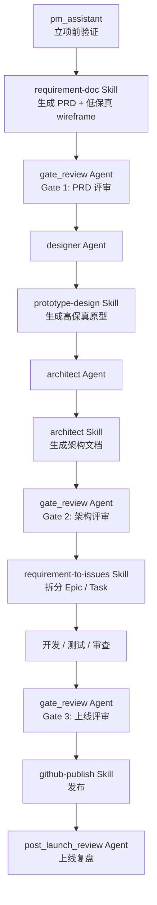
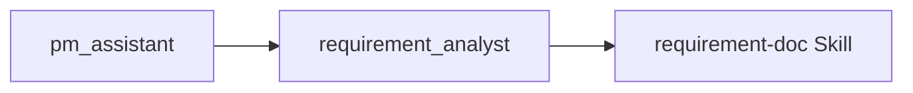

# pm_assistant 下游工作流说明

本文档用于说明 `pm_assistant` Agent 在当前仓库中的**主链路、可选分支、下游 Agent/Skill 关系**，以及每个阶段的输入、输出和交付物。

## 适用范围

- 立项前验证
- 从产品灵感进入 PRD、原型、架构和任务拆分
- 明确 `pm_assistant` 与下游 Agent / Skill 的边界

## 总览

`pm_assistant` 本身不是 PRD 生成器，也不是架构设计器。它的职责是先判断一个需求是否值得推进，再把结果送入后续正式流程。

> 说明：本文中的“主链路”以项目级工作流约定为主；个别 Agent 的协作提示与项目主流程存在轻微差异，文中会单独标注。

主链路如下：

可选轻量分支：

## 角色定位

### `pm_assistant`

- 定位：立项前过滤器、需求入口校准器
- 目标：在正式投入 PRD、设计和研发前，先完成价值判断
- 不负责：正式 PRD、高保真原型、正式架构方案、研发任务拆分

### 下游单元

- `requirement-doc`：把想法或分析报告转成正式 PRD 与低保真原型
- `gate_review`：在关键节点做 Go / No-Go 决策
- `designer` + `prototype-design`：把低保真升级为高保真
- `architect` + `architect` Skill：从 PRD 产出架构设计
- `requirement-to-issues`：把需求文档转成开发任务
- `github-publish`：发布文档或代码
- `post_launch_review`：做上线复盘与迭代建议

## 阶段详解

### 阶段 1：`pm_assistant`

**目标**

- 判断需求是否值得推进
- 做查重、竞品、商业快评和可落地性初评

**核心输入**

- 用户的产品灵感或需求描述
- 可选：已有 PRD、飞书文档、竞品线索

**核心流程**

1. 飞书认证状态确认
2. 本地 PRD 迭代检测
3. 需求理解与拆解
4. 飞书文档查重
5. 网络竞品检索
6. Lean Canvas 商业快评
7. UI 复杂度初评
8. 技术可行性初评
9. 输出价值评估报告

**本阶段使用的 Skill / 外部能力**

- 无显式绑定 Skill
- 直接使用飞书 MCP 做查重
- 直接使用 web / Tavily 做竞品检索

**核心输出**

- 价值评估报告
- 结论：建议推进 / 需进一步调研 / 不建议推进

**下游去向**

- 主链路：进入 `requirement-doc` Skill
- 可选分支：进入 `requirement_analyst`
- 特殊跳转：如果用户直接要架构方案，可进入 `architect`

### 阶段 2：可选分支 `requirement_analyst`

**目标**

- 做一轮更轻量的需求验证

**与 `pm_assistant` 的区别**

- 不做 UI 复杂度初评和技术可行性初评
- 更适合快速二次验证，而不是完整立项校准

**本阶段使用的 Skill**

- `feishu-docs`

**核心输出**

- 价值评估报告
- 推荐下一步：`requirement-doc`

### 阶段 3：`requirement-doc` Skill

**目标**

- 生成正式 PRD
- 生成低保真 wireframe

**典型输入**

- `pm_assistant` / `requirement_analyst` 的分析结论
- 用户补充的优先级、里程碑、非功能需求

**核心流程**

1. 收集输入并检测是否为迭代更新
2. 信息整理与缺失项追问
3. 按模板生成 PRD
4. 生成低保真原型
5. 输出或发布

**本阶段使用的 Skill**

- `feishu-docs`
  - 读取飞书上的需求草稿
  - 将 PRD 发布到飞书
- `github-publish`
  - 提交 PRD 到 GitHub
- `modao-prototype`
  - 将低保真原型导入墨刀

**交付物**

- `docs/prd-{项目名}/prd-{项目名}.md`
- `docs/prd-{项目名}/wireframes/*.html`

**下游去向**

- `gate_review` Gate 1

### 阶段 4：`gate_review` Agent - Gate 1

**目标**

- 正式评审 PRD 和低保真原型

**输入**

- PRD
- 低保真 wireframe

**检查维度**

- 需求完整性
- 商业合理性
- 可行性
- 原型质量
- 版本管理

**本阶段使用的 Skill**

- 无直接 Skill

**输出**

- Go / Conditional Go / No-Go 评审报告

**下游去向**

- 通过后进入 `designer` / `prototype-design`
- 高保真原型完成后再进入 `architect`

### 阶段 5：`designer` Agent + `prototype-design` Skill

**目标**

- 生成高保真原型

**Agent 与 Skill 分工**

- `designer`：负责扮演设计师角色、控制阶段顺序与设计约束
- `prototype-design`：负责高保真生成的具体工作流

**核心流程**

1. 读取 PRD 与低保真原型
2. 设计决策：主题、布局方向、生成方式
3. 生成高保真原型
4. 质量自检
5. 输出与交付

**本阶段使用的 Skill**

- `prototype-design`
  - 主执行 Skill
- `modao-prototype`
  - 可选，将高保真导入墨刀
- `github-publish`
  - 可选，提交高保真原型到 GitHub
- `requirement-doc`
  - 不是本阶段执行项，但若缺低保真输入，会反向提示先执行

**交付物**

- `docs/prd-{项目名}/hifi-wireframes/*.html`

**下游去向**

- `architect`

### 阶段 6：`architect` Agent + `architect` Skill

**目标**

- 从 PRD 和原型推导正式技术架构

**Agent 与 Skill 分工**

- `architect` Agent：负责需求解读、技术调研、章节组织和文档输出节奏
- `architect` Skill：提供模板、依赖 Skill、版本规则、分文档模式规则

**核心流程**

1. 解读 PRD
2. 分析低保真与高保真原型
3. 技术调研
4. 依据模板完成架构设计
5. 输出架构文档
6. 根据需要进入后续动作

**本阶段使用的 Skill**

- `architect`
  - 主执行 Skill
- `microservices`
  - 当选择微服务架构时使用
- `feishu-docs`
  - 同步架构文档到飞书
- `github-publish`
  - 提交架构文档到 GitHub
- `requirement-to-issues`
  - 将架构模块拆分为任务

**交付物**

- `docs/prd-{项目名}/architecture-{项目名}.md`
- 可选：
  - `frontend-architecture-{项目名}.md`
  - `backend-services-{项目名}.md`
  - `database-design-{项目名}.md`

**下游去向**

- `gate_review` Gate 2

### 阶段 7：`gate_review` Agent - Gate 2

**目标**

- 对架构文档做正式评审

**输入**

- 架构文档
- PRD

**检查维度**

- 架构完整性
- 需求追溯
- 质量属性
- 风险与成本
- 版本管理

**本阶段使用的 Skill**

- 无直接 Skill

**下游去向**

- 通过后进入 `requirement-to-issues`

### 阶段 8：`requirement-to-issues` Skill

**目标**

- 将 PRD 与架构文档转换为可执行开发任务

**核心流程**

1. 定位 PRD
2. 解析功能需求
3. 关联用户故事、技术参考和架构文档
4. 解析里程碑与依赖
5. 生成 Epic / Task
6. 用户确认后写入 GitHub

**本阶段使用的 Skill**

- `feishu-docs`
  - 如果 PRD 来源于飞书，则先读取飞书文档

**外部能力**

- GitHub MCP
  - 创建 Issue
  - 创建子 Issue
  - 搜索重复 Issue

**交付物**

- GitHub Epic / Task / 子 Issue

**下游去向**

- 进入开发、测试、代码审查

### 阶段 9：`gate_review` Agent - Gate 3 + `github-publish` Skill

**目标**

- 在上线前做最终评审并执行发布

**Gate 3 输入**

- 测试报告
- PR 列表

**本阶段使用的 Skill**

- `github-publish`
  - Gate 3 通过后执行发布流程

**交付物**

- 发布动作、PR 合并、上线准备完成

### 阶段 10：`post_launch_review` Agent

**目标**

- 对照 PRD 与上线结果做复盘，形成下一轮迭代输入

**核心流程**

1. 确定复盘范围
2. 收集业务、技术、反馈、事故四类数据
3. 做诊断分析
4. 生成迭代建议
5. 输出复盘报告

**本阶段使用的 Skill**

- 无直接 Skill
- 但可能回流到：
  - `requirement-doc`
  - `gate_review`

**协作跳转**

- 发现 P0 问题 → `code_debug`
- 需要新版本 PRD → `requirement-doc`
- 需要重新评审 → `gate_review`

## Agent / Skill 责任矩阵

| 阶段 | 主执行单元 | 主要职责 | 使用的 Skill |
| --- | --- | --- | --- |
| 立项前验证 | `pm_assistant` | 查重、竞品、商业快评、可落地性初评 | 无显式 Skill；直接用飞书 MCP + web |
| 可选复核 | `requirement_analyst` | 轻量需求验证 | `feishu-docs` |
| PRD 生成 | `requirement-doc` | PRD、低保真原型 | `feishu-docs`、`github-publish`、`modao-prototype` |
| PRD 评审 | `gate_review` Gate 1 | PRD Go / No-Go | 无 |
| 高保真设计 | `designer` | 控制设计阶段顺序 | `prototype-design` |
| 高保真生成 | `prototype-design` | 生成 Hi-Fi 原型 | 可选 `modao-prototype`、`github-publish` |
| 架构设计 | `architect` | 控制架构阶段顺序 | `architect` |
| 架构细则 | `architect` Skill | 模板、分文档、版本规则 | 可选 `microservices`、`feishu-docs`、`github-publish`、`requirement-to-issues` |
| 架构评审 | `gate_review` Gate 2 | 架构 Go / No-Go | 无 |
| 任务拆分 | `requirement-to-issues` | Epic / Task / 子 Issue | 可选 `feishu-docs` |
| 上线评审 | `gate_review` Gate 3 | 上线前评审 | `github-publish` |
| 上线复盘 | `post_launch_review` | 复盘与迭代建议 | 无；可能回流 `requirement-doc` |

## 推荐理解方式

- `pm_assistant` 负责“值不值得做”
- `requirement-doc` 负责“需求到底是什么”
- `designer` / `prototype-design` 负责“产品长什么样”
- `architect` 负责“技术上怎么做”
- `requirement-to-issues` 负责“研发要做哪些任务”
- `gate_review` 负责“每个关键阶段能不能往下走”
- `post_launch_review` 负责“上线后学到了什么”

## 结论

如果只看 `pm_assistant`，它只是入口；如果看完整业务链路，它的真正价值在于把模糊灵感送入一条有门禁、有产物、有回流的标准化流程。

其中最关键的下游 Skill 是：

- `requirement-doc`
- `prototype-design`
- `architect`
- `requirement-to-issues`
- `feishu-docs`
- `github-publish`
- `modao-prototype`
- `microservices`
