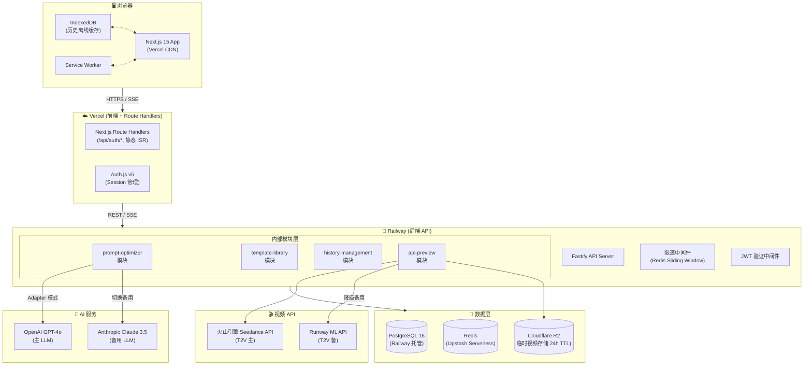
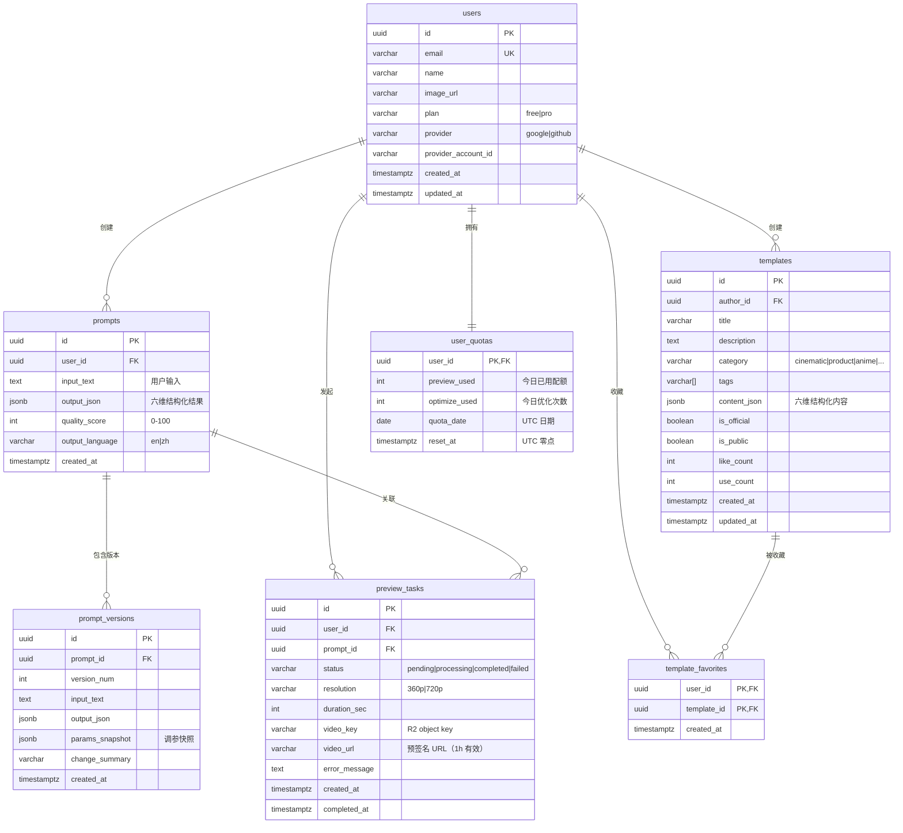
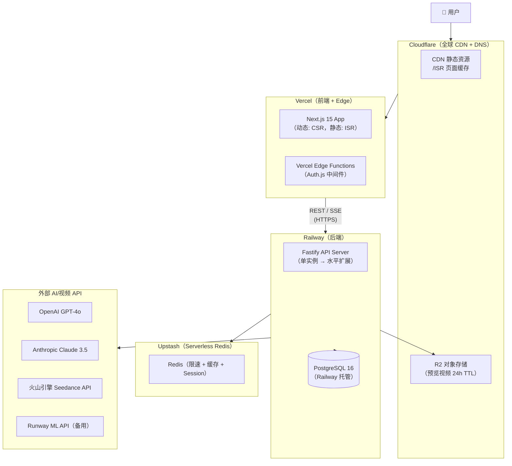

# Seedance Prompt Studio — 技术架构设计文档

> **版本**：v1.0.0
> **架构师**：Architect Agent
> **创建日期**：2026-04-12
> **最后更新**：2026-04-12
> **状态**：评审中
> **关联 PRD**：`prd-seedance-prompt.md` v1.0.0

---

## 0. 文档索引

> 本文档为主架构文档（总纲），聚焦跨模块架构、共享能力、部署、安全与演进策略。各模块的详细数据模型、API 和组件设计见对应的模块级架构文档。

| 文档 | 路径 | 说明 | 模式 |
| ---- | ---- | ---- | ---- |
| **主架构文档（本文档）** | `architecture-seedance-prompt.md` | 系统整体架构、技术栈选型、部署方案、非功能需求 | 始终生成 |
| 提示词优化引擎模块架构 | `modules/architecture-seedance-prompt-prompt-optimizer.md` | P0 核心模块：LLM SSE 流式、参数调校面板、质量评分 | 模块化 PRD |
| 模板库模块架构 | `modules/architecture-seedance-prompt-template-library.md` | 模板 CRUD、全文搜索、收藏功能 | 模块化 PRD |
| 历史管理模块架构 | `modules/architecture-seedance-prompt-history-management.md` | 版本对比、IndexedDB 离线缓存 | 模块化 PRD |
| API 集成预览模块架构 | `modules/architecture-seedance-prompt-api-preview.md` | Seedance API 代理、配额管理、任务轮询 | 模块化 PRD |

---

## 1. 设计概述

### 1.1 项目背景

Seedance Prompt Studio 是面向 AI 视频创作者的 Seedance 专属提示词优化工具。字节跳动 Seedance 2.0 模型专业维度多（镜头控制/光影风格/运动轨迹/多模态参考），其提示词结构与通用 LLM 截然不同；而 PromptPerfect 于 2026 年 9 月关停将带来用户真空。本产品通过 LLM 驱动的六维结构化提示词引擎，降低创作者试错成本，建立"Seedance 专属提示词引擎"的用户心智。

MVP 目标：上线 3 个月内，Pro 转化率 ≥ 8%，WAU ≥ 1,000，DAU 6 个月内 ≥ 5,000。

### 1.2 设计目标

| 目标 | 描述 | 衡量标准 |
| ---- | ---- | -------- |
| **低延迟流式体验** | 用户感知的提示词优化首字延迟 ≤ 1s | SSE 首 token 延迟 P90 ≤ 1s |
| **高可用核心链路** | 优化引擎（P0）不因 Video API（P1）故障而降级 | 提示词优化服务 SLA ≥ 99.5% |
| **安全密钥代理** | LLM/Seedance API Key 绝不暴露到浏览器 | 无 API Key 出现在任何前端代码或响应中 |
| **弹性扩展** | MVP 支持 200 QPS，3 个月后扩展至 1,000 QPS | Railway 水平扩展能力验证 |
| **快速交付** | 架构方案与 MVP 节奏匹配，不过度设计 | 单体后端服务，模块化内部结构 |

### 1.3 设计原则

- **优先简单性**：MVP 阶段采用单体后端架构，避免微服务带来的运维复杂度；业务拆分在内部模块层面维护。
- **安全优先**：API Keys 仅存储于后端环境变量，前端只持有用户 Session Token；所有用户输入经服务端校验。
- **降级可用**：核心提示词优化器独立于 Seedance Video API 运行；LLM 主备切换（GPT-4o → Claude 3.5 Sonnet）自动降级。
- **渐进演进**：当 QPS 超过 800 时触发水平扩展；当单体组件 CPU 持续 > 80% 时考虑服务拆分。
- **前端 SSR + 静态优先**：Next.js App Router，公共页面（模板库）走 CDN 缓存，编辑器页面走 CSR，兼顾 SEO 与体验。

### 1.4 范围与边界

| 范围 | 包含 | 不包含 |
| ---- | ---- | ------ |
| 提示词优化引擎 | LLM 调用、SSE 流式输出、参数调校、质量评分 | 视频内容合规审核（外部服务） |
| 模板库 | 官方/用户模板 CRUD、分类搜索、收藏 | 模板付费授权、NFT 化（v2.0+） |
| 历史管理 | 记录持久化、版本对比、离线缓存 | 团队协作共享（v1.1 迭代） |
| API 预览 | Seedance T2V 代理调用、任务轮询、配额管理 | I2V（图生视频）、批量生成（v1.1 迭代） |
| 用户系统 | OAuth 登录、订阅计划（Free/Pro）、配额管理 | 企业 SSO（v2.0+） |
| 部署 | Vercel + Railway + Cloudflare | 私有化部署、K8s 编排（扩展阶段再引入） |

### 1.5 需求追溯矩阵

| PRD 需求编号 | 需求描述 | 优先级 | 对应架构模块 | 对应 API | 备注 |
| ------------- | -------- | ------ | ------------ | ------- | ---- |
| US-001 | 自然语言 → 结构化提示词（SSE 流式） | P0 | prompt-optimizer | `POST /api/v1/prompt/optimize` | 详见 `architecture-...-prompt-optimizer.md` |
| US-001-param | 多维度参数调校面板（重新优化） | P0 | prompt-optimizer | `POST /api/v1/prompt/refine` | 详见 `architecture-...-prompt-optimizer.md` |
| US-002 | 历史记录查看与版本迭代 | P1 | history-management | `GET/POST /api/v1/history` | 详见 `architecture-...-history-management.md` |
| US-003 | 官方精选模板浏览 | P1 | template-library | `GET /api/v1/templates` | 详见 `architecture-...-template-library.md` |
| US-004 | 用户私有模板创建与分享 | P1 | template-library | `POST /api/v1/templates` | Pro 功能权限控制 |
| US-005 | REST API 接入（第三方集成） | P2 | 公共 API 层 | `/api/v1/prompt/optimize` + API Key | P2，不在 MVP 范围内 |
| US-006 | Seedance T2V 视频预览 | P1 | api-preview | `POST /api/v1/preview/generate` | 详见 `architecture-...-api-preview.md` |
| NFR-PERF | 提示词优化 P90 ≤ 3s，首 token P90 ≤ 1s | — | prompt-optimizer + LLM 代理层 | — | §8 性能方案 |
| NFR-AVA | SLA ≥ 99.5% | — | 全系统 | — | §8 高可用方案 |
| NFR-SEC | HTTPS/TLS 1.3，数据加密存储 | — | 安全层 | — | §9 安全设计 |
| NFR-SCALE | MVP 200 QPS → 1,000 QPS | — | Railway 水平扩展 | — | §8 可扩展性 |
| NFR-GDPR | GDPR + 个人信息保护法 | — | 数据层 + 用户系统 | — | §9 合规要求 |

---

## 2. 技术栈选型

### 2.1 选型总览

| 层级 | 技术选型 | 选型理由 | 备选方案 |
| ---- | -------- | -------- | -------- |
| **前端框架** | Next.js 15 (App Router) + TypeScript | SSR/SSG/CSR 混合；内置 API Routes；前后共享类型；Vercel 原生部署；v15 Server Actions 减少 API 调用 | Remix, Nuxt 3 |
| **前端 UI** | Tailwind CSS + shadcn/ui | 无运行时 CSS，原子化；shadcn 组件无捆绑体积；易于定制 Seedance 品牌风格 | MUI, Ant Design |
| **前端状态** | Zustand + React Query (TanStack) | Zustand 极简全局状态；React Query 管理异步数据缓存和同步，避免 Redux 样板代码 | Jotai, SWR |
| **SSE 客户端** | 原生 `EventSource` + `eventsource-parser` | 原生支持断线重连；需解析 OpenAI-style SSE 格式 | — |
| **后端框架** | Fastify + TypeScript | 比 Express 快 3-4× 吞吐量；插件体系完善；Zod schema 集成；支持 SSE response | Express, Hono |
| **后端 ORM** | Drizzle ORM | 类型安全 SQL；运行时极小（0 依赖）；配合 PostgreSQL 类型推断出色 | Prisma, TypeORM |
| **主数据库** | PostgreSQL 16 (Railway 托管) | 关系型数据满足用户/历史/模板一致性需求；Railway 提供 managed 实例，自动备份 | MySQL, PlanetScale |
| **缓存** | Redis (Upstash Serverless) | 按调用计费；Upstash 支持 Vercel Edge；用于限速、会话、热模板缓存 | Valkey, 自建 Redis |
| **AI 主模型** | OpenAI GPT-4o | 最强指令跟随；SSE 流式稳定；Seedance 领域提示词工程效果最优 | Claude 3.5 Sonnet |
| **AI 备用模型** | Anthropic Claude 3.5 Sonnet | GPT-4o 不可用时自动降级；长上下文优势用于复杂提示词重写 | Gemini 1.5 Pro |
| **视频 API** | 火山引擎 Seedance API (主) | Seedance T2V 原生支持；最佳参数契合度 | Runway ML API (备) |
| **认证** | Auth.js v5 (Next-Auth) + Google/GitHub OAuth | 内置 Next.js 15 集成；OAuth 无需额外服务；支持数据库 Session 持久化 | Clerk, Supabase Auth |
| **对象存储** | Cloudflare R2 | 零出站流量费；兼容 S3 API；用于存储临时预览视频 (24h TTL) | AWS S3, Vercel Blob |
| **CDN** | Cloudflare | 全球覆盖；R2 原生集成；Workers 支持边缘限速 | Vercel Edge, CloudFront |
| **CI/CD** | GitHub Actions | 免费分钟额度满足 MVP；与 GitHub PR 流程集成；直接触发 Vercel/Railway 部署 | CircleCI, Bitbucket Pipelines |
| **监控 & 错误** | Sentry (错误) + Vercel Analytics (性能) | Sentry Next.js SDK 零配置；Vercel Analytics 内置 Web Vitals | Datadog (扩展阶段) |
| **日志** | Railway 内置日志 + Axiom (结构化日志) | Railway 日志 30 天保留；Axiom 提供 SQL 查询和告警 | Logflare, Loki |
| **离线缓存** | IndexedDB (via `idb` 库) | 历史记录本地缓存，断网可访问；Service Worker + IndexedDB | localStorage (容量不足) |
| **版本对比** | `diff-match-patch` | Google 出品；文字级 diff；用于提示词版本对比 | `jsdiff` |

### 2.2 关键选型决策记录（ADR）

#### ADR-001：后端架构风格 — 单体 vs 微服务

- **状态**：接受
- **背景**：MVP 阶段团队规模小（≤5 人），4 个模块功能高度耦合（优化器 → 历史 → 预览），独立部署收益低，运维成本高。
- **候选方案**：单体模块化架构 vs 微服务（4 服务）
- **结论**：选择**单体模块化架构**（Fastify 单个进程，内部按 module 目录拆分）
- **理由**：模块间调用走函数调用而非 HTTP，延迟近无；Railway 单服务水平扩展满足 MVP 需求；当 QPS > 800 或团队 > 10 人时再按模块拆分服务。
- **后果**：部署简单；需严格维护模块边界（通过 Barrel 导出约束），避免循环依赖。

#### ADR-002：前端渲染策略 — 混合 SSR/CSR

- **状态**：接受
- **背景**：模板库需要 SEO；提示词编辑器实时交互不需要 SSR；历史页面需认证后访问。
- **候选方案**：纯 CSR（SPA）vs 全量 SSR vs Next.js 混合渲染
- **结论**：Next.js App Router 混合渲染
  - 公共模板库页 → `generateStaticParams` + ISR（1h 重新生成）
  - 编辑器/历史页 → Client Component（SSR 的 HTML 壳 + CSR 交互）
  - API Routes 处理 SSE stream（Next.js Route Handler）
- **理由**：SEO 需求与交互需求并存；App Router `'use client'` 边界精准控制；Vercel Edge 缓存 ISR 页面。
- **后果**：需注意 Server/Client Component 混用的水合问题；SSE 必须通过 Route Handler 而非 Server Component。

#### ADR-003：LLM 调用主备切换策略

- **状态**：接受
- **背景**：GPT-4o API 存在偶发性超时（P99 > 10s）；Claude 3.5 Sonnet 可作为对等备用；需要对用户透明。
- **候选方案**：单一 Provider vs 静态备用 vs 动态路由（按延迟/可用性）
- **结论**：**主备静态切换**（GPT-4o 优先，超时 or 5xx 后重试时切 Claude）
- **理由**：动态路由实现复杂；MVP 阶段主备已满足可用性需求；两个 Provider SDKs 接口差异通过 Adapter 模式屏蔽。
- **后果**：后端需实现 `LLMProviderAdapter` 接口（见 prompt-optimizer 模块架构文档）；需维护两套 API Key 配置。

---

## 3. 系统架构

### 3.1 架构风格

**选择**：单体模块化架构（Modular Monolith）

**理由**：MVP 阶段 4 个模块业务紧密耦合，团队规模 ≤5 人，单体架构降低运维开销，同时通过内部模块化设计为后续服务拆分奠定基础。当 QPS 超过 800 或模块团队独立后，优先对 `api-preview`（外部依赖最重）进行服务化拆分。

### 3.2 整体架构图



### 3.3 模块职责

| 模块/服务 | 职责 | 核心功能 | 依赖 | 模块级架构文档 |
| --------- | ---- | -------- | ---- | ---------------- |
| `prompt-optimizer` | P0 核心：提示词优化与调校 | LLM 调用、SSE 流式、参数面板、质量评分、一键复制 | LLM API (OpenAI/Claude) | `modules/architecture-seedance-prompt-prompt-optimizer.md` |
| `template-library` | P1：提示词模板管理 | 官方/用户模板 CRUD、全文搜索（PostgreSQL FTS）、收藏、ISR 缓存 | PostgreSQL, Redis | `modules/architecture-seedance-prompt-template-library.md` |
| `history-management` | P1：用户历史记录 | 提示词持久化、版本管理、版本 diff、IndexedDB 离线缓存 | PostgreSQL, IndexedDB | `modules/architecture-seedance-prompt-history-management.md` |
| `api-preview` | P1：视频预览生成 | Seedance API 代理、任务轮询、配额管理、R2 临时存储 | Seedance API, R2, Redis | `modules/architecture-seedance-prompt-api-preview.md` |
| `user-system` | 公共：用户与认证 | Auth.js OAuth 集成、订阅计划（Free/Pro）、配额 reset | PostgreSQL, Auth.js v5 | （内嵌于主文档，无单独模块架构） |

### 3.4 前端架构（基于原型图分析）

#### 摘要

| 分析项 | 结果 |
| ------ | ---- |
| 原型图来源 | `wireframes/`（低保真，共 6 页） |
| 页面总数 | 6 个页面（含导航首页） |
| 前端复杂度评级 | **中**（SSE 流式集成、参数面板实时状态、diff 视图是主要复杂点） |
| 核心交互模式 | 双栏布局（输入/输出）、流式文本渲染、可视化参数调校、版本对比抽屉 |
| 状态管理方案 | Zustand（全局：用户信息、配额、当前提示词）+ React Query（服务端数据同步）|

**页面清单**：

| 页面 | 路由 | 渲染策略 | 核心组件 | 说明 |
| ---- | ---- | -------- | -------- | ---- |
| 提示词编辑器 | `/` (或 `/editor`) | CSR（Client Component） | `PromptInputPanel`, `PromptOutputPanel` | P0 核心页面，SSE 流式输出 |
| 优化结果/参数调校 | `/editor?tab=result` | CSR（Tab 切换） | `ParameterTuningPanel`, `QualityScoreCard` | 参数面板与结果展示 |
| 模板库浏览 | `/templates` | ISR（1h 重建） | `TemplateGrid`, `SearchBar`, `CategoryFilter` | SEO 页面，静态优先 |
| 历史记录 | `/history` | CSR（认证后） | `HistoryList`, `VersionDiffDrawer` | 需登录访问 |
| API 预览面板 | `/editor?tab=preview` | CSR | `APIPreviewPanel`, `VideoPlayer`, `QuotaIndicator` | 嵌入编辑器页面 |
| 原型导航 | N/A（开发用） | 静态 HTML | — | wireframes/index.html |

#### 路由结构（Next.js App Router）

```
app/
├── (public)/
│   ├── page.tsx                      # 登录/落地页
│   └── templates/
│       ├── page.tsx                  # 模板库（ISR）
│       └── [id]/page.tsx             # 模板详情（ISR）
├── (auth)/
│   ├── editor/
│   │   └── page.tsx                  # 提示词编辑器（CSR）
│   └── history/
│       └── page.tsx                  # 历史记录（CSR）
├── api/
│   ├── auth/[...nextauth]/route.ts   # Auth.js endpoints
│   └── health/route.ts               # 健康检查
└── layout.tsx                         # 全局布局 + providers
```

> 业务 API 调用走 `NEXT_PUBLIC_API_URL` → Fastify 后端，不走 Next.js `/api` Routes（SSE 需要 Fastify 长连接）。

### 3.5 服务通信

| 调用方 | 被调用方 | 通信方式 | 协议 | 说明 |
| ------ | -------- | -------- | ---- | ---- |
| Next.js (浏览器) | Fastify API | 同步请求 | HTTPS REST | 常规 CRUD（模板、历史） |
| Next.js (浏览器) | Fastify API | 长连接流式 | HTTPS + SSE (EventSource) | 提示词优化流式输出 |
| Next.js (浏览器) | Fastify API | 短轮询（3s） | HTTPS REST | 视频任务状态轮询 |
| Fastify | OpenAI API | 同步请求 | HTTPS REST | LLM 调用（支持流式） |
| Fastify | Anthropic API | 同步请求 | HTTPS REST | LLM 备用降级 |
| Fastify | 火山引擎 Seedance | 同步请求 | HTTPS REST | T2V 任务提交 + 状态查询 |
| Fastify | Cloudflare R2 | 同步请求 | S3-compatible API | 视频文件上传（24h TTL） |
| Fastify | Upstash Redis | 同步请求 | Redis 协议 over TLS | 限速、会话、缓存 |
| Fastify | Railway PostgreSQL | 同步请求 | PostgreSQL TCP | 所有持久化数据 |

---

## 4. 数据模型设计

### 4.1 核心实体关系图



### 4.2 数据层概览

| 数据类型 | 存储介质 | 说明 |
| -------- | -------- | ---- |
| 用户账号、历史、模板 | PostgreSQL 16 (Railway) | 主业务数据，事务保障 |
| 配额计数器 | Redis (Upstash) | 高频读写，Lua 脚本原子扣减；每日 UTC 零点 TTL 过期 |
| 会话 Token | Redis (Upstash) | Auth.js 数据库 Session 的 TTL 管理 |
| 热门模板缓存 | Redis (Upstash) | ISR 重建前的降级缓存，TTL 30min |
| 历史记录离线缓存 | IndexedDB (浏览器) | 断网可读，最近 50 条，`idb` 库管理 |
| 预览视频文件 | Cloudflare R2 | 临时存储，Object TTL 24h；预签名 URL 1h 有效 |

---

## 5. API 设计

### 5.1 设计规范

- **风格**：RESTful，URL 路径版本化 `/api/v1/`
- **认证方式**：JWT Bearer Token（由 Auth.js 签发），所有 `/api/v1/` 路由默认鉴权；公共只读路由（模板列表/详情）免鉴权
- **SSE 路由**：`POST /api/v1/prompt/optimize` 和 `POST /api/v1/prompt/refine` 返回 `Content-Type: text/event-stream`
- **限流策略**：Free 用户每日 3 次预览 + 50 次优化；Pro 用户每日 50 次预览 + 无限优化；滑动窗口算法，Redis Lua 脚本原子执行
- **响应格式**：统一 `{ data, error, meta }` JSON 结构；SSE 使用 `data: { token }` + `data: [DONE]` 终止符
- **输入校验**：所有请求体通过 Zod schema 校验，Fastify `preValidation` hook

### 5.2 核心接口概览

| 方法 | 路径 | 功能 | 认证 | 优先级 |
| ---- | ---- | ---- | ---- | ------ |
| `POST` | `/api/v1/prompt/optimize` | 自然语言→结构化提示词（**SSE**） | 是 | P0 |
| `POST` | `/api/v1/prompt/refine` | 基于参数调整重新优化（**SSE**） | 是 | P0 |
| `GET` | `/api/v1/history` | 分页获取用户历史提示词列表 | 是 | P1 |
| `POST` | `/api/v1/history` | 保存提示词到历史记录 | 是 | P1 |
| `DELETE` | `/api/v1/history/:id` | 删除历史记录 | 是 | P1 |
| `GET` | `/api/v1/templates` | 分页获取模板列表（按分类/搜索过滤） | 否 | P1 |
| `GET` | `/api/v1/templates/:id` | 获取模板详情 | 否 | P1 |
| `POST` | `/api/v1/templates` | 创建用户私有模板 | 是（Pro） | P1 |
| `DELETE` | `/api/v1/templates/:id` | 删除自己的模板 | 是 | P1 |
| `POST` | `/api/v1/templates/:id/favorite` | 收藏/取消收藏模板 | 是 | P1 |
| `POST` | `/api/v1/preview/generate` | 发起 Seedance T2V 预览任务 | 是 | P1 |
| `GET` | `/api/v1/preview/:taskId/status` | 查询视频生成状态 | 是 | P1 |
| `GET` | `/api/v1/user/quota` | 获取当前用户配额用量 | 是 | P1 |
| `GET` | `/api/v1/health` | 健康检查（负载均衡探针） | 否 | — |

> 完整接口定义（请求/响应体 Schema、错误码规范）见各模块级架构文档中的 §4 API 设计。

---

## 6. 部署架构

### 6.1 部署拓扑图



### 6.2 环境规划

| 环境 | 用途 | 配置规格 | 数据策略 |
| ---- | ---- | -------- | -------- |
| **Development** | 本地开发调试 | 本地 Docker Compose（pg + redis）| 种子数据（dev seed script）|
| **Staging** | 预发布验证 / UAT | Railway 同规格单实例；独立 PostgreSQL | 脱敏 Fixture 数据 |
| **Production** | 正式生产 | Railway 2vCPU 2GB RAM × 2 实例（负载均衡）；PostgreSQL 2 核 4G | 真实数据，每日自动备份 |

MVP 阶段生产环境从单实例起步，Railway 水平扩展通过控制台手动触发，后续阶段接入 CPU > 80% 的自动扩展规则。

### 6.3 CI/CD 流水线

```text
PR 提交
  → GitHub Actions: Lint（ESLint + Prettier）
    → TypeScript 类型检查 (tsc --noEmit)
      → 单元测试 (Vitest + Fastify inject)
        → 构建验证 (next build + tsc backend)
          → 集成测试 (Testcontainers PG + Redis)
            → PR 通过 Review
              → Merge to main
                → Railway 自动部署后端
                  → Vercel 自动部署前端
                    → Staging 冒烟测试 (Playwright)
                      → 触发通知（Slack）
```

### 6.4 部署策略

- **策略选择**：Railway 滚动更新（Rolling Update），Vercel Instant Rollback
- **回滚方案**：Railway 控制台一键回滚到上一个 Deployment；Vercel Git 回滚；数据库迁移使用向前兼容策略（先加列再删旧列），支持 Zero-downtime 迁移
- **数据库迁移**：Drizzle Kit `migrate` 命令，CI 中在部署前自动执行；迁移脚本需通过 PR Review

### 6.5 成本估算（月度）

| 资源类别 | 具体资源 | 规格 | 单价 | 月预估用量 | 月成本（USD） |
| -------- | -------- | ---- | ---- | ---------- | ------------ |
| 计算（前端） | Vercel Pro | 按用量 | $20/月 | — | $20 |
| 计算（后端） | Railway 后端服务 | 2vCPU 2GB × 1 实例 | ~$10-15/月 | — | $15 |
| 数据库 | Railway PostgreSQL | 2 核 4GB | $15/月 | — | $15 |
| 缓存 | Upstash Redis | Serverless，1M 命令/月内免费 | $0-5/月 | 200K 命令 | $2 |
| 对象存储 | Cloudflare R2 | 10GB 存储 + 100M 请求免费 | $0 | MVP 阶段 < 1GB | $0 |
| CDN | Cloudflare | 免费计划 | $0 | — | $0 |
| AI/LLM API | OpenAI GPT-4o | input $5/1M token, output $15/1M token | 按调用 | 5,000 次优化 × 平均 500 token | ~$45 |
| AI/LLM API | Anthropic Claude 3.5 | 仅降级使用 | 按调用 | <5% 流量 | ~$3 |
| 视频 API | 火山引擎 Seedance T2V | 待确认（⚠️ API 内测未公开价格） | TBD | 500 次预览/月 | TBD |
| 监控 | Sentry + Vercel Analytics | 小团队免费计划 | $0 | — | $0 |
| **月度合计（不含视频 API）** | | | | | **~$100** |

**成本优化策略**：
1. **提示词优化结果缓存**：相同输入 Hash 命中 Redis 缓存（TTL 1h），减少 LLM API 调用量（预计降低 15-20%）
2. **视频预览配额限制**：Free 3 次/日，Pro 50 次/日，避免视频 API 费用失控
3. **ISR 缓存模板库**：热门模板页由 CDN 缓存，减少后端负载

---

## 7. 测试架构

### 7.1 测试策略与分层

**测试金字塔分层**：

| 测试层级 | 占比目标 | 职责 | 执行频率 |
| -------- | -------- | ---- | -------- |
| **单元测试** | 65% | 验证纯函数（提示词构建、质量评分算法、diff 逻辑） | 每次提交 |
| **集成测试** | 25% | 验证 API Handler + DB 操作 + Redis 限速；Fastify inject 测试 | 每次 PR |
| **E2E 测试** | 10% | 验证核心用户流程（优化→保存→预览）；SSE 流式验证 | 每次部署 Staging |

**覆盖率目标**：

| 维度 | 目标值 | 说明 |
| ---- | ------ | ---- |
| 行覆盖率（Line） | ≥ 80% | 整体最低线 |
| 分支覆盖率（Branch） | ≥ 70% | 条件分支覆盖 |
| P0 功能覆盖率 | 100% | prompt-optimizer P0 功能必须有完整测试 |
| API 接口覆盖率 | ≥ 90% | 所有 `/api/v1/` 端点 |

### 7.2 测试框架选型

| 测试类型 | 框架/工具 | 选型理由 | 备选方案 |
| -------- | --------- | -------- | -------- |
| 前端单元测试 | Vitest | 与 Next.js/Vite 生态齐平；速度快；兼容 Jest API | Jest |
| 前端组件测试 | Testing Library + jsdom | 面向用户行为测试；Accessibility 查询优先 | Enzyme |
| 后端单元测试 | Vitest | 复用工具链；mock 能力完整 | Jest |
| API 集成测试 | Fastify inject | 无需启动 HTTP Server；直接注入请求测试路由 | Supertest |
| 数据库集成测试 | Testcontainers (PG + Redis) | 隔离环境；真实数据库行为；CI 可用 | 内存 SQLite（类型不匹配） |
| E2E 测试 | Playwright | 跨浏览器；支持 SSE 流式请求测试；CSR 页面等待机制完善 | Cypress |
| 性能测试 | k6 | JS 脚本；云端运行；支持 SSE 场景 | Artillery |
| 安全测试 | OWASP ZAP API Scan | 自动化 DAST；GitHub Actions 集成 | Burp Suite |
| Mock/Stub | MSW (前端) + Vitest mock (后端) | MSW 拦截网络请求；Service Worker 级别真实性 | nock |
| SSE 测试 | `eventsource` npm 包 + Playwright `page.waitForResponse` | 验证 SSE 流接收完整性 | — |

### 7.3 测试环境与数据策略

| 环境 | 测试类型 | 数据策略 | 说明 |
| ---- | -------- | -------- | ---- |
| 本地开发 | 单元 + 组件测试 | Mock 数据 / Vitest mock | 无需数据库连接 |
| CI 环境 | 单元 + 集成测试 | Testcontainers 隔离实例 + Drizzle seed | GitHub Actions 支持 Docker |
| Staging | 集成 + E2E + 冒烟 | Fixture 数据（脱敏）+ 测试账号 | LLM API 用低成本模型（GPT-4o-mini） |
| 生产 | 冒烟测试（部署后） | 监控探针（UptimeRobot）| 只读验证，不写入真实数据 |

### 7.4 性能测试方案

| 测试场景 | 工具 | 目标指标 | 触发条件 |
| -------- | ---- | -------- | -------- |
| 提示词优化并发基准 | k6 | SSE 首 token P90 ≤ 1s；P95 ≤ 2s；200 并发 | 每次 Release 前 |
| 模板列表压测 | k6 | GET P95 ≤ 200ms（已缓存）；500 QPS | 初始部署后 |
| 历史记录分页压测 | k6 | GET P95 ≤ 500ms；100 QPS | 每次 DB 索引变更后 |

### 7.5 安全测试方案

| 测试项 | 工具/方法 | 频率 | 覆盖范围 |
| ------ | --------- | ---- | -------- |
| SAST（静态分析） | CodeQL（GitHub Advanced Security） | 每次 PR | 源代码漏洞扫描（注入、硬编码密钥） |
| 依赖漏洞扫描 | Dependabot + npm audit | 每日 | 第三方依赖 CVE |
| DAST（动态分析） | OWASP ZAP API Scan | 每次 Staging 部署 | 运行时漏洞（SQLi/XSS/CSRF/BOLA） |
| API Security | 手动 Postman 渗透测试 | 每次 Release 前 | 越权访问、配额绕过、SSE 注入 |
| 容器镜像扫描 | Trivy（Railway 部署镜像） | 每次构建 | 基础镜像 CVE |

### 7.6 CI/CD 中的测试集成

| 流水线阶段 | 执行的测试 | 质量门禁 | 失败处理 |
| ---------- | ---------- | -------- | -------- |
| 代码提交 | ESLint + Prettier + tsc | 零 error/warning | 阻断 push |
| PR 构建 | 单元测试 + Fastify 集成测试 | 覆盖率 ≥ 80%，零失败 | 阻断合并 |
| Staging 部署后 | E2E 冒烟测试（Playwright，5 个核心场景） | 100% 通过 | 触发 Slack 告警，阻断生产部署 |
| 生产部署后 | UptimeRobot 健康检查 | HTTP 200 | 触发 PagerDuty 告警 |

### 7.7 系统级端到端测试方案

**跨模块核心业务场景（E2E）**：

| 场景 | 模块链路 | Playwright 测试文件 | 优先级 |
| ---- | -------- | ------------------- | ------ |
| 用户登录 → 优化提示词 → 保存历史 | user-system → prompt-optimizer → history-management | `e2e/optimize-and-save.spec.ts` | P0 |
| 选择模板 → 应用到编辑器 → 优化 | template-library → prompt-optimizer | `e2e/template-to-optimize.spec.ts` | P1 |
| 优化提示词 → 发起视频预览 → 查看结果 | prompt-optimizer → api-preview | `e2e/optimize-and-preview.spec.ts` | P1 |
| 历史记录版本对比 | history-management | `e2e/history-version-diff.spec.ts` | P1 |
| 配额用尽 → Pro 升级引导 | user-system → api-preview | `e2e/quota-upgrade-flow.spec.ts` | P1 |

**NFR 验证追溯表**：

| NFR | 测试方法 | 目标值 | 验证时机 |
| --- | -------- | ------ | -------- |
| P90 提示词优化首 token ≤ 1s | k6 SSE 首 byte 计时 | ≤ 1000ms | 每次 Release 前 |
| P90 全流程完成 ≤ 3s | k6 SSE 完成事件计时 | ≤ 3000ms | 每次 Release 前 |
| SLA ≥ 99.5% | UptimeRobot 月度统计 | ≥ 99.5% | 持续监控 |
| 支持 200 QPS | k6 阶梯式加压测试 | 200 QPS 下 P95 ≤ 500ms | MVP 上线前 |

---

## 8. 非功能需求设计

### 8.1 性能方案

| 指标 | 目标值 | PRD 来源 | 推导逻辑 | 设计方案 |
| ---- | ------ | -------- | -------- | -------- |
| SSE 首 token 延迟 | P90 ≤ 1s | §5 NFR | GPT-4o API 首 token 通常 300-600ms；加上网络 RTT 200ms，P90 = 1s 可达 | 后端直连 OpenAI API（无额外代理跳）；Fastify 响应头立即推送 |
| 完整优化响应 | P90 ≤ 3s | §5 NFR | GPT-4o 150-200 token 输出约 2-3s；P90 = 3s | System Prompt 精简（< 800 token）；输出长度限制 150 token |
| 模板列表响应 | P95 ≤ 200ms（缓存命中时）| — | Redis 读取 < 2ms；JSON 序列化 < 10ms | ISR 1h + Redis 热缓存 30min；分页大小 ≤ 20 条 |
| 历史记录响应 | P95 ≤ 500ms | — | PostgreSQL 索引扫描；50 条分页 | `user_id + created_at` 复合索引；游标分页 |

### 8.2 高可用方案

| 组件 | 故障模式 | 降级策略 | 恢复方式 |
| ---- | -------- | -------- | -------- |
| OpenAI GPT-4o | 超时 (>10s) / 5xx | 自动切换到 Claude 3.5 Sonnet | 下次请求恢复检测 |
| Seedance API | 不可用 / 未开通 | 前端隐藏预览功能；编辑器独立运行 | API 恢复后自动启用 |
| Railway 后端 | 实例崩溃 | Railway 自动重启；加入第二实例（Rolling Update）| < 30s 自动恢复 |
| PostgreSQL | 主库故障 | Railway 自动故障转移（只读模式）| 15min 内恢复 |
| Redis | 不可用 | 限速降级（allow-all 模式，记录日志告警）；Session 降级到 JWT 短期 Token | 自动重连 |
| Cloudflare R2 | 写入失败 | 预览任务标记为失败，返回错误提示；不影响优化功能 | 用户重试 |

### 8.3 可扩展性设计

| 扩展场景 | 触发阈值 | 方案 |
| -------- | -------- | ---- |
| CPU 持续 > 80% | Railway 监控 | 手动增加 Railway 实例数量（MVP）→ 接入自动扩展规则（v1.1） |
| QPS > 800 | k6 压测发现 | 引入 Redis 消息队列（BullMQ）将 LLM 调用异步化；前端轮询任务状态 |
| 数据库连接数 > 80% | pg_stat_activity 监控 | 接入 PgBouncer 连接池（Railway 提供） |
| `api-preview` 外部依赖增多 | 团队 > 10 人 | 将 `api-preview` 拆分为独立微服务 |

### 8.4 监控告警

| 监控项 | 工具 | 告警阈值 | 通知渠道 |
| ------ | ---- | -------- | -------- |
| API 可用性 | UptimeRobot | HTTP 200 / 1 min 检查 | 邮件 + Slack |
| 错误率 | Sentry | 1min 内 ≥ 5 个新 Error | Slack |
| 响应时间 | Vercel Analytics + Railway Metrics | P95 > 2s 持续 5min | Slack |
| AI API 失败率 | 自定义 Fastify 插件 → Axiom | 失败率 > 10% / 5min | Slack + PagerDuty |
| 配额用尽告警 | 后端业务日志 → Axiom | Free 用户配额耗尽率 > 20%/日 | 内部 Dashboard |

---

## 9. 安全设计

### 9.1 认证授权

| 机制 | 实现方案 | 覆盖场景 |
| ---- | -------- | -------- |
| 用户认证 | Auth.js v5 + Google/GitHub OAuth 2.0；数据库 Session（Redis 存储 Token TTL） | 所有需要登录的功能 |
| API 请求鉴权 | Fastify `onRequest` hook 验证 JWT；`userId` 注入请求上下文 | 所有 `/api/v1/` 路由（公共路由除外） |
| 用户数据隔离 | 所有 DB 查询强制添加 `WHERE user_id = ?`；Drizzle ORM Repository 层封装 | 历史记录、私有模板、配额 |
| Pro 功能鉴权 | 查询 `users.plan` 字段；`requirePlan('pro')` 中间件 | 创建私有模板、API 预览高配额 |
| API Key 保护 | LLM/Seedance API Keys 仅存放于 Railway 环境变量；Next.js 前端无任何 Key | 防止 Key 泄露 |

### 9.2 数据安全

| 数据类型 | 保护措施 | 说明 |
| -------- | -------- | ---- |
| 用户提示词内容 | PostgreSQL 行级加密（pg_column_encryption）或应用层 AES-256-GCM | GDPR 要求数据加密存储 |
| 密码 / OAuth Token | 不存储明文；Auth.js 只存储 OAuth Access Token 的 Hash | — |
| 预览视频 | Cloudflare R2 预签名 URL（1h 有效）；Object 24h 自动删除 | 最小化数据留存 |
| 传输安全 | HTTPS/TLS 1.3（Vercel + Cloudflare 强制）；HSTS 头 | — |
| Session | HttpOnly + Secure + SameSite=Strict Cookie；TTL 7d | 防 XSS 劫持 |

### 9.3 输入校验与注入防护

| 风险 | 防护措施 |
| ---- | -------- |
| SQL 注入 | Drizzle ORM 参数化查询，禁止原始 SQL 字符串拼接 |
| XSS | React 默认转义；Prompt 输出渲染使用 `dangerouslySetInnerHTML` 时强制 DOMPurify 净化 |
| Prompt 注入（LLM） | System Prompt 与用户输入严格分离（不拼接）；使用 OpenAI Messages Array 结构 |
| CSRF | SameSite=Strict Cookie；Auth.js 内置 CSRF Token | — |
| 参数篡改 | 服务端重新查询 `userId` 验证所有资源归属，禁止信任前端传入的 `userId` |
| 速率限制 | Redis Sliding Window 限速；超限返回 HTTP 429 + `Retry-After` 头 |

### 9.4 合规要求

| 法规 | 要求 | 实施方案 |
| ---- | ---- | -------- |
| GDPR（欧盟用户） | 数据主体权利（访问/删除/导出）；最小化数据原则 | 用户账号删除级联清空所有提示词/历史；隐私政策页；Cookie Banner |
| 中国个人信息保护法 | 用户知情同意；数据境内存储（如有中国用户） | 隐私政策；收集范围说明；MVP 阶段部署在 Railway（美西），后续中国用户需使用国内节点 |
| OpenAI 使用条款 | 不得用 API 训练竞争模型 | 用户提示词不用于微调 OpenAI 模型；在隐私政策中声明 |

---

## 10. 风险与应对

| 风险/债务 | 概率 | 影响 | 应对策略 | 触发条件 |
| --------- | ---- | ------ | -------- | -------- |
| 字节跳动 Seedance API 迟迟不开放 | 高 | 中（api-preview 模块 P1） | Runway ML API 作为备用；api-preview 非 MVP 必需；编辑器可独立上线 | API 申请 7 天内无回应 |
| GPT-4o 提示词优化质量不达预期 | 中 | 高（P0 核心价值） | 建立 Seedance 专属 Few-shot 案例库（10-20 条）；设置用户反馈机制持续调优 System Prompt | 用户满意度 < 70% |
| LLM API 成本超预期（提示词缓存命中率低） | 中 | 中（成本） | 精确输入 Hash 缓存（剔除空格/大小写归一化）；Free 用户每日 50 次优化硬限制 | 月 LLM 支出 > $200 |
| Railway 单体服务成为瓶颈 | 低（MVP 阶段） | 中（性能） | 接入 BullMQ 异步队列处理 LLM 调用；水平扩展 Railway 实例 | QPS > 800 或 CPU > 80% |
| PostgreSQL 慢查询（历史记录增长） | 低 | 低 | 预置 `user_id + created_at` 复合索引；接入 pg_stat_statements 慢查询监控 | P95 历史查询 > 1s |
| GDPR 合规成本超预期 | 低 | 中 | MVP 阶段先面向亚太市场；GDPR 随欧洲用户增长逐步完善 | 欧洲用户占比 > 10% |
| 架构债务：单体过度膨胀 | 中（6 个月后） | 低 | api-preview 已规划为第一个拆分候选；保持模块边界严格，Barrel 导出限制跨模块直接引用 | 单体代码行 > 50K LOC |

---

## 11. 术语表

| 术语 | 定义 |
| ---- | ---- |
| **SSE** | Server-Sent Events，服务器推送事件，HTTP 长连接单向流；用于 LLM 流式输出 |
| **Seedance** | 字节跳动 Seed 团队的多模态视频生成大模型，支持 T2V/I2V |
| **T2V** | Text-to-Video，文本生成视频 |
| **LLM Provider Adapter** | 屏蔽 OpenAI/Claude API 差异的适配器层，统一 `generate(prompt)` 接口 |
| **ISR** | Incremental Static Regeneration，Next.js 增量静态再生策略，结合 CDN 缓存与定时重建 |
| **BOLA** | Broken Object Level Authorization，OWASP API 安全 Top 1：对象级越权访问 |
| **Sliding Window** | 滑动窗口限速算法，相比固定窗口更平滑，避免边界突刺 |
| **Barrel 导出** | TypeScript 模块化模式，通过 `index.ts` 显式声明公共 API，限制模块间直接导入内部实现 |
| **Drizzle ORM** | 类型安全的 TypeScript SQL 查询构建器，运行时无额外体积 |
| **Testcontainers** | 在单元/集成测试中自动启动真实 Docker 容器（PostgreSQL/Redis）的测试工具 |
| **预签名 URL** | Cloudflare R2 生成的带时效签名的临时访问 URL，无需暴露 Bucket 凭据 |

---

## 12. 变更记录

| 版本 | 日期 | 作者 | 变更类型 | 变更摘要 |
| ---- | ---- | ---- | -------- | -------- |
| v1.0.0 | 2026-04-12 | Architect Agent | Initial | 首次生成主架构文档；覆盖 12 章节；模块化模式（4 个模块级架构文档） |
