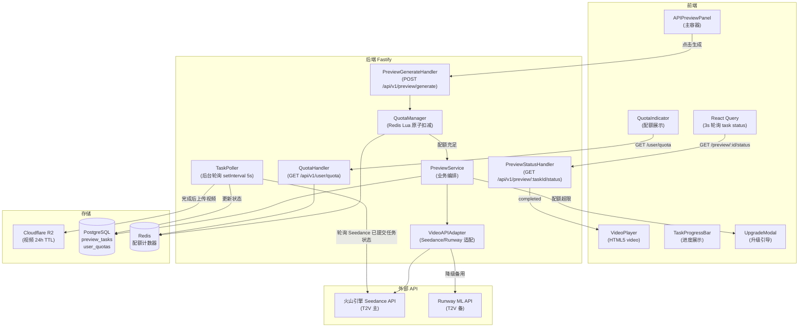

# Seedance Prompt Studio — API 集成预览（api-preview）模块架构设计文档

> **版本**：v1.0.0
> **架构师**：Architect Agent
> **创建日期**：2026-04-12
> **最后更新**：2026-04-12
> **状态**：评审中
> **模块标识**：`api-preview`
> **关联 Module PRD**：`modules/prd-api-preview.md` v1.0.0
> **关联主架构文档**：`architecture-seedance-prompt.md` v1.0.0

---

## 0. 关联文档

| 文档 | 路径 | 说明 |
| ---- | ---- | ---- |
| 主架构文档 | `architecture-seedance-prompt.md` | 跨模块架构总纲、部署、安全、公共能力 |
| 模块 PRD | `modules/prd-api-preview.md` | 模块需求、用户故事、验收标准 |
| 相关原型 | `wireframes/api-preview-panel.html` | API 预览面板低保真原型 |

> ⚠️ **风险注意**：本模块依赖火山引擎 Seedance API 内测资格（待申请）。MVP 阶段此模块为**增强功能**，提示词优化器可独立运行。架构设计已包含当 Seedance API 不可用时的降级方案。

---

## 1. 模块定位

### 1.1 模块概述

API 集成预览模块让用户在不离开 Seedance Prompt Studio 的情况下，将优化后的提示词直接提交给 Seedance T2V API 生成预览视频，形成「优化 → 即时验证 → 迭代」的完整闭环。该模块是产品从"提示词生成器"升级为"视频创作助手"的关键差异化路径。

模块核心设计挑战：
1. **API Key 安全代理**：Seedance API Key 永不暴露到前端，所有调用经后端代理转发
2. **异步任务轮询**：T2V 生成耗时 15-120s，需要稳定的前端轮询 + 后端状态管理
3. **配额管理**：Free 用户每日 3 次、Pro 用户每日 50 次，需原子性扣减防超配
4. **临时存储**：生成的预览视频临时存储于 Cloudflare R2（24h TTL），无需长期成本

### 1.2 设计目标

| 目标 | 描述 | 衡量标准 |
| ---- | ---- | -------- |
| 安全 API 代理 | Seedance API Key 不出现在任何前端代码/响应/日志 | 安全扫描零发现 |
| 配额原子扣减 | 并发请求下配额不超配 | Redis Lua 脚本测试（100 并发 3 配额不超用）|
| 任务状态可靠 | 97% 的任务最终达到 completed/failed 终态 | 后台任务监控 |
| 降级透明 | Seedance API 不可用时用户看到友好提示，编辑器功能不受影响 | 功能降级测试 |

### 1.3 范围与边界

| 范围 | 包含 | 不包含 |
| ---- | ---- | ------ |
| API 代理域 | Seedance T2V 调用封装、Runway ML 备用代理、API Key 安全管理 | 用户自带 API Key（v2.0 迭代）|
| 任务管理域 | 任务创建、状态轮询（3s 间隔）、完成通知、失败处理 | WebSocket 实时推送（v1.1 迭代，替代轮询）|
| 视频展示域 | 内嵌 HTML5 Video 播放器、预签名 URL 访问（1h 有效）| 视频下载、分享到社交媒体（v1.1 迭代）|
| 配额管理域 | 每日配额展示（已用/剩余）、UTC 零点自动 reset、超配提示+升级引导 | 配额历史记录、配额购买（v1.1 迭代）|

### 1.4 需求追溯矩阵

| Module PRD 需求编号 | 需求描述 | 优先级 | 对应组件/服务 | 对应 API | 对应数据对象 |
| ------------------- | -------- | ------ | ------------- | -------- | ------------ |
| US-ap-001 | Seedance T2V 预览调用（生成并展示视频）| P1 | `APIPreviewPanel` + `PreviewService` | `POST /api/v1/preview/generate` | `preview_tasks` |
| US-ap-002 | API 配额展示与超配引导 | P1 | `QuotaIndicator` + `UpgradeModal` | `GET /api/v1/user/quota` | `user_quotas` |
| US-ap-003 | 生成效果评分与反馈 | P2 | `RatingWidget` + `FeedbackService` | `POST /api/v1/preview/:taskId/feedback` | `preview_feedbacks`（P2，MVP 不实现）|

---

## 2. 模块架构设计

### 2.1 模块组件与职责

| 组件/服务 | 职责 | 输入 | 输出 | 依赖 |
| --------- | ---- | ---- | ---- | ---- |
| `APIPreviewPanel`（前端）| 预览面板主容器：参数选择、生成触发、进度展示 | 当前优化后的提示词 | 视频预览 | Zustand, React Query |
| `VideoPlayer`（前端）| HTML5 内嵌视频播放；支持 360p/720p | 预签名视频 URL | 视频播放 | 原生 `<video>` 标签 |
| `QuotaIndicator`（前端）| 显示今日剩余配额；进度条可视化 | 配额 API 响应 | 配额余量展示 | React Query |
| `TaskProgressBar`（前端）| 生成任务进度展示（pending/processing 状态时展示）| 轮询 API 响应 | 进度动画 | React Query polling |
| `UpgradeModal`（前端）| 配额用尽时展示 Pro 升级引导 | 配额超限 429 响应 | 升级页面 | Router |
| `PreviewService`（后端）| 任务创建、Seedance API 代理调用、状态更新、R2 视频上传 | REST 请求 | JSON 响应 | Seedance API, R2, PostgreSQL |
| `VideoAPIAdapter`（后端）| 统一封装 Seedance API / Runway ML API 差异 | 统一 `GenerateVideoRequest` | 统一 `TaskResponse` | 火山引擎 SDK, Runway SDK |
| `QuotaManager`（后端）| 原子配额检查与扣减、UTC 零点 reset | JWT userId + plan | 通过/拒绝 + 剩余配额 | Redis Lua 脚本 |
| `TaskPoller`（后端）| 后台任务状态轮询服务（向 Seedance 查询已提交任务的状态）| `preview_tasks` 表中 `pending/processing` 任务 | 状态更新 + R2 上传 | 定时任务（setInterval 5s）|

### 2.2 模块内部架构图



### 2.3 前端路由与组件

| 页面/路由 | 核心组件 | 状态管理 | 原型来源 | 说明 |
| --------- | -------- | -------- | -------- | ---- |
| `/editor?tab=preview` | `APIPreviewPanel` + `VideoPlayer` + `QuotaIndicator` + `TaskProgressBar` | React Query（任务轮询）+ Zustand（当前提示词）| `api-preview-panel.html` | 嵌入编辑器页面作为 Tab；Seedance API 不可用时此 Tab 隐藏/禁用 |

**React Query 任务轮询配置**：

```typescript
// 任务状态轮询（3s 间隔，直到终态）
const { data: taskStatus } = useQuery({
  queryKey: ['preview', taskId],
  queryFn: () => fetchTaskStatus(taskId),
  refetchInterval: (data) => {
    if (!taskId) return false;
    if (data?.status === 'completed' || data?.status === 'failed') return false;
    return 3000; // 3s 轮询
  },
  enabled: !!taskId,
  staleTime: 0,  // 每次都重新拉取（实时性要求高）
});
```

### 2.4 后端服务与处理流

| 场景 | 入口 API | 核心处理步骤 | 结果 |
| ---- | -------- | ------------ | ---- |
| 发起 T2V 预览 | `POST /api/v1/preview/generate` | 1.JWT 验证 → 2.QuotaManager 原子检查+扣减（Redis Lua）→ 3.配额不足返回 429 → 4.INSERT `preview_tasks`（status=pending）→ 5.VideoAPIAdapter 调用 Seedance API 提交任务 → 6.更新 `preview_tasks.status=processing, external_task_id` → 7.返回 `taskId` 给前端（立即返回，不等待生成完成）| 202 Accepted + taskId |
| 后台任务轮询（TaskPoller） | 定时任务（每 5s 扫描 `status=processing` 的任务）| 1.查询所有 processing 任务 → 2.向 Seedance API 查询状态 → 3.若 completed：下载视频 → 上传 R2（临时 Key，24h 自动删除）→ 生成预签名 URL → UPDATE `preview_tasks`（status=completed, video_url）→ 4.若 failed：UPDATE status=failed, error_message → 5.若超时（>120s processing）：标记为 timeout/failed | 状态更新到 DB |
| 前端轮询状态 | `GET /api/v1/preview/:taskId/status` | 1.JWT 验证 → 2.校验任务归属 → 3.查询 `preview_tasks` → 4.若 completed 返回预签名视频 URL | JSON 状态响应 |
| 查询配额 | `GET /api/v1/user/quota` | 1.JWT 验证 → 2.读取 Redis `quota:{userId}:{today}` 计数器 → 3.对比计划上限（Free:3, Pro:50）| JSON 配额 |
| Seedance API 不可用 | 任意 generate 请求 | VideoAPIAdapter 健康检查失败 → 模块特性标志（Feature Flag）设为 disabled → 前端 Tab 隐藏 + 提示「API 暂时不可用」| 503 + 降级提示 |

---

## 3. 数据模型设计

### 3.1 核心实体关系图

```mermaid
erDiagram
    users ||--o{ preview_tasks : "发起"
    users ||--|| user_quotas : "拥有"
    prompts ||--o{ preview_tasks : "关联"

    users {
        uuid id PK
        varchar plan "free|pro"
    }

    user_quotas {
        uuid user_id PK FK
        int preview_used "今日已使用配额"
        int optimize_used "今日优化次数"
        date quota_date "UTC 日期（YYYY-MM-DD）"
        timestamptz reset_at "下次 UTC 零点"
    }

    preview_tasks {
        uuid id PK
        uuid user_id FK
        uuid prompt_id FK
        varchar status "pending|processing|completed|failed|timeout"
        varchar resolution "360p|720p"
        int duration_sec "5|10"
        varchar external_task_id "Seedance/Runway 任务 ID"
        varchar video_key "R2 Object Key（24h TTL）"
        varchar video_url "R2 预签名 URL（1h 有效）"
        text error_message
        timestamptz created_at
        timestamptz updated_at
        timestamptz completed_at
    }

    prompts {
        uuid id PK
        uuid user_id FK
        jsonb output_json
    }
```

### 3.2 关键数据对象

| 数据对象 | 类型 | 关键字段 | 用途 | 生命周期 |
| -------- | ---- | -------- | ---- | -------- |
| `preview_tasks` | PostgreSQL 表 | `external_task_id`（Seedance 任务 ID）, `video_key`（R2 Key）| 任务状态管理 | completed/failed 后保留 7 天（用于历史展示）；R2 Object 独立 24h 删除 |
| `user_quotas` | PostgreSQL 表 | `preview_used`, `quota_date` | 配额记录（DB 持久化，Redis 缓存）| 每日 UTC 零点通过 UPSERT 重置；账户删除时级联删除 |
| 配额计数器 | Redis Counter | `quota:preview:{userId}:{YYYY-MM-DD}` | 高频原子扣减（Lua 脚本）| TTL 至次日 UTC 零点 |
| 预览视频文件 | Cloudflare R2 | `preview/{userId}/{taskId}.mp4` | 临时视频存储 | R2 Object TTL 24h 自动删除 |

**配额 Reset 策略**：
- Redis 计数器 TTL 设置为当日 UTC 零点后 1s（`EXPIREAT key <next_midnight_ts>`），零点后自动过期
- DB `user_quotas` 通过 UPSERT 在每日第一次预览时重置（`INSERT ... ON CONFLICT DO UPDATE`），无需定时任务

### 3.3 索引与一致性策略

| 场景 | 策略 | 说明 |
| ---- | ---- | ---- |
| 任务状态查询 | `(user_id, status, created_at DESC)` 索引 | TaskPoller 扫描 processing 任务 |
| 配额原子扣减 | Redis Lua 脚本：`if INCR(key) <= limit then return 1 else DECR(key); return 0 end` | 防止并发超配 |
| 任务超时检测 | `WHERE status='processing' AND updated_at < NOW() - INTERVAL '120 seconds'` | TaskPoller 定期扫描超时任务 |
| R2 Object 生命周期 | R2 Bucket 设置 Object Expiry Policy（24h）| 无需应用层清理 |

---

## 4. API 设计

### 4.1 接口清单

| 接口 | 方法 | 说明 | 请求摘要 | 响应摘要 | 鉴权 |
| ---- | ---- | ---- | -------- | -------- | ---- |
| `/api/v1/preview/generate` | POST | 发起 T2V 预览任务 | `{promptText, resolution, durationSec, promptId}` | `{taskId, status: 'pending'}` | 是 |
| `/api/v1/preview/:taskId/status` | GET | 查询任务状态 | — | `{status, videoUrl?, errorMessage?, progress?}` | 是 |
| `/api/v1/user/quota` | GET | 获取用户配额用量 | — | `{previewUsed, previewLimit, optimizeUsed, resetAt}` | 是 |

**响应状态流转**：

```
pending → processing → completed（video_url 有效 1h）
                    → failed（error_message 说明原因）
                    → timeout（默认 120s 无响应）
```

**`POST /api/v1/preview/generate` 请求体**：

```typescript
interface GeneratePreviewRequest {
  promptText: string;           // 优化后的完整提示词（rawText）
  resolution: '360p' | '720p'; // 默认 360p（节省配额）
  durationSec: 5 | 10;         // 视频时长
  promptId?: string;           // 可选，关联 prompts.id（供历史页展示预览状态）
}
```

### 4.2 错误处理与幂等

| 场景 | 错误码/状态码 | 处理策略 | 说明 |
| ---- | ------------- | -------- | ---- |
| 配额用尽 | `429 QUOTA_EXCEEDED` | 前端展示 UpgradeModal | 响应体含 `resetAt`（ISO 8601，下次重置时间）|
| Seedance API 不可用 | `503 SERVICE_UNAVAILABLE` | 前端隐藏预览 Tab + 友好提示 | 全局 Feature Flag 控制可用性 |
| 任务超时（120s）| DB `status=timeout` | 前端轮询收到 timeout 状态，展示重试提示 | 用户可重新发起（不扣配额，因任务未完成）|
| 任务未找到或非本人 | `404 NOT_FOUND` | — | `task.user_id != req.userId` 返回 404（不区分「不存在」和「越权」）|
| 重复提交相同提示词 | 允许（不去重）| — | 配额正常扣减；用户明确操作就执行 |

---

## 5. 模块间接口与依赖

| 调用方模块 | 被调用方模块 | 接口 / 数据结构 | 同步/异步 | 测试优先级 | 测试策略 | 说明 |
| ---------- | ------------ | --------------- | --------- | ---------- | -------- | ---- |
| `api-preview`（前端）| `prompt-optimizer`（前端）| Zustand `promptStore.outputTokens` → `rawText` | 同步（状态读取）| P0 | 单元测试（mock store）| 预览面板读取当前优化结果，不依赖 API |
| `api-preview` | `history-management` | `preview_tasks.prompt_id` → 写入对应历史记录的关联预览 | 异步（任务完成后更新）| P2 | 集成测试 | 历史页可展示该提示词的最新预览结果 |
| `api-preview` | 火山引擎 Seedance API（外部）| `VideoAPIAdapter.generateVideo()` / `VideoAPIAdapter.queryStatus()` | 同步（HTTP）| P0 | MSW Mock + 真实 API E2E | MVP 关键外部依赖，⚠️ 待申请内测资格 |
| `api-preview` | Runway ML API（外部，备用）| `VideoAPIAdapter.generateVideo()`（降级路径）| 同步（HTTP）| P1 | MSW Mock | Seedance 不可用时自动切换 |
| `api-preview` | Cloudflare R2 | `PreviewService.uploadVideo()` | 同步（S3 compatible）| P1 | Mock R2 Client | 视频生成完成后上传临时存储 |

### 5.1 外部依赖

| 依赖项 | 类型 | 用途 | 降级策略 |
| ------ | ---- | ---- | -------- |
| 火山引擎 Seedance T2V API | 外部服务 | T2V 视频生成（主）| ⚠️ 待申请内测；不可用时整个模块降级，编辑器独立运行 |
| Runway ML API | 外部服务 | T2V 视频生成（备）| Seedance 不可用时激活（需提前开通），若两者均不可用则模块禁用 |
| Cloudflare R2 | 外部基础设施 | 临时视频存储（24h）| R2 上传失败时任务标记为 failed；视频不存储到 DB |
| Redis (Upstash) | 内部基础设施 | 配额原子计数 | Redis 不可用时 allow-all 降级（临时无配额限制）并告警 |

### 5.2 集成与契约测试设计

| 接口 | 对端模块 | 契约工具 | Mock 策略 | 关键测试场景 | 关联 Module PRD TC 编号 |
| ---- | -------- | -------- | --------- | ------------ | ---------------------- |
| `POST /api/v1/preview/generate` | Seedance API | MSW 拦截 Mock | 模拟 pending 响应、直接 completed、超时 | 正常生成流程；配额用尽；Seedance 超时 | TC-AP-001, TC-AP-003, TC-AP-007 |
| `GET /api/v1/preview/:taskId/status` | 前端轮询 | Fastify inject | Mock DB（pending→processing→completed 状态序列）| 状态轮询 3 次后返回 completed + video_url | TC-AP-004 |
| 配额 Lua 脚本 | Redis | Vitest + 真实 Redis（Testcontainers）| — | 并发 10 请求 + 配额为 3，只有 3 个成功 | TC-AP-002 |
| TaskPoller 后台任务 | Seedance API + R2 | Vitest + MSW | Mock Seedance status 响应 + Mock R2 upload | 任务到达 completed 后上传 R2 并更新 DB | TC-AP-005 |

---

## 6. 非功能与安全

### 6.1 性能与容量

| 指标 | 目标值 | 推导依据 | 设计方案 |
| ---- | ------ | -------- | -------- |
| 视频生成等待时间 | 15-120s（由 Seedance API 决定）| T2V 行业基准 | 异步任务 + 前端轮询；进度条展示 |
| 状态查询响应 | P95 ≤ 200ms | DB 主键查询 + 状态字段 | `preview_tasks.id` 主键索引；状态字段已索引 |
| 配额查询响应 | P95 ≤ 50ms | Redis 读取 < 2ms | 配额优先读 Redis；DB 只在 Redis miss 时查询 |
| 并发任务数 | Free: 1 并发/用户，Pro: 3 并发/用户 | 防止单用户占用 Seedance API 连接 | TaskPoller 中检查用户 processing 任务数 |

### 6.2 安全控制

| 控制项 | 方案 | 覆盖风险 |
| ------ | ---- | -------- |
| API Key 保护 | Seedance/Runway API Keys 仅存于 Railway 环境变量；后端代理转发 | API Key 泄露 |
| 配额原子扣减 | Redis Lua 脚本保证 Check-Then-Act 原子性 | 并发超配（配额绕过）|
| 任务归属校验 | 查询 `WHERE user_id = ?`；状态查询返回 404 而非 403（防止枚举）| 越权访问他人任务 |
| 预签名 URL | R2 预签名 URL 1h 有效；`video_url` 不直接存储永久 URL | 视频 URL 泄露后无限访问 |
| 提示词注入防护 | 提示词在后端进行 HTML/JSON 安全处理后再提交给 Seedance API；禁止用户注入视频 API 参数 | 通过提示词注入攻击 Seedance API |
| 视频内容合规 | MVP 阶段：用户协议约束 + 反馈举报 → 后期引入 AI 内容审核 | 违法/违规视频生成 |

---

## 7. 风险与演进

| 风险/债务 | 影响 | 应对策略 | 触发条件 |
| --------- | ---- | -------- | -------- |
| 火山引擎 Seedance API 内测未获批 | api-preview 模块无法上线 | Runway ML API 作为备用；api-preview 为 P1 功能，MVP 可不含此模块上线 | API 申请 7 天无回应 |
| Seedance API 价格不透明 | 成本失控 | 严格配额限制（Free 3/日，Pro 50/日）；根据实际成本调整配额 | 上线后 API 费用 > 配额收益 |
| TaskPoller `setInterval` 在 Railway 单实例中的可靠性 | 多实例部署时产生重复轮询 | MVP 阶段单实例运行（Railway 默认）；多实例时引入 Redis 分布式锁控制 TaskPoller | Railway 实例扩展到 2+ |
| R2 预签名 URL 过期后前端展示视频失败 | 用户看到断链视频 | 前端检测 video load error 后自动请求刷新 URL（`GET /api/v1/preview/:taskId/status` 返回新 URL）| 频繁出现视频加载失败 |
| 轮询 QPS 浪费（大量处于 processing 状态的任务）| 后端 QPS 浪费 | v1.1 引入 WebSocket / Server-Sent Events 替代轮询，服务端主动推送状态变更 | 并发任务 > 50 个 |

---

## 8. 关联与回填检查

| 检查项 | 状态 | 说明 |
| ------ | ---- | ---- |
| 文档头已关联 Module PRD 版本 | ✅ | `modules/prd-api-preview.md` v1.0.0 |
| 文档头已关联主架构版本 | ✅ | `architecture-seedance-prompt.md` v1.0.0 |
| Module PRD 「关联架构文档」已更新 | ✅ | `prd-api-preview.md` 文档头已更新 |
| Module PRD §6.3 技术参考已回填 | ✅ | 数据模型、API 端点摘要已回填 |

---

## 9. 变更记录

| 版本 | 日期 | 作者 | 变更类型 | 变更摘要 |
| ---- | ---- | ---- | -------- | -------- |
| v1.0.0 | 2026-04-12 | Architect Agent | Initial | 首次生成 api-preview 模块架构文档 |
