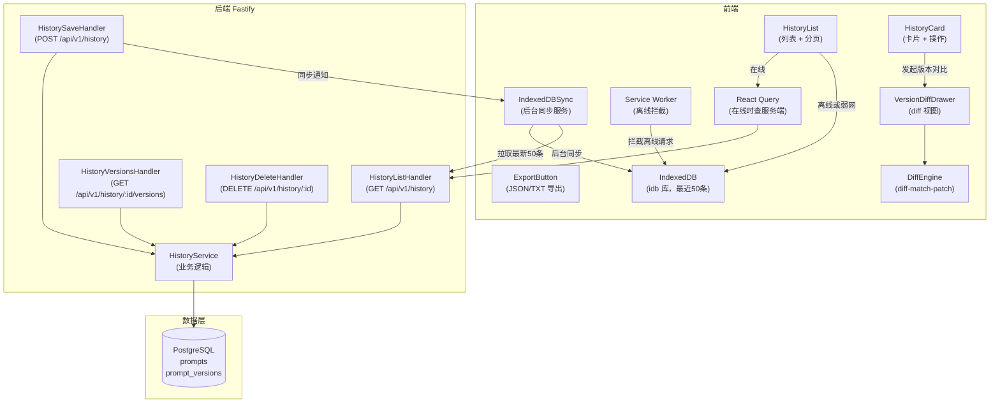
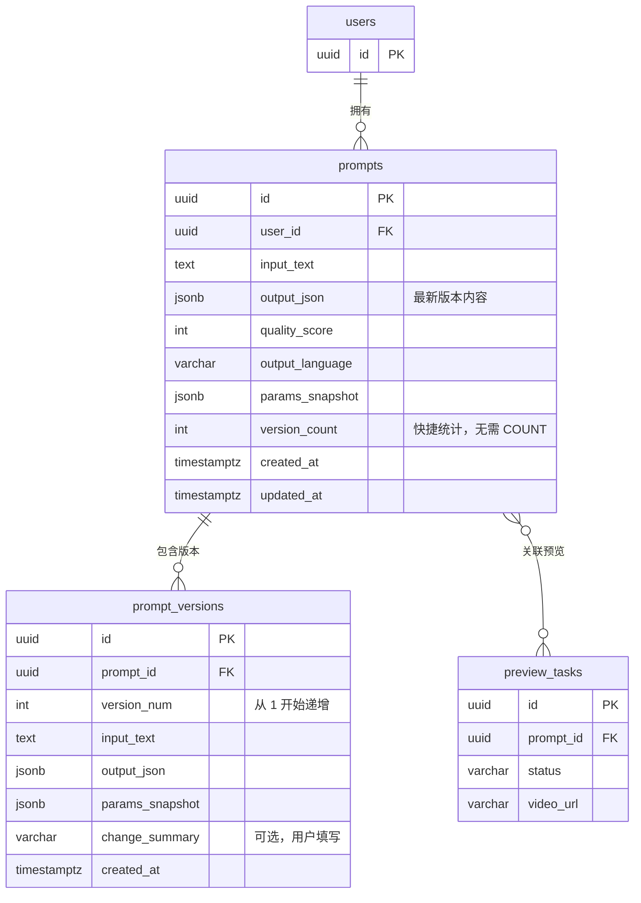

# Seedance Prompt Studio — 历史管理（history-management）模块架构设计文档

> **版本**：v1.0.0
> **架构师**：Architect Agent
> **创建日期**：2026-04-12
> **最后更新**：2026-04-12
> **状态**：评审中
> **模块标识**：`history-management`
> **关联 Module PRD**：`modules/prd-history-management.md` v1.0.0
> **关联主架构文档**：`architecture-seedance-prompt.md` v1.0.0

---

## 0. 关联文档

| 文档 | 路径 | 说明 |
| ---- | ---- | ---- |
| 主架构文档 | `architecture-seedance-prompt.md` | 跨模块架构总纲、部署、安全、公共能力 |
| 模块 PRD | `modules/prd-history-management.md` | 模块需求、用户故事、验收标准 |
| 相关原型 | `wireframes/history-management-list.html` | 历史记录列表与版本对比低保真原型 |

---

## 1. 模块定位

### 1.1 模块概述

历史管理模块负责用户提示词优化历史的持久化存储、版本迭代管理和版本对比。核心价值是帮助用户将优质提示词沉淀为个人资产，支持在已有版本基础上迭代优化，并通过版本对比直观展示每次调整的变化。

模块针对离线场景做了专项设计：通过 IndexedDB 缓存最近 50 条历史记录，Service Worker 在网络不可用时仍能展示历史内容，保障核心资产随时可访问。

### 1.2 设计目标

| 目标 | 描述 | 衡量标准 |
| ---- | ---- | -------- |
| 快速历史访问 | 历史列表页加载 P95 ≤ 500ms | k6 + APM 监控 |
| 离线可用 | 断网时仍能查看最近 50 条历史 | Playwright 网络截断测试 |
| 版本对比清晰 | diff 视图精确到词级别，变化一目了然 | 用户体验测试 |

### 1.3 范围与边界

| 范围 | 包含 | 不包含 |
| ---- | ---- | ------ |
| 历史持久化域 | 用户主动保存提示词、自动保存（可配置）、保留最近 200 条 | 无限容量存储（Pro 用户迭代计划）|
| 版本管理域 | 基于历史版本再次优化、版本号管理、版本删除 | Git-style 分支管理（v2.0 迭代）|
| 版本对比域 | diff-match-patch 词级别对比、变化高亮展示 | 三方对比（v2.0 迭代）|
| 离线缓存域 | IndexedDB 缓存最近 50 条、Service Worker 离线响应 | 跨设备同步离线数据（v1.1 迭代）|
| 导出域 | 导出 JSON（含版本树）、导出 TXT（最新版本）| 导入功能、云同步（v1.1 迭代）|

### 1.4 需求追溯矩阵

| Module PRD 需求编号 | 需求描述 | 优先级 | 对应组件/服务 | 对应 API | 对应数据对象 |
| ------------------- | -------- | ------ | ------------- | -------- | ------------ |
| US-hm-001 | 查看历史记录列表，基于历史版本迭代修改 | P1 | `HistoryList` + `HistoryService.list()` | `GET /api/v1/history` | `prompts`, `prompt_versions` |
| US-hm-002 | 历史版本对比（词级别 diff）| P1 | `VersionDiffDrawer` + `DiffEngine` | `GET /api/v1/history/:id/versions` | `prompt_versions` |
| US-hm-003 | 历史记录导出（JSON/TXT）| P2 | `ExportButton` | `GET /api/v1/history/export` | `prompts`, `prompt_versions` |

---

## 2. 模块架构设计

### 2.1 模块组件与职责

| 组件/服务 | 职责 | 输入 | 输出 | 依赖 |
| --------- | ---- | ---- | ---- | ---- |
| `HistoryList`（前端）| 历史记录列表展示、分页、搜索过滤 | 历史数据（React Query + IndexedDB）| 历史卡片列表 | React Query, IndexedDB |
| `HistoryCard`（前端）| 单条历史记录展示、操作菜单（重用/版本对比/删除/导出）| 单条历史数据 | 操作回调 | Zustand |
| `VersionDiffDrawer`（前端）| 版本对比抽屉（词级别 diff 视图）| 两个版本的提示词文本 | 高亮 diff 渲染 | `diff-match-patch` |
| `ExportButton`（前端）| 导出 JSON/TXT 文件（浏览器下载）| 历史数据 | 文件下载 | Blob API |
| `HistoryService`（后端）| 历史 CRUD、版本创建、导出 | REST 请求 | JSON 响应 | PostgreSQL |
| `IndexedDBSync`（前端 Service）| 后台同步 DB 数据到 IndexedDB；离线时从 IndexedDB 读取 | API 响应 + 网络状态 | 本地缓存写入 | `idb` 库, Service Worker |
| `DiffEngine`（前端 Util）| 计算两个版本提示词文本的 diff | 两段文本 | diff 结果（操作序列）| `diff-match-patch` |

### 2.2 模块内部架构图



### 2.3 前端路由与组件

| 页面/路由 | 核心组件 | 状态管理 | 原型来源 | 说明 |
| --------- | -------- | -------- | -------- | ---- |
| `/history` | `HistoryList` + `VersionDiffDrawer`（抽屉）| React Query + IndexedDB（离线）| `history-management-list.html` | CSR，需要登录；离线时从 IndexedDB 读取 |

**离线缓存策略（Service Worker + IndexedDB）**：

```typescript
// IndexedDB Schema（idb 库）
interface HistoryDB {
  prompts: {
    key: string;            // prompt.id
    value: PromptRecord;    // 含 output_json + quality_score
    indexes: {
      by_created_at: IDBValidKey;
      by_user_id: string;
    };
  };
}

// Service Worker 离线策略
// GET /api/v1/history → Network First（在线优先，失败时回退 IndexedDB）
// IndexedDB 保留最近 50 条（按 created_at 排序），超出自动淘汰老记录
```

### 2.4 后端服务与处理流

| 场景 | 入口 API | 核心处理步骤 | 结果 |
| ---- | -------- | ------------ | ---- |
| 浏览历史记录 | `GET /api/v1/history?page=1&limit=20` | 1.JWT 验证 → 2.`WHERE user_id = ?` 游标分页 → 3.按 `created_at DESC` 排序 → 4.返回分页数据 | JSON 分页 |
| 保存历史 | `POST /api/v1/history` | 1.JWT 验证 → 2.Zod 校验 → 3.INSERT `prompts` → 4.INSERT `prompt_versions`（version_num=1）→ 5.检查用户历史总数（超200条淘汰最老）| 201 Created |
| 基于历史版本再次优化 | 前端逻辑（读取 history item → 填充 promptStore → 调用 optimize）+ `POST /api/v1/history`（保存新版本）| 前端：读取 `historyId` 对应的 output_json，填充编辑器，用户编辑后优化 → 后端：new `prompts` INSERT + 新 `prompt_version` INSERT（关联原 `prompt_id`）| 前端导航到编辑器；后端 201 |
| 查看版本历史 | `GET /api/v1/history/:id/versions` | 1.JWT 验证 → 2.校验资源归属（`user_id`）→ 3.查询 `prompt_versions WHERE prompt_id = ?` → 4.按 `version_num ASC` 排序返回 | JSON 版本列表 |
| 版本对比 | 纯前端操作（`DiffEngine`）| 1.用户选择两个版本 → 2.`DiffEngine.diff(v1.rawText, v2.rawText)` → 3.渲染 `VersionDiffDrawer` | 前端 diff 渲染 |
| 删除历史 | `DELETE /api/v1/history/:id` | 1.JWT 验证 → 2.校验归属 → 3.DELETE `prompts`（CASCADE 删除 `prompt_versions`）→ 4.通知前端清除 IndexedDB 对应记录 | 204 No Content |
| 导出历史 | `GET /api/v1/history/export?format=json` | 1.JWT 验证 → 2.查询用户所有历史（含版本树）→ 3.序列化为 JSON/TXT → 4.返回附件响应 | Binary（文件下载）|

---

## 3. 数据模型设计

### 3.1 核心实体关系图



### 3.2 关键数据对象

| 数据对象 | 类型 | 关键字段 | 用途 | 生命周期 |
| -------- | ---- | -------- | ---- | -------- |
| `prompts` | PostgreSQL 表 | `version_count`（冗余字段，快速展示版本数）| 历史记录主表 | 用户主动保存时创建；保持最近 200 条；账户删除时级联删除 |
| `prompt_versions` | PostgreSQL 表 | `version_num`, `params_snapshot`（调参快照）| 版本历史 | 随 `prompts` 级联删除 |
| 离线历史缓存 | IndexedDB (浏览器) | `prompts` store，最近 50 条 | 断网访问 | 登录状态下后台同步；登出时清除 |

### 3.3 索引与一致性策略

| 场景 | 策略 | 说明 |
| ---- | ---- | ---- |
| 用户历史列表 | `(user_id, created_at DESC)` 复合索引 | 分页历史查询 |
| 版本列表查询 | `(prompt_id, version_num ASC)` 复合索引 | 按版本号排序的版本历史 |
| 历史总数淘汰 | 保存时通过子查询获取最老记录 ID：`DELETE FROM prompts WHERE id IN (SELECT id FROM prompts WHERE user_id=? ORDER BY created_at ASC LIMIT (count - 200))` | 软上限管理，无需定时任务 |
| IndexedDB 与 DB 一致性 | 最终一致性（Network First 策略）；删除时先删 DB，成功后通知前端删除 IndexedDB | 离线状态下本地显示可能含已删除记录，联网后自动修正 |

---

## 4. API 设计

### 4.1 接口清单

| 接口 | 方法 | 说明 | 请求摘要 | 响应摘要 | 鉴权 |
| ---- | ---- | ---- | -------- | -------- | ---- |
| `/api/v1/history` | GET | 用户历史列表（游标分页）| `?cursor&limit=20` | `{data: Prompt[], nextCursor}` | 是 |
| `/api/v1/history` | POST | 保存提示词到历史 | `{inputText, outputJson, paramsSnapshot, language}` | `{data: Prompt}` | 是 |
| `/api/v1/history/:id` | DELETE | 删除历史记录 | — | `204` | 是（仅作者）|
| `/api/v1/history/:id/versions` | GET | 获取某条历史的版本列表 | — | `{data: PromptVersion[]}` | 是（仅作者）|
| `/api/v1/history/export` | GET | 导出历史（JSON/TXT）| `?format=json\|txt` | 文件附件 | 是 |

**游标分页说明**：历史记录按 `created_at DESC` 游标分页，`cursor` 为上一页最后一条的 `created_at` 时间戳（ISO 8601）。游标分页相比 offset 分页在数据实时写入场景下不会出现重复/跳过问题。

### 4.2 错误处理与幂等

| 场景 | 错误码/状态码 | 幂等策略 | 说明 |
| ---- | ------------- | -------- | ---- |
| 访问他人历史 | `403 FORBIDDEN` | — | 服务端强制 `user_id` 归属校验 |
| 历史已达 200 条上限 | 保存成功，自动淘汰最老 1 条 | — | 不报错，静默淘汰 |
| 离线保存（前端）| 返回本地临时 ID，联网后自动同步 | 幂等写入（`inputText + user_id` 的 Hash 防重）| 网络恢复后去重 |

---

## 5. 模块间接口与依赖

| 调用方模块 | 被调用方模块 | 接口 / 数据结构 | 同步/异步 | 测试优先级 | 测试策略 | 说明 |
| ---------- | ------------ | --------------- | --------- | ---------- | -------- | ---- |
| `prompt-optimizer`（前端）| `history-management` | 优化完成后，前端通过 Zustand store `optimizationId` 触发保存 | 异步（用户手动操作）| P1 | 集成测试验证保存流程 | 用户点击「保存」后才写入历史，不自动保存 |
| `api-preview` | `history-management` | 视频预览任务 ID 写入对应 `prompts` 记录（`preview_tasks.prompt_id`）| 异步 | P2 | 集成测试 | 历史页可关联展示该提示词的预览状态 |
| `history-management` | `user-system` | `prompts.user_id` 归属校验 | 同步（请求时）| P0（安全）| 单元测试 + 渗透测试 | 不允许跨用户访问 |

### 5.1 外部依赖

| 依赖项 | 类型 | 用途 | 降级策略 |
| ------ | ---- | ---- | -------- |
| `diff-match-patch` | 前端 npm 包 | 词级别文本 diff（版本对比）| 无降级需求（纯前端计算）|
| `idb` | 前端 npm 包 | IndexedDB 操作的 Promise 封装 | 无降级需求（浏览器原生支持）|
| PostgreSQL | 内部基础设施 | 历史数据持久化 | 参见主架构文档 §8.2 高可用方案 |

### 5.2 集成与契约测试设计

| 接口 | 对端模块 | 契约工具 | Mock 策略 | 关键测试场景 | 关联 Module PRD TC 编号 |
| ---- | -------- | -------- | --------- | ------------ | ---------------------- |
| `POST /api/v1/history` | `prompt-optimizer` 前端 | Fastify inject + Testcontainers | PostgreSQL 真实 DB | 保存成功；超200条自动淘汰；离线暂存 | TC-HM-001 |
| `GET /api/v1/history/:id/versions` | 历史页前端 | Fastify inject | Mock JWT + DB 种子数据 | 版本列表正确返回；非作者 403 | TC-HM-002 |
| `diff-match-patch` 本地计算 | 前端组件 | Vitest 单元测试 | 无 Mock（纯函数）| 相同文本 diff = 空；字词级别变化正确高亮 | TC-HM-004 |
| IndexedDB 离线回退 | Service Worker | Playwright（截断网络）| MSW 模拟网络断开 | 断网时仍显示最近50条；联网后自动同步最新数据 | TC-HM-005 |

---

## 6. 非功能与安全

### 6.1 性能与容量

| 指标 | 目标值 | 推导依据 | 设计方案 |
| ---- | ------ | -------- | -------- |
| 历史列表加载 | P95 ≤ 500ms | 游标分页 + 复合索引；20 条约 5-10ms | `(user_id, created_at DESC)` 索引；游标分页 |
| 版本对比渲染 | < 100ms（前端）| diff-match-patch 对 < 500 token 文本约 1-5ms | 纯前端计算，无需后端 |
| 离线历史读取 | < 50ms | IndexedDB 读取约 5-20ms | idb 库异步读取 |
| 导出响应 | < 2s | 最多 200 条历史 × 平均 1KB = 200KB，DB 全量查询约 50-100ms | 限制最大导出 200 条；流式响应（Stream `pipe`）|

### 6.2 安全控制

| 控制项 | 方案 | 覆盖风险 |
| ------ | ---- | -------- |
| 历史数据归属强制校验 | 所有查询/删除添加 `WHERE user_id = ?`；Drizzle ORM Repository 不暴露跨用户接口 | BOLA（对象级越权访问）|
| 导出鉴权 | 导出接口需 JWT 验证；仅可导出自己的数据 | 数据窃取 |
| IndexedDB 数据加密 | MVP 阶段不加密（浏览器 Same-Origin 已隔离）；敏感用户可选择不启用离线缓存 | 共用设备数据泄露（低风险）|
| 离线同步防写入脏数据 | 联网同步时，以服务端数据为准（Server-wins 策略）| 离线修改冲突 |

---

## 7. 风险与演进

| 风险/债务 | 影响 | 应对策略 | 触发条件 |
| --------- | ---- | -------- | -------- |
| IndexedDB 存储配额限制（浏览器约 50MB）| 大量历史数据可能超限 | 仅缓存最近 50 条（约 500KB）；超出时淘汰最老 | 用户历史总量 > 50 条 |
| diff-match-patch 对长文本性能 | 超长提示词（> 2000 字符）diff 计算可能卡顿 | 前端 Web Worker 异步执行 diff 计算 | 单次 diff 耗时 > 100ms |
| 200 条历史硬上限 | Pro 用户觉得限制太少 | v1.1 增加 Pro 用户历史无限上限 | NPS 投诉历史上限 |

---

## 8. 关联与回填检查

| 检查项 | 状态 | 说明 |
| ------ | ---- | ---- |
| 文档头已关联 Module PRD 版本 | ✅ | `modules/prd-history-management.md` v1.0.0 |
| 文档头已关联主架构版本 | ✅ | `architecture-seedance-prompt.md` v1.0.0 |
| Module PRD 「关联架构文档」已更新 | ✅ | `prd-history-management.md` 文档头已更新 |
| Module PRD §6.3 技术参考已回填 | ✅ | 数据模型、API 端点摘要已回填 |

---

## 9. 变更记录

| 版本 | 日期 | 作者 | 变更类型 | 变更摘要 |
| ---- | ---- | ---- | -------- | -------- |
| v1.0.0 | 2026-04-12 | Architect Agent | Initial | 首次生成 history-management 模块架构文档 |
