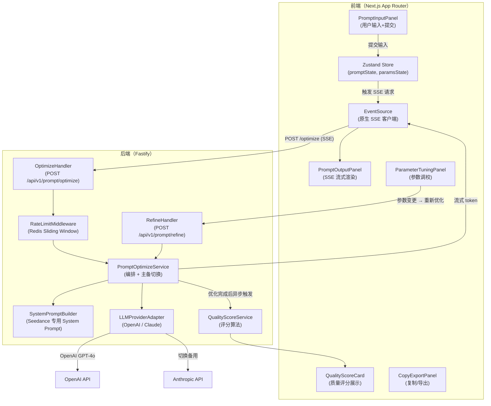
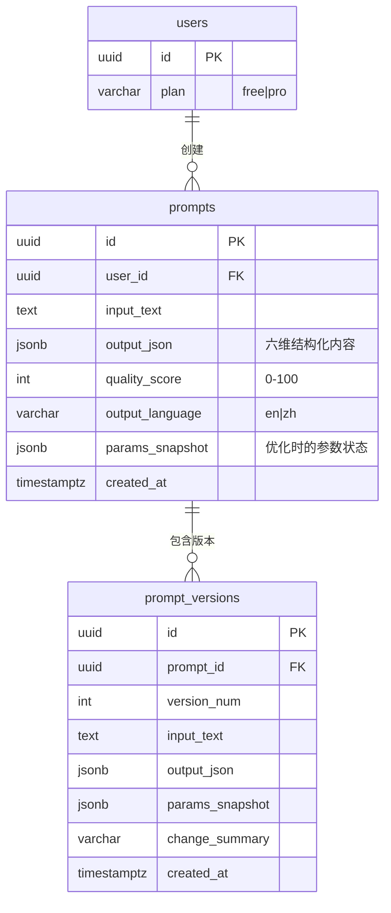

# Seedance Prompt Studio — 提示词优化引擎（prompt-optimizer）模块架构设计文档

> **版本**：v1.0.0
> **架构师**：Architect Agent
> **创建日期**：2026-04-12
> **最后更新**：2026-04-12
> **状态**：评审中
> **模块标识**：`prompt-optimizer`
> **关联 Module PRD**：`modules/prd-prompt-optimizer.md` v1.0.0
> **关联主架构文档**：`architecture-seedance-prompt.md` v1.0.0

---

## 0. 关联文档

| 文档 | 路径 | 说明 |
| ---- | ---- | ---- |
| 主架构文档 | `architecture-seedance-prompt.md` | 跨模块架构总纲、部署、安全、公共能力 |
| 模块 PRD | `modules/prd-prompt-optimizer.md` | 模块需求、用户故事、验收标准 |
| 相关原型 | `wireframes/prompt-optimizer-editor.html` | 编辑器输入面板低保真原型 |
| 相关原型 | `wireframes/prompt-optimizer-result.html` | 结果展示与参数调校面板低保真原型 |

---

## 1. 模块定位

### 1.1 模块概述

提示词优化引擎是 Seedance Prompt Studio 的 P0 核心差异化模块，承担将创作者的自然语言创意描述通过 LLM 转化为 Seedance 2.0 专属六维结构化提示词的核心职责。模块的核心竞争力在于：专为 Seedance 定制的 System Prompt（包含六维结构定义 + Seedance 禁忌词 + Few-shot 案例）、SSE 流式输出的低延迟体验，以及可视化参数调校面板的专业性。

本模块输出的提示词是整个产品链路的起点：历史管理模块保存其输出，API 预览模块消费其输出，模板库为其提供起点内容。

### 1.2 设计目标

| 目标 | 描述 | 衡量标准 |
| ---- | ---- | -------- |
| 极速首字节 | SSE 首 token 延迟 P90 ≤ 1s | k6 SSE 首 byte 计时 |
| 主备 LLM 切换 | GPT-4o 不可用时无缝切换 Claude 3.5 Sonnet | 切换后用户无感知（< 500ms 额外延迟）|
| 参数调校即时预览 | 参数变更后提示词文本实时更新，无需重新调用 LLM | 本地 < 16ms 更新（60FPS） |
| 安全 API Key 代理 | LLM API Keys 不出现在任何前端代码或响应中 | 安全扫描零发现 |

### 1.3 范围与边界

| 范围 | 包含 | 不包含 |
| ---- | ---- | ------ |
| 优化器功能域 | LLM 调用、SSE 流式、System Prompt 管理、六维结构解析 | 视频内容合规审核（外部服务）|
| 参数调校域 | 可视化参数面板、本地状态实时更新、基于参数重新优化 | 参数的持久化存储（由 history-management 模块处理）|
| 质量评分域 | 维度覆盖率检查、Seedance 兼容性评分、改进建议生成 | 用户反馈数据训练（v1.1 迭代）|
| 导出功能域 | 一键复制到剪贴板、导出 .txt 文件 | 导出到第三方平台（v1.1 迭代）|

### 1.4 需求追溯矩阵

| Module PRD 需求编号 | 需求描述 | 优先级 | 对应组件/服务 | 对应 API | 对应数据对象 |
| ------------------- | -------- | ------ | ------------- | -------- | ------------ |
| US-prompt-optimizer-001 | 自然语言 → 结构化提示词（SSE） | P0 | `PromptOptimizeService` + `PromptInputPanel` | `POST /api/v1/prompt/optimize` | `prompts` |
| US-prompt-optimizer-002（参数调校） | 多维度参数调校面板 | P0 | `ParameterTuningPanel` + `PromptOptimizeService.refine()` | `POST /api/v1/prompt/refine` | 参数面板本地状态 |
| F-quality-score（提示词质量评分） | 质量评分 + 维度雷达图 + 改进建议 | P1 | `QualityScoreService` + `QualityScoreCard` | `POST /api/v1/prompt/score`（异步，优化完成后自动触发）| `prompts.quality_score` |
| F-copy-export（一键复制导出） | 复制到剪贴板 / 导出 .txt | P1 | `CopyExportPanel`（前端组件）| N/A（纯前端操作）| — |

---

## 2. 模块架构设计

### 2.1 模块组件与职责

| 组件/服务 | 职责 | 输入 | 输出 | 依赖 |
| --------- | ---- | ---- | ---- | ---- |
| `PromptInputPanel`（前端） | 用户输入框、字数统计、提交触发 | 用户自然语言文本 | 触发优化请求 | Zustand store |
| `PromptOutputPanel`（前端） | SSE 流式文本渲染、六维标签高亮展示 | SSE token stream | 结构化提示词可视化 | EventSource |
| `ParameterTuningPanel`（前端） | 镜头/光影/风格/运动参数可视化调校 | 用户参数操作 | 实时更新提示词预览 / 触发 refine | Zustand params store |
| `QualityScoreCard`（前端） | 质量分展示、维度雷达图、改进建议 | quality_score API 响应 | 可视化质量评估 | React Query |
| `CopyExportPanel`（前端） | 一键复制、.txt 导出 | 当前提示词文本 | 剪贴板 / 文件下载 | Clipboard API |
| `PromptOptimizeService`（后端） | LLM 调用编排、SSE 响应流、主备切换 | 用户输入 + 参数 | SSE token stream | `LLMProviderAdapter` |
| `LLMProviderAdapter`（后端） | 屏蔽 OpenAI/Claude API 差异 | 统一 `GenerateRequest` | 统一 `TokenStream` | OpenAI SDK, Anthropic SDK |
| `SystemPromptBuilder`（后端） | 动态构建 Seedance 专用 System Prompt | 用户输入 + 参数 | 最终 messages array | 内置 Few-shot 案例库 |
| `QualityScoreService`（后端） | 维度覆盖率、禁忌词检测、综合评分 | 结构化提示词文本 | 质量分 0-100 + 建议列表 | 内置规则引擎 |
| `RateLimitMiddleware`（后端） | 用户配额检查（每日优化次数） | JWT userId | 通过/拒绝 | Redis Sliding Window |

### 2.2 模块内部架构图



### 2.3 前端路由与组件

| 页面/路由 | 核心组件 | 状态管理 | 原型来源 | 说明 |
| --------- | -------- | -------- | -------- | ---- |
| `/editor` (Tab: 输入) | `PromptInputPanel` + `LanguageSelector` + `DurationSelector` | Zustand `promptStore.inputText` | `prompt-optimizer-editor.html` | CSR；双栏布局（左输入/右输出）|
| `/editor` (Tab: 结果) | `PromptOutputPanel` + `ParameterTuningPanel` + `QualityScoreCard` + `CopyExportPanel` | Zustand `promptStore.outputTokens` + `paramsStore` | `prompt-optimizer-result.html` | SSE 渲染中禁用参数面板 |

**Zustand Store 设计**：

```typescript
// stores/promptStore.ts
interface PromptStore {
  inputText: string;
  outputTokens: string[];          // SSE token accumulation
  structuredOutput: SixDimOutput | null;
  isStreaming: boolean;
  qualityScore: QualityScore | null;
  optimizationId: string | null;   // 关联到 history-management 模块
  setInput: (text: string) => void;
  appendToken: (token: string) => void;
  setQualityScore: (score: QualityScore) => void;
  resetOutput: () => void;
}

// stores/paramsStore.ts
interface ParamsStore {
  cameraType: CameraType;          // 12 种镜头类型
  lightingStyle: number;           // 1-7 光影风格
  motionSpeed: MotionSpeed;        // slow|normal|fast
  stylePresets: string[];          // 最多 3 个风格标签
  setParam: <K extends keyof ParamsState>(key: K, value: ParamsState[K]) => void;
  resetToDefault: () => void;
}
```

### 2.4 后端服务与处理流

| 场景 | 入口 API | 核心处理步骤 | 结果 |
| ---- | -------- | ------------ | ---- |
| 首次优化 | `POST /api/v1/prompt/optimize` | 1.JWT 验证 → 2.配额检查（Redis）→ 3.Zod 校验输入 → 4.SystemPromptBuilder 构建 → 5.LLMProviderAdapter.stream() → 6.SSE 逐 token 推送 → 7.[DONE] → 8.异步触发质量评分 → 9.可选保存历史（前端决定）| SSE stream |
| 参数重新优化 | `POST /api/v1/prompt/refine` | 1.JWT 验证 → 2.将参数注入 System Prompt → 3.LLM 重新生成 → 4.SSE 推送 | SSE stream |
| 质量评分 | 内部方法调用（优化完成后异步）| 1.解析六维结构 → 2.维度覆盖率计算 → 3.禁忌词检测 → 4.Token 长度评估 → 5.综合评分 → 6.生成建议 → 7.写入 `prompts.quality_score` | JSON |
| LLM 降级切换 | 内部（LLMProviderAdapter）| 1.GPT-4o 调用失败/超时（10s）→ 2.记录降级日志 → 3.切换到 Claude 3.5 → 4.重新 stream | 对用户透明，仅延迟略增 |

**SSE 协议规范**：

```
# 请求头
Content-Type: application/json
Authorization: Bearer <token>

# 响应头
Content-Type: text/event-stream
Cache-Control: no-cache
Connection: keep-alive
X-Optimization-Id: <uuid>   ← 供前端关联历史保存

# 事件格式（每个 LLM token 推送一次）
data: {"token": "cinematic", "index": 0}

data: {"token": " shot", "index": 1}

# 维度标签推送（优化完成后）
data: {"type": "dimensions", "data": {"subject": "...", "scene": "...", ...}}

# 质量评分推送（维度推送后）
data: {"type": "quality", "data": {"score": 85, "suggestions": ["..."]}}

# 结束标志
data: [DONE]
```

---

## 3. 数据模型设计

### 3.1 核心实体关系图



**`output_json` 结构定义**：

```typescript
interface SixDimOutput {
  subject: string;      // 主体：who/what
  scene: string;        // 场景：where/environment
  camera: string;       // 镜头：angle/movement/type
  lighting: string;     // 光影：mood/style
  motion: string;       // 运动：speed/direction
  style: string;        // 风格：aesthetic/genre
  rawText: string;      // 完整提示词原文（用于复制）
}
```

### 3.2 关键数据对象

| 数据对象 | 类型 | 关键字段 | 用途 | 生命周期 |
| -------- | ---- | -------- | ---- | -------- |
| `prompts` | PostgreSQL 表 | `output_json` (JSONB), `quality_score` | 优化结果持久化 | 用户主动保存时创建；账户删除时级联删除 |
| `prompt_versions` | PostgreSQL 表 | `version_num`, `params_snapshot` | 用户迭代优化的版本历史 | 每次「基于现有版本重新优化」时创建 |
| `paramsState` | Redis Key | `user:{id}:params` (Hash) | 参数面板状态的短期持久化（刷新保留）| TTL 24h |
| `optimizeRateLimit` | Redis Key | `rl:optimize:{userId}:{date}` (Counter) | 每日优化次数限制（Free: 50, Pro: 无限）| TTL 至 UTC 零点 |

### 3.3 索引与一致性策略

| 场景 | 策略 | 说明 |
| ---- | ---- | ---- |
| 用户历史查询 | `(user_id, created_at DESC)` 复合索引 | 支持分页历史列表 |
| 版本查询 | `(prompt_id, version_num)` 复合索引 | 支持版本列表展示 |
| 质量评分写入 | 乐观更新（UPDATE 不加事务）| 评分是异步非关键操作，容许偶发失败 |
| 配额扣减 | Redis Lua 脚本原子 INCR + 判断 | 防止并发竞争超配 |

---

## 4. API 设计

### 4.1 接口清单

**`POST /api/v1/prompt/optimize`** — 提示词优化（SSE 流式）

```typescript
// 请求体
interface OptimizeRequest {
  inputText: string;          // 1-2000 字
  outputLanguage: 'en' | 'zh'; // 默认 'en'
  targetDuration: 5 | 10;     // 视频时长目标（秒），影响运动描述
}

// SSE 事件流（见 §2.4）
// 最终 HTTP 状态：200（流开始时立即返回）
// 限速：Free 50次/日，通过 X-RateLimit-Remaining 响应头告知
```

**`POST /api/v1/prompt/refine`** — 基于参数重新优化（SSE 流式）

```typescript
interface RefineRequest {
  optimizationId: string;  // 关联的 prompts.id
  params: {
    cameraType?: CameraType;
    lightingStyle?: number;   // 1-7
    motionSpeed?: 'slow' | 'normal' | 'fast';
    stylePresets?: string[];   // 最多 3 个
  };
  keepContext: boolean;       // true=基于原输入+参数重优化，false=只做参数替换
}
```

**`POST /api/v1/prompt/score`** — 质量评分（内部调用，也可前端单独触发）

```typescript
interface ScoreRequest {
  promptText: string;
  outputJson: SixDimOutput;
}
interface ScoreResponse {
  score: number;          // 0-100
  dimensions: {           // 六维覆盖率（0-1）
    subject: number; scene: number; camera: number;
    lighting: number; motion: number; style: number;
  };
  suggestions: string[];  // 1-3 条具体建议
}
```

### 4.2 错误处理与幂等

| 场景 | 错误码/状态码 | 处理策略 | 说明 |
| ---- | ------------- | -------- | ---- |
| 输入为空 / 超长 | `400 BAD_REQUEST` | 前端校验 + 后端 Zod 二次校验 | 返回字段级错误说明 |
| 未登录 | `401 UNAUTHORIZED` | 跳转登录页 | — |
| 每日配额用尽 | `429 QUOTA_EXCEEDED` | 展示 Pro 升级引导 | 携带 `Retry-After: <seconds_to_midnight>` 头 |
| LLM 超时（>10s） | SSE 推送 `{"type":"error","code":"LLM_TIMEOUT"}` 后关闭 | 前端显示重试按钮 | 主备切换后仍失败才返回此错误 |
| LLM API 5xx | 自动切换到备用 Provider，透明重试 1 次 | 无用户感知 | 两个 Provider 均失败才报错 |
| SSE 连接中断 | 前端 `EventSource` `onerror` → 提示「连接中断，请重试」| 不自动重连（避免重复计费）| — |

---

## 5. 模块间接口与依赖

| 调用方模块 | 被调用方模块 | 接口 / 数据结构 | 同步/异步 | 测试优先级 | 测试策略 | 说明 |
| ---------- | ------------ | --------------- | --------- | ---------- | -------- | ---- |
| `prompt-optimizer` | LLM API (外部) | OpenAI Chat Completions stream / Anthropic Messages stream | 同步（流式）| P0 | MSW 拦截 + 真实调用 E2E 测试 | 主备切换需单独测试 |
| `history-management` | `prompt-optimizer` | `optimizationId` + `SixDimOutput`（前端通过 Zustand 传递）| 异步（用户主动保存）| P1 | 集成测试验证保存流程 | 优化结果不自动保存，用户选择保存 |
| `api-preview` | `prompt-optimizer` | `promptText`（通过前端 Zustand store 读取）| 同步（用户操作驱动）| P1 | Mock store 测试 | 预览时直接读取当前优化输出 |
| `template-library` | `prompt-optimizer` | `TemplateContent` → 填充到 `PromptInputPanel`（前端事件）| 同步 | P1 | 组件测试 | 模板应用通过前端事件广播实现 |

### 5.1 外部依赖

| 依赖项 | 类型 | 用途 | 降级策略 |
| ------ | ---- | ---- | -------- |
| OpenAI GPT-4o API | 外部服务 | LLM 主模型（提示词优化） | 超时或 5xx 自动切换 Claude 3.5 |
| Anthropic Claude 3.5 Sonnet API | 外部服务 | LLM 备用模型 | GPT-4o 不可用时激活；均不可用返回用户友好错误 |
| Redis (Upstash) | 内部基础设施 | 配额限速（日计数器 + Sliding Window）| Redis 不可用时降级为 allow-all 模式并告警 |

### 5.2 集成与契约测试设计

| 接口 | 对端模块 | 契约工具 | Mock 策略 | 关键测试场景 | 关联 Module PRD TC 编号 |
| ---- | -------- | -------- | --------- | ------------ | ---------------------- |
| `POST /api/v1/prompt/optimize` | OpenAI API | MSW 拦截 Mock | 模拟正常 SSE 流、超时、5xx | 正常流式接收 / 超时切换 / 配额用尽 | TC-PO-001, TC-PO-002, TC-PO-005 |
| `POST /api/v1/prompt/refine` | OpenAI API | MSW 拦截 Mock | 参数注入后 LLM 输出变化 | 参数变更后结果包含对应关键词 | TC-PO-003 |
| `POST /api/v1/prompt/score` | 内置规则引擎 | 单元测试 | 纯函数，无 Mock 需要 | 六维全覆盖 = 高分；缺失维度 = 低分 | TC-PO-006 |

---

## 6. 非功能与安全

### 6.1 性能与容量

| 指标 | 目标值 | 推导依据 | 设计方案 |
| ---- | ------ | -------- | -------- |
| SSE 首 token 延迟 | P90 ≤ 1s | GPT-4o 首 token ~300-600ms + 网络 200ms | Fastify 响应头立即推送；后端与 OpenAI API 直连（不经代理）|
| 完整优化响应 | P90 ≤ 3s | GPT-4o 输出 150 token @40 token/s = 3.75s | System Prompt 压缩至 < 800 token；输出 max_tokens=200 |
| 质量评分延迟 | < 200ms（优化完成后）| 纯规则引擎，无 LLM 调用 | 同步计算，CPU 密集度低 |
| 并发 SSE 连接 | 200 个并发 | MVP QPS 需求 200 | Node.js 异步 I/O 天然支持；Railway 单实例 2vCPU 2GB 满足 |

### 6.2 安全控制

| 控制项 | 方案 | 覆盖风险 |
| ------ | ---- | -------- |
| 输入校验 | Zod schema 校验（1 ≤ length ≤ 2000）；前端同步校验，后端强制校验 | 超长输入 DoS，注入攻击 |
| Prompt 注入防护 | System Prompt 与用户输入严格通过 `messages` array 分离，禁止字符串拼接 | LLM Prompt Injection（OWASP LLM01）|
| API Key 保护 | Keys 仅存于 Railway 环境变量；`never expose to client` lint 规则 | API Key 泄露 |
| 配额强制 | Redis Lua 原子检查+扣减；服务端强制校验（不信任前端） | 配额绕过 |
| 用户输入内容 | 不记录在应用日志中（避免 PII 暴露）；仅数据库加密存储 | 隐私数据泄露 |

---

## 7. 风险与演进

| 风险/债务 | 影响 | 应对策略 | 触发条件 |
| --------- | ---- | -------- | -------- |
| GPT-4o 提示词质量不达预期 | 核心价值受损 | 建立 20 条 Seedance 专属 Few-shot 案例库；用户反馈打分持续迭代 System Prompt | 用户满意度 < 70% |
| System Prompt 泄露风险 | 竞争优势丧失 | System Prompt 存于后端环境变量，不写入代码仓库；访问日志不记录 System Prompt 内容 | 代码泄露 |
| LLM API 调用成本超预期 | 成本失控 | 相同输入 Hash 缓存（Redis TTL 1h）；优化次数硬限制 | 月 LLM 支出 > $200 |
| 参数面板状态管理复杂度增长 | 前端维护困难 | Zustand 单一状态源；参数面板组件独立测试 | 参数维度 > 20 |
| 单体架构中 LLM 调用阻塞其他请求 | 高并发时响应慢 | 接入 BullMQ 异步队列（触发条件达到时）| QPS > 500 |

---

## 8. 关联与回填检查

| 检查项 | 状态 | 说明 |
| ------ | ---- | ---- |
| 文档头已关联 Module PRD 版本 | ✅ | `modules/prd-prompt-optimizer.md` v1.0.0 |
| 文档头已关联主架构版本 | ✅ | `architecture-seedance-prompt.md` v1.0.0 |
| Module PRD 「关联架构文档」已更新 | ✅ | `prd-prompt-optimizer.md` 文档头已更新 |
| Module PRD §6.3 技术参考已回填 | ✅ | 数据模型、API 端点摘要已回填 |

---

## 9. 变更记录

| 版本 | 日期 | 作者 | 变更类型 | 变更摘要 |
| ---- | ---- | ---- | -------- | -------- |
| v1.0.0 | 2026-04-12 | Architect Agent | Initial | 首次生成 prompt-optimizer 模块架构文档 |
