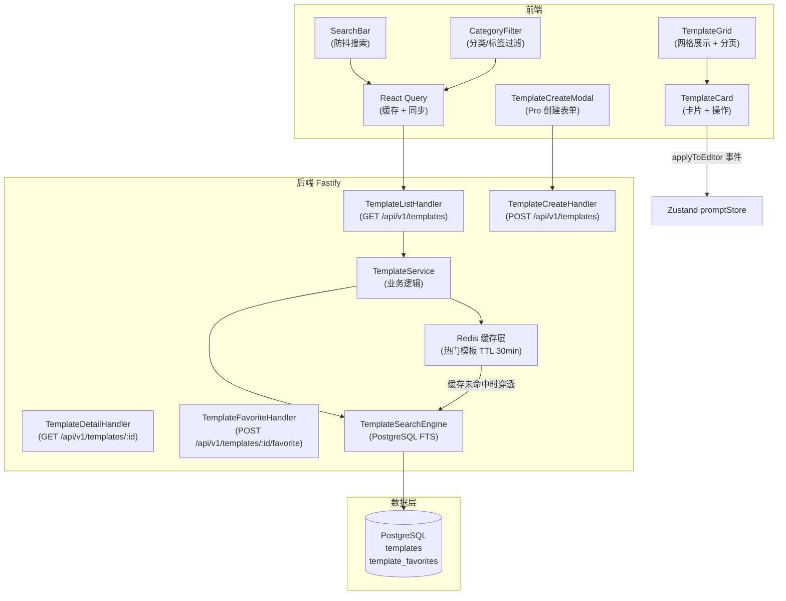

# Seedance Prompt Studio — 模板库（template-library）模块架构设计文档

> **版本**：v1.0.0
> **架构师**：Architect Agent
> **创建日期**：2026-04-12
> **最后更新**：2026-04-12
> **状态**：评审中
> **模块标识**：`template-library`
> **关联 Module PRD**：`modules/prd-template-library.md` v1.0.0
> **关联主架构文档**：`architecture-seedance-prompt.md` v1.0.0

---

## 0. 关联文档

| 文档 | 路径 | 说明 |
| ---- | ---- | ---- |
| 主架构文档 | `architecture-seedance-prompt.md` | 跨模块架构总纲、部署、安全、公共能力 |
| 模块 PRD | `modules/prd-template-library.md` | 模块需求、用户故事、验收标准 |
| 相关原型 | `wireframes/template-library-browse.html` | 模板库浏览页低保真原型 |

---

## 1. 模块定位

### 1.1 模块概述

模板库模块为创作者提供官方精选提示词模板的浏览、搜索和应用能力，同时允许 Pro 用户创建自己的私有/公开模板。模块的核心价值是降低新用户上手门槛（一键应用官方模板），并为高频用户提供可复用的品牌提示词资产。

作为 SEO 核心页面，模板库走 ISR 渲染策略，公共模板列表由 Cloudflare CDN 缓存，缓存命中时延 < 50ms。

### 1.2 设计目标

| 目标 | 描述 | 衡量标准 |
| ---- | ---- | -------- |
| 模板发现效率 | 用户 3 次点击内找到目标模板并应用 | 用户行为埋点分析 |
| 列表页低延迟 | 模板列表 CDN 缓存命中时 P95 ≤ 200ms | Vercel Analytics 监控 |
| 全文搜索响应 | 关键词搜索 P95 ≤ 500ms | k6 压测 |

### 1.3 范围与边界

| 范围 | 包含 | 不包含 |
| ---- | ---- | ------ |
| 浏览功能域 | 分类导航、官方模板展示、收藏状态展示 | 用户生成内容（UGC）审核（外部服务）|
| 搜索功能域 | 关键词全文搜索（PostgreSQL FTS）、分类过滤、标签过滤 | 语义搜索 / Embedding（v1.1 迭代）|
| 模板管理域（Pro）| 创建私有模板、设置公开/私有、删除自己的模板 | 版权保护、模板付费授权 |
| 收藏功能域 | 收藏/取消收藏、我的收藏列表 | 收藏夹分组管理（v1.1 迭代）|

### 1.4 需求追溯矩阵

| Module PRD 需求编号 | 需求描述 | 优先级 | 对应组件/服务 | 对应 API | 对应数据对象 |
| ------------------- | -------- | ------ | ------------- | -------- | ------------ |
| US-tl-001 | 浏览官方精选模板（分类/搜索）| P1 | `TemplateGrid` + `TemplateService.list()` | `GET /api/v1/templates` | `templates` |
| US-tl-002 | 一键应用模板到编辑器 | P1 | `TemplateCard.applyToEditor()` | N/A（前端事件）| `templates.content_json` |
| US-tl-003 | 创建用户私有/公开模板（Pro）| P1 | `TemplateCreateModal` + `TemplateService.create()` | `POST /api/v1/templates` | `templates` |
| US-tl-004 | 搜索与收藏模板 | P1 | `SearchBar` + `FavoriteButton` + `TemplateService` | `GET /api/v1/templates?q=...` + `POST /api/v1/templates/:id/favorite` | `templates`, `template_favorites` |

---

## 2. 模块架构设计

### 2.1 模块组件与职责

| 组件/服务 | 职责 | 输入 | 输出 | 依赖 |
| --------- | ---- | ---- | ---- | ---- |
| `TemplateGrid`（前端）| 模板卡片网格展示、分页加载 | 模板列表数据 | 渲染模板卡片网格 | React Query |
| `TemplateCard`（前端）| 单模板展示、预览、应用/收藏操作 | 单条模板数据 | 操作事件（apply/favorite）| Zustand store |
| `SearchBar`（前端）| 关键词输入、防抖搜索触发 | 用户输入 | 触发 React Query 搜索 | React Query（debounce 300ms）|
| `CategoryFilter`（前端）| 分类/标签筛选器 | 用户选择 | 更新查询参数 | URL 搜索参数 |
| `TemplateCreateModal`（前端）| Pro 用户创建模板表单 | 表单数据 | 调用创建 API | React Hook Form |
| `TemplateService`（后端）| 模板 CRUD、搜索、收藏、缓存管理 | REST 请求 | JSON 响应 | PostgreSQL, Redis |
| `TemplateSearchEngine`（后端）| PostgreSQL 全文搜索（FTS）| 关键词 + 过滤条件 | 分页结果 | PostgreSQL `tsvector` |

### 2.2 模块内部架构图



### 2.3 前端路由与组件

| 页面/路由 | 核心组件 | 状态管理 | 原型来源 | 说明 |
| --------- | -------- | -------- | -------- | ---- |
| `/templates` | `TemplateGrid` + `SearchBar` + `CategoryFilter` | URL 搜索参数（`?category=&q=&page=`）+ React Query | `template-library-browse.html` | ISR（每 1h 重建）；登录后显示收藏状态 |
| `/templates/[id]` | `TemplateDetail` + `TemplateApplyButton` | React Query（单条模板缓存）| — | ISR；包含完整提示词内容预览 |

**ISR 策略**：
- `/templates` 页：`revalidate: 3600`（每小时重建），官方模板更新频率低
- `/templates/[id]` 页：`revalidate: 3600`
- 用户创建/删除模板时通过 `revalidatePath('/templates')` 按需触发重建（Next.js 15 On-Demand ISR）

### 2.4 后端服务与处理流

| 场景 | 入口 API | 核心处理步骤 | 结果 |
| ---- | -------- | ------------ | ---- |
| 分类浏览模板 | `GET /api/v1/templates?category=cinematic&page=1&limit=20` | 1.解析查询参数 → 2.Redis 缓存 Key 生成（`tpl:list:{hash}`）→ 3.缓存命中直接返回 → 4.缓存未命中走 DB 查询 → 5.写入 Redis（TTL 30min）→ 6.返回分页结果 | JSON 分页 |
| 关键词搜索 | `GET /api/v1/templates?q=赛博朋克` | 1.Zod 校验（q 长度 1-50 字）→ 2.构建 `to_tsquery` 表达式 → 3.PostgreSQL FTS 查询（按相关度排序）→ 4.结果不缓存（搜索多样性）→ 5.返回结果 | JSON 分页 |
| Pro 用户创建模板 | `POST /api/v1/templates` | 1.JWT 验证 + Pro 计划检查 → 2.Zod 校验表单 → 3.INSERT `templates` → 4.清除列表缓存（`DEL tpl:list:*` 模式）→ 5.可选触发 `/templates` 按需 ISR 重建 | 201 Created |
| 收藏/取消收藏 | `POST /api/v1/templates/:id/favorite` | 1.JWT 验证 → 2.检查 `template_favorites` 记录 → 3.不存在则 INSERT（收藏）→ 4.存在则 DELETE（取消）→ 5.UPDATE `templates.like_count` | 200 OK，返回最新收藏状态 |

---

## 3. 数据模型设计

### 3.1 核心实体关系图

```mermaid
erDiagram
    users ||--o{ templates : "创建"
    users ||--o{ template_favorites : "收藏"
    templates ||--o{ template_favorites : "被收藏"

    users {
        uuid id PK
        varchar plan "free|pro"
    }

    templates {
        uuid id PK
        uuid author_id FK
        varchar title
        text description
        varchar category
        varchar[] tags
        jsonb content_json
        boolean is_official
        boolean is_public
        int like_count
        int use_count
        tsvector search_vector "GIN 索引，FTS 字段"
        timestamptz created_at
        timestamptz updated_at
    }

    template_favorites {
        uuid user_id PK FK
        uuid template_id PK FK
        timestamptz created_at
    }
```

**`content_json` 结构**（与 `prompts.output_json` 一致，共享 `SixDimOutput` 类型）：

```typescript
interface TemplateContent extends SixDimOutput {
  previewDescription: string;   // 模板效果文字描述（用于卡片展示）
  exampleVideoUrl?: string;     // 官方模板示例视频 URL（可选）
  variablePlaceholders?: string[]; // 如 ["{{产品名}}", "{{场景}}"]（Pro 功能）
}
```

### 3.2 关键数据对象

| 数据对象 | 类型 | 关键字段 | 用途 | 生命周期 |
| -------- | ---- | -------- | ---- | -------- |
| `templates` | PostgreSQL 表 | `is_official`, `is_public`, `search_vector` (FTS) | 官方模板 + 用户公开模板 | 官方模板由运营手动管理；用户模板在账户删除时级联删除 |
| `template_favorites` | PostgreSQL 关联表 | `(user_id, template_id)` 复合 PK | 用户收藏状态 | 用户账户删除时级联删除 |
| 模板列表缓存 | Redis Hash | key: `tpl:list:{queryHash}`, TTL: 30min | 热门模板分页缓存 | 创建/删除模板时主动清除；按时间自然过期 |
| 热门官方模板 | Redis Key | `tpl:official:top50` | 首页官方推荐 | TTL 1h；后台任务定时刷新 |

### 3.3 索引与一致性策略

| 场景 | 策略 | 说明 |
| ---- | ---- | ---- |
| 分类浏览 | `(is_public, category, created_at DESC)` 复合索引 | 支持按分类分页查询 |
| 全文搜索 | `GIN index on search_vector`（`tsvector`）| PostgreSQL FTS，支持中英文分词 |
| 用户模板查询 | `(author_id, created_at DESC)` 索引 | 支持「我的模板」列表 |
| like_count 一致性 | 先写 DB（INSERT favorites），再 UPDATE like_count；不用事务（最终一致性可接受）| 收藏数可存在 ±1 的短暂误差 |

**全文搜索实现**：

```sql
-- 创建 search_vector 字段（中英文加权）
ALTER TABLE templates ADD COLUMN search_vector tsvector;
CREATE INDEX templates_fts_idx ON templates USING GIN (search_vector);

-- 触发器自动更新（title × A 权重，description × B 权重，tags × C 权重）
CREATE TRIGGER templates_search_update
  BEFORE INSERT OR UPDATE ON templates
  FOR EACH ROW EXECUTE FUNCTION
  tsvector_update_trigger(search_vector, 'pg_catalog.english', title, description);
```

---

## 4. API 设计

### 4.1 接口清单

| 接口 | 方法 | 说明 | 请求摘要 | 响应摘要 | 鉴权 |
| ---- | ---- | ---- | -------- | -------- | ---- |
| `/api/v1/templates` | GET | 模板列表（分类/搜索/分页）| `?category&q&page&limit&sort` | `{data: Template[], meta: Pagination}` | 否（公开）|
| `/api/v1/templates/:id` | GET | 模板详情 | — | `{data: TemplateDetail}` | 否（公开）|
| `/api/v1/templates` | POST | 创建用户模板（Pro）| `{title, description, category, tags, content_json, is_public}` | `{data: Template}` | 是（Pro 计划）|
| `/api/v1/templates/:id` | DELETE | 删除自己的模板 | — | `{success: true}` | 是（仅作者）|
| `/api/v1/templates/:id/favorite` | POST | 收藏/取消收藏（Toggle）| — | `{favorited: boolean, likeCount: number}` | 是 |
| `/api/v1/templates/me/favorites` | GET | 我的收藏列表 | `?page&limit` | `{data: Template[], meta: Pagination}` | 是 |

**查询参数规范**（`GET /api/v1/templates`）：

```typescript
interface TemplateListQuery {
  category?: 'cinematic' | 'product' | 'anime' | 'cyberpunk' | 'nature' | 'abstract';
  q?: string;           // 关键词（1-50 字）
  page?: number;        // 默认 1
  limit?: number;       // 默认 20，最大 50
  sort?: 'latest' | 'popular' | 'relevance';  // relevance 仅搜索时有效
  official?: boolean;   // true=仅官方模板
}
```

### 4.2 错误处理与幂等

| 场景 | 错误码/状态码 | 幂等策略 | 说明 |
| ---- | ------------- | -------- | ---- |
| 非 Pro 用户创建模板 | `403 PLAN_REQUIRED` | — | 返回升级引导信息 |
| 删除他人模板 | `403 FORBIDDEN` | — | 服务端强制校验 `author_id = userId` |
| 收藏重复操作 | 200 OK（幂等操作）| 重复收藏返回当前状态不报错 | Toggle 语义 |
| 搜索词过短 | `400 BAD_REQUEST` | — | `q` 至少 1 字符 |

---

## 5. 模块间接口与依赖

| 调用方模块 | 被调用方模块 | 接口 / 数据结构 | 同步/异步 | 测试优先级 | 测试策略 | 说明 |
| ---------- | ------------ | --------------- | --------- | ---------- | -------- | ---- |
| `template-library`（前端）| `prompt-optimizer`（前端）| 前端事件：`applyTemplate(content_json)` → 填充 `PromptInputPanel` | 同步（事件总线）| P1 | 组件集成测试（Testing Library）| 应用模板后编辑器内容应被正确填充 |
| `template-library` | `user-system` | `users.plan` 字段（Pro 计划检查）| 同步（中间件查询）| P1 | 单元测试（mock plan 字段）| 非 Pro 用户尝试创建模板时返回 403 |

### 5.1 外部依赖

| 依赖项 | 类型 | 用途 | 降级策略 |
| ------ | ---- | ---- | -------- |
| PostgreSQL FTS | 内部基础设施 | 模板全文搜索 | 无降级（FTS 是 PostgreSQL 内置能力，不需外部依赖）|
| Redis (Upstash) | 内部基础设施 | 模板列表缓存 + 热门模板缓存 | 缓存不可用时直接查 DB（性能下降但功能正常）|
| Cloudflare CDN / Vercel Edge | 内部基础设施 | ISR 页面缓存（`/templates`, `/templates/[id]`）| CDN 失效时请求穿透到 Vercel SSR |

### 5.2 集成与契约测试设计

| 接口 | 对端模块 | 契约工具 | Mock 策略 | 关键测试场景 | 关联 Module PRD TC 编号 |
| ---- | -------- | -------- | --------- | ------------ | ---------------------- |
| `GET /api/v1/templates` | 浏览器/CDN | Fastify inject + Testcontainers | PostgreSQL 种子数据（官方模板10条）| 分类过滤返回正确结果；搜索返回相关模板 | TC-TL-001, TC-TL-002 |
| `POST /api/v1/templates/:id/favorite` | 认证用户 | Fastify inject | Mock JWT + Mock DB | 收藏成功；重复收藏幂等；未登录 401 | TC-TL-004 |
| 模板应用事件 | `prompt-optimizer` 前端 | Testing Library | Mock promptStore | 点击应用后编辑器内容等于模板 rawText | TC-TL-003 |

---

## 6. 非功能与安全

### 6.1 性能与容量

| 指标 | 目标值 | 推导依据 | 设计方案 |
| ---- | ------ | -------- | -------- |
| 模板列表（缓存命中）| P95 ≤ 200ms | Redis Hash 读取 < 2ms + 序列化 < 10ms | Redis list cache（TTL 30min）|
| 模板列表（缓存未命中）| P95 ≤ 500ms | PostgreSQL 索引扫描 20 条约 5-20ms | 复合索引 `(is_public, category, created_at)` |
| 全文搜索响应 | P95 ≤ 500ms | GIN 索引全文搜索约 10-50ms | GIN 索引 + 结果 limit 20 |
| CDN 缓存命中 | P95 ≤ 50ms | Cloudflare 边缘节点延迟 | ISR 页面由 CDN 缓存 |

### 6.2 安全控制

| 控制项 | 方案 | 覆盖风险 |
| ------ | ---- | -------- |
| 用户模板归属验证 | 所有写操作服务端校验 `author_id = req.userId` | 越权删除/修改他人模板（BOLA）|
| 模板内容 XSS | 模板内容渲染前经 DOMPurify 净化（前端）| 官方模板内容 XSS 注入 |
| 搜索词注入 | Drizzle ORM 参数化查询；`to_tsquery` 特殊字符过滤 | SQL 注入 + PostgreSQL FTS 查询注入 |
| 创建频率限制 | 用户每日最多创建 10 个模板（Redis 计数）| 垃圾数据刷库 |

---

## 7. 风险与演进

| 风险/债务 | 影响 | 应对策略 | 触发条件 |
| --------- | ---- | -------- | -------- |
| PostgreSQL FTS 中文分词效果差 | 搜索召回率低 | 引入 `zhparser` + `pg_jieba` 中文分词扩展（Railway 镜像自定义）；MVP 阶段英文搜索为主 | 中文搜索 NPS < 为差评主因 |
| 用户 UGC 模板质量问题 | 平台内容质量下降 | MVP 阶段 Pro 功能审核后发布（人工审核）；后期引入 LLM 自动内容审核 | 公开模板 > 100 条 |
| 收藏数最终一致性误差 | 展示略不准确 | 接受 ±1 误差；高精度场景改用 DB 事务（触发条件达到时）| 投诉收藏数显示不正确 |
| 热门模板缓存穿透 | 缓存失效时 DB 压力突增 | 布隆过滤器防穿透（扩展阶段）；当前 TTL 30min 足够 | 并发 > 500 QPS |

---

## 8. 关联与回填检查

| 检查项 | 状态 | 说明 |
| ------ | ---- | ---- |
| 文档头已关联 Module PRD 版本 | ✅ | `modules/prd-template-library.md` v1.0.0 |
| 文档头已关联主架构版本 | ✅ | `architecture-seedance-prompt.md` v1.0.0 |
| Module PRD 「关联架构文档」已更新 | ✅ | `prd-template-library.md` 文档头已更新 |
| Module PRD §6.3 技术参考已回填 | ✅ | 数据模型、API 端点摘要已回填 |

---

## 9. 变更记录

| 版本 | 日期 | 作者 | 变更类型 | 变更摘要 |
| ---- | ---- | ---- | -------- | -------- |
| v1.0.0 | 2026-04-12 | Architect Agent | Initial | 首次生成 template-library 模块架构文档 |
