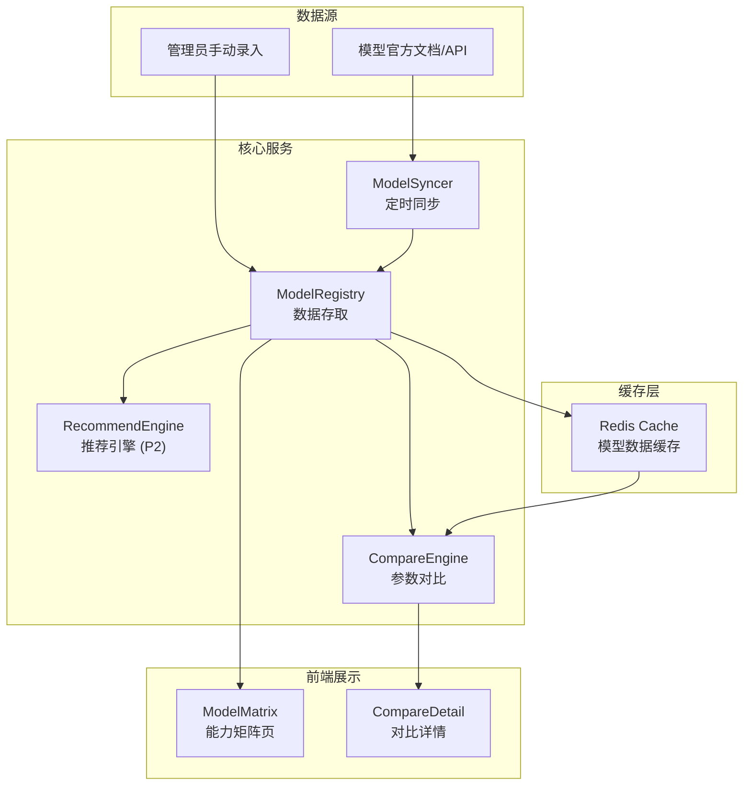
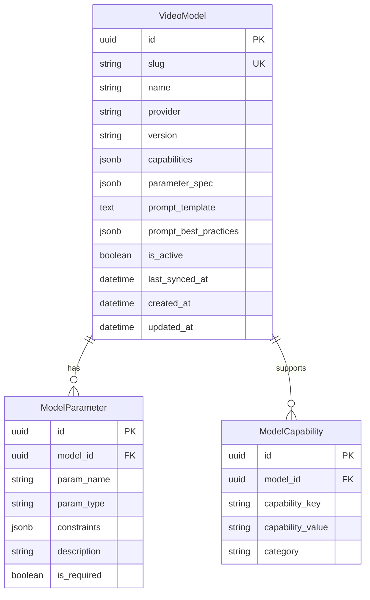

# VideoPrompt AI — 模型对比 (model-comparison) 模块架构设计文档

> **版本**：v1.0.0
> **创建日期**：2026-04-11
> **最后更新**：2026-04-11
> **状态**：草稿
> **关联主架构文档**：[`architecture-videoprompt-ai.md`](architecture-videoprompt-ai.md) v1.0.0
> **关联 Module PRD**：[`modules/prd-model-comparison.md`](modules/prd-model-comparison.md)

---

## 0. 模块概述

| 属性 | 值 |
| ---- | -- |
| 模块名称 | model-comparison (模型对比) |
| 优先级 | P1 |
| 功能点数 | 3（模型能力矩阵、参数规格对比、模型推荐引擎） |
| 核心验收标准 | 覆盖 ≥ 3 款主流模型、参数数据准确率 100%、推荐算法准确率 ≥ 80% (P2) |

---

## 1. 模块定位

### 1.1 模块目标

维护视频大模型的参数能力知识库（Model Registry），为用户提供可视化的模型能力对比矩阵，同时作为 prompt-converter 和 prompt-generator 的基础数据源，抽象模型差异、支持可插拔式新模型接入。

### 1.2 职责边界

| 包含 | 不包含 |
| ---- | ------ |
| 模型参数与能力数据维护 (Model Registry) | 提示词转换/生成（由其他模块负责） |
| 模型能力矩阵展示和多模型对比 | 用户认证/配额（由 user-center 负责） |
| 模型推荐引擎 (P2) | 模型 API 调用/视频生成 |
| 新模型接入配置管理 | — |

### 1.3 需求追溯

| PRD 功能需求 | 优先级 | 对应组件 | 对应 API |
| ------------ | ------ | -------- | -------- |
| F-MC-1 模型能力矩阵 | P1 | ModelRegistry + MatrixView | `GET /api/v1/models` |
| F-MC-2 参数规格对比 | P1 | CompareEngine | `POST /api/v1/models/compare` |
| F-MC-3 模型推荐引擎 | P2 | RecommendEngine | `POST /api/v1/models/recommend` |

---

## 2. 模块架构设计

### 2.1 核心组件

| 组件 | 职责 | 技术方案 |
| ---- | ---- | -------- |
| ModelRegistry | 存储和管理各模型的参数规范、能力标签、prompt 模板 | PostgreSQL JSONB + Redis 缓存（热数据） |
| CompareEngine | 接收多个模型 ID，横向对比参数差异并生成对比报表 | 结构化对比（字段对齐）+ 差异标记 |
| RecommendEngine (P2) | 基于用户输入/历史偏好推荐最佳模型 | 规则评分（P2 初版）→ ML 模型（P3） |
| ModelSyncer | 定期从模型官方文档/API 抓取最新参数并更新 Registry | 定时任务（Cron/Celery Beat），手动触发兜底 |

### 2.2 模块内部架构图



### 2.3 前端路由与组件

| 路由 | 页面组件 | 渲染模式 | 说明 |
| ---- | -------- | -------- | ---- |
| `/models` | `ModelMatrixPage` | SSR | SEO 友好，展示所有模型能力矩阵 |
| `/models/compare?ids=a,b,c` | `ModelComparePage` | CSR | 动态对比，最多选 4 个模型 |

**关键前端组件**：

| 组件 | 职责 | 来源 |
| ---- | ---- | ---- |
| `ModelCard` | 单个模型卡片（Logo + 核心参数） | 自定义 |
| `CapabilityMatrix` | 模型能力矩阵表格（行=参数，列=模型） | shadcn/ui Table |
| `CompareSelector` | 模型多选器（最多 4 个） | shadcn/ui Combobox |
| `ParamDiffHighlight` | 参数差异高亮标记 | 自定义 |
| `ModelBadge` | 模型标签（分辨率/帧率/时长等） | shadcn/ui Badge |

### 2.4 Model Registry 数据结构

每个视频大模型在 Registry 中存储以下结构化信息：

```json
{
  "slug": "runway-gen4",
  "name": "Runway Gen-4",
  "provider": "Runway",
  "version": "Gen-4 Turbo",
  "capabilities": {
    "max_resolution": "4K",
    "max_duration": "16s",
    "fps_options": [24, 30],
    "aspect_ratios": ["16:9", "9:16", "1:1"],
    "camera_motions": ["pan", "tilt", "zoom", "orbit", "static"],
    "style_controls": true,
    "image_to_video": true,
    "text_to_video": true
  },
  "parameter_spec": {
    "prompt": { "type": "string", "max_length": 2048, "required": true },
    "duration": { "type": "enum", "values": ["5s", "10s", "16s"], "default": "5s" },
    "aspect_ratio": { "type": "enum", "values": ["16:9", "9:16", "1:1"], "default": "16:9" },
    "camera_motion": { "type": "string", "description": "Free-form camera instruction" }
  },
  "prompt_template": "{{scene_description}}, {{camera_motion}}, {{style}}, {{duration}}",
  "prompt_best_practices": [
    "Use vivid, descriptive language",
    "Specify camera motion explicitly",
    "Include lighting and mood descriptors"
  ],
  "is_active": true,
  "last_synced_at": "2026-04-10T00:00:00Z"
}
```

---

## 3. 数据模型设计

### 3.1 模块 ER 图



### 3.2 索引策略

- `idx_model_slug`: UNIQUE (slug) — 按 slug 快速查找
- `idx_model_active`: (is_active) WHERE is_active = true — 仅查询激活模型
- `idx_param_model`: (model_id) — 按模型查参数
- `idx_cap_model_cat`: (model_id, category) — 按模型 + 类别查能力

### 3.3 缓存策略

```text
Redis Key: model:registry:{slug}
Redis Value: 完整 JSON 模型数据
TTL: 3600s (1h) — 模型数据变更频率低

Redis Key: model:list:active
Redis Value: 所有激活模型的 slug 列表
TTL: 1800s (30min)
```

---

## 4. API 设计

### 4.1 接口列表

#### GET `/api/v1/models`

**描述**：获取所有激活模型的能力矩阵

| 参数 | 位置 | 类型 | 必填 | 说明 |
| ---- | ---- | ---- | ---- | ---- |
| `category` | query | string | 否 | 按能力类别筛选（resolution/duration/style） |

**响应摘要**：

```json
{
  "code": 0,
  "data": {
    "models": [
      { "slug": "runway-gen4", "name": "Runway Gen-4", "capabilities": {...} },
      { "slug": "kling-ai", "name": "Kling AI", "capabilities": {...} }
    ],
    "total": 3
  }
}
```

#### POST `/api/v1/models/compare`

**描述**：对比 2-4 个模型的参数规格

| 参数 | 位置 | 类型 | 必填 | 说明 |
| ---- | ---- | ---- | ---- | ---- |
| `model_slugs` | body | string[] | 是 | 模型 slug 数组（2-4 个） |

**响应摘要**：

```json
{
  "code": 0,
  "data": {
    "models": ["runway-gen4", "kling-ai"],
    "comparison": {
      "max_resolution": { "runway-gen4": "4K", "kling-ai": "1080p" },
      "max_duration": { "runway-gen4": "16s", "kling-ai": "10s" },
      "camera_motions": { "runway-gen4": ["pan","tilt","zoom"], "kling-ai": ["pan","zoom"] }
    },
    "advantages": {
      "runway-gen4": ["更高分辨率", "更丰富运镜"],
      "kling-ai": ["更快生成速度"]
    }
  }
}
```

#### POST `/api/v1/models/recommend` (P2)

**描述**：根据用户需求推荐最佳模型

| 参数 | 位置 | 类型 | 必填 | 说明 |
| ---- | ---- | ---- | ---- | ---- |
| `requirements` | body | object | 是 | 用户需求（分辨率/时长/风格等偏好） |

### 4.2 错误码

| HTTP 状态 | 业务码 | 描述 |
| --------- | ------ | ---- |
| 400 | 40020 | 对比模型数量超范围（< 2 或 > 4） |
| 404 | 40421 | 模型 slug 不存在 |
| 500 | 50020 | 模型数据同步失败 |

---

## 5. 模块间接口与依赖

### 5.1 依赖关系

本模块为**基础数据模块**，不依赖其他业务模块。

| 依赖 | 类型 | 说明 |
| ---- | ---- | ---- |
| PostgreSQL | 基础设施 | 数据存储 |
| Redis | 基础设施 | 缓存 |
| 模型官方文档/API | 外部 | ModelSyncer 数据源 |

### 5.2 被依赖关系

| 被依赖方 | 接口方式 | 场景 |
| -------- | -------- | ---- |
| prompt-converter | Python 函数调用 `ModelRegistry.get_model_specs(slug)` | 获取参数规范和 prompt 模板 |
| prompt-generator | Python 函数调用 `ModelRegistry.get_model_specs(slug)` | 同上 |
| 前端 ModelSelector | REST API `GET /api/v1/models` | 模型选择下拉框数据 |

### 5.3 测试策略

| 测试类型 | 方式 | 说明 |
| -------- | ---- | ---- |
| 单元测试 | pytest | CompareEngine 对比逻辑、RecommendEngine 评分规则 |
| 集成测试 | Testcontainers + Seed | Registry CRUD + 缓存一致性 |
| 数据验证 | 自定义校验脚本 | 验证 model_spec JSON schema 完整性 |

---

## 6. 非功能与安全

### 6.1 性能要求

| 指标 | 目标值 | 说明 |
| ---- | ------ | ---- |
| GET /models P95 | ≤ 200ms | Redis 缓存命中 |
| POST /models/compare P95 | ≤ 300ms | 内存计算 |
| 首屏 SSR /models | ≤ 1.5s | ISR 增量静态再生成 |

### 6.2 安全要求

- **只读公开**：models 和 compare 接口无需认证，但有 IP 级限流（100 次/分钟）
- **管理员保护**：模型数据增删改仅限 admin 角色
- **数据完整性**：ModelSyncer 更新前校验 JSON schema，防止写入格式破损的数据

---

## 7. 风险与演进

| 风险 | 应对 |
| ---- | ---- |
| 模型官方 API 变更导致同步失败 | 告警 + 手动兜底 + 变更监控 |
| 模型数量增长后对比计算复杂度上升 | 限制同时对比 ≤ 4 个 + 预计算对比矩阵 |

**演进规划**：

- Phase 1 (MVP)：手动维护 3 款模型数据，Registry 配置化
- Phase 2：ModelSyncer 自动同步，扩展至 8+ 模型
- Phase 3：推荐引擎上线 (P2)，基于用户历史学习偏好

---

## 8. 关联与回填检查

- [x] 关联 Module PRD 已标注
- [x] 关联主架构文档已标注
- [ ] Module PRD §6.3 技术参考已回填（待步骤 10）

---

## 9. 变更记录

| 版本 | 日期 | 变更类型 | 变更摘要 |
| ---- | ---- | -------- | -------- |
| v1.0.0 | 2026-04-11 | 初始版本 | 首版：ModelRegistry + CompareEngine + RecommendEngine(P2) + ModelSyncer；SSR 能力矩阵页 + 对比详情页 |
