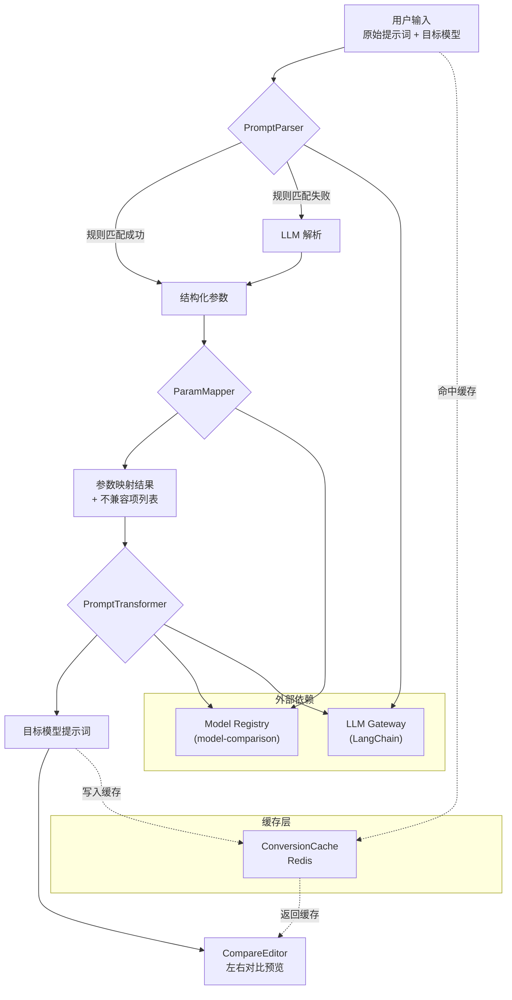
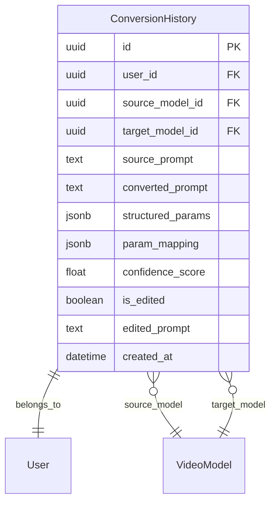

# VideoPrompt AI — 提示词转换 (prompt-converter) 模块架构设计文档

> **版本**：v1.0.0
> **创建日期**：2026-04-11
> **最后更新**：2026-04-11
> **状态**：草稿
> **关联主架构文档**：[`architecture-videoprompt-ai.md`](architecture-videoprompt-ai.md) v1.0.0
> **关联 Module PRD**：[`modules/prd-prompt-converter.md`](modules/prd-prompt-converter.md)

---

## 0. 模块概述

| 属性 | 值 |
| ---- | -- |
| 模块名称 | prompt-converter (提示词转换) |
| 优先级 | P0 |
| 功能点数 | 4（智能提示词解析、跨模型格式转换、参数自动映射、转换结果预览与编辑） |
| 用户故事数 | 5 (US-prompt-converter-001 ~ 005) |
| 核心验收标准 | 转换准确率 ≥ 85%、P95 ≤ 3s、支持 ≥ 3 个主流视频模型 |

---

## 1. 模块定位

### 1.1 模块目标

提供跨视频大模型的提示词智能转换能力，用户输入一个模型的提示词后，系统自动识别来源模型、解析结构化参数，并转换为目标模型的格式，实现"一次编写，多模型适配"。

### 1.2 职责边界

| 包含 | 不包含 |
| ---- | ------ |
| 提示词源模型自动识别 | 视频生成（由外部模型平台负责） |
| 结构化解析（参数提取） | 模型参数维护（由 model-comparison 模块负责） |
| 跨模型格式转换 | 用户认证/配额控制（由 user-center 模块负责） |
| 参数差异映射与补全建议 | 自然语言转提示词（由 prompt-generator 模块负责） |
| 左右对比预览与手动编辑 | — |

### 1.3 需求追溯

| PRD 功能需求 | 优先级 | 对应组件 | 对应 API |
| ------------ | ------ | -------- | -------- |
| F-PC-1 智能提示词解析 | P0 | PromptParser | `POST /api/v1/prompts/parse` |
| F-PC-2 跨模型格式转换 | P0 | PromptTransformer | `POST /api/v1/prompts/convert` |
| F-PC-3 参数自动映射 | P0 | ParamMapper | 内嵌于转换流程 |
| F-PC-4 转换结果预览与编辑 | P1 | 前端 CompareEditor 组件 | — |

---

## 2. 模块架构设计

### 2.1 核心组件

| 组件 | 职责 | 技术方案 |
| ---- | ---- | -------- |
| PromptParser | 接收原始提示词文本，识别来源模型，提取结构化参数 | LLM (GPT-4o) + 正则规则引擎混合；先规则匹配已知格式，失败后 fallback LLM |
| PromptTransformer | 将解析后的结构化参数按目标模型规范重组为新的提示词 | LLM 改写 + 模板拼接；基于 Model Registry 的 prompt template |
| ParamMapper | 处理模型间参数差异的映射/补全/丢弃逻辑 | 静态映射表（Model Registry）+ LLM 推理补全 |
| ConversionCache | 缓存相同输入的转换结果 | Redis Hash，key = hash(source_prompt + source_model + target_model)，TTL 24h |

### 2.2 模块内部架构图



### 2.3 前端路由与组件

| 路由 | 页面组件 | 说明 |
| ---- | -------- | ---- |
| `/` | `ConverterHome` | 转换入口页：输入文本框 + 源模型自动识别 + 目标模型选择 |
| `/convert/result` | `ConvertResult` | 结果页：左（原始）右（转换后）对比 + 参数差异 + 编辑器 |

**关键前端组件**：

| 组件 | 职责 | 来源 |
| ---- | ---- | ---- |
| `PromptInput` | 多行文本框 + 字数统计 + 粘贴检测 | 自定义 |
| `ModelSelector` | 目标模型下拉（数据来自 Model Registry API） | shadcn/ui Select |
| `CompareEditor` | 左右分栏对比 + 高亮差异 + 手动编辑 | 自定义 + Monaco 精简版 |
| `ParamDiffTable` | 表格展示参数映射差异 | shadcn/ui Table |
| `ConvertButton` | 转换操作按钮 + Loading 状态 | shadcn/ui Button |

### 2.4 后端服务流程

```text
POST /api/v1/prompts/convert

1. Auth 中间件：验证 JWT → 获取 user_id
2. RateLimit 中间件：检查用户配额（Redis 计数器）
3. 缓存查询：Redis Hash 查找 cached_result
4. PromptParser.parse(source_prompt)
   4a. 尝试规则引擎匹配（regex patterns per model）
   4b. 未匹配 → 调用 LLM 识别 source_model + 提取 structured_params
5. ParamMapper.map(structured_params, source_model, target_model)
   5a. 查询 Model Registry 获取两个模型的 parameter_spec
   5b. 静态映射已知参数
   5c. LLM 推理补全缺失参数
   5d. 标记不兼容参数
6. PromptTransformer.transform(mapped_params, target_model)
   6a. 加载目标模型的 prompt_template
   6b. LLM 改写生成最终提示词
7. 写入 ConversionHistory（异步）
8. 写入缓存（Redis）
9. 返回：{ converted_prompt, param_diff, confidence_score, source_model_detected }
```

---

## 3. 数据模型设计

### 3.1 模块 ER 图



### 3.2 数据对象

| 字段 | 类型 | 说明 | 索引 |
| ---- | ---- | ---- | ---- |
| `id` | UUID | 主键 | PK |
| `user_id` | UUID | 用户外键 | INDEX |
| `source_model_id` | UUID | 来源模型外键 | INDEX |
| `target_model_id` | UUID | 目标模型外键 | INDEX |
| `source_prompt` | TEXT | 原始提示词 | — |
| `converted_prompt` | TEXT | 转换后提示词 | — |
| `structured_params` | JSONB | 解析后的结构化参数 | — |
| `param_mapping` | JSONB | 参数映射详情（含差异项） | — |
| `confidence_score` | FLOAT | 转换置信度 (0~1) | — |
| `is_edited` | BOOLEAN | 用户是否手动编辑 | — |
| `edited_prompt` | TEXT | 用户编辑后的版本（可选） | — |
| `created_at` | TIMESTAMP | 创建时间 | INDEX (DESC) |

**索引策略**：

- `idx_conversion_user_created`: (user_id, created_at DESC) — 用户历史查询
- `idx_conversion_models`: (source_model_id, target_model_id) — 按模型对统计

### 3.3 缓存数据结构

```text
Redis Key: conv:{md5(source_prompt + source_model_slug + target_model_slug)}
Redis Value: JSON { converted_prompt, param_mapping, confidence_score }
TTL: 86400s (24h)
```

---

## 4. API 设计

### 4.1 接口列表

#### POST `/api/v1/prompts/parse`

**描述**：解析输入提示词，自动识别来源模型和结构化参数

| 参数 | 位置 | 类型 | 必填 | 说明 |
| ---- | ---- | ---- | ---- | ---- |
| `source_prompt` | body | string | 是 | 原始提示词文本 |

**响应示例**：
```json
{
  "code": 0,
  "data": {
    "detected_model": "runway-gen4",
    "confidence": 0.92,
    "structured_params": {
      "scene_description": "A cat walking on the beach",
      "camera_motion": "slow zoom in",
      "duration": "5s",
      "aspect_ratio": "16:9"
    }
  }
}
```

#### POST `/api/v1/prompts/convert`

**描述**：将提示词从来源模型格式转换为目标模型格式

| 参数 | 位置 | 类型 | 必填 | 说明 |
| ---- | ---- | ---- | ---- | ---- |
| `source_prompt` | body | string | 是 | 原始提示词 |
| `source_model` | body | string | 否 | 来源模型 slug（不传则自动识别） |
| `target_model` | body | string | 是 | 目标模型 slug |

**响应示例**：
```json
{
  "code": 0,
  "data": {
    "converted_prompt": "Cinematic shot of a cat walking along...",
    "source_model_detected": "runway-gen4",
    "target_model": "kling-ai",
    "confidence_score": 0.88,
    "param_diff": {
      "mapped": [
        { "param": "duration", "source_value": "5s", "target_value": "5s", "status": "compatible" }
      ],
      "incompatible": [
        { "param": "camera_motion", "source_value": "slow zoom in", "suggestion": "Use motion_type: zoom, speed: 0.5" }
      ]
    }
  }
}
```

### 4.2 错误码

| HTTP 状态 | 业务码 | 描述 |
| --------- | ------ | ---- |
| 400 | 40001 | 输入提示词为空或超长（> 5000 字符） |
| 400 | 40002 | 无法识别来源模型 |
| 400 | 40003 | 目标模型不支持 |
| 429 | 42901 | 每日配额已用完 |
| 500 | 50001 | LLM 调用超时 |
| 503 | 50301 | LLM 服务不可用（已降级到备用模型） |

---

## 5. 模块间接口与依赖

### 5.1 依赖关系

| 依赖模块 | 接口/能力 | 调用方式 | 说明 |
| -------- | --------- | -------- | ---- |
| model-comparison | Model Registry：获取模型参数规范 (`get_model_specs`) | 内部 Python 函数调用 | 用于参数映射和 prompt 模板加载 |
| user-center | Auth 中间件：JWT 验证 + 配额检查 | HTTP 中间件（FastAPI Depends） | 每次 API 调用前验证身份和配额 |
| LLM Gateway | LangChain 调用 LLM | HTTP + Streaming | 提示词解析和转换 |

### 5.2 被依赖关系

| 被依赖方 | 场景 | 说明 |
| -------- | ---- | ---- |
| template-library | 转换结果可保存为模板 | 用户在 CompareEditor 中点击"保存为模板" |
| user-center | 转换历史写入 ConversionHistory | 异步写入，不影响响应延迟 |

### 5.3 集成/契约测试策略

| 被测接口 | 测试方式 | 说明 |
| -------- | -------- | ---- |
| Model Registry 调用 | 集成测试 + Mock | CI 中 Mock Model Registry，Staging 中真实调用 |
| LLM Gateway 调用 | 集成测试 + 录制回放 | 使用 VCR.py 录制 LLM 响应，CI 中回放以保证稳定性 |
| 缓存读写 | 集成测试 | Testcontainers 启动 Redis |

---

## 6. 非功能与安全

### 6.1 性能要求

| 指标 | 目标值 | 说明 |
| ---- | ------ | ---- |
| 转换 API P95 | ≤ 3s | 含 LLM 调用 |
| 缓存命中时 P95 | ≤ 200ms | 跳过 LLM |
| 解析 API P95 | ≤ 2s | 单步 LLM 调用 |

### 6.2 安全要求

- **输入消毒**：Pydantic 校验提示词长度（≤ 5000 字符），过滤特殊字符注入
- **Prompt 注入防护**：LLM 调用使用固定 system prompt + user 输入分层，禁止用户输入覆盖 system 指令
- **输出过滤**：LLM 返回结果经内容安全检查（敏感词过滤）

---

## 7. 风险与演进

| 风险 | 应对 |
| ---- | ---- |
| 新模型 prompt 格式解析失败 | 规则引擎兜底 + LLM fallback + 用户可手动指定来源模型 |
| LLM 转换准确率不达标 | 构建 per-model prompt template + 用户反馈标注 + 迭代优化 prompt |
| 缓存 key 碰撞（MD5） | 概率极低；可升级为 SHA256 |

**演进规划**：

- Phase 1 (MVP)：支持 3 款主流模型（Runway Gen-4, Kling AI, Veo 3），规则引擎 + LLM 混合
- Phase 2：扩展至 8+ 模型，引入用户反馈提升准确率
- Phase 3：批量转换、API 开放（B2B 场景）

---

## 8. 关联与回填检查

- [x] 关联 Module PRD 已标注：`modules/prd-prompt-converter.md`
- [x] 关联主架构文档已标注：`architecture-videoprompt-ai.md v1.0.0`
- [ ] Module PRD §6.3 技术参考已回填（待步骤 10）

---

## 9. 变更记录

| 版本 | 日期 | 变更类型 | 变更摘要 |
| ---- | ---- | -------- | -------- |
| v1.0.0 | 2026-04-11 | 初始版本 | 首版模块架构设计：4 组件（Parser/Transformer/Mapper/Cache）+ 2 API + Redis 缓存 + LLM 混合策略 |
