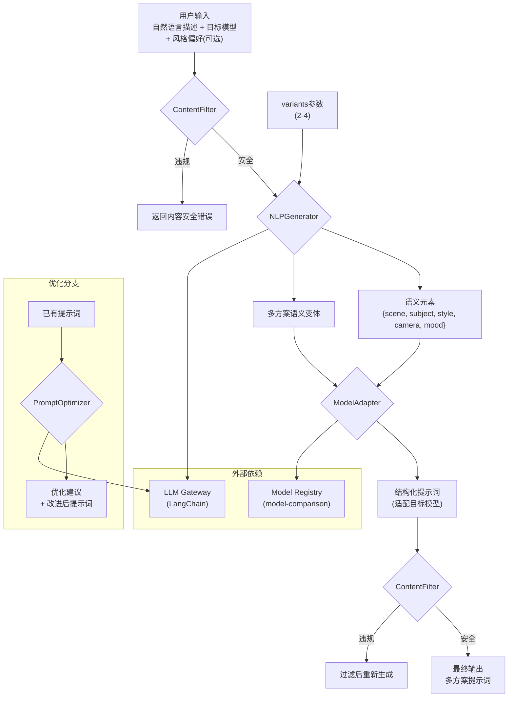
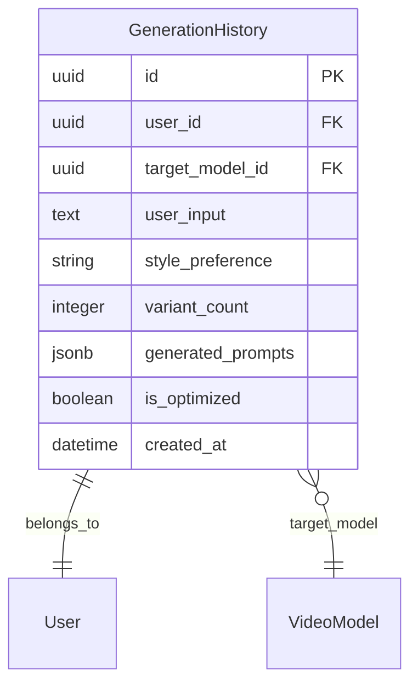

# VideoPrompt AI — 提示词生成 (prompt-generator) 模块架构设计文档

> **版本**：v1.0.0
> **创建日期**：2026-04-11
> **最后更新**：2026-04-11
> **状态**：草稿
> **关联主架构文档**：[`architecture-videoprompt-ai.md`](architecture-videoprompt-ai.md) v1.0.0
> **关联 Module PRD**：[`modules/prd-prompt-generator.md`](modules/prd-prompt-generator.md)

---

## 0. 模块概述

| 属性 | 值 |
| ---- | -- |
| 模块名称 | prompt-generator (提示词生成) |
| 优先级 | P0 |
| 功能点数 | 4（自然语言转提示词、目标模型选择与适配、提示词优化建议、多方案对比生成） |
| 用户故事数 | 4 (US-prompt-generator-001 ~ 004) |
| 核心验收标准 | 生成可用率 ≥ 90%、支持中英文输入、P95 ≤ 3s |

---

## 1. 模块定位

### 1.1 模块目标

让非专业用户通过自然语言描述即可生成专业级视频大模型提示词。系统基于 LLM 理解用户意图，结合目标模型参数规范，输出结构化、可直接使用的提示词，并提供多方案对比以满足不同创作风格。

### 1.2 职责边界

| 包含 | 不包含 |
| ---- | ------ |
| 自然语言理解与意图提取 | 已有提示词的跨模型转换（由 prompt-converter 负责） |
| 根据目标模型规范生成结构化提示词 | 模型参数维护（由 model-comparison 负责） |
| 多方案（2-4 个）风格变体生成 | 用户认证/配额控制（由 user-center 负责） |
| 基于最佳实践的优化建议 | 视频生成（由外部模型平台负责） |
| 内容安全过滤 | — |

### 1.3 需求追溯

| PRD 功能需求 | 优先级 | 对应组件 | 对应 API |
| ------------ | ------ | -------- | -------- |
| F-PG-1 自然语言转提示词 | P0 | NLPGenerator | `POST /api/v1/prompts/generate` |
| F-PG-2 目标模型选择与适配 | P0 | ModelAdapter | `POST /api/v1/prompts/generate` |
| F-PG-3 提示词优化建议 | P1 | PromptOptimizer | `POST /api/v1/prompts/optimize` |
| F-PG-4 多方案对比生成 | P1 | NLPGenerator (variants) | `POST /api/v1/prompts/generate` |

---

## 2. 模块架构设计

### 2.1 核心组件

| 组件 | 职责 | 技术方案 |
| ---- | ---- | -------- |
| NLPGenerator | 解析自然语言描述，提取场景/主体/风格/运镜等语义元素 | LLM (GPT-4o) + 结构化输出（JSON Mode） |
| ModelAdapter | 根据目标模型的参数规范，将语义元素适配为模型特定的提示词格式 | Model Registry 参数规范 + prompt 模板填充 |
| PromptOptimizer | 分析已有提示词，基于最佳实践给出优化建议 | LLM + 评分规则（清晰度/具体性/模型适配度） |
| ContentFilter | 输入输出内容安全检查 | 关键词黑名单 + LLM moderation API |

### 2.2 模块内部架构图



### 2.3 前端路由与组件

| 路由 | 页面组件 | 说明 |
| ---- | -------- | ---- |
| `/generate` | `GeneratorPage` | 生成入口：自然语言输入 + 模型选择 + 风格选项 + 方案数设置 |

**关键前端组件**：

| 组件 | 职责 | 来源 |
| ---- | ---- | ---- |
| `NLInput` | 自然语言输入框（支持中英文，带示例提示） | 自定义 |
| `ModelSelector` | 目标模型选择（复用 prompt-converter 组件） | shadcn/ui Select |
| `StyleSelector` | 风格偏好选择（电影感/动画/纪录片等） | shadcn/ui RadioGroup |
| `VariantSlider` | 方案数量选择 (2-4) | shadcn/ui Slider |
| `PromptCard` | 单个生成方案展示卡片（含复制/编辑/保存） | 自定义 |
| `PromptCardGrid` | 多方案网格对比布局 | 自定义 |
| `OptimizeTip` | 优化建议提示条 | shadcn/ui Alert |

### 2.4 后端服务流程

```text
POST /api/v1/prompts/generate

1. Auth 中间件：验证 JWT → 获取 user_id
2. RateLimit 中间件：检查配额
3. ContentFilter.check(user_input) → 内容安全校验
4. NLPGenerator.generate(user_input, target_model, style, variants)
   4a. 构建 system prompt（含模型上下文 + 输出 JSON schema）
   4b. 调用 LLM → 生成 N 个语义变体（JSON 结构化输出）
   4c. 解析 LLM 输出 → N 组 semantic_elements
5. ModelAdapter.adapt(semantic_elements[], target_model)
   5a. 查询 Model Registry → 获取 target_model 的 parameter_spec + prompt_template
   5b. 对每组 semantic_elements 填充 prompt_template → N 个 formatted_prompts
6. ContentFilter.check(formatted_prompts[]) → 输出安全校验
7. 写入 GenerationHistory（异步）
8. 返回：{ prompts: [{variant, prompt, highlight}], target_model, input_summary }
```

---

## 3. 数据模型设计

### 3.1 模块 ER 图



### 3.2 数据对象

| 字段 | 类型 | 说明 | 索引 |
| ---- | ---- | ---- | ---- |
| `id` | UUID | 主键 | PK |
| `user_id` | UUID | 用户外键 | INDEX |
| `target_model_id` | UUID | 目标模型外键 | INDEX |
| `user_input` | TEXT | 用户自然语言输入 | — |
| `style_preference` | VARCHAR(50) | 风格偏好 (cinematic/anime/documentary 等) | — |
| `variant_count` | INTEGER | 生成方案数量 (2-4) | — |
| `generated_prompts` | JSONB | 生成的多个方案 `[{variant, prompt, highlight}]` | — |
| `is_optimized` | BOOLEAN | 是否经过优化 | — |
| `created_at` | TIMESTAMP | 创建时间 | INDEX (DESC) |

---

## 4. API 设计

### 4.1 接口列表

#### POST `/api/v1/prompts/generate`

**描述**：根据自然语言描述生成适配目标模型的结构化提示词

| 参数 | 位置 | 类型 | 必填 | 说明 |
| ---- | ---- | ---- | ---- | ---- |
| `user_input` | body | string | 是 | 自然语言描述（≤ 2000 字符，中英文） |
| `target_model` | body | string | 是 | 目标模型 slug |
| `style` | body | string | 否 | 风格偏好（默认 cinematic） |
| `variants` | body | integer | 否 | 生成方案数（2-4，默认 3） |

**响应示例**：

```json
{
  "code": 0,
  "data": {
    "prompts": [
      {
        "variant": "cinematic",
        "prompt": "A golden hour scene of a lone traveler walking through...",
        "highlights": ["camera: tracking shot", "lighting: golden hour"]
      },
      {
        "variant": "dramatic",
        "prompt": "Close-up of a traveler's silhouette against..."
      }
    ],
    "target_model": "runway-gen4",
    "input_summary": "独行旅人穿越沙漠"
  }
}
```

#### POST `/api/v1/prompts/optimize`

**描述**：分析现有提示词并给出优化建议

| 参数 | 位置 | 类型 | 必填 | 说明 |
| ---- | ---- | ---- | ---- | ---- |
| `prompt` | body | string | 是 | 待优化的提示词 |
| `target_model` | body | string | 是 | 目标模型 slug |

**响应示例**：

```json
{
  "code": 0,
  "data": {
    "score": 72,
    "suggestions": [
      { "aspect": "specificity", "issue": "场景描述不够具体", "fix": "添加光照、天气等环境细节" },
      { "aspect": "model_fit", "issue": "缺少 Runway 特定参数", "fix": "添加 camera_motion 参数" }
    ],
    "optimized_prompt": "A golden hour cinematic shot..."
  }
}
```

### 4.2 错误码

| HTTP 状态 | 业务码 | 描述 |
| --------- | ------ | ---- |
| 400 | 40010 | 自然语言输入为空或超长（> 2000 字符） |
| 400 | 40011 | 内容安全检查未通过 |
| 400 | 40012 | 目标模型不支持 |
| 429 | 42901 | 每日配额已用完 |
| 500 | 50001 | LLM 调用超时 |

---

## 5. 模块间接口与依赖

### 5.1 依赖关系

| 依赖模块 | 接口/能力 | 说明 |
| -------- | --------- | ---- |
| model-comparison | Model Registry：获取目标模型参数规范和 prompt 模板 | ModelAdapter 核心依赖 |
| user-center | Auth 中间件 + 配额检查 | 每次调用前验证 |
| LLM Gateway | LangChain 调用 | NLPGenerator + PromptOptimizer |

### 5.2 被依赖关系

| 被依赖方 | 场景 |
| -------- | ---- |
| template-library | 生成结果可保存为模板 |
| user-center | 生成历史写入 GenerationHistory |

### 5.3 集成/契约测试策略

| 被测接口 | 测试方式 | 说明 |
| -------- | -------- | ---- |
| Model Registry | 集成测试 + Mock | CI 中 Mock，Staging 真实调用 |
| LLM Gateway | VCR 录制回放 | 录制 LLM 多种输入的响应，保证 CI 稳定 |
| ContentFilter | 单元测试 | 黑名单命中 + Mock LLM moderation |

---

## 6. 非功能与安全

### 6.1 性能要求

| 指标 | 目标值 | 说明 |
| ---- | ------ | ---- |
| 生成 API P95 | ≤ 3s | 含 LLM 调用（1 次 generate + 1 次 format） |
| 优化 API P95 | ≤ 2s | 单次 LLM 调用 |
| 多方案并行 | ≤ 4s (4 variants) | variants > 2 时 LLM 返回更多内容 |

### 6.2 安全要求

- **内容安全过滤**：双重校验（输入 + 输出），拦截违规、成人、暴力内容
- **Prompt 注入防护**：NLPGenerator 使用分层 prompt（system + user），禁止用户输入覆盖系统指令
- **输出长度限制**：单个生成方案 ≤ 3000 字符，防止 LLM 异常输出

---

## 7. 风险与演进

| 风险 | 应对 |
| ---- | ---- |
| LLM 生成内容不可控 | ContentFilter 双重校验 + 输出格式强制 JSON Schema |
| 中文输入理解偏差 | 针对中文场景构建专用 prompt 模板 + 测试集覆盖 |
| 多方案质量参差不齐 | 引入评分排序机制，高分方案优先展示 |

**演进规划**：

- Phase 1：支持 3 个模型的生成，中英文双语
- Phase 2：引入用户历史偏好学习，个性化风格推荐
- Phase 3：支持图文混合输入（参考图 + 文字描述）

---

## 8. 关联与回填检查

- [x] 关联 Module PRD 已标注
- [x] 关联主架构文档已标注
- [ ] Module PRD §6.3 技术参考已回填（待步骤 10）

---

## 9. 变更记录

| 版本 | 日期 | 变更类型 | 变更摘要 |
| ---- | ---- | -------- | -------- |
| v1.0.0 | 2026-04-11 | 初始版本 | 首版：NLPGenerator + ModelAdapter + PromptOptimizer + ContentFilter 四组件；generate + optimize 两接口 |
