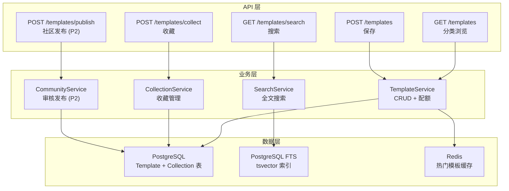
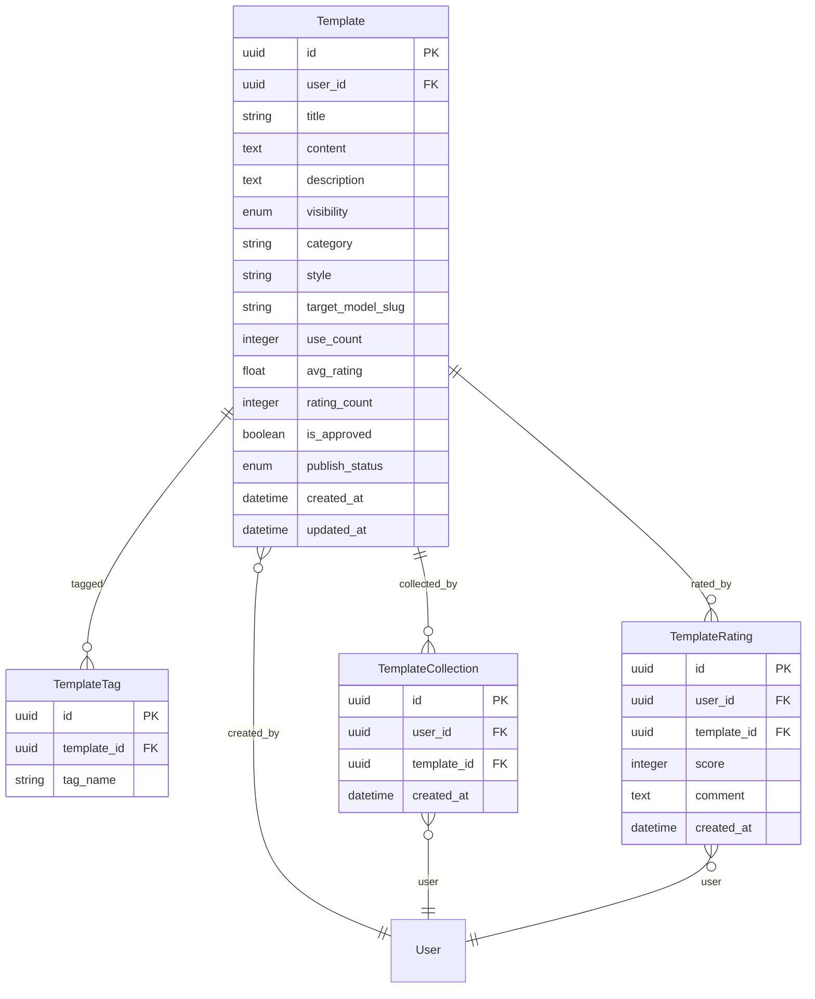

# VideoPrompt AI — 模板库 (template-library) 模块架构设计文档

> **版本**：v1.0.0
> **创建日期**：2026-04-11
> **最后更新**：2026-04-11
> **状态**：草稿
> **关联主架构文档**：[`architecture-videoprompt-ai.md`](architecture-videoprompt-ai.md) v1.0.0
> **关联 Module PRD**：[`modules/prd-template-library.md`](modules/prd-template-library.md)

---

## 0. 模块概述

| 属性 | 值 |
| ---- | -- |
| 模块名称 | template-library (模板库) |
| 优先级 | P1 |
| 功能点数 | 4（模板分类浏览、模板搜索与筛选、个人模板收藏、社区模板分享） |
| 核心验收标准 | 搜索响应 ≤ 500ms、Free 用户限 20 模板、社区发布需审核通过 |

---

## 1. 模块定位

### 1.1 模块目标

提供提示词模板的存储、浏览、搜索和社区分享能力。用户可将自己的优质提示词保存为模板复用，也可浏览社区热门模板获取灵感。模板库同时作为 SEO 内容池，吸引搜索引擎自然流量。

### 1.2 职责边界

| 包含 | 不包含 |
| ---- | ------ |
| 模板 CRUD（创建/读取/更新/删除） | 提示词转换/生成（由其他模块负责） |
| 分类浏览（按场景/风格/模型） | 用户认证/订阅（由 user-center 负责） |
| 全文搜索与多维筛选 | 模型数据维护（由 model-comparison 负责） |
| 个人收藏管理 | — |
| 社区发布 + 内容审核 (P2) | — |

### 1.3 需求追溯

| PRD 功能需求 | 优先级 | 对应组件 | 对应 API |
| ------------ | ------ | -------- | -------- |
| F-TL-1 模板分类浏览 | P1 | TemplateService + BrowseView | `GET /api/v1/templates` |
| F-TL-2 模板搜索与筛选 | P1 | SearchService | `GET /api/v1/templates/search` |
| F-TL-3 个人模板收藏 | P1 | CollectionService | `POST /api/v1/templates/collect` |
| F-TL-4 社区模板分享 | P2 | CommunityService | `POST /api/v1/templates/publish` |

---

## 2. 模块架构设计

### 2.1 核心组件

| 组件 | 职责 | 技术方案 |
| ---- | ---- | -------- |
| TemplateService | 模板 CRUD 操作，含个人模板配额控制 | PostgreSQL + RBAC（Free 限 20 条） |
| SearchService | 全文搜索 + 多维筛选 | PostgreSQL FTS (tsvector + pg_trgm)，MVP 阶段；后续迁移 MeiliSearch |
| CollectionService | 收藏/取消收藏管理 | PostgreSQL 多对多关联表 |
| CommunityService (P2) | 社区发布 + 内容审核 | 状态机（draft→pending→approved/rejected）+ LLM 自动审核 |

### 2.2 模块内部架构图

### 2.3 前端路由与组件

| 路由 | 页面组件 | 渲染模式 | 说明 |
| ---- | -------- | -------- | ---- |
| `/templates` | `TemplateBrowsePage` | SSR | SEO 友好，分类卡片列表 + 侧边筛选 |
| `/templates/:id` | `TemplateDetailPage` | SSR | 模板详情 + 一键使用 + 收藏 |

**关键前端组件**：

| 组件 | 职责 | 来源 |
| ---- | ---- | ---- |
| `TemplateCard` | 模板卡片（标题 + 预览 + 场景标签 + 评分） | 自定义 |
| `TemplateGrid` | 卡片网格列表 + 分页 | 自定义 + shadcn/ui Pagination |
| `CategoryFilter` | 侧边分类筛选（场景/风格/模型） | shadcn/ui Checkbox Group |
| `SearchBar` | 搜索框 + 实时建议 | shadcn/ui Input + Command |
| `CollectButton` | 收藏/取消收藏按钮 | shadcn/ui Button + Toast |

---

## 3. 数据模型设计

### 3.1 模块 ER 图

### 3.2 索引策略

- `idx_template_user`: (user_id) — 我的模板列表
- `idx_template_category_style`: (category, style) WHERE visibility = 'public' — 分类浏览
- `idx_template_search`: GIN (to_tsvector('english', title || ' ' || content)) — 全文搜索
- `idx_template_trgm`: GIN (title gin_trgm_ops) — 模糊匹配
- `idx_collection_user`: UNIQUE (user_id, template_id) — 防止重复收藏
- `idx_template_popular`: (use_count DESC, avg_rating DESC) WHERE visibility = 'public' — 热门排序

### 3.3 配额控制

| 计划 | 个人模板上限 | 收藏上限 |
| ---- | ------------ | -------- |
| Free | 20 | 50 |
| Pro | 500 | 无限 |
| Enterprise | 无限 | 无限 |

---

## 4. API 设计

### 4.1 接口列表

#### GET `/api/v1/templates`

**描述**：分页获取模板列表

| 参数 | 位置 | 类型 | 必填 | 说明 |
| ---- | ---- | ---- | ---- | ---- |
| `category` | query | string | 否 | 场景分类筛选 |
| `style` | query | string | 否 | 风格筛选 |
| `model` | query | string | 否 | 目标模型筛选 |
| `sort` | query | string | 否 | 排序（popular/newest，默认 popular） |
| `page` | query | integer | 否 | 页码（默认 1） |
| `page_size` | query | integer | 否 | 每页数量（默认 20）|

#### GET `/api/v1/templates/search`

**描述**：全文搜索模板

| 参数 | 位置 | 类型 | 必填 | 说明 |
| ---- | ---- | ---- | ---- | ---- |
| `q` | query | string | 是 | 搜索关键词 |
| `category` | query | string | 否 | 分类筛选 |
| `page` | query | integer | 否 | 页码 |

#### POST `/api/v1/templates`

**描述**：保存个人模板（需认证）

| 参数 | 位置 | 类型 | 必填 | 说明 |
| ---- | ---- | ---- | ---- | ---- |
| `title` | body | string | 是 | 模板标题（≤ 100 字符） |
| `content` | body | string | 是 | 提示词内容 |
| `category` | body | string | 是 | 分类 |
| `style` | body | string | 否 | 风格标签 |
| `target_model` | body | string | 否 | 适用模型 |
| `tags` | body | string[] | 否 | 自定义标签 |

#### POST `/api/v1/templates/collect`

**描述**：收藏/取消收藏模板（需认证）

| 参数 | 位置 | 类型 | 必填 | 说明 |
| ---- | ---- | ---- | ---- | ---- |
| `template_id` | body | string | 是 | 模板 ID |
| `action` | body | string | 是 | `collect` 或 `uncollect` |

#### POST `/api/v1/templates/publish` (P2)

**描述**：将个人模板发布到社区（需审核）

| 参数 | 位置 | 类型 | 必填 | 说明 |
| ---- | ---- | ---- | ---- | ---- |
| `template_id` | body | string | 是 | 模板 ID |
| `description` | body | string | 是 | 社区展示描述 |

### 4.2 错误码

| HTTP 状态 | 业务码 | 描述 |
| --------- | ------ | ---- |
| 400 | 40030 | 模板标题或内容为空 |
| 403 | 40331 | 个人模板配额已满 |
| 404 | 40432 | 模板不存在 |
| 409 | 40933 | 已收藏该模板（重复操作） |

---

## 5. 模块间接口与依赖

### 5.1 依赖关系

| 依赖模块 | 接口/能力 | 说明 |
| -------- | --------- | ---- |
| user-center | Auth 中间件 + 配额检查（模板创建限额） | 写操作需认证 |
| user-center | 用户订阅计划查询 | 判断模板配额 |

### 5.2 被依赖关系

| 被依赖方 | 场景 |
| -------- | ---- |
| prompt-converter | 转换结果 → 保存为模板 |
| prompt-generator | 生成结果 → 保存为模板 |

### 5.3 测试策略

| 测试类型 | 方式 | 说明 |
| -------- | ---- | ---- |
| 单元测试 | pytest | 配额检查逻辑、搜索结果排序 |
| 集成测试 | Testcontainers (PG) | CRUD + FTS 查询 + 收藏操作 |
| E2E 测试 | Playwright | 搜索→浏览→收藏完整流程 |

---

## 6. 非功能与安全

### 6.1 性能要求

| 指标 | 目标值 | 说明 |
| ---- | ------ | ---- |
| GET /templates P95 | ≤ 300ms | Redis 热门模板缓存 |
| GET /templates/search P95 | ≤ 500ms | PG FTS 查询 |
| SSR /templates 首屏 | ≤ 1.5s | ISR 增量静态再生成 |

### 6.2 安全要求

- **XSS 防护**：模板内容展示时转义 HTML 标签
- **CSRF 防护**：写操作使用 JWT 验证（非 Cookie 方案，天然免疫 CSRF）
- **内容审核**：社区发布模板需通过自动审核（关键词 + LLM 审核）+ 举报机制
- **配额绕过防护**：配额检查在服务端执行，不依赖前端

---

## 7. 风险与演进

| 风险 | 应对 |
| ---- | ---- |
| PG FTS 性能在数据量大时下降 | 监控查询延迟；> 10 万模板时迁移到 MeiliSearch |
| 社区模板质量参差不齐 | 评分排序 + 审核机制 + 举报下架 |
| 搜索结果相关性差 | 优化 tsvector 权重配置 + 引入 pg_trgm 模糊匹配 |

**演进规划**：

- Phase 1 (MVP)：个人模板 CRUD + PG FTS 搜索 + 收藏
- Phase 2：社区发布 (P2) + MeiliSearch 替换 PG FTS
- Phase 3：模板推荐算法 + 模板市场（付费模板）

---

## 8. 关联与回填检查

- [x] 关联 Module PRD 已标注
- [x] 关联主架构文档已标注
- [ ] Module PRD §6.3 技术参考已回填（待步骤 10）

---

## 9. 变更记录

| 版本 | 日期 | 变更类型 | 变更摘要 |
| ---- | ---- | -------- | -------- |
| v1.0.0 | 2026-04-11 | 初始版本 | 首版：TemplateService + SearchService (PG FTS) + CollectionService + CommunityService(P2)；SSR 浏览 + 搜索 + 收藏 |
