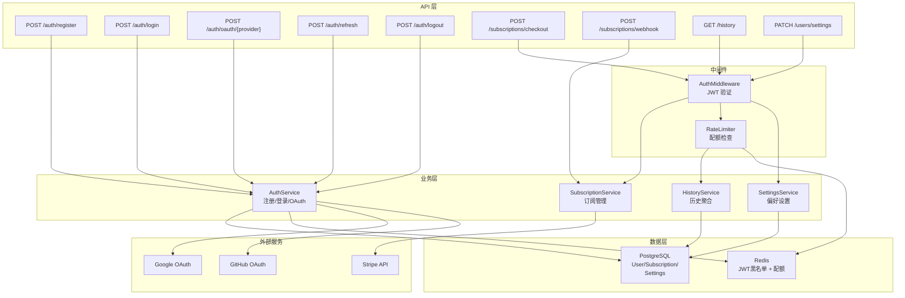

# VideoPrompt AI — 用户中心 (user-center) 模块架构设计文档

> **版本**：v1.0.0
> **创建日期**：2026-04-11
> **最后更新**：2026-04-11
> **状态**：草稿
> **关联主架构文档**：[`architecture-videoprompt-ai.md`](architecture-videoprompt-ai.md) v1.0.0
> **关联 Module PRD**：[`modules/prd-user-center.md`](modules/prd-user-center.md)

---

## 0. 模块概述

| 属性 | 值 |
| ---- | -- |
| 模块名称 | user-center (用户中心) |
| 优先级 | P0 |
| 功能点数 | 4（注册与登录、订阅与付费管理、使用历史记录、个人设置） |
| 用户故事数 | 4+ |
| 核心验收标准 | 登录延迟 ≤ 500ms、支付流程零数据丢失、JWT + OAuth 2.0 合规 |

---

## 1. 模块定位

### 1.1 模块目标

为全系统提供统一的用户身份认证、授权、订阅管理和配额控制能力。作为横切关注点，user-center 为所有业务模块提供 Auth 中间件和配额校验服务，同时管理用户使用历史和个人偏好设置。

### 1.2 职责边界

| 包含 | 不包含 |
| ---- | ------ |
| 用户注册/登录（邮箱 + OAuth） | 提示词转换/生成业务逻辑 |
| JWT 签发/验证/续期/吊销 | 模板管理（由 template-library 负责） |
| 订阅计划管理 (Free/Pro/Enterprise) | 模型数据维护（由 model-comparison 负责） |
| Stripe 支付集成 | — |
| 每日使用配额管理（Redis 限流） | — |
| 使用历史聚合查询 | — |
| 个人设置（偏好模型/语言/通知） | — |

### 1.3 需求追溯

| PRD 功能需求 | 优先级 | 对应组件 | 对应 API |
| ------------ | ------ | -------- | -------- |
| F-UC-1 注册与登录 | P0 | AuthService | `POST /api/v1/auth/*` |
| F-UC-2 订阅与付费管理 | P1 | SubscriptionService | `POST /api/v1/subscriptions/*` |
| F-UC-3 使用历史记录 | P1 | HistoryService | `GET /api/v1/history` |
| F-UC-4 个人设置 | P2 | SettingsService | `PATCH /api/v1/users/settings` |

---

## 2. 模块架构设计

### 2.1 核心组件

| 组件 | 职责 | 技术方案 |
| ---- | ---- | -------- |
| AuthService | 注册、登录、JWT 签发/验证/刷新/吊销、OAuth 回调 | bcrypt 密码哈希 + PyJWT + Google/GitHub OAuth |
| AuthMiddleware | FastAPI 中间件，拦截请求验证 JWT + 注入 current_user | FastAPI Depends |
| RateLimiter | 基于用户计划的配额检查 | Redis 滑动窗口计数器 `quota:{user_id}:{date}` |
| SubscriptionService | 订阅计划管理，Stripe Checkout/Webhook | Stripe SDK (stripe-python) |
| HistoryService | 聚合查询 ConversionHistory + GenerationHistory | PostgreSQL UNION 查询 + 分页 |
| SettingsService | 用户偏好设置 CRUD | PostgreSQL JSONB |

### 2.2 模块内部架构图



### 2.3 前端路由与组件

| 路由 | 页面组件 | 说明 |
| ---- | -------- | ---- |
| `/auth/login` | `LoginPage` | 邮箱登录 + OAuth 按钮 |
| `/auth/register` | `RegisterPage` | 邮箱注册 |
| `/profile` | `ProfilePage` | 个人中心：用户信息 + 订阅 + 历史 + 设置 |

**关键前端组件**：

| 组件 | 职责 | 来源 |
| ---- | ---- | ---- |
| `LoginForm` | 邮箱密码登录表单 | shadcn/ui Form |
| `OAuthButtons` | Google/GitHub OAuth 登录按钮 | 自定义 |
| `SubscriptionCard` | 订阅计划展示与升级 CTA | 自定义 |
| `PricingTable` | 三栏定价表（Free/Pro/Enterprise） | 自定义 |
| `HistoryTimeline` | 使用历史时间线列表 | 自定义 + shadcn/ui ScrollArea |
| `HistoryFilter` | 历史筛选（类型/模型/日期） | shadcn/ui Select + DatePicker |
| `SettingsPanel` | 偏好设置面板 | shadcn/ui Switch + Select |
| `QuotaIndicator` | 今日配额使用进度条 | shadcn/ui Progress |

### 2.4 认证流程

**邮箱注册登录**：

```text
注册: POST /auth/register → 验证邮箱格式 → bcrypt 哈希密码 → 创建 User → 签发 JWT
登录: POST /auth/login → 校验邮箱+密码 → 签发 JWT (access + refresh)
刷新: POST /auth/refresh → 验证 refresh_token → 签发新 access_token
登出: POST /auth/logout → 将 access_token 加入 Redis 黑名单（TTL = 剩余有效期）
```

**OAuth 流程**：

```text
1. 前端跳转 → Google/GitHub 授权页
2. 用户授权 → 回调到 /auth/oauth/{provider}/callback
3. 后端交换 auth_code → 获取用户信息
4. 查找或创建 User（oauth_provider + oauth_id）
5. 签发 JWT → 重定向到前端
```

**JWT 结构**：

```json
{
  "sub": "user_uuid",
  "email": "user@example.com",
  "role": "pro",
  "plan": "pro",
  "iat": 1713600000,
  "exp": 1714204800
}
```

- Access Token：有效期 7 天
- Refresh Token：有效期 30 天
- 算法：HS256（MVP），后续可升级 RS256

### 2.5 订阅与配额

**订阅计划**：

| 计划 | 价格 | 日配额（转换+生成） | 个人模板上限 | 功能 |
| ---- | ---- | -------------------- | ------------ | ---- |
| Free | $0 | 10 次/天 | 20 | 基础转换、生成 |
| Pro | $9.99/月 | 200 次/天 | 500 | 批量转换、高级优化 |
| Enterprise | $49/月 | 无限制 | 无限 | API 访问、优先支持 |

**Stripe 集成**：

```text
升级: POST /subscriptions/checkout
  → SubscriptionService.create_checkout_session(user, plan)
  → Stripe Checkout Session
  → 重定向用户到 Stripe 支付页

支付成功: Stripe Webhook → POST /subscriptions/webhook
  → 验证 Stripe 签名
  → 更新 Subscription 状态 (active)
  → 更新用户 plan
```

**配额检查逻辑**（RateLimiter）：

```text
Redis Key: quota:{user_id}:{YYYY-MM-DD}
Redis Value: 当前已用次数 (INCR)
TTL: 86400s (自动过期)

检查流程:
1. GET quota:{user_id}:{today}
2. 若 >= plan_limit → 返回 429
3. 若 < plan_limit → INCR + 放行
```

---

## 3. 数据模型设计

### 3.1 模块 ER 图

```mermaid
erDiagram
    User ||--|| Subscription : "has"
    User ||--o| UserSettings : "configures"
    User ||--o{ ConversionHistory : "produces"
    User ||--o{ GenerationHistory : "produces"

    User {
        uuid id PK
        string email UK
        string password_hash
        string name
        string avatar_url
        string oauth_provider
        string oauth_id
        enum role
        datetime created_at
        datetime updated_at
    }

    Subscription {
        uuid id PK
        uuid user_id FK_UK
        enum plan
        string stripe_customer_id
        string stripe_subscription_id
        datetime current_period_start
        datetime current_period_end
        enum status
        datetime created_at
        datetime updated_at
    }

    UserSettings {
        uuid id PK
        uuid user_id FK_UK
        string preferred_model_slug
        string language
        boolean email_notifications
        jsonb custom_preferences
        datetime updated_at
    }
```

### 3.2 索引策略

- `idx_user_email`: UNIQUE (email) — 登录查询
- `idx_user_oauth`: UNIQUE (oauth_provider, oauth_id) WHERE oauth_provider IS NOT NULL — OAuth 查找
- `idx_subscription_user`: UNIQUE (user_id) — 一对一关系
- `idx_subscription_stripe`: (stripe_customer_id) — Stripe Webhook 查询

---

## 4. API 设计

### 4.1 接口列表

#### POST `/api/v1/auth/register`

| 参数 | 位置 | 类型 | 必填 | 说明 |
| ---- | ---- | ---- | ---- | ---- |
| `email` | body | string | 是 | 邮箱 |
| `password` | body | string | 是 | 密码（≥ 8 字符，含大小写+数字） |
| `name` | body | string | 否 | 用户名 |

#### POST `/api/v1/auth/login`

| 参数 | 位置 | 类型 | 必填 | 说明 |
| ---- | ---- | ---- | ---- | ---- |
| `email` | body | string | 是 | 邮箱 |
| `password` | body | string | 是 | 密码 |

**响应**：

```json
{
  "code": 0,
  "data": {
    "access_token": "eyJhbGci...",
    "refresh_token": "eyJhbGci...",
    "expires_in": 604800,
    "user": { "id": "...", "email": "...", "name": "...", "plan": "free" }
  }
}
```

#### POST `/api/v1/auth/oauth/{provider}`

| 参数 | 位置 | 类型 | 必填 | 说明 |
| ---- | ---- | ---- | ---- | ---- |
| `provider` | path | string | 是 | `google` 或 `github` |
| `code` | body | string | 是 | OAuth 授权码 |

#### POST `/api/v1/subscriptions/checkout`

| 参数 | 位置 | 类型 | 必填 | 说明 |
| ---- | ---- | ---- | ---- | ---- |
| `plan` | body | string | 是 | `pro` 或 `enterprise` |

**响应**：`{ "checkout_url": "https://checkout.stripe.com/..." }`

#### POST `/api/v1/subscriptions/webhook`

Stripe Webhook 端点，验证 Stripe 签名后处理事件。

#### GET `/api/v1/history`

| 参数 | 位置 | 类型 | 必填 | 说明 |
| ---- | ---- | ---- | ---- | ---- |
| `type` | query | string | 否 | `conversion` / `generation` / `all`（默认 all） |
| `model` | query | string | 否 | 按模型筛选 |
| `start_date` | query | string | 否 | 开始日期 |
| `end_date` | query | string | 否 | 结束日期 |
| `page` | query | integer | 否 | 页码 |

#### PATCH `/api/v1/users/settings`

| 参数 | 位置 | 类型 | 必填 | 说明 |
| ---- | ---- | ---- | ---- | ---- |
| `preferred_model` | body | string | 否 | 默认目标模型 |
| `language` | body | string | 否 | 界面语言 (`zh` / `en`) |
| `email_notifications` | body | boolean | 否 | 邮件通知开关 |

### 4.2 错误码

| HTTP 状态 | 业务码 | 描述 |
| --------- | ------ | ---- |
| 400 | 40040 | 邮箱格式错误 |
| 400 | 40041 | 密码强度不足 |
| 401 | 40142 | 邮箱或密码错误 |
| 401 | 40143 | JWT 已过期或无效 |
| 401 | 40144 | JWT 已被吊销（黑名单） |
| 409 | 40945 | 邮箱已注册 |
| 429 | 42946 | 登录失败次数过多（5 次/15min） |
| 429 | 42901 | 每日配额已用完 |

---

## 5. 模块间接口与依赖

### 5.1 依赖关系

| 依赖 | 类型 | 说明 |
| ---- | ---- | ---- |
| Stripe API | 外部服务 | 支付与订阅管理 |
| Google OAuth | 外部服务 | 第三方登录 |
| GitHub OAuth | 外部服务 | 第三方登录 |
| Redis | 基础设施 | JWT 黑名单 + 配额计数器 |

### 5.2 被依赖关系（作为基础模块）

| 被依赖方 | 提供的能力 | 调用方式 |
| -------- | ---------- | -------- |
| prompt-converter | AuthMiddleware（JWT 验证）+ RateLimiter（配额检查） | FastAPI Depends |
| prompt-generator | AuthMiddleware + RateLimiter | FastAPI Depends |
| template-library | AuthMiddleware + 用户计划查询（配额控制） | FastAPI Depends |
| model-comparison | 无（公开 API 不需认证） | — |

### 5.3 测试策略

| 测试类型 | 方式 | 说明 |
| -------- | ---- | ---- |
| 单元测试 | pytest | AuthService 密码校验、JWT 签发/验证、配额计算 |
| 集成测试 | Testcontainers | 注册→登录→获取 Token→调用受保护 API |
| 支付测试 | Stripe Test Mode | 使用测试信用卡 (4242...) 完成支付流程 |
| 安全测试 | OWASP ZAP | 认证接口漏洞扫描 |

---

## 6. 非功能与安全

### 6.1 性能要求

| 指标 | 目标值 | 说明 |
| ---- | ------ | ---- |
| 登录 API P95 | ≤ 500ms | 含 bcrypt 验证（~250ms） |
| Auth 中间件 P95 | ≤ 10ms | JWT 验证（内存操作）+ Redis 黑名单检查 |
| 配额检查 P95 | ≤ 5ms | Redis GET + INCR |
| Stripe Webhook P95 | ≤ 1s | 签名验证 + DB 更新 |

### 6.2 安全要求

- **密码策略**：≥ 8 字符，必须含大小写字母 + 数字；bcrypt cost=12
- **登录限流**：同一邮箱 5 次失败/15 分钟 → 锁定 15 分钟
- **JWT 安全**：
  - Secret Key ≥ 256 位，通过环境变量注入
  - 登出时 Token 加入 Redis 黑名单
  - 不在 JWT 中存储敏感信息（密码、API Key）
- **Stripe Webhook 验证**：始终验证 `Stripe-Signature` 头，防止伪造
- **OAuth 安全**：`state` 参数防 CSRF + PKCE (OAuth 2.1)
- **数据保护**：用户可导出/删除个人数据（GDPR/个保法合规）

---

## 7. 风险与演进

| 风险 | 应对 |
| ---- | ---- |
| JWT Secret 泄露 | Secret 轮换机制（双 Secret 并行验证过渡期）+ 全局 Token 刷新 |
| Stripe Webhook 重复投递 | Webhook 幂等处理（idempotency_key 去重） |
| 配额 Redis 故障 | 降级策略：Redis 不可用时放行请求 + 告警 |

**演进规划**：

- Phase 1 (MVP)：邮箱注册 + Google/GitHub OAuth + Free/Pro 两档 + 基础历史
- Phase 2：Enterprise 计划 + 团队管理 + 发票
- Phase 3：SSO (SAML) + 审计日志 + 高级权限管理

---

## 8. 关联与回填检查

- [x] 关联 Module PRD 已标注
- [x] 关联主架构文档已标注
- [ ] Module PRD §6.3 技术参考已回填（待步骤 10）

---

## 9. 变更记录

| 版本 | 日期 | 变更类型 | 变更摘要 |
| ---- | ---- | -------- | -------- |
| v1.0.0 | 2026-04-11 | 初始版本 | 首版：AuthService + AuthMiddleware + RateLimiter + SubscriptionService (Stripe) + HistoryService + SettingsService；JWT + OAuth 2.0 + Redis 配额 |
