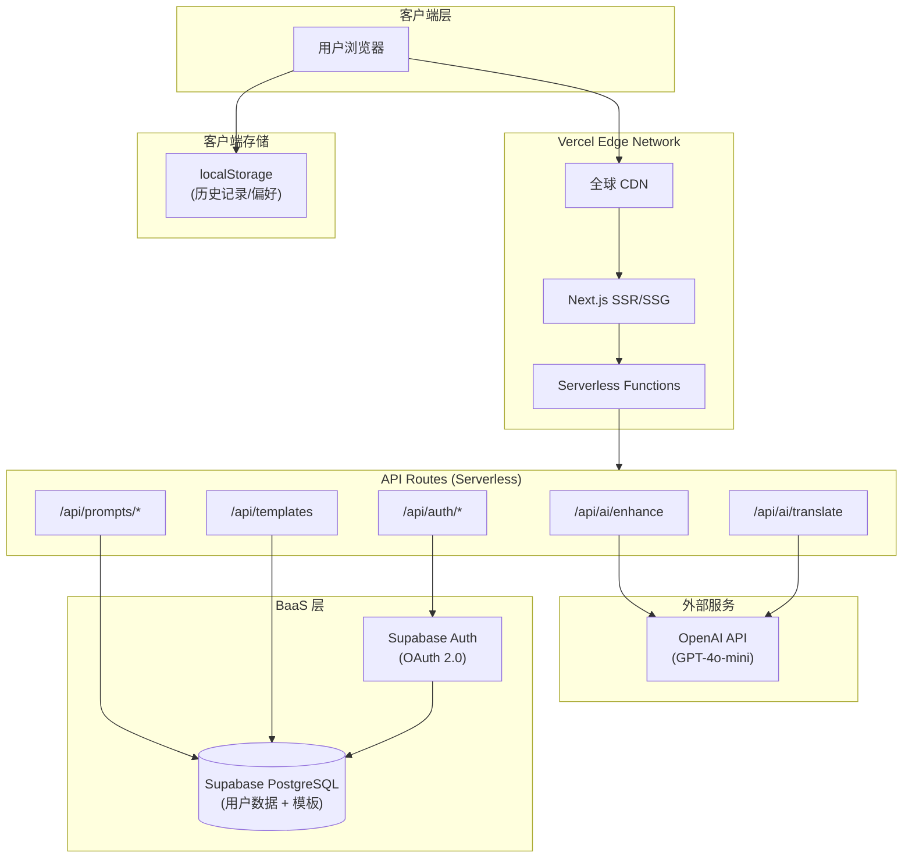
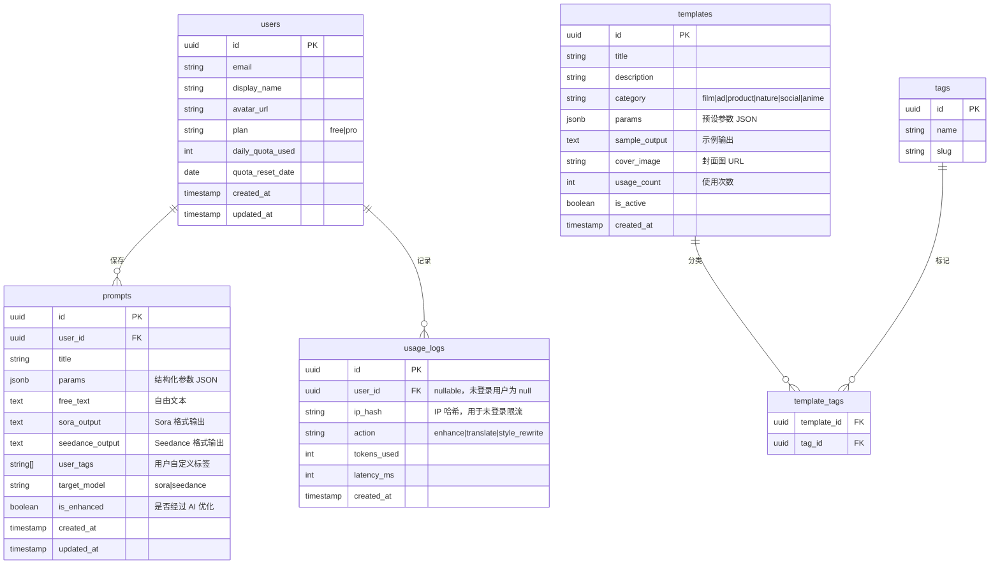
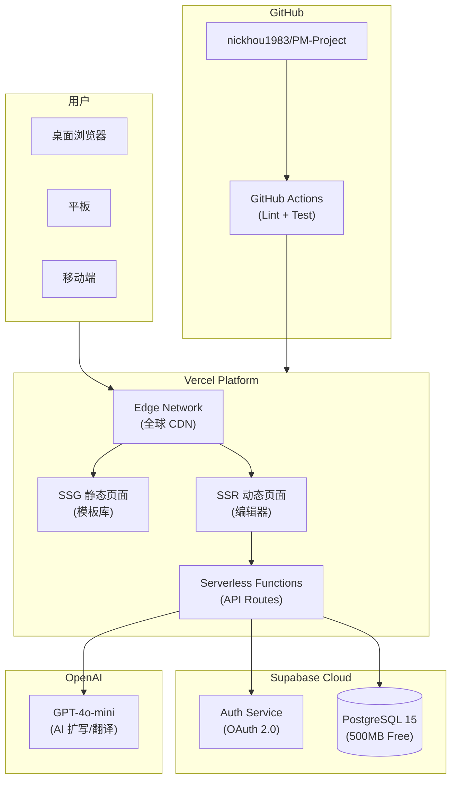

# VideoPrompt AI — 技术架构设计文档

> **版本**：v1.0
> **架构师**：技术团队
> **创建日期**：2026-03-29
> **最后更新**：2026-03-29
> **状态**：草稿
> **关联 PRD**：[prd-videoprompt-ai.md](prd-videoprompt-ai.md)

---

## 0. 文档索引

| 文档 | 路径 | 说明 | 模式 |
| ---- | ---- | ---- | ---- |
| **主架构文档（本文档）** | `architecture-videoprompt-ai.md` | 系统整体架构、技术栈选型、部署方案、非功能需求 | 单文档 |

> 本项目采用**单文档模式**：所有内容写入本文档。项目规模为 MVP（6 模块、6 API 端点），不需要拆分子文档。

---

## 1. 设计概述

### 1.1 项目背景

VideoPrompt AI 是一个面向 AI 视频创作者的智能提示词编辑器（Web App），旨在同时适配 Sora 2 和 Seedance 2.0 两大主流文生视频模型。产品通过结构化参数面板 + AI 智能扩写，帮助普通用户快速生成专业级视频提示词，降低运镜/光影/构图等专业术语的学习门槛。

本技术架构基于 PRD v1.1 设计，覆盖 MVP 阶段（Sprint 1）及后续两个迭代周期（Sprint 2/3）的技术方案。

### 1.2 设计目标

| 目标 | 描述 | 衡量标准 |
| ---- | ---- | -------- |
| 快速交付 | 2 周内上线 MVP 版本，验证市场需求 | Sprint 1 交付 P0 全部功能 |
| 低延迟 AI 交互 | AI 扩写响应流畅，用户感知无明显等待 | AI 端到端响应 ≤ 5s |
| 高可用 | MVP 阶段保障核心功能稳定运行 | SLA ≥ 99.5% |
| 低运维成本 | Serverless 架构，按量付费，无服务器运维 | 月度基础设施成本 ≤ $50 |
| 可扩展 | 架构支持从 MVP 平滑演进到用户增长期 | 支持 100 QPS，可水平扩展到 1000 QPS |

### 1.3 设计原则

- **简单优先（KISS）**：MVP 阶段选择最简方案，Serverless 全栈一体化，避免引入不必要的中间件
- **前后端一体化**：Next.js API Routes 承载全部后端逻辑，减少运维复杂度
- **配置驱动**：提示词格式规则（Sora/Seedance）存储为 JSON 配置，与代码解耦，便于快速适配模型格式变更
- **渐进增强**：核心编辑功能纯客户端运行，AI 增值功能通过 API 异步调用，保障基础体验不受网络影响

### 1.4 范围与边界

| 范围 | 包含 | 不包含 |
| ---- | ---- | ------ |
| 前端应用 | 编辑器、模板库、用户中心、提示词管理 | 移动端原生 App |
| AI 能力 | 提示词扩写、风格改写、中英翻译 | 视频生成、图片生成 |
| 模型适配 | Sora 2、Seedance 2.0 格式输出 | 其他模型（Runway、Kling 等，后续扩展） |
| 用户系统 | 注册/登录、免登录使用、配额管理 | 团队协作、权限管理 |
| 付费系统 | Pro 订阅（P2，Sprint 3） | 企业版、API 接入计费 |

### 1.5 需求追溯矩阵

| PRD 功能 | 描述 | 优先级 | 对应架构模块 | 对应 API | 备注 |
| -------- | ---- | ------ | ------------ | ------- | ---- |
| 结构化参数面板 | 下拉/标签选择参数，实时组合提示词 | P0 | PromptEditor（前端） | — | 纯客户端逻辑 |
| 自由文本输入 | 文本编辑与参数面板联动 | P0 | PromptEditor（前端） | — | 纯客户端逻辑 |
| 实时预览 | 实时显示组合后的提示词文本 | P0 | PromptEditor（前端） | — | 纯客户端逻辑 |
| AI 一键优化 | AI 扩写简单描述为专业提示词 | P0 | AI Service | `POST /api/ai/enhance` | 调用 OpenAI API |
| Sora 格式输出 | 按 Sora 2 最佳实践格式化 | P0 | ModelAdapter（前端） | — | 前端格式化规则 |
| Seedance 格式输出 | 按 Seedance 2.0 格式输出 | P0 | ModelAdapter（前端） | — | 前端格式化规则 |
| 一键复制 | 复制提示词到剪贴板 | P0 | PromptEditor（前端） | — | Clipboard API |
| 免登录使用 | 核心功能无需注册，每日限免 AI 额度 | P0 | QuotaManager | — | localStorage + IP 限流 |
| AI 风格改写 | 改写为不同风格 | P1 | AI Service | `POST /api/ai/enhance` | 复用扩写接口 |
| 双模型对比视图 | 并排展示 Sora/Seedance 差异 | P1 | ModelAdapter（前端） | — | 纯客户端渲染 |
| 保存到个人库 | 登录用户保存提示词 | P1 | Prompt CRUD | `POST /api/prompts` | Supabase |
| 历史记录 | 本地存储最近生成记录 | P1 | PromptEditor（前端） | — | localStorage |
| 场景模板浏览 | 分类浏览预设模板 | P1 | Template Service | `GET /api/templates` | SSG 预渲染 |
| 模板加载到编辑器 | 一键加载模板到编辑器 | P1 | PromptEditor（前端） | — | 前端状态加载 |
| 中英双向翻译 | 提示词中英翻译 | P1 | AI Service | `POST /api/ai/translate` | 调用 OpenAI API |
| 注册/登录 | 邮箱/Google/GitHub 登录 | P1 | Auth Service | `/api/auth/*` | Supabase Auth |
| Pro 订阅 | 解锁无限 AI + 高级模板 | P2 | Payment Service | `POST /api/payment/*` | Stripe（Sprint 3） |

---

## 2. 技术栈选型

### 2.1 选型总览

| 层级 | 技术选型 | 选型理由 | 备选方案 |
| ---- | -------- | -------- | -------- |
| **前端框架** | Next.js 14 + React 18 + TypeScript | SSR/SSG 支持 SEO（模板库页面）；App Router 支持 RSC 和流式渲染；React 生态成熟；TS 保障类型安全 | Nuxt.js 3（Vue 生态）、Remix |
| **UI 组件库** | Tailwind CSS + shadcn/ui | Tailwind 原子化 CSS 开发效率高；shadcn/ui 无运行时依赖、可定制性强、TypeScript 原生支持 | Ant Design、Chakra UI |
| **状态管理** | Zustand | 轻量（~1KB）、API 简洁、无 Provider 包裹、支持中间件；适合编辑器场景的频繁状态更新 | Jotai、Redux Toolkit |
| **后端框架** | Next.js API Routes (Serverless) | 前后端一体化减少运维；与 Vercel 深度集成；Serverless 自动弹性伸缩 | Express.js（独立 Node 后端）、Hono |
| **主数据库** | Supabase (PostgreSQL 15) | 免费额度充足（500MB/50K 行）；内置 Auth + RLS 行级安全策略；实时订阅能力 | PlanetScale (MySQL)、Neon (PostgreSQL) |
| **认证服务** | Supabase Auth (OAuth 2.0) | 与数据库无缝集成；支持 Google/GitHub/邮箱；JWT 自动管理；RLS 策略天然配合 | NextAuth.js、Clerk |
| **AI/LLM** | OpenAI API (GPT-4o-mini) | 性价比最优（$0.15/1M input, $0.6/1M output）；响应速度快（通常 < 3s）；提示词扩写质量可靠 | Claude 3.5 Sonnet、Gemini 1.5 Flash |
| **本地存储** | localStorage | 未登录用户历史记录和偏好存储；无需额外依赖 | IndexedDB（数据量更大场景） |
| **部署平台** | Vercel | 与 Next.js 深度集成；全球 Edge CDN；Serverless 自动弹性；免费额度适合 MVP（100GB/月带宽） | AWS Amplify、Cloudflare Pages |
| **CI/CD** | GitHub Actions + Vercel Git Integration | 代码推送自动触发部署；Preview Deployment 支持 PR 预览；零配置 | GitLab CI |
| **监控** | Vercel Analytics + Sentry | Vercel 内置 Web Vitals 监控；Sentry 错误追踪和性能监控；均有免费额度 | Datadog、New Relic |
| **日志** | Vercel Logs + Sentry | Serverless 函数日志 Vercel 内置；Sentry 结构化错误日志 | LogTail |

### 2.2 关键选型决策记录（ADR）

#### ADR-1：AI 模型选型 — GPT-4o-mini vs GPT-4o

- **状态**：接受
- **背景**：AI 扩写和翻译是核心功能，需在响应质量、速度和成本间平衡
- **候选方案**：GPT-4o vs GPT-4o-mini vs Claude 3.5 Sonnet
- **评估维度**：

| 维度 | GPT-4o | GPT-4o-mini | Claude 3.5 Sonnet |
| ---- | ------ | ----------- | ----------------- |
| 扩写质量 | 优秀 | 良好（满足需求） | 优秀 |
| 响应延迟 | 3-8s | 1-3s | 2-5s |
| 成本（百万 tokens） | $5/$15 | $0.15/$0.6 | $3/$15 |
| SDK 成熟度 | 高 | 高 | 高 |

- **结论**：选择 GPT-4o-mini
- **理由**：MVP 阶段优先成本效率，GPT-4o-mini 在提示词扩写场景质量足够，成本仅为 GPT-4o 的 1/25，响应更快。通过精心设计 System Prompt 弥补模型能力差距。未来付费用户可升级为 GPT-4o 作为增值功能。
- **后果**：需密切关注扩写质量反馈，若用户满意度不达标则升级模型。

#### ADR-2：数据库选型 — Supabase vs PlanetScale

- **状态**：接受
- **背景**：需要一个托管数据库支持用户数据存储和认证
- **候选方案**：Supabase (PostgreSQL) vs PlanetScale (MySQL) vs Neon (PostgreSQL)
- **结论**：选择 Supabase
- **理由**：Supabase 将数据库 + 认证 + 行级安全 + 实时订阅整合为一站式方案，减少 MVP 阶段 BaaS 集成工作量。免费额度（500MB 存储、50K MAU）远超 MVP 需求。PostgreSQL 的 JSONB 类型适合存储结构灵活的提示词参数数据。
- **后果**：与 Supabase 平台绑定；后续若需迁移，数据层需额外适配。

---

## 3. 系统架构

### 3.1 架构风格

**选择**：Serverless + BaaS（Backend as a Service）

**理由**：
1. **团队与交付**：小团队（≤5 人），2 周 MVP 交付约束，Serverless 无需运维服务器
2. **流量模式**：MVP 初期流量低且不可预测，按量付费避免资源浪费
3. **PRD 技术偏好**：PRD §7.1 已明确选择 Next.js API Routes + Supabase + Vercel
4. **弹性**：Vercel Serverless Functions 自动弹性伸缩，无需提前规划容量

### 3.2 整体架构图



### 3.3 模块职责

| 模块/服务 | 职责 | 核心功能 | 依赖 |
| --------- | ---- | -------- | ---- |
| **PromptEditor**（前端） | 提示词编辑核心 | 结构化参数面板、自由文本编辑、实时预览、一键复制 | Zustand（状态管理） |
| **ModelAdapter**（前端） | 模型格式适配 | Sora/Seedance 格式化输出、双模型对比视图 | 格式规则 JSON 配置 |
| **AI Service**（API） | AI 能力封装 | 提示词扩写、风格改写、中英翻译 | OpenAI API |
| **QuotaManager**（前端+API） | 额度控制 | 未登录用户每日 5 次限额、登录用户 20 次限额 | localStorage + Supabase |
| **Prompt CRUD**（API） | 提示词持久化 | 保存、查询、更新、删除用户提示词 | Supabase PostgreSQL |
| **Template Service**（API+SSG） | 模板管理 | 模板浏览、分类筛选、加载到编辑器 | Supabase PostgreSQL |
| **Auth Service**（API） | 用户认证 | Google/GitHub/邮箱登录、Session 管理 | Supabase Auth |

### 3.4 前端架构（基于原型图分析）

#### 原型图分析摘要

| 分析项 | 结果 |
| ------ | ---- |
| 原型图来源 | wireframes/（低保真，6 个页面） |
| 页面总数 | 6 个（导航首页、编辑器、AI 结果、模板库、我的提示词、登录注册） |
| 前端复杂度评级 | **中** |
| 核心交互模式 | 左右分栏编辑器、双模型并列对比、标签筛选卡片列表、表单选择联动 |
| 状态管理方案 | Zustand（编辑器全局状态） |

#### 页面路由

| 页面 | 路由 | 渲染方式 | 说明 |
| ---- | ---- | -------- | ---- |
| 编辑器（首页） | `/` | CSR | 核心页面，左侧参数面板 + 右侧输出预览，P0 功能集中于此 |
| AI 扩写结果 | `/result` | CSR | AI 优化后结果展示，双模型对比视图 |
| 模板库 | `/templates` | SSG | 静态生成，SEO 友好，分类浏览卡片布局 |
| 我的提示词 | `/my-prompts` | CSR（需认证） | 已保存提示词列表管理 |
| 登录注册 | `/login` | CSR | OAuth 登录 + 邮箱注册 |

#### 组件架构

```
app/
├── layout.tsx                    # 全局布局（Header + Nav）
├── page.tsx                      # 编辑器首页
├── result/page.tsx               # AI 结果页
├── templates/page.tsx            # 模板库（SSG）
├── my-prompts/page.tsx           # 我的提示词
├── login/page.tsx                # 登录注册
└── api/                          # API Routes
    ├── ai/
    │   ├── enhance/route.ts      # AI 扩写
    │   └── translate/route.ts    # AI 翻译
    ├── prompts/
    │   ├── route.ts              # 列表 + 创建
    │   └── [id]/route.ts         # 单条操作
    ├── templates/route.ts        # 模板列表
    └── auth/
        └── callback/route.ts     # OAuth 回调

components/
├── editor/
│   ├── ParameterPanel.tsx        # 左侧参数面板（下拉/标签/滑块）
│   ├── TextEditor.tsx            # 自由文本输入区
│   ├── PromptPreview.tsx         # 实时预览区
│   └── ActionBar.tsx             # 操作按钮（AI 优化/复制/保存）
├── model-adapter/
│   ├── SoraOutput.tsx            # Sora 格式输出
│   ├── SeedanceOutput.tsx        # Seedance 格式输出
│   └── CompareView.tsx           # 双模型对比视图
├── template/
│   ├── TemplateCard.tsx          # 模板卡片
│   └── TemplateFilter.tsx        # 分类筛选
├── prompt/
│   ├── PromptList.tsx            # 提示词列表
│   └── PromptCard.tsx            # 单条提示词卡片
├── auth/
│   ├── LoginForm.tsx             # 登录表单
│   └── AuthGuard.tsx             # 路由守卫
└── ui/                           # shadcn/ui 基础组件
    ├── button.tsx
    ├── select.tsx
    ├── dialog.tsx
    └── ...

stores/
├── editorStore.ts                # 编辑器状态（参数/文本/当前模型）
├── authStore.ts                  # 用户认证状态
└── quotaStore.ts                 # AI 额度状态

lib/
├── model-rules/
│   ├── sora.json                 # Sora 格式化规则配置
│   └── seedance.json             # Seedance 格式化规则配置
├── prompt-builder.ts             # 参数→提示词文本拼接逻辑
├── supabase.ts                   # Supabase 客户端初始化
└── openai.ts                     # OpenAI API 封装
```

#### 状态管理设计（Zustand）

```typescript
// stores/editorStore.ts — 核心状态结构
interface EditorState {
  // 参数面板状态
  params: {
    subject: string;        // 主体描述
    action: string;         // 动作
    environment: string;    // 环境/场景
    cameraMovement: string; // 运镜方式
    lighting: string;       // 光影
    mood: string[];         // 情绪/氛围（多选）
    style: string;          // 视频风格
    duration: number;       // 时长(秒)
    aspectRatio: string;    // 画面比例
  };
  // 文本编辑状态
  freeText: string;
  // 输出状态
  targetModel: 'sora' | 'seedance';
  generatedPrompt: string;
  soraOutput: string;
  seedanceOutput: string;
  // AI 状态
  isEnhancing: boolean;
  enhanceError: string | null;
  // Actions
  updateParam: (key: string, value: any) => void;
  setFreeText: (text: string) => void;
  setTargetModel: (model: 'sora' | 'seedance') => void;
  enhance: () => Promise<void>;
  copyToClipboard: () => Promise<void>;
}
```

### 3.5 服务通信

| 调用方 | 被调用方 | 通信方式 | 协议 | 说明 |
| ------ | -------- | -------- | ---- | ---- |
| Browser | Next.js SSR/SSG | 同步 | HTTPS | 页面请求 |
| Browser | API Routes | 异步 | HTTPS (REST) | AI 扩写/CRUD/认证 |
| API Routes | OpenAI API | 异步 | HTTPS (REST) | LLM 调用，支持流式响应 |
| API Routes | Supabase | 异步 | HTTPS (REST) | 数据读写（通过 Supabase JS SDK） |
| Browser | Supabase Auth | 异步 | HTTPS | OAuth 回调/Session 刷新 |

---

## 4. 数据模型设计

### 4.1 核心实体关系图



### 4.2 关键表结构

#### `prompts` 表 — 核心数据表

```sql
CREATE TABLE prompts (
    id UUID PRIMARY KEY DEFAULT gen_random_uuid(),
    user_id UUID NOT NULL REFERENCES auth.users(id) ON DELETE CASCADE,
    title VARCHAR(200) NOT NULL DEFAULT '',
    params JSONB NOT NULL DEFAULT '{}',
    free_text TEXT NOT NULL DEFAULT '',
    sora_output TEXT NOT NULL DEFAULT '',
    seedance_output TEXT NOT NULL DEFAULT '',
    user_tags TEXT[] DEFAULT '{}',
    target_model VARCHAR(20) NOT NULL DEFAULT 'sora',
    is_enhanced BOOLEAN NOT NULL DEFAULT false,
    created_at TIMESTAMPTZ NOT NULL DEFAULT NOW(),
    updated_at TIMESTAMPTZ NOT NULL DEFAULT NOW()
);

-- 索引策略
CREATE INDEX idx_prompts_user_id ON prompts(user_id);
CREATE INDEX idx_prompts_created_at ON prompts(created_at DESC);
CREATE INDEX idx_prompts_user_tags ON prompts USING GIN(user_tags);

-- 行级安全策略（RLS）
ALTER TABLE prompts ENABLE ROW LEVEL SECURITY;
CREATE POLICY "用户只能访问自己的提示词"
    ON prompts FOR ALL
    USING (auth.uid() = user_id);
```

#### `templates` 表 — 模板数据表

```sql
CREATE TABLE templates (
    id UUID PRIMARY KEY DEFAULT gen_random_uuid(),
    title VARCHAR(200) NOT NULL,
    description TEXT NOT NULL DEFAULT '',
    category VARCHAR(50) NOT NULL,
    params JSONB NOT NULL DEFAULT '{}',
    sample_output TEXT NOT NULL DEFAULT '',
    cover_image VARCHAR(500),
    usage_count INT NOT NULL DEFAULT 0,
    is_active BOOLEAN NOT NULL DEFAULT true,
    created_at TIMESTAMPTZ NOT NULL DEFAULT NOW()
);

CREATE INDEX idx_templates_category ON templates(category) WHERE is_active = true;
CREATE INDEX idx_templates_usage ON templates(usage_count DESC) WHERE is_active = true;

-- 模板对所有用户只读
ALTER TABLE templates ENABLE ROW LEVEL SECURITY;
CREATE POLICY "模板对所有人可读"
    ON templates FOR SELECT
    USING (is_active = true);
```

#### `usage_logs` 表 — AI 调用日志

```sql
CREATE TABLE usage_logs (
    id UUID PRIMARY KEY DEFAULT gen_random_uuid(),
    user_id UUID REFERENCES auth.users(id) ON DELETE SET NULL,
    ip_hash VARCHAR(64) NOT NULL,
    action VARCHAR(30) NOT NULL,
    tokens_used INT NOT NULL DEFAULT 0,
    latency_ms INT NOT NULL DEFAULT 0,
    created_at TIMESTAMPTZ NOT NULL DEFAULT NOW()
);

CREATE INDEX idx_usage_logs_user_date ON usage_logs(user_id, created_at);
CREATE INDEX idx_usage_logs_ip_date ON usage_logs(ip_hash, created_at);
```

### 4.3 数据层概览

| 数据类型 | 存储介质 | 说明 |
| -------- | -------- | ---- |
| 核心业务数据（用户、提示词、模板） | Supabase PostgreSQL | 结构化数据，RLS 行级安全 |
| AI 调用日志 | Supabase PostgreSQL | 用于额度控制和成本监控 |
| 未登录用户历史记录 | localStorage | 客户端存储，无需后端交互 |
| 用户偏好（目标模型、UI 设置） | localStorage | 客户端存储 |
| 模型格式配置 | JSON 文件（代码仓库） | Sora/Seedance 格式规则，随部署更新 |

---

## 5. API 设计

### 5.1 设计规范

- **风格**：RESTful
- **基础路径**：`/api/`（Next.js API Routes，无需额外版本前缀，MVP 阶段）
- **认证方式**：Supabase JWT（通过 Authorization: Bearer {token} 传递）。未认证请求通过 IP 哈希追踪配额。
- **限流策略**：未登录用户 5 次/天 AI 调用（基于 IP 哈希）；免费用户 20 次/天；Pro 用户不限次数
- **响应格式**：统一 JSON

```json
// 成功响应
{ "data": { ... }, "error": null }

// 错误响应
{ "data": null, "error": { "code": "QUOTA_EXCEEDED", "message": "今日 AI 额度已用完" } }
```

### 5.2 核心接口定义

#### AI 扩写

```
POST /api/ai/enhance
```

| 参数 | 类型 | 必填 | 说明 |
| ---- | ---- | ---- | ---- |
| text | string | 是 | 用户输入的描述（≥5 字符） |
| targetModel | string | 是 | 目标模型：`sora` \| `seedance` |
| mode | string | 否 | `enhance`（默认）\| `style_rewrite` |
| style | string | 否 | 仅 mode=style_rewrite 时需要：`cinematic` \| `documentary` \| `mv` \| `ad` |

**响应**：

```json
{
  "data": {
    "prompt": "A young woman in a red dress runs through...",
    "soraFormatted": "...",
    "seedanceFormatted": "...",
    "tokensUsed": 350,
    "model": "gpt-4o-mini"
  }
}
```

**流式响应**：支持 Server-Sent Events（SSE），前端通过 `EventSource` 逐字渲染，提升感知速度。

#### AI 翻译

```
POST /api/ai/translate
```

| 参数 | 类型 | 必填 | 说明 |
| ---- | ---- | ---- | ---- |
| text | string | 是 | 待翻译的提示词 |
| targetLang | string | 是 | `en` \| `zh` |

#### 提示词 CRUD

```
GET    /api/prompts              # 获取列表（分页：?page=1&limit=20&tag=xxx）
POST   /api/prompts              # 创建
GET    /api/prompts/:id          # 获取单条
PUT    /api/prompts/:id          # 更新
DELETE /api/prompts/:id          # 删除
```

所有 `/api/prompts/*` 接口需认证。Supabase RLS 自动确保用户只能访问自己的数据。

#### 模板

```
GET /api/templates               # 获取列表（?category=film&page=1&limit=20）
```

无需认证，公开接口。模板库页面使用 SSG 预渲染 + ISR（增量静态再生成，每小时刷新一次）。

#### 认证

```
GET  /api/auth/callback          # OAuth 回调（Supabase 处理）
POST /api/auth/signout           # 登出
```

认证流程由 Supabase Auth SDK 在客户端发起，API Routes 仅处理回调和登出。

---

## 6. 部署架构

### 6.1 部署拓扑图



### 6.2 环境规划

| 环境 | 用途 | 触发方式 | Vercel 配置 | 数据策略 |
| ---- | ---- | -------- | ----------- | -------- |
| **Preview** | PR 预览 | PR 创建/更新自动触发 | Preview Deployment | 独立 Supabase 项目（测试数据） |
| **Production** | 正式生产 | `main` 分支推送自动触发 | Production Deployment | 生产 Supabase 项目 |

> MVP 阶段仅需 Preview + Production 两个环境，无需独立 Staging。

### 6.3 CI/CD 流水线

```text
代码推送 (git push)
    │
    ├── GitHub Actions:
    │   ├── ESLint + Prettier 检查
    │   ├── TypeScript 类型检查 (tsc --noEmit)
    │   └── 单元测试 (Vitest)
    │
    └── Vercel Git Integration:
        ├── 自动构建 (next build)
        ├── Preview Deployment (PR)
        └── Production Deployment (main 分支)
```

### 6.4 部署策略

- **策略**：Vercel Immutable Deployments（每次部署生成不可变快照）
- **回滚方案**：在 Vercel Dashboard 一键回滚到任意历史部署版本（秒级生效）
- **零停机**：Vercel 默认原子切换，新部署就绪后瞬间切换流量

### 6.5 成本估算

| 资源类别 | 具体资源 | 规格 | 单价 | 月预估用量 | 月成本 |
| -------- | -------- | ---- | ---- | ---------- | ------ |
| 部署/CDN | Vercel Hobby Plan | 100GB 带宽、Serverless 100GB-hours | $0 (Free) | MVP 阶段远低于上限 | $0 |
| 数据库 | Supabase Free Plan | 500MB 存储、50K MAU、500K Edge Functions | $0 (Free) | MVP 阶段远低于上限 | $0 |
| AI/LLM | OpenAI GPT-4o-mini | $0.15/M input, $0.6/M output | 按量 | ~500 DAU × 3 次/天 × 500 tokens/次 ≈ 22.5M tokens/月 | ~$17 |
| 监控 | Sentry Developer Plan | 5K errors/月 | $0 (Free) | MVP 阶段足够 | $0 |
| 域名 | 自定义域名 | .com | $12/年 | — | ~$1 |
| **月度总计** | | | | | **~$18** |

**成本优化策略**：

1. **缓存 AI 结果**：相同输入参数命中 Supabase 缓存表，避免重复调用 OpenAI（预估降低 30% 调用量）
2. **流式响应**：SSE 流式返回用户可提前开始阅读，降低感知延迟而非增加 token 消耗
3. **GPT-4o-mini 默认**：免费用户使用 GPT-4o-mini（成本最低），Pro 用户可选 GPT-4o（成本由订阅收入覆盖）
4. **模板库 SSG**：静态生成模板页面，零 Serverless 函数调用

---

## 7. 非功能需求设计

### 7.1 性能设计

| 指标 | PRD 要求 | 目标值 | 推导逻辑 | 达成方案 |
| ---- | -------- | ------ | -------- | -------- |
| 首屏加载 | ≤ 2s | ≤ 1.5s (LCP) | PRD 要求 2s + CDN 加速。模板库 SSG 0 后端延迟；编辑器 CSR bundle 控制在 150KB（gzip） | Vercel Edge CDN + Next.js SSG/SSR + 代码分割 + Tree Shaking |
| AI 扩写响应 | ≤ 5s | ≤ 3s（首字节）/ ≤ 5s（完成） | GPT-4o-mini 典型延迟 1-3s；加上网络传输 200ms + API 处理 100ms | SSE 流式响应 + GPT-4o-mini 低延迟模型 + 加载动画 |
| 参数面板更新 | ≤ 100ms | ≤ 16ms（60fps） | PRD 要求 100ms。参数→提示词为纯前端字符串拼接，Zustand 精准订阅避免多余渲染 | Zustand 切片订阅 + React.memo + 防抖(输入) |
| QPS 峰值 | 100 QPS | 100 QPS | PRD MVP 阶段 100 QPS。500 DAU × 尖峰倍率 5x × 平均 3 次/人 ÷ 86400s ≈ 0.09 QPS（实际远低于 100） | Vercel Serverless 自动弹性（默认支持 1000 并发） |

### 7.2 高可用设计

| 策略 | 描述 | SLA 目标 |
| ---- | ---- | -------- |
| Vercel 全球 Edge | 全球多区域部署，就近路由，单区域故障自动 failover | 99.99%（Vercel SLA） |
| Supabase 托管 | Supabase 提供自动备份（每日）、高可用 PostgreSQL 集群 | 99.9%（Free Plan） |
| 客户端降级 | AI 功能不可用时，编辑器基础功能（参数面板 + 实时预览 + 复制）仍可正常使用 | 编辑器 100% 可用 |
| OpenAI 故障降级 | 若 OpenAI API 超时或报错，展示重试按钮 + 本地格式化输出（无 AI 增强） | — |

**复合 SLA**：核心编辑功能 ≥ 99.9%（仅依赖 Vercel CDN）；AI 功能 ≥ 99.5%（依赖 Vercel + OpenAI）。满足 PRD 要求的 99.5% SLA。

### 7.3 可扩展性设计

- **水平扩展**：Vercel Serverless Functions 自动弹性伸缩，无需手动配置。触发条件：并发请求增加时自动创建新实例
- **数据库扩展**：MVP 使用 Supabase Free Plan（500MB），用户量达到 10K+ 时升级至 Pro Plan（8GB，$25/月）
- **AI 模型扩展**：`lib/openai.ts` 封装为统一接口，后续支持多模型（Claude、Gemini）仅需新增 Provider 适配器
- **模型格式扩展**：Sora/Seedance 格式规则存储为 `lib/model-rules/*.json`，新增模型只需增加 JSON 配置文件

### 7.4 监控与告警

| 监控维度 | 工具 | 关键指标 | 告警阈值 |
| -------- | ---- | -------- | -------- |
| Web Vitals | Vercel Analytics | LCP、FID、CLS | LCP > 2.5s |
| 运行时错误 | Sentry | Error rate、Unhandled exceptions | Error rate > 1% |
| AI 调用质量 | usage_logs 表 + Sentry | 响应延迟 P95、失败率、Token 消耗 | 延迟 P95 > 8s 或失败率 > 5% |
| 业务指标 | Vercel Analytics + 自定义事件 | DAU、AI 调用次数、转化率 | DAU 日环比下降 > 30% |
| Supabase 数据库 | Supabase Dashboard | 连接数、查询延迟、存储使用 | 存储 > 400MB（80% 容量） |

---

## 8. 安全设计

### 8.1 认证与授权

| 层级 | 方案 | 说明 |
| ---- | ---- | ---- |
| 用户认证 | Supabase Auth (JWT + OAuth 2.0) | 支持 Google/GitHub/邮箱登录；JWT 有效期 1h，自动刷新 |
| 接口鉴权 | Supabase RLS (Row Level Security) | 数据库级别的行级安全策略，`auth.uid() = user_id` 确保用户只访问自己的数据 |
| API 认证 | Bearer Token（JWT）| API Routes 校验 Supabase JWT；未认证请求仅允许访问模板列表和受限的 AI 调用 |
| 匿名额度控制 | IP 哈希 + localStorage | 未登录用户通过 IP SHA-256 哈希 + localStorage 双重追踪每日 AI 调用次数 |

### 8.2 数据安全

| 场景 | 策略 | 说明 |
| ---- | ---- | ---- |
| 传输加密 | TLS 1.3 | Vercel 默认强制 HTTPS；Supabase 连接均 TLS 加密 |
| 存储加密 | Supabase 透明加密 | PostgreSQL data-at-rest 加密（AES-256） |
| API Key 管理 | Vercel 环境变量 | OpenAI API Key、Supabase Key 存储在 Vercel Environment Variables，不入代码仓库 |
| IP 隐私 | SHA-256 哈希 | 未登录用户 IP 仅存储哈希值（不可逆），不记录原始 IP |
| 数据脱敏 | 日志脱敏 | Sentry 配置 `beforeSend` 过滤用户输入内容，不上报提示词原文到错误追踪系统 |

### 8.3 安全防护

| OWASP 威胁 | 防护措施 |
| ---------- | -------- |
| **A01 — 访问控制失效** | Supabase RLS 行级安全策略；API Routes 校验 JWT；`prompts` 表策略 `auth.uid() = user_id` |
| **A02 — 加密机制失效** | 全站 TLS 1.3；API Key 不入仓库，通过 Vercel 环境变量注入 |
| **A03 — 注入攻击** | Supabase JS SDK 自动参数化查询；前端 React 自动 XSS 转义；CSP 头配置 |
| **A04 — 不安全设计** | 默认拒绝原则；未认证用户仅可读模板 + 受限 AI 调用；AI 输出经内容安全过滤 |
| **A05 — 安全配置错误** | Vercel 默认安全头（X-Frame-Options、X-Content-Type-Options）；Next.js 安全默认配置 |
| **A06 — 脆弱过时组件** | Dependabot 自动依赖更新；`npm audit` 集成 CI 流水线 |
| **A07 — 身份验证失败** | Supabase Auth 处理认证复杂性（CSRF 保护、Token 自动刷新、密码哈希） |
| **A08 — 数据完整性失败** | Vercel 不可变部署；依赖锁文件（package-lock.json） |
| **A09 — 日志监控不足** | Sentry 错误追踪 + Vercel 函数日志 + usage_logs 表记录 AI 调用 |
| **A10 — SSRF** | API Routes 仅调用白名单外部服务（api.openai.com、*.supabase.co）；不接受用户传入 URL |

### 8.4 内容安全

- **AI 输出过滤**：调用 OpenAI API 时设置 `moderation` 检查；对 AI 返回内容进行关键词过滤，防止生成违规提示词
- **输入长度限制**：用户输入文本 ≤ 2000 字符；参数选择值白名单校验
- **Rate Limiting**：Vercel Edge Middleware 实现全局限流（100 req/min/IP）

### 8.5 合规要求

- **个人信息保护**：仅收集必要信息（邮箱、OAuth 头像）；提供账户删除功能（GDPR 第 17 条）
- **隐私政策**：上线前需撰写隐私政策和用户服务条款

---

## 9. 风险与应对

| 风险 | 概率 | 影响 | 应对措施 |
| ---- | ---- | ---- | -------- |
| OpenAI API 故障或限流 | 中 | 高 | AI 功能降级为纯格式化输出（无增强）；展示重试按钮；预留 Claude API 作为备用 |
| Sora/Seedance 提示词格式变更 | 中 | 中 | 格式规则存储为 JSON 配置文件，热更新不需要重新部署代码 |
| LLM API 成本超预期 | 中 | 高 | GPT-4o-mini 默认；严格执行配额控制；缓存相同参数的 AI 结果；日报监控 Token 消耗 |
| Vercel/Supabase Free Plan 超限 | 低 | 高 | 监控用量仪表盘；DAU > 1000 时及时升级为付费 Plan |
| 前端 bundle 过大导致加载慢 | 低 | 中 | Next.js 自动代码分割 + Tree Shaking；shadcn/ui 按需引入；Vercel 自动 Brotli 压缩 |
| 用户提示词数据泄露 | 低 | 高 | Supabase RLS 行级安全 + JWT 校验 + TLS 传输加密 |

### 9.1 架构演进路线

```text
Phase 1 — MVP (当前):
  Next.js 全栈 Serverless + Supabase BaaS + Vercel
  单体架构，6 API Routes，GPT-4o-mini
      ↓
Phase 2 — Growth (DAU 1K-10K):
  升级 Vercel Pro + Supabase Pro
  引入 Redis 缓存层（Upstash，Serverless Redis）
  AI 结果缓存 + 多模型支持（Claude、Gemini）
  添加 Stripe 付费系统
      ↓
Phase 3 — Scale (DAU 10K+):
  评估是否拆分独立后端（AI Service 独立部署）
  数据库读写分离（Supabase Replicas）
  引入 CDN 级别边缓存（Vercel Edge Config）
  国际化多语言支持
```

---

## 10. 术语表

| 术语 | 定义 |
| ---- | ---- |
| SSR | Server-Side Rendering，服务端渲染，每次请求时在服务端生成 HTML |
| SSG | Static Site Generation，静态站点生成，构建时预渲染 HTML |
| CSR | Client-Side Rendering，客户端渲染，浏览器执行 JavaScript 动态生成页面 |
| ISR | Incremental Static Regeneration，增量静态再生成，SSG 页面按设定时间间隔重新生成 |
| RSC | React Server Components，React 服务端组件，在服务端执行的 React 组件 |
| Serverless | 无服务器架构，按需执行函数，无需管理服务器实例 |
| BaaS | Backend as a Service，后端即服务，将数据库、认证等后端能力托管给第三方平台 |
| RLS | Row Level Security，PostgreSQL 行级安全策略，基于策略自动过滤数据行 |
| SSE | Server-Sent Events，服务端推送事件，用于流式传输 AI 响应 |
| Zustand | 轻量级 React 状态管理库，基于发布-订阅模式 |
| shadcn/ui | 基于 Radix UI 的 React 组件集合，可拷贝到项目中自行维护 |
| Edge CDN | 内容分发网络的边缘节点，将静态资源缓存到用户就近的节点 |
| JWT | JSON Web Token，用于认证的自包含令牌 |
| OAuth 2.0 | 开放授权协议，用于第三方登录（Google/GitHub） |
| Prompt | 提示词，用户输入给 AI 模型的文字描述 |
| Sora | OpenAI 推出的文生视频 AI 模型 |
| Seedance | 字节跳动推出的 AI 视频生成模型（即梦平台） |
| RICE | 功能优先级评估框架：Reach × Impact × Confidence ÷ Effort |
| LCP | Largest Contentful Paint，最大内容绘制时间，衡量页面加载性能的核心指标 |
| GPT-4o-mini | OpenAI 的轻量级大语言模型，性价比高，适合中等复杂度的文本生成任务 |
