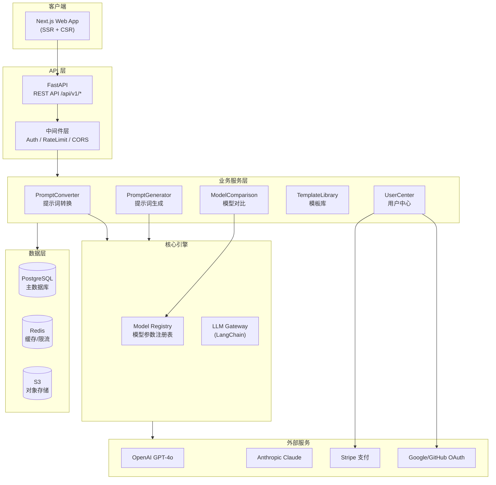
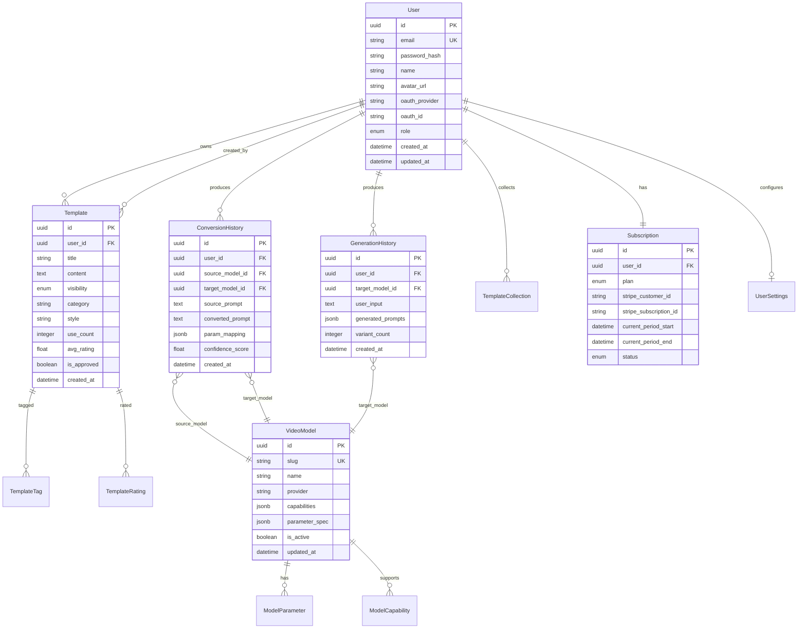
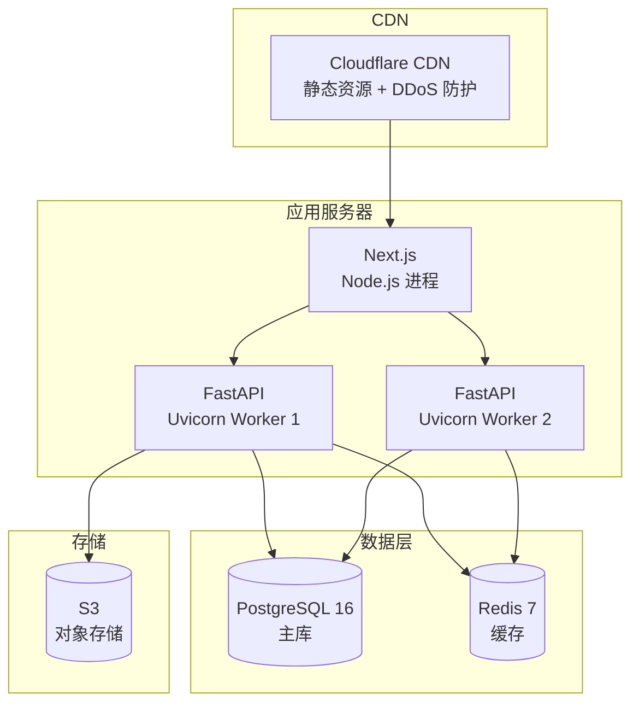

# VideoPrompt AI — 技术架构设计文档

> **版本**：v1.0.0
> **架构师**：Architect Agent (AI)
> **创建日期**：2026-04-11
> **最后更新**：2026-04-11
> **状态**：草稿
> **关联 PRD**：prd-videoprompt-ai.md v1.0.0

---

## 0. 文档索引

> 本架构文档为主文档（总纲）。PRD 采用模块化结构（5 个模块），本文档聚焦跨模块架构、共享能力、部署、安全与演进策略；各模块的详细设计位于独立模块级架构文档中。

| 文档 | 路径 | 说明 | 模式 |
| ---- | ---- | ---- | ---- |
| **主架构文档（本文档）** | `architecture-videoprompt-ai.md` | 系统整体架构、技术栈选型、部署方案、非功能需求 | 始终生成 |
| 提示词转换模块架构 | [`architecture-videoprompt-ai-prompt-converter.md`](architecture-videoprompt-ai-prompt-converter.md) | 转换引擎、参数映射、结果预览 | 模块化 PRD |
| 提示词生成模块架构 | [`architecture-videoprompt-ai-prompt-generator.md`](architecture-videoprompt-ai-prompt-generator.md) | 自然语言理解、多方案生成、优化建议 | 模块化 PRD |
| 模型对比模块架构 | [`architecture-videoprompt-ai-model-comparison.md`](architecture-videoprompt-ai-model-comparison.md) | Model Registry、能力矩阵、推荐引擎 | 模块化 PRD |
| 模板库模块架构 | [`architecture-videoprompt-ai-template-library.md`](architecture-videoprompt-ai-template-library.md) | 模板 CRUD、搜索、社区分享 | 模块化 PRD |
| 用户中心模块架构 | [`architecture-videoprompt-ai-user-center.md`](architecture-videoprompt-ai-user-center.md) | 认证、订阅、历史记录、设置 | 模块化 PRD |

---

## 1. 设计概述

### 1.1 项目背景

随着 Runway Gen-4、Kling AI、Google Veo 3 等视频大模型快速发展，不同模型对提示词的格式要求、参数规范和表达风格存在显著差异。VideoPrompt AI 定位为视频大模型提示词的"通用翻译器"和"智能助手"，通过 LLM 驱动的跨模型提示词转换和自然语言生成，降低 AI 视频创作的技术门槛。

产品采用 Freemium 模式（Free / Pro $9.99 / Enterprise $49），核心技术路径为 LLM 驱动的提示词解析与改写，面向视频创作者、非技术用户和内容运营者三类用户群体。

### 1.2 设计目标

| 目标 | 描述 | 衡量标准 |
| ---- | ---- | -------- |
| 低延迟响应 | 提示词转换/生成在用户可接受时间内完成 | API P95 ≤ 3s，首屏加载 ≤ 2s |
| 高可用服务 | 系统稳定运行，满足 MVP 阶段用户量 | SLA ≥ 99.5%，支持 500 并发 |
| 可扩展架构 | 支持新模型快速接入，不修改核心代码 | 新模型接入 ≤ 1 天（仅配置更新） |
| 成本可控 | LLM 调用成本在预算范围内 | 月 LLM API 成本 ≤ $500（MVP 阶段） |

### 1.3 设计原则

- **简单优先**：MVP 阶段采用单体架构，避免微服务过度设计，团队规模小（≤5 人）时单体维护成本最低
- **模块内聚**：业务逻辑按 5 个功能模块组织，模块间通过内部服务接口通信，为后续拆分微服务预留边界
- **可插拔模型**：通过 Model Registry 抽象层屏蔽模型差异，新增模型仅需添加适配器配置
- **安全默认**：所有用户输入经过消毒处理，LLM 调用增加 system prompt 约束，防止 Prompt 注入

### 1.4 范围与边界

| 范围 | 包含 | 不包含 |
| ---- | ---- | ------ |
| 核心业务 | 提示词转换、生成、模型对比、模板管理 | 实际视频生成（由各模型平台完成） |
| 用户体系 | 注册登录、订阅管理、使用历史 | 企业组织管理、团队协作（后续迭代） |
| 数据存储 | 提示词、模板、用户数据、模型参数 | 视频文件存储、图片素材库 |

### 1.5 需求追溯矩阵

| PRD 需求编号 | 需求描述 | 优先级 | 对应架构模块 | 对应 API | 备注 |
| ------------- | -------- | ------ | ------------ | ------- | ---- |
| 智能提示词解析 | 自动识别输入提示词的来源模型 | P0 | prompt-converter / PromptParser | `POST /api/v1/prompts/parse` | 详见模块架构 |
| 跨模型格式转换 | 将提示词转换为目标模型格式 | P0 | prompt-converter / PromptTransformer | `POST /api/v1/prompts/convert` | 详见模块架构 |
| 参数自动映射 | 自动匹配模型间参数对应关系 | P0 | prompt-converter / ParamMapper | `POST /api/v1/prompts/convert` | 内嵌于转换流程 |
| 自然语言转提示词 | 中英文描述转结构化提示词 | P0 | prompt-generator / NLPGenerator | `POST /api/v1/prompts/generate` | 详见模块架构 |
| 目标模型选择与适配 | 生成适配目标模型的提示词 | P0 | prompt-generator / ModelAdapter | `POST /api/v1/prompts/generate` | 复用 Model Registry |
| 注册与登录 | 邮箱注册 + OAuth 登录 | P0 | user-center / AuthService | `POST /api/v1/auth/*` | 详见模块架构 |
| 转换结果预览与编辑 | 左右对比 + 手动编辑 | P1 | prompt-converter / 前端组件 | — | 纯前端交互 |
| 提示词优化建议 | 基于最佳实践的优化建议 | P1 | prompt-generator / Optimizer | `POST /api/v1/prompts/optimize` | 详见模块架构 |
| 多方案对比生成 | 同时生成 2-4 个风格方案 | P1 | prompt-generator / NLPGenerator | `POST /api/v1/prompts/generate` | variants 参数 |
| 模型能力矩阵 | 展示各模型核心参数 | P1 | model-comparison / ModelRegistry | `GET /api/v1/models` | 详见模块架构 |
| 参数规格对比 | 多模型并排对比 | P1 | model-comparison / CompareEngine | `POST /api/v1/models/compare` | 详见模块架构 |
| 模板分类浏览 | 按场景/风格/模型浏览 | P1 | template-library / TemplateService | `GET /api/v1/templates` | 详见模块架构 |
| 模板搜索与筛选 | 关键词搜索 + 多维筛选 | P1 | template-library / SearchService | `GET /api/v1/templates/search` | 详见模块架构 |
| 个人模板收藏 | 收藏和管理个人模板 | P1 | template-library / CollectionService | `POST /api/v1/templates/collect` | 详见模块架构 |
| 使用历史记录 | 转换/生成历史 | P1 | user-center / HistoryService | `GET /api/v1/history` | 详见模块架构 |
| 订阅与付费管理 | Free/Pro/Enterprise 订阅 | P1 | user-center / SubscriptionService | `POST /api/v1/subscriptions/*` | Stripe 集成 |
| 模型推荐引擎 | 智能推荐模型 | P2 | model-comparison / RecommendEngine | `POST /api/v1/models/recommend` | 详见模块架构 |
| 社区模板分享 | 发布模板到社区 | P2 | template-library / CommunityService | `POST /api/v1/templates/publish` | 含内容审核 |
| 个人设置 | 偏好模型/语言/通知 | P2 | user-center / SettingsService | `PATCH /api/v1/users/settings` | 详见模块架构 |

---

## 2. 技术栈选型

### 2.1 选型总览

| 层级 | 技术选型 | 选型理由 | 备选方案 |
| ---- | -------- | -------- | -------- |
| **前端框架** | Next.js 15 (React 19, TypeScript) | PRD 指定；SSR 支持 SEO，App Router 架构，与 AI 生态兼容 | Nuxt.js 3 |
| **UI 组件** | Tailwind CSS + shadcn/ui | PRD 指定；快速构建一致性 UI，组件可定制，社区活跃 | Ant Design / MUI |
| **后端框架** | Python FastAPI | PRD 指定；与 LLM SDK 原生兼容（LangChain/OpenAI SDK），异步 IO 高性能 | Node.js Express |
| **主数据库** | PostgreSQL 16 | 成熟稳定，JSON 支持好（存储结构化提示词），全文搜索能力 | MySQL 8 |
| **缓存** | Redis 7 | 会话管理 + 热点数据缓存 + 配额限流计数器 | Memcached |
| **搜索引擎** | PostgreSQL FTS + pg_trgm | MVP 阶段利用 PG 内建全文搜索，避免引入额外组件；后续可迁移 MeiliSearch | MeiliSearch / Elasticsearch |
| **AI/ML** | OpenAI GPT-4o + Anthropic Claude | 提示词转换和生成的核心引擎，通过 LangChain 统一调用 | 自建微调模型 |
| **对象存储** | S3 兼容存储 (AWS S3 / MinIO) | 用户上传的参考图片等非结构化数据 | Azure Blob |
| **CI/CD** | GitHub Actions | 与仓库原生集成，免费额度充足 | GitLab CI |
| **容器** | Docker + Docker Compose | MVP 阶段单机容器编排，后续可迁移 K8s | Kubernetes |
| **监控** | Sentry + Prometheus + Grafana | 错误追踪 + 指标监控 + 可视化，社区方案成本低 | Datadog |
| **日志** | 结构化 JSON 日志 + Loki | 轻量级日志聚合，与 Grafana 生态整合 | ELK Stack |

### 2.2 关键选型决策记录（ADR）

#### ADR-1：架构风格 — 单体优先

- **状态**：接受
- **背景**：MVP 阶段团队规模小（≤5 人），19 个功能点中 6 个 P0，6 个月内需上线
- **候选方案**：单体架构 vs 微服务 vs Serverless
- **评估维度**：开发效率 / 运维复杂度 / 团队规模匹配 / 扩展难度
- **结论**：选择单体架构（模块化内聚）
- **理由**：团队小、MVP 初期流量低（目标 DAU 500），单体架构开发效率最高，模块化代码组织为后续拆分微服务预留边界
- **后果**：需严格执行模块边界，避免模块间耦合；DAU 超过 5000 时需评估拆分

#### ADR-2：前端 SSR vs CSR

- **状态**：接受
- **背景**：PRD 要求首屏 ≤ 2s，且 SEO 对产品增长有重要价值（模板库需要被搜索引擎索引）
- **候选方案**：Next.js SSR vs Vite SPA
- **结论**：选择 Next.js SSR
- **理由**：SSR 首屏性能优势 + SEO 支持；模板库和模型对比页需要 SSR；转换/生成页面使用 CSR（交互密集型）
- **后果**：服务端渲染增加 Node.js 运行时依赖；需合理划分 SSR/CSR 页面边界

#### ADR-3：LLM 调用策略 — LangChain 统一接口

- **状态**：接受
- **背景**：核心功能依赖 LLM（转换 + 生成 + 优化），需支持多 LLM 提供商切换和故障转移
- **候选方案**：LangChain vs 直接 API 调用 vs 自建抽象层
- **结论**：选择 LangChain
- **理由**：成熟的 LLM 抽象层，支持 prompt 模板、链式调用、输出解析；社区提供各厂商 adapter
- **后果**：引入 LangChain 依赖；需关注版本升级兼容性

---

## 3. 系统架构

### 3.1 架构风格

**选择**：单体架构（模块化内聚）

**理由**：MVP 阶段（目标 DAU ≤ 500，团队 ≤ 5 人），单体架构开发和部署效率最高。通过 Python 包组织实现模块边界，各模块对应独立的 router / service / repository 层，为后续拆分微服务预留清晰边界。

### 3.2 整体架构图


```mermaid
graph TB
    subgraph Client["客户端"]
        Web["Next.js Web App<br/>(SSR + CSR)"]
    end

    subgraph Gateway["API 层"]
        API["FastAPI<br/>REST API /api/v1/*"]
        MW["中间件层<br/>Auth / RateLimit / CORS"]
    end

    subgraph Services["业务服务层"]
        PC["PromptConverter<br/>提示词转换"]
        PG["PromptGenerator<br/>提示词生成"]
        MC["ModelComparison<br/>模型对比"]
        TL["TemplateLibrary<br/>模板库"]
        UC["UserCenter<br/>用户中心"]
    end

    subgraph Core["核心引擎"]
        MR["Model Registry<br/>模型参数注册表"]
        LLM["LLM Gateway<br/>(LangChain)"]
    end

    subgraph Data["数据层"]
        PG_DB[("PostgreSQL<br/>主数据库")]
        RD[("Redis<br/>缓存/限流")]
        S3[("S3<br/>对象存储")]
    end

    subgraph External["外部服务"]
        GPT["OpenAI GPT-4o"]
        Claude["Anthropic Claude"]
        Stripe["Stripe 支付"]
        OAuth["Google/GitHub OAuth"]
    end

    Web --> API
    API --> MW
    MW --> Services
    PC --> Core
    PG --> Core
    MC --> MR
    Services --> Data
    Core --> External
    UC --> OAuth
    UC --> Stripe
```

### 3.3 模块职责

| 模块/服务 | 职责 | 核心功能 | 依赖 | 模块级架构文档 |
| --------- | ---- | -------- | ---- | -------------- |
| prompt-converter | 提示词解析与跨模型转换 | 智能解析、格式转换、参数映射、结果预览 | model-comparison (Model Registry)、LLM Gateway | [`architecture-videoprompt-ai-prompt-converter.md`](architecture-videoprompt-ai-prompt-converter.md) |
| prompt-generator | 自然语言到结构化提示词生成 | NLP 理解、模型适配、优化建议、多方案生成 | model-comparison (Model Registry)、LLM Gateway | [`architecture-videoprompt-ai-prompt-generator.md`](architecture-videoprompt-ai-prompt-generator.md) |
| model-comparison | 模型能力管理与对比 | Model Registry 维护、能力矩阵、参数对比、推荐引擎 | — (基础数据模块) | [`architecture-videoprompt-ai-model-comparison.md`](architecture-videoprompt-ai-model-comparison.md) |
| template-library | 模板存储、搜索与社区 | 分类浏览、全文搜索、收藏管理、社区分享 | user-center (用户身份) | [`architecture-videoprompt-ai-template-library.md`](architecture-videoprompt-ai-template-library.md) |
| user-center | 用户身份与订阅管理 | 注册登录、JWT/OAuth、订阅付费、历史记录、设置 | Stripe、OAuth Provider | [`architecture-videoprompt-ai-user-center.md`](architecture-videoprompt-ai-user-center.md) |

### 3.4 前端架构（基于原型图分析）

#### 摘要

| 分析项 | 结果 |
| ------ | ---- |
| 原型图来源 | wireframes（7 页低保真原型） |
| 页面总数 | 7 个（含导航页） |
| 前端复杂度评级 | 中 |
| 核心交互模式 | 文本输入→AI 处理→结果对比、表格矩阵筛选、卡片列表浏览 |
| 状态管理方案 | Zustand（轻量级，适合中等复杂度） |

**页面路由设计**：

| 页面 | 路由 | 渲染模式 | 原型来源 | 说明 |
| ---- | ---- | -------- | -------- | ---- |
| 首页/工作台 | `/` | CSR | `prompt-converter-home.html` | 转换入口，交互密集型 |
| 转换结果页 | `/convert/result` | CSR | `prompt-converter-result.html` | 左右对比，实时编辑 |
| 提示词生成 | `/generate` | CSR | `prompt-generator-create.html` | AI 生成，多方案展示 |
| 模型对比 | `/models` | SSR | `model-comparison-matrix.html` | SEO 友好，静态数据为主 |
| 模板库 | `/templates` | SSR | `template-library-browse.html` | SEO 友好，分页列表 |
| 个人中心 | `/profile` | CSR | `user-center-profile.html` | 需认证，私有数据 |
| 登录/注册 | `/auth/login`, `/auth/register` | CSR | — | 认证页面 |

**组件架构**：

```
src/
├── app/                    # Next.js App Router
│   ├── (public)/           # 公开页面组
│   │   ├── models/         # 模型对比 (SSR)
│   │   └── templates/      # 模板库 (SSR)
│   ├── (workspace)/        # 工作台页面组
│   │   ├── page.tsx        # 首页/转换入口 (CSR)
│   │   ├── convert/        # 转换结果 (CSR)
│   │   └── generate/       # 生成页面 (CSR)
│   ├── (auth)/             # 认证页面组
│   └── profile/            # 个人中心 (CSR)
├── components/
│   ├── ui/                 # shadcn/ui 基础组件
│   ├── prompt/             # 提示词相关组件
│   ├── model/              # 模型相关组件
│   └── layout/             # 布局组件 (NavHeader)
├── stores/                 # Zustand 状态管理
│   ├── prompt-store.ts     # 提示词转换/生成状态
│   ├── auth-store.ts       # 用户认证状态
│   └── ui-store.ts         # UI 状态
└── lib/                    # 工具函数
    ├── api/                # API 客户端
    └── utils/              # 通用工具
```

### 3.5 服务通信

| 调用方 | 被调用方 | 通信方式 | 协议 | 说明 |
| ------ | -------- | -------- | ---- | ---- |
| Next.js 前端 | FastAPI 后端 | 同步 HTTP | REST JSON | 所有 API 调用 |
| prompt-converter | Model Registry | 同步内部调用 | Python 函数 | 获取模型参数规范 |
| prompt-converter | LLM Gateway | 同步 HTTP + Streaming | REST / SSE | LLM 转换调用 |
| prompt-generator | LLM Gateway | 同步 HTTP + Streaming | REST / SSE | LLM 生成调用 |
| user-center | Stripe API | 同步 HTTPS + Webhook | REST | 支付和订阅管理 |
| user-center | OAuth Provider | 同步 HTTPS | OAuth 2.0 | 第三方登录 |

---

## 4. 数据模型设计

### 4.1 核心实体关系图


```mermaid
erDiagram
    User ||--o{ ConversionHistory : "produces"
    User ||--o{ GenerationHistory : "produces"
    User ||--o{ Template : "owns"
    User ||--o{ TemplateCollection : "collects"
    User ||--|| Subscription : "has"
    User ||--o| UserSettings : "configures"

    Template ||--o{ TemplateTag : "tagged"
    Template ||--o{ TemplateRating : "rated"
    Template }o--|| User : "created_by"

    VideoModel ||--o{ ModelParameter : "has"
    VideoModel ||--o{ ModelCapability : "supports"

    ConversionHistory }o--|| VideoModel : "source_model"
    ConversionHistory }o--|| VideoModel : "target_model"
    GenerationHistory }o--|| VideoModel : "target_model"

    User {
        uuid id PK
        string email UK
        string password_hash
        string name
        string avatar_url
        string oauth_provider
        string oauth_id
        enum role
        datetime created_at
        datetime updated_at
    }

    Subscription {
        uuid id PK
        uuid user_id FK
        enum plan
        string stripe_customer_id
        string stripe_subscription_id
        datetime current_period_start
        datetime current_period_end
        enum status
    }

    VideoModel {
        uuid id PK
        string slug UK
        string name
        string provider
        jsonb capabilities
        jsonb parameter_spec
        boolean is_active
        datetime updated_at
    }

    ConversionHistory {
        uuid id PK
        uuid user_id FK
        uuid source_model_id FK
        uuid target_model_id FK
        text source_prompt
        text converted_prompt
        jsonb param_mapping
        float confidence_score
        datetime created_at
    }

    GenerationHistory {
        uuid id PK
        uuid user_id FK
        uuid target_model_id FK
        text user_input
        jsonb generated_prompts
        integer variant_count
        datetime created_at
    }

    Template {
        uuid id PK
        uuid user_id FK
        string title
        text content
        enum visibility
        string category
        string style
        integer use_count
        float avg_rating
        boolean is_approved
        datetime created_at
    }
```

### 4.2 数据层概览

| 数据类型 | 存储介质 | 说明 |
| -------- | -------- | ---- |
| 核心业务数据（用户、历史、模板、模型） | PostgreSQL 16 | 主数据库，ACID 事务保证 |
| 会话与缓存（JWT 黑名单、配额计数器、热门模板） | Redis 7 | 内存缓存，TTL 自动过期 |
| 用户上传文件（参考图片等） | S3 兼容存储 | 非结构化数据 |

> 各模块的完整表结构定义和索引策略详见对应模块级架构文档。

---

## 5. API 设计

### 5.1 设计规范

- **风格**：RESTful
- **版本策略**：URL 路径版本 `/api/v1/`
- **认证方式**：JWT Bearer Token（Authorization Header）
- **限流策略**：基于用户订阅计划的差异化限流（Free: 10 次/天，Pro: 200 次/天，Enterprise: 无限制），使用 Redis 滑动窗口计数器
- **响应格式**：统一 JSON 结构 `{ "code": 0, "data": {}, "message": "ok" }`
- **错误码规范**：HTTP 状态码 + 业务错误码 `{ "code": 40001, "message": "配额已用完" }`
- **分页**：`?page=1&page_size=20`，响应含 `total`, `page`, `page_size`

### 5.2 核心接口概览

| 方法 | 路径 | 功能 | 认证 | 优先级 |
| ---- | ---- | ---- | ---- | ------ |
| `POST` | `/api/v1/prompts/convert` | 提示词跨模型转换 | 是 | P0 |
| `POST` | `/api/v1/prompts/generate` | 自然语言生成提示词 | 是 | P0 |
| `POST` | `/api/v1/auth/register` | 邮箱注册 | 否 | P0 |
| `POST` | `/api/v1/auth/login` | 登录获取 JWT | 否 | P0 |
| `POST` | `/api/v1/auth/oauth/{provider}` | OAuth 登录 | 否 | P0 |
| `GET` | `/api/v1/models` | 获取模型列表及参数 | 否 | P1 |
| `POST` | `/api/v1/models/compare` | 对比多个模型参数 | 否 | P1 |
| `GET` | `/api/v1/templates` | 模板列表（分页筛选） | 否 | P1 |
| `POST` | `/api/v1/templates` | 保存个人模板 | 是 | P1 |
| `GET` | `/api/v1/templates/search` | 全文搜索模板 | 否 | P1 |
| `POST` | `/api/v1/templates/collect` | 收藏模板 | 是 | P1 |
| `GET` | `/api/v1/history` | 使用历史记录 | 是 | P1 |
| `POST` | `/api/v1/subscriptions/checkout` | 创建支付会话 | 是 | P1 |
| `POST` | `/api/v1/prompts/optimize` | 提示词优化建议 | 是 | P1 |
| `POST` | `/api/v1/models/recommend` | 模型推荐 | 是 | P2 |
| `POST` | `/api/v1/templates/publish` | 发布社区模板 | 是 | P2 |
| `PATCH` | `/api/v1/users/settings` | 更新个人设置 | 是 | P2 |

> 各接口的详细请求/响应体定义见对应模块级架构文档。

---

## 6. 部署架构

### 6.1 部署拓扑图


```mermaid
graph TB
    subgraph CDN["CDN"]
        CF["Cloudflare CDN<br/>静态资源 + DDoS 防护"]
    end

    subgraph Server["应用服务器"]
        Next["Next.js<br/>Node.js 进程"]
        FastAPI_1["FastAPI<br/>Uvicorn Worker 1"]
        FastAPI_2["FastAPI<br/>Uvicorn Worker 2"]
    end

    subgraph Data["数据层"]
        PG[("PostgreSQL 16<br/>主库")]
        Redis[("Redis 7<br/>缓存")]
    end

    subgraph Storage["存储"]
        S3[("S3<br/>对象存储")]
    end

    CF --> Next
    Next --> FastAPI_1
    Next --> FastAPI_2
    FastAPI_1 --> PG
    FastAPI_1 --> Redis
    FastAPI_2 --> PG
    FastAPI_2 --> Redis
    FastAPI_1 --> S3
```

### 6.2 环境规划

| 环境 | 用途 | 配置规格 | 数据策略 |
| ---- | ---- | -------- | -------- |
| **Development** | 本地开发调试 | Docker Compose（单机） | Mock LLM API + SQLite/PG |
| **Staging** | 预发布验证 | 2 vCPU / 4GB RAM | 脱敏数据 + 真实 LLM（限额） |
| **Production** | 正式生产 | 4 vCPU / 8GB RAM × 2 | 真实数据 |

### 6.3 CI/CD 流水线

```text
代码提交 → Lint(Ruff+ESLint) → 单元测试(pytest+Vitest) → 构建镜像 → 集成测试 → 推送镜像 → 部署 Staging → E2E(Playwright) → 人工验证 → 部署 Production → 冒烟测试
```

### 6.4 部署策略

- **策略选择**：Rolling Update（Docker Compose 环境下逐容器更新）
- **回滚方案**：保留前 3 个镜像版本，通过 `docker-compose down && docker-compose up -d` 快速回滚
- **后续演进**：DAU > 2000 时迁移至 Kubernetes，采用 Blue-Green 部署

### 6.5 成本估算

> 本项目核心依赖 LLM API（付费），必须进行成本估算。

| 资源类别 | 具体资源 | 规格 | 单价 | 月预估用量 | 月成本 |
| -------- | -------- | ---- | ---- | ---------- | ------ |
| 计算 | 云服务器 (VPS) | 4C8G × 2 | $40/台 | 2 台 | $80 |
| 数据库 | PostgreSQL (托管) | 2C4G | $30 | 1 实例 | $30 |
| 缓存 | Redis (托管) | 1GB | $15 | 1 实例 | $15 |
| AI/ML API | OpenAI GPT-4o | $2.50/1M input tokens | DAU 500 × 5 次/天 × 1K tokens | ~75M tokens | $188 |
| AI/ML API | Anthropic Claude (备用) | $3/1M input tokens | 20% 流量降级 | ~15M tokens | $45 |
| CDN + 域名 | Cloudflare Pro | — | — | — | $20 |
| 第三方 | Stripe 手续费 | 2.9% + $0.30/笔 | Pro 用户 50 人 × $9.99 | — | ~$16 |
| 第三方 | Sentry 错误追踪 | Developer 版 | 免费 | — | $0 |
| **月度总计** | | | | | **~$394** |

**成本优化策略**：

- 缓存相同提示词的转换结果（Redis，TTL 24h），预计减少 30% LLM 调用
- 简单转换使用规则引擎优先处理，仅复杂转换调用 LLM
- 使用 GPT-4o-mini 处理低复杂度请求（成本降 10×）

---

## 7. 测试架构

### 7.1 测试策略与分层

| 测试层级 | 占比目标 | 职责 | 执行频率 |
| -------- | -------- | ---- | -------- |
| **单元测试** | 60%-70% | 验证核心逻辑（解析器、映射器、格式化器） | 每次提交 |
| **集成测试** | 20%-25% | 验证 API 端点、数据库操作、LLM 调用链 | 每次 PR |
| **E2E 测试** | 10%-15% | 验证端到端用户流程（转换 / 生成 / 注册） | 每次部署 Staging |

**覆盖率目标**：

| 维度 | 目标值 | 说明 |
| ---- | ------ | ---- |
| 行覆盖率（Line） | ≥ 80% | 整体最低线 |
| 分支覆盖率（Branch） | ≥ 70% | 条件分支覆盖 |
| P0 功能覆盖率 | 100% | P0 功能必须有完整测试用例覆盖 |
| API 接口覆盖率 | ≥ 90% | 所有公开 API 端点 |

### 7.2 测试框架选型

| 测试类型 | 框架/工具 | 选型理由 | 备选方案 |
| -------- | --------- | -------- | -------- |
| 前端单元测试 | Vitest | 与 Vite 生态兼容，速度快 | Jest |
| 前端组件测试 | Testing Library | React 官方推荐，行为驱动 | Enzyme |
| 后端单元测试 | pytest | Python 生态标准，fixture 机制强大 | unittest |
| API 集成测试 | httpx + pytest | FastAPI 官方推荐的异步测试客户端 | Supertest |
| E2E 测试 | Playwright | 跨浏览器支持，稳定性好，项目已有 Playwright MCP | Cypress |
| 性能测试 | k6 | 轻量级，脚本化，CI 集成好 | Artillery |
| 安全测试 | OWASP ZAP + Snyk | 动态+依赖扫描，覆盖 OWASP Top 10 | Trivy |
| Mock/Stub | unittest.mock + MSW | 后端 Python mock + 前端请求拦截 | WireMock |

### 7.3 测试环境与数据策略

| 环境 | 测试类型 | 数据策略 | 说明 |
| ---- | -------- | -------- | ---- |
| 本地开发 | 单元测试 + 组件测试 | Mock LLM + SQLite 内存数据库 | 快速反馈循环 |
| CI 环境 | 单元 + 集成测试 | Testcontainers (PG + Redis) + Seed 数据 | GitHub Actions |
| Staging | 集成 + E2E 测试 | 脱敏数据 + 真实 LLM（限额调用） | 预发布验证 |
| 生产 | 冒烟测试 + 监控 | 真实数据（只读验证） | 部署后自动执行 |

**测试数据管理**：

- **数据生成**：Faker（Python）+ 自定义 Seed 脚本
- **数据隔离**：每次测试独立事务回滚
- **敏感数据**：禁止使用真实 PII，LLM API Key 通过 CI Secret 注入

### 7.4 性能测试方案

| 测试场景 | 工具 | 目标指标 | 触发条件 |
| -------- | ---- | -------- | -------- |
| 基准性能测试 | k6 | API P95 ≤ 3s, 首屏 ≤ 2s | 每次 Release 前 |
| 压力测试 | k6 | 系统在 500 并发下稳定运行 | 重大版本发布前 |
| LLM 响应延迟 | k6 + Mock LLM | 转换 API 含 LLM 调用总延迟 ≤ 5s | 架构变更后 |

### 7.5 安全测试方案

| 测试项 | 工具/方法 | 频率 | 覆盖范围 |
| ------ | --------- | ---- | -------- |
| SAST（静态分析） | Ruff + Semgrep | 每次 PR | Python 源代码漏洞扫描 |
| DAST（动态分析） | OWASP ZAP | 每次部署 Staging | 运行时漏洞扫描 |
| 依赖漏洞扫描 | Snyk / Dependabot | 每日 | 第三方依赖 CVE |
| 容器镜像扫描 | Trivy | 每次构建镜像 | 基础镜像安全 |
| API 安全测试 | OWASP ZAP API Scan | 每次 Release 前 | 认证/鉴权/注入/越权 |

### 7.6 CI/CD 中的测试集成

| 流水线阶段 | 执行的测试 | 质量门禁 | 失败处理 |
| ---------- | ---------- | -------- | -------- |
| 代码提交 | Ruff + ESLint + Prettier | 零 error | 阻断合并 |
| PR 构建 | pytest + Vitest | 覆盖率 ≥ 80%，零失败 | 阻断合并 |
| 合并主分支 | 全量单元 + 集成测试 | 覆盖率 ≥ 80%，零失败 | 阻断部署 |
| 部署 Staging | E2E (Playwright) + OWASP ZAP | 关键路径零失败，无高危漏洞 | 阻断生产部署 |
| 部署 Production | 冒烟测试 | 核心 API 可达 | 触发自动回滚 |

### 7.7 系统级端到端测试方案

**跨模块业务场景**：

| 场景名 | 覆盖模块 | 关键数据流 | 测试类型 | 优先级 |
| ------ | -------- | ---------- | -------- | ------ |
| 新用户注册→转换提示词→查看历史 | user-center, prompt-converter | 注册→JWT→转换→历史写入→历史查询 | E2E | P0 |
| 自然语言生成→保存为模板→社区浏览 | prompt-generator, template-library | 生成→保存模板→模板列表展示 | E2E | P0 |
| 模型对比→选择模型→转换提示词 | model-comparison, prompt-converter | 查看矩阵→选定模型→执行转换 | E2E | P1 |
| 订阅升级→额度提升→批量转换 | user-center, prompt-converter | Stripe 支付→计划变更→配额更新→批量操作 | E2E | P1 |

**NFR 验证追溯表**：

| PRD §5 NFR 类别 | PRD 指标 | 架构验证工具 | 验证时机 | 通过标准 | 关联架构章节 |
| --------------- | -------- | ------------ | -------- | -------- | ------------ |
| 性能 | API ≤ 3s (P95)，首屏 ≤ 2s | k6 + Lighthouse | 每次 Release 前 | P95 ≤ 3s | §8.1 |
| 可用性 | SLA ≥ 99.5% | UptimeRobot + Prometheus | 持续监控 | 月度 uptime ≥ 99.5% | §8.2 |
| 安全 | TLS 1.3, OAuth 2.0/JWT | OWASP ZAP + Snyk | 每次部署 Staging | 零高危漏洞 | §9 |
| 兼容性 | Chrome/Safari/Firefox/Edge | Playwright multi-browser | 每次 Release 前 | 零关键缺陷 | §3.4 |
| 可扩展性 | 500 并发 | k6 容量测试 | 重大版本前 | CPU ≤ 70% | §8.3 |
| 数据合规 | 个人信息保护法 | 合规审计 + 脱敏验证 | 上线前 + 每季度 | 零不合规项 | §9.4 |
| 国际化 | 中英文两种语言 | 人工 UI 走查 | 每次 Release 前 | 全页面双语正确 | §3.4 |

---

## 8. 非功能需求设计

### 8.1 性能设计

| 指标 | PRD 要求 | 目标值 | 推导逻辑 | 达成方案 |
| ---- | -------- | ------ | -------- | -------- |
| 首屏加载 | ≤ 2s | ≤ 1.5s (P95) | PRD 明确要求；目标用户以桌面端为主，4G+ 网络 | Next.js SSR + CDN 静态资源 + 代码分割 + 图片懒加载 |
| API 响应 (P95) | ≤ 3s | ≤ 3s | 含 LLM 调用；拆解：接口处理 200ms + LLM 调用 2.5s + 后处理 300ms | Redis 缓存相同请求 + LLM streaming + 超时控制 5s |
| 并发连接 | 500 并发 | ≥ 500 | PRD 明确要求（MVP 阶段） | Uvicorn 4 workers + asyncio + 连接池 |
| QPS 峰值 | — | ≥ 50 | DAU 500 × 平均 5 次/天，尖峰 10×，集中在 8h → 峰值 QPS ≈ 50 | 水平扩展（增加 worker）+ Redis 限流 |

### 8.2 高可用设计

| 策略 | 描述 | SLA 目标 |
| ---- | ---- | -------- |
| 多实例部署 | FastAPI 双实例 + Nginx 负载均衡 | 单实例故障不影响服务 |
| 数据库高可用 | PostgreSQL 主从复制（托管服务提供） | RPO: 0, RTO: < 5min |
| LLM 降级 | GPT-4o 不可用时自动切换 Claude，Claude 不可用时返回缓存结果 | LLM 服务 99% 可用 |
| 健康检查 | `/health` 端点，30s 间隔探测 | 60s 内检测到故障 |
| 回滚机制 | Docker 镜像版本回退 | 5min 内完成回滚 |

### 8.3 可扩展性设计

- **水平扩展**：FastAPI worker 数量可通过环境变量调整（默认 4），容器可复制；从 Docker Compose 迁移到 K8s 后支持 HPA
- **垂直扩展**：单机上限 8C16G，超过后需分布式部署
- **自动伸缩**：MVP 阶段手动扩展；DAU > 2000 时引入 K8s HPA（CPU > 70% 触发扩容）
- **模型扩展**：新增视频大模型仅需在 Model Registry 添加配置（JSON），无需修改核心代码

### 8.4 监控与告警

| 监控维度 | 工具 | 关键指标 | 告警阈值 |
| -------- | ---- | -------- | -------- |
| 应用性能 | Sentry | 错误率、慢请求 | 错误率 > 1% 或 P95 > 5s |
| 基础设施 | Prometheus + Grafana | CPU、内存、磁盘、网络 | CPU > 80%、内存 > 85%、磁盘 > 90% |
| 业务指标 | Grafana Dashboard | DAU、转换次数、生成次数、付费转化率 | DAU 下降 > 30%（日环比） |
| 日志 | Loki + Grafana | 错误日志频率、异常模式 | 5min 内相同错误 > 50 次 |
| 外部依赖 | UptimeRobot | LLM API 可用性、Stripe 状态 | 连续 2 次探测失败 |

---

## 9. 安全设计

### 9.1 认证与授权

| 层级 | 方案 | 说明 |
| ---- | ---- | ---- |
| 用户认证 | JWT + OAuth 2.0 | JWT 有效期 7 天，Refresh Token 续期；支持 Google/GitHub OAuth |
| 接口鉴权 | 基于角色的访问控制 (RBAC) | 角色：guest（未登录）/ user（Free）/ pro / enterprise / admin |
| 配额控制 | Redis 滑动窗口 | 基于用户 plan 的每日调用限额（Free: 10, Pro: 200, Enterprise: 无限） |

### 9.2 数据安全

| 场景 | 策略 | 说明 |
| ---- | ---- | ---- |
| 传输加密 | TLS 1.3 | 所有通信强制 HTTPS，HSTS 启用 |
| 密码存储 | bcrypt (cost=12) | 密码哈希存储，永不明文 |
| 密钥管理 | 环境变量 + Docker Secret | LLM API Key、Stripe Key、JWT Secret 通过环境变量注入 |
| 日志脱敏 | 正则替换 | 日志中自动脱敏 email、token、API Key |

### 9.3 安全防护（OWASP Top 10）

| 威胁 | 防护措施 |
| ---- | -------- |
| A01 — 访问控制失效 | JWT 鉴权中间件 + RBAC + 资源归属校验（用户只能访问自己的数据） |
| A02 — 加密失败 | TLS 1.3 + bcrypt 密码存储 + 敏感字段加密存储 |
| A03 — 注入 | SQLAlchemy ORM（参数化查询）+ Pydantic 输入校验 + LLM Prompt 注入防护（system prompt 约束） |
| A04 — 不安全设计 | STRIDE 威胁建模 + 安全需求清单 |
| A05 — 安全配置错误 | 生产环境禁用 debug 模式 + 最小权限原则 + Docker 非 root 运行 |
| A06 — 脆弱/过时组件 | Dependabot 自动扫描 + Snyk 漏洞告警 |
| A07 — 认证失败 | 登录失败限流（5 次/15min）+ JWT 黑名单（登出时加入 Redis 黑名单） |
| A08 — 数据完整性 | CI/CD 流水线签名 + Docker 镜像哈希校验 |
| A09 — 日志与监控不足 | 结构化日志 + Sentry 错误追踪 + 安全事件告警 |
| A10 — SSRF | 限制 LLM 回调 URL / 禁止内部网络访问 + 白名单外部 API |

### 9.4 合规要求

- **个人信息保护法**：用户可查看/导出/删除个人数据（提示词历史、模板、账户信息）；数据存储符合最小必要原则
- **内容安全**：用户输入经过 LLM 内容安全过滤（拦截不合规内容）；社区模板发布前自动审核

---

## 10. 风险与应对

| 风险 | 概率 | 影响 | 应对措施 |
| ---- | ---- | ---- | -------- |
| LLM API 调用成本超预算 | 中 | 高 | 缓存策略 + 规则引擎优先 + GPT-4o-mini 降级 + 每日成本监控告警 |
| LLM 转换准确率不达标（<85%） | 中 | 高 | 构建模型特定 prompt 模板 + 用户反馈闭环 + A/B 测试优化 prompt |
| 视频大模型 API 参数变更 | 中 | 中 | Model Registry 抽象层解耦 + 变更监控脚本 + 适配器模式 |
| 单体架构性能瓶颈 | 低 | 中 | 预留微服务拆分边界 + 性能监控预警 + DAU > 2000 时启动拆分 |
| Prompt 注入攻击 | 低 | 高 | System prompt 约束 + 输入消毒 + 输出格式限制 + 安全测试覆盖 |
| Stripe 集成支付风险 | 低 | 中 | 使用 Stripe Checkout（PCI DSS 合规）+ Webhook 幂等处理 |

### 10.1 架构演进路线

```text
Phase 1 (MVP): 单体架构 + Docker Compose
    - 目标: DAU ≤ 500，3 个核心模型
    ↓
Phase 2 (Growth): 服务拆分 + K8s
    - 触发: DAU > 2000 或团队 > 10 人
    - 拆分: LLM Gateway 独立为服务 + 用户中心独立为服务
    ↓
Phase 3 (Scale): 微服务 + 事件驱动
    - 触发: DAU > 10000
    - 引入: 消息队列 (Kafka) + 独立搜索服务 (MeiliSearch) + CDN 边缘计算
```

---

## 11. 术语表

| 术语 | 定义 |
| ---- | ---- |
| Model Registry | 存储各视频大模型参数、能力、限制和 prompt 模板的知识库 |
| LLM Gateway | 统一的 LLM 调用入口，封装多提供商切换、重试、降级逻辑 |
| 参数映射 (Parameter Mapping) | 不同视频模型之间参数对应关系的自动匹配算法 |
| Prompt 注入 | 恶意用户通过构造输入操纵 LLM 行为的攻击手段 |
| RBAC | 基于角色的访问控制 (Role-Based Access Control) |
| 滑动窗口限流 | 基于 Redis 的限流算法，统计窗口内请求数并拒绝超额请求 |
| ADR | 架构决策记录 (Architecture Decision Record) |
| Freemium | 基础功能免费 + 高级功能付费的商业模式 |
| SSR/CSR | 服务端渲染 / 客户端渲染 (Server-Side / Client-Side Rendering) |

---

## 12. 变更记录

| 版本 | 日期 | 作者 | 变更类型 | 变更摘要 |
| ---- | ---- | ---- | -------- | -------- |
| v1.0.0 | 2026-04-11 | Architect Agent | 初始版本 | 首版架构设计，基于 PRD v1.0.0。单体架构 + 模块化内聚，5 个业务模块 + LLM Gateway + Model Registry |
