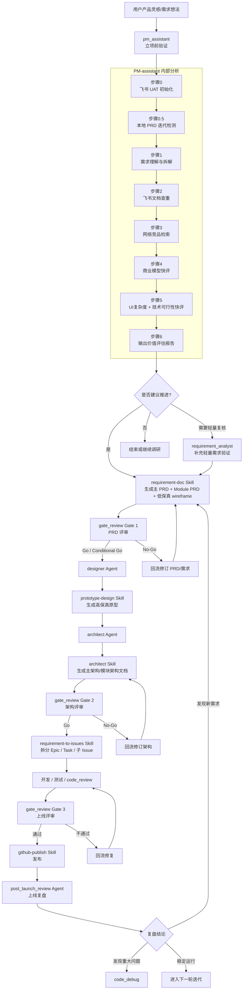

# PM-assistant 与下游流程一页版

## 定位

`pm_assistant` 是产品需求进入正式研发流程前的入口 Agent，职责是先完成立项前验证，再决定是否进入 PRD、设计、架构和研发阶段。

它关注的核心问题不是“怎么做实现”，而是：

- 这个需求是否值得推进
- 是否已有重复需求或已有 PRD 基线
- 市场上是否存在竞品和替代方案
- 从 UI 复杂度和技术可行性看，是否适合进入正式 PRD 阶段

相较于 `requirement_analyst`，`pm_assistant` 增加了 3 个关键能力：

- 飞书 UAT 初始化，确保查重流程可执行
- 本地 PRD 迭代检测，判断是全新立项还是增量迭代
- UI 复杂度初评和技术可行性初评，作为进入下游流程前的联合校准

## 主链路结论

- `pm_assistant` 是立项前过滤器，不负责正式 PRD、正式架构和高保真设计
- 主下游链路是：`requirement-doc` -> `gate_review` Gate 1 -> `designer` / `prototype-design` -> `architect` -> `gate_review` Gate 2 -> `requirement-to-issues` -> 开发与审查 -> `gate_review` Gate 3 -> `github-publish` -> `post_launch_review`
- `requirement_analyst` 是可选轻量分支，适合补充二次验证，但不是默认主链路
- 整个流程是“门禁 + 回流”的闭环，不是一次性串行交付

## Mermaid 流程图

## 角色分工速览

| 单元 | 主要职责 |
| --- | --- |
| `pm_assistant` | 立项前验证、查重、竞品、商业快评、UI/技术快评 |
| `requirement-doc` | 生成正式 PRD 和低保真原型 |
| `gate_review` | 在 PRD、架构、上线前 3 个关键节点做 Go / No-Go 决策 |
| `designer` + `prototype-design` | 生成高保真原型 |
| `architect` + `architect` Skill | 输出技术架构方案 |
| `requirement-to-issues` | 将需求和架构拆分为 Epic / Task / 子 Issue |
| `github-publish` | 发布与交付动作 |
| `post_launch_review` | 复盘结果并回流到下一轮迭代 |

## 一句话理解

`pm_assistant` 负责判断“值不值得做”，后续各 Agent / Skill 分别负责“需求是什么”“产品长什么样”“技术怎么做”“研发做哪些任务”以及“上线后学到了什么”。
